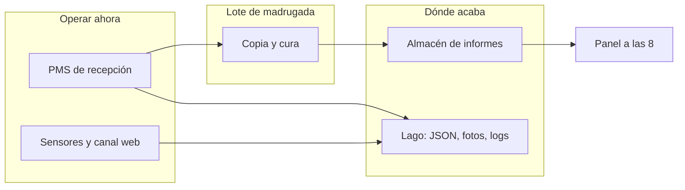
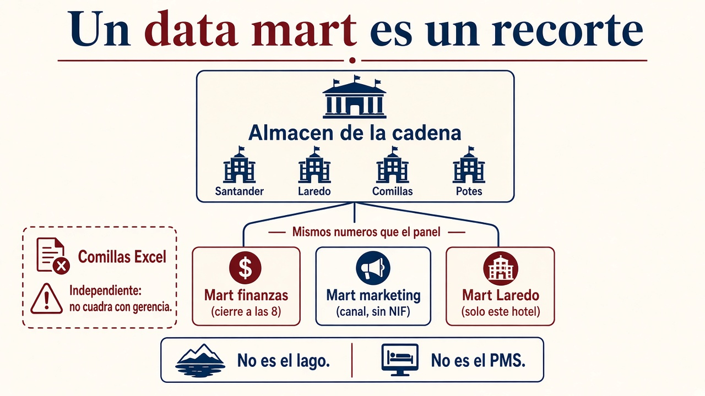
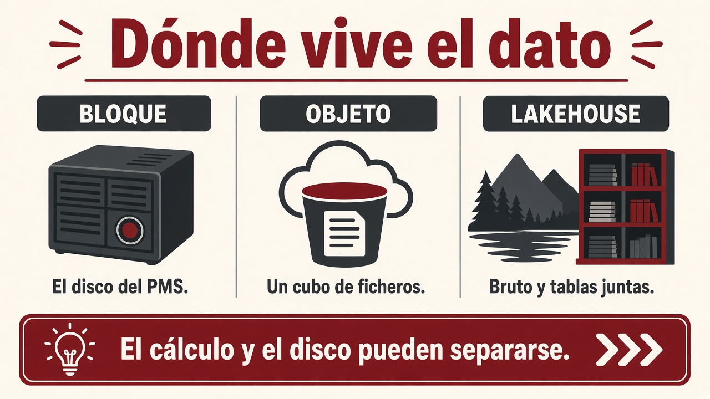
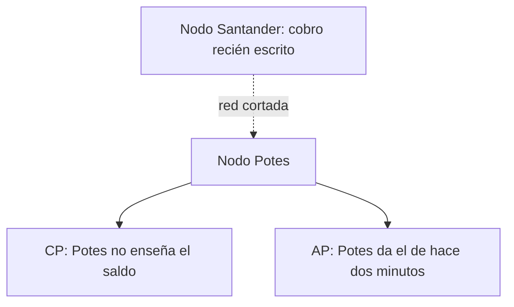

# 1.3. Conceptos de almacenamiento

Diseñar la solución (criterio **a)**) es elegir **dónde vive el dato** y **qué garantías** ofrecéis. No hace falta haber cursado un módulo de bases de datos: cada idea se explica aquí con un ejemplo, y **después** aparece la sigla, si la tiene.

En el [grupo hotelero](caso-hotel.md) eso ya está partido en dos relojes:

- **Recepción** pica ahora en el PMS. Un cobro **no** puede verse a medias.
- **Gerencia** abre a las **8** el panel de **ayer**. Finanzas cerró a las **23:00**; de madrugada corre el job que **copia** (no pica) ocupación e importe.

JSON del canal, sensores y fotos de habitación **no** caben en las tablas del PMS. El histórico de los cuatro hoteles **tampoco** es el disco de Laredo.

!!! info "Cómo se lee esta página"
    Primero **dónde** guardáis (PMS, lago, almacén de informes, *data mart*). Luego **cómo** (bloque, cubo, *lakehouse*). Al final **qué pasa si se cae o se parte la red** (transacción, ACID, CAP, BASE). Los relojes: 23:00 / job / panel de las 8.

## Base de datos relacional

Pensad en una hoja de cálculo bien hecha, con reglas. Los datos viven en **tablas**:

- cada **fila** es un hecho (una reserva, un cobro, un check-in);
- cada **columna** es un dato de ese hecho (fecha, importe, hotel).

Antes de guardar nada, declaráis **cómo es** la tabla: qué columnas hay, de qué tipo (número, texto, fecha) y qué no se puede romper (un localizador no se puede repetir, un importe no puede estar vacío). A ese “contrato” se le llama **esquema**. El lenguaje habitual para preguntar y cambiar esas tablas es **SQL**.

Un **índice** es como el índice de un libro: evitáis leerse todas las páginas para encontrar un NIF.

Este modelo encaja cuando el trabajo es **muchas operaciones cortas del día a día**: cobrar una estancia, reservar una doble, picar un extra. Cada una tiene que quedar **bien hecha**, no a medias. En el hotel, ese sitio es el **PMS**.

**Por qué cuesta en Big Data:** estas bases suelen crecer **en vertical** (un servidor más gordo). Cuando la tabla ya no cabe, o cruzar tres tablas enormes no termina a tiempo, el relacional deja de ser el almacén *único*. **No desaparece**: sigue siendo el origen típico del que **copiáis** datos hacia el lago o hacia el almacén de informes. El PMS de Laredo seguirá aquí; el análisis de tres años de los cuatro hoteles, probablemente no.

!!! tip "La pregunta de aula"
    “¿Las relacionales sirven para Big Data?”  
    Como **único** almacén del volumen extremo: en general **no**, por el techo vertical.  
    Como **fuente** y como sitio de las operaciones de negocio: **sí**, y mucho.

## Base de datos NoSQL

Nacen para **volumen**, **variedad** y crecer **añadiendo máquinas**. “NoSQL” no es un producto: es una **familia**. Elegir “NoSQL” sin decir cuál es como decir “voy en vehículo” sin decir si es bici o camión.

| Familia | Idea | En el hotel |
| --- | --- | --- |
| Documento | Un registro parece un JSON; no todos tienen los mismos campos | Reserva del canal web (un extra que otro no trae) |
| Clave-valor | Guardar y recuperar muy rápido con una clave (`sesion:17`) | Sesión de la web de reservas |
| *Wide-column* | Filas con **muchas** columnas, a menudo vacías; bien para series | Lecturas de sensores cada 30 s |
| Grafo | Puntos unidos por relaciones | La misma tarjeta en dos hoteles (fraude) |

***Wide-column* no es Parquet.** Cassandra o HBase guardan **filas** con familias de columnas. Un fichero **columnar** (Parquet) es otra cosa: guarda *columnas* juntas para el informe. Eso va en [1.7](formatos.md).

Cada familia habla un idioma distinto. Lo que veis en tutoriales de MongoDB **no** sirve igual en las otras.

**¿Sirven para Big Data?** Sí, cuando el problema es **repartir y crecer**. **No** sustituyen al PMS si el cobro no puede verse a medias. Un JSON de reserva *puede* vivir en un documento; el asiento del cobro, no.

## Data warehouse (almacén de informes)

Es un sitio **central**, pensado para **informes y decisiones** (inteligencia de negocio, *BI*), con **histórico**. Los datos **no se pican** ahí: **se copian** desde el PMS, la pasarela y, si hace falta, el lago. Es una **foto** periódica, no el sitio donde recepción cobra.

Las columnas se deciden **antes** de guardar: si mañana el canal añade un campo, hay que **cambiar el modelo**. A cambio, gerencia encuentra tablas limpias (ocupación, importe, hotel), listas para el panel de las **8**.

En la nube oiréis [Snowflake](https://www.snowflake.com/) o BigQuery: es **este** oficio (informes), no el lago.

## Data mart (un recorte, no otro lago)

El almacén de la cadena sirve a **toda** gerencia: ocupación e importe de Santander, Laredo, Comillas y Potes. Un **data mart** es el **mismo oficio** (tablas limpias, pregunta ya conocida, se copia, no se pica), pero **más estrecho**: un departamento o un hotel.

No es el PMS. No es el [lago](#data-lake). Es un trozo del warehouse que alguien ya puede abrir a las **8** sin tragarse el modelo entero ni ver columnas que no le tocan (el NIF no va al mart de marketing).

En el hotel:

| Recorte | Quién lo usa | Qué hay | Qué **no** hay |
| --- | --- | --- | --- |
| Mart de **finanzas** | Cierre y fiscalidad | Importe cobrado, canal, hotel | Fotos de habitación, JSON bruto |
| Mart de **marketing** | Campañas | Canal, ocupación, temporada | NIF, fianza |
| Mart de **Laredo** | Dirección de ese hotel | Solo Laredo | Los números de Potes |

Tres maneras de alimentarlo (el nombre es de libro; el criterio es de diseño):

| Tipo | De dónde sale | En el hotel |
| --- | --- | --- |
| **Dependiente** | Del warehouse de la cadena | El panel de Laredo lee **los mismos** cobros que gerencia a las 8 |
| **Independiente** | ETL propio, sin pasar por el almacén del grupo | Comillas monta un Excel “porque mañana abre otro”. Los importes **no cuadran** con el cierre |
| **Híbrido** | Del warehouse **y** de un fichero extra | Campañas de la OTA + ocupación ya curada |

El independiente parece más rápido el día 1. El martes, finanzas y Laredo discuten **dos** ocupaciones. Por eso el recorte **dependiente** es el diseño sano: un origen de verdad, varias vistas.

## Data lake

El **data lake** (lago de datos) guarda el dato **como llegó**: JSON del canal, log de la web, foto de habitación, CSV de Comillas, serie del sensor. Encaja cuando **aún no** sabéis qué preguntaréis mañana, o cuando el bruto es de muchos tipos.

Esa colección que tiene sentido tratar junta (reservas de agosto, lecturas de Potes) es un **dataset**: es *qué* vais a procesar, no *en qué motor* está.

El “cómo se interpreta” se aplica **al leer**, no al guardar. El riesgo clásico es el ***data swamp*** (ciénaga): un lago sin catálogo, sin dueño y sin calidad. Entonces “tenemos un lake” significa “tenemos un disco sucio”.

| | Data warehouse | Data lake |
| --- | --- | --- |
| Oficio | El panel de las 8 | Guardar el original |
| Dato | Limpio, modelado | Bruto o poco curado |
| Cuándo fijáis las columnas | Al **guardar** | Al **leer** |
| Quién lo usa | Gerencia, informes | Ingeniería y ciencia de datos |
| Pregunta | Ya la conocéis (ocupación / importe) | Puede aparecer después |

En la práctica el grupo suele tener **los dos**: el lago para el bruto y el warehouse para lo que gerencia ve a las 8. El *data mart* es un **recorte** de ese warehouse, no un tercer sitio para el JSON. No elegís uno “para siempre”: elegís **para cada pregunta**.

## Cómo se guarda (bloque, objeto, lakehouse)

No es lo mismo el **disco del PMS** que el sitio donde gerencia lee el histórico.

| Forma | Idea | En el hotel |
| --- | --- | --- |
| **Bloque** | El sistema operativo parte el disco en bloques y monta un sistema de ficheros. Es el disco de *una* máquina (o un NAS compartido). | El volumen donde corre PostgreSQL de recepción. |
| **Objeto** | Guardáis el fichero **entero** (un objeto) con una clave, en un cubo. No “abrís el byte 17”: bajáis o sustituís el objeto. Típico en nube ([S3](https://aws.amazon.com/s3/), Azure Blob…). | El volcado de reservas del martes en un cubo; se replica sin que miréis el disco. El formato (Parquet…) está en [1.7](formatos.md). |
| **Lakehouse** | El lago **más** tablas: esquema, actualizaciones e incluso borrados (un huésped ejerce el derecho de supresión) **sin** montar un warehouse aparte. Productos que oiréis: [Delta Lake](https://delta.io/), [Iceberg](https://iceberg.apache.org/). | Bruto de sensores **y** la tabla limpia de ocupación, en el mismo sitio. |

Snowflake **no** es un lakehouse: es el warehouse en nube del apartado anterior. El *lakehouse* es **lago + tablas**.

El diario de Delta o Iceberg puede dar un **ACID de tabla** (un `MERGE` no deja la ocupación a medias; podéis borrar un NIF). **Eso no cobra en recepción.** El cobro sigue en el PMS. El detalle del formato está en [1.7](formatos.md).

**Calcular y guardar se pueden separar.** En un clúster Hadoop clásico el dato y la CPU **conviven** en el nodo (lo visteis en [1.2](clusters.md)). En un lago en cubo, el disco escala solo; el motor (Spark, Athena, un job que lee el cubo…) se enciende, lee, escribe y se apaga. A veces hay un híbrido: copiáis un trozo a HDFS (el disco repartido de Hadoop) **solo para el job** y el resultado vuelve al cubo.

!!! tip "RAM frente a disco (orden de magnitud)"
    La RAM es **órdenes** más rápida que un SSD, y el SSD más que un disco de platos. Por eso Spark “en memoria” y por eso el panel de las 8 no puede barrer 8 TB desde un HDD como si fuera una variable. El formato (Parquet, columnas) está en [1.7](formatos.md).

## Qué es una transacción (hace falta para entender ACID)

En la calle, “transacción” suena a pago. En bases de datos es más concreto: **un paquete de cambios que o se hacen todos o no se hace ninguno**.

Ejemplo: transferir 50 € de la cuenta A a la B son **dos** cambios (quitar en A, poner en B). Si el sistema se cae a mitad, no podéis dejar a A sin el dinero y a B sin recibirlo. Ese paquete es la **transacción**.

En el hotel: descontar la fianza **y** registrar el cobro. Si solo ocurre uno de los dos, recepción está mintiendo.

Cuando el paquete termina bien, el sistema lo **confirma** (queda grabado). Si algo falla, **deshace** todo el paquete y el mundo queda como al principio.

## ACID: cuando el negocio no puede verse a medias

Son las cuatro garantías que se piden a una base usada para esas transacciones (casi siempre, una relacional). El acrónimo se entiende con la misma transferencia de 50 €:

| Letra | Nombre | Qué exige | Si fallara |
| --- | --- | --- | --- |
| **A** | Atomicidad | Todo o nada | Se resta en A y no se suma en B |
| **C** | Consistencia | Se cumplen las reglas (un saldo no puede quedar “prohibido”) | Queda escrito un saldo negativo que el banco no admite |
| **I** | Aislamiento | Nadie ve el paquete a medias | Otra persona lee A ya descontada y B aún no ingresada |
| **D** | Durabilidad | Lo confirmado **no se pierde** | Tras confirmar, un corte de luz borra el ingreso |

Para conseguirlo, el sistema suele **bloquear** un momento lo que está tocando (como reservar un asiento en el cine mientras pagáis). Escribir en disco (durabilidad) es más lento que dejarlo solo en la memoria RAM: por eso estas bases no son las más rápidas del mundo, son las más **serias** para dinero y para el cobro en recepción.

No toda base “relacional” cumple esto al 100 % si la configuráis en modo relajado. Para **caja, cobro o una nota que ya no se puede retractar** sí debéis exigir estas cuatro letras.

## Teorema CAP: qué pasa cuando se parte la red

Hasta ahora imaginabais **un** servidor. En un [clúster](clusters.md) el dato está en **varios** ordenadores. El teorema de Brewer (CAP) dice que, **si se corta la red entre ellos**, no podéis tener a la vez las tres cosas siguientes:

- **C**onsistencia: quien pregunta recibe el dato **más reciente**, o un error. Nunca un valor viejo haciéndose pasar por actual.
- **A**vailability (disponibilidad): quien pregunta recibe **alguna** respuesta (un valor; aunque no sea el último).
- **P**artition tolerance: el sistema **sigue funcionando** aunque se corte el enlace entre nodos.

Esta **C no es la C de ACID**. ACID-C son las **reglas** (un saldo no queda prohibido). CAP-C es **el mismo valor reciente en los nodos**, no uno viejo. En [1.4](procesamiento.md#scv) hay una tercera C (precisión del análisis): tampoco es esta.

En un clúster real **P no es opcional**: un cable se corta, un *switch* se cuelga, Potes pierde enlace con Santander. La decisión de diseño suele ser:

| Tipo | Prioriza | En una frase de aula |
| --- | --- | --- |
| **CP** | C + P | “Prefiero no responder a enseñar un saldo mentira.” |
| **AP** | A + P | “Prefiero responder; ya se pondrán de acuerdo los nodos.” |
| **CA** | C + A | Un relacional en **un** sitio: el dato no está partido, así que “cortar la red entre nodos” **no entra** en el problema |

!!! example "Santander y Potes"
    El nodo de Santander acaba de registrar un pago. Se corta la red con Potes.

    - **CP:** Potes puede **negar** la lectura del saldo hasta recuperar el enlace.
    - **AP:** Potes **da un saldo** (quizá el de hace dos minutos). El cliente ve *algo*; puede no ser lo último.

Muchos productos **se configuran**. No memoricéis “Mongo es CP” como dogma: preguntad *qué hace este sistema si se parte la red*.

## BASE: el otro extremo de ACID

Cuando una base distribuida elige **responder aunque algún nodo vaya atrasado** (A + P), el diseño típico se llama **BASE**. Otra vez, primero la idea y luego las letras:

- **B**asically **A**vailable: hay **un valor** de respuesta, no un silencio. Un “no puedo, la red está partida” es más bien **CP**, no BASE.
- **S**oft state (estado blando): dos lecturas seguidas pueden diferir **aunque vosotros no hayáis escrito**. Un nodo aún no había recibido la copia.
- **E**ventual consistency (consistencia **eventual**): *al rato* (segundos o más) todos los nodos dicen lo mismo.

!!! failure "¿BASE para el cobro en recepción?"
    **No.** Una estancia cobrada o una calificación publicada quieren **ACID**. BASE encaja en el catálogo de extras replicado, lecturas de sensores o un carrito que **aún no** es el cobro.

## Cómo elegir (criterio a)

Recorred las preguntas **en este orden**, con el hotel:

1. ¿Hay un paquete que no puede verse a medias (cobro, fianza)? → relacional con **ACID** (el PMS).
2. ¿El volumen o la variedad rompen un solo servidor (cuatro hoteles, JSON, fotos, sensores)? → **clúster** + NoSQL o ficheros repartidos.
3. ¿La pregunta ya está clara y se repetirá cada mañana a las 8 (ocupación e importe)? → **warehouse**.
4. ¿Solo un departamento o un hotel necesita ese recorte (marketing, Laredo) y no toda gerencia? → **data mart**, alimentado del warehouse. No montéis un segundo almacén a escondidas.
5. ¿Aún no sabéis qué preguntaréis o el bruto es de muchos tipos? → **lake**, y luego curáis hacia el warehouse.
6. ¿Necesitáis el bruto **y** tablas que se puedan actualizar o borrar (un NIF que hay que retirar)? → **lakehouse**, o lago + warehouse a la vez.

En [1.4](procesamiento.md) veréis otro par de siglas (OLTP y OLAP): no son otro tipo de base, son **dos trabajos distintos** (operar en recepción frente a informar a gerencia).

Si podéis justificar esas frases con el [caso](caso-hotel.md), habéis caracterizado el diseño. Eso es lo que pide el RA1, no recitar definiciones.

## Actividad

No puntúa en Moodle. Una línea de por qué.

1. Recepción cobra una estancia (fianza + pasarela). ¿Relacional con ACID, lago en bruto o BASE?
2. El canal web deja un JSON de reserva con extras distintos en cada fila. ¿Warehouse (columnas al guardar) o lago (columnas al leer)?
3. Gerencia quiere ocupación e importe **a las 8**, siempre las mismas columnas. ¿Warehouse o lago?
4. Marketing quiere campañas **sin** NIF, y finanzas no tiene que ver ese recorte. ¿Lago, warehouse entero o data mart?
5. Se corta la red Santander–Potes. Potes **niega** el saldo antes que enseñar el de hace dos minutos. ¿CP o AP?

!!! tip "Comprobación"
    ACID (cobro) / lago / warehouse / mart (recorte del almacén) / CP (no servir dato dudoso).
