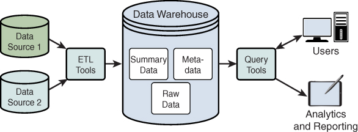
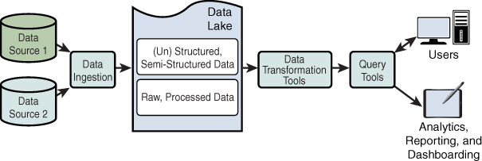

# 1.3. Conceptos de almacenamiento

Diseñar la solución (criterio **a)**) es elegir **dónde vive el dato** y **qué garantías** ofreces: ¿una transacción que no se puede ver a medias, o un sistema que sigue respondiendo aunque se corte la red entre nodos?

No es una moda (“ahora todo a Mongo”). Es una lista de preguntas. Este apartado te da el vocabulario para responderlas.

## Base de datos relacional

Guarda registros en **tablas**: cada **fila** es un hecho (una venta, un alumno) y cada **columna** un atributo (fecha, importe, grupo). Antes de insertar, declaras un **esquema**: tipos, claves, reglas. El lenguaje habitual es **SQL**. Los **índices** son como el índice de un libro: evitan leerse todas las páginas para encontrar un DNI.

Encajan muy bien en **OLTP**: muchas operaciones cortas (“cobra esta línea”, “reserva esta plaza”) con integridad.

**Por qué cuesta en Big Data:** suelen crecer **en vertical** (un servidor más gordo). Cuando una tabla ya no cabe, o un `JOIN` de tres tablas enormes no termina, el relacional deja de ser el almacén *único*. **No desaparece**: sigue siendo el origen típico del que **ingieres** hacia el lago o el almacén analítico. La caja del supermercado seguirá en SQL; el análisis de tres años de tickets, probablemente no.

!!! tip "La pregunta de aula"
    “¿Las relacionales sirven para Big Data?”  
    Como **único** almacén del volumen extremo: en general **no**, por el techo vertical.  
    Como **fuente** y como sitio de las transacciones de negocio: **sí**, y mucho.

## Base de datos NoSQL

Nacen para **volumen**, **variedad** y **escala horizontal**. “NoSQL” no es un producto: es una familia. Elegir “NoSQL” sin decir cuál es como decir “voy en vehículo” sin decir si es bici o camión.

| Familia | Idea | Ejemplo de uso |
| --- | --- | --- |
| Documento | Un JSON/BSON por registro; el esquema puede variar | Perfil de usuario, catálogo |
| Clave-valor | `get` / `put` muy rápidos | Caché, sesiones |
| Columnar / *wide-column* | Familias de columnas, bien para series | Logs, IoT |
| Grafo | Nodos y aristas | Fraude, “quién conoce a quién” |

MongoDB Query Language (MQL) aparece mucho en tutoriales de **documentos**. No es “el SQL de todo NoSQL”: cada familia habla distinto.

**¿Sirven para Big Data?** Sí, cuando el problema es **repartir y crecer**. **No** sustituyen a un relacional si necesitas transacciones ACID estrictas (transferencia, stock con bloqueo). Un carrito de la compra *puede* vivir en un documento; el asiento contable, no.

## Dataset

Un **dataset** (conjunto de datos) es una colección que **tiene sentido tratar junta**: los tweets de una campaña, las lecturas de una estación, las facturas de 2026. Puede vivir en CSV, JSON, una tabla, Parquet o un *bucket*.

No es un producto que se instala. Es la **unidad de trabajo** del análisis. Cuando en práctica te dicen “usa el dataset de Airbnb”, te están diciendo *qué* vas a procesar, no *en qué motor* está.

## Data warehouse (almacén de datos)

Es un repositorio **centralizado**, pensado para **inteligencia de negocio (BI)** y análisis, con **histórico**. Los datos suelen llegar por **ETL** desde sistemas de operación (ERP, CRM, SCM, la caja). Es una **foto** periódica, no el sitio donde el cajero pica la venta.

El esquema se decide **antes** de cargar (*schema-on-write*): si mañana aparece un campo nuevo, hay que **cambiar el modelo**. A cambio, el analista encuentra tablas limpias, con nombres que el negocio entiende, listas para OLAP o para un cuadro de mando.

Piensa en un **almacén de un supermercado**: todo etiquetado, pasillos fijos, pensado para sacar el pedido de siempre. No tiras ahí la caja sin abrir del camión.

## Data lake

El **data lake** guarda el dato **en su formato original** (tabla, JSON, vídeo, log). Encaja con ciencia de datos y ML: no tiras el bruto por si **mañana** cambia la pregunta.

El esquema se aplica **al leer** (*schema-on-read*). Cargas desde IoT, APIs, logs, a menudo en continuo. El riesgo clásico es el ***data swamp***: un lago sin catálogo, sin dueño y sin calidad. Entonces “tenemos un lake” significa “tenemos un disco sucio”.

| | Data warehouse | Data lake |
| --- | --- | --- |
| Imagen | Almacén etiquetado | Embalse: el agua llega como llega |
| Dato | Limpio, modelado | Bruto o poco curado |
| Esquema | Al **escribir** | Al **leer** |
| Usuarios típicos | Negocio, BI | Ingeniería y ciencia de datos |
| Pregunta | Ya la conoces | Puede aparecer después |

En la práctica muchas organizaciones tienen **los dos** (o un *lakehouse*): el lago para el bruto y el warehouse para lo que el director ve el lunes. No eliges uno “para siempre”: eliges **para cada pregunta**.

## ACID: cuando el negocio no puede verse a medias

Son las garantías de las bases **transaccionales** (casi siempre relacionales). El acrónimo se entiende mejor con una transferencia de 50 € de la cuenta A a la B:

| Letra | Nombre | Qué exige | Si fallara |
| --- | --- | --- | --- |
| **A** | Atomicidad | Todo o nada | Se resta en A y no se suma en B |
| **C** | Consistencia | Las reglas del esquema se cumplen | Un saldo negativo “prohibido” queda escrito |
| **I** | Aislamiento | Nadie ve el intermedio | Otra sesión lee A ya descontada y B aún no ingresada |
| **D** | Durabilidad | Lo confirmado no se pierde | Tras `COMMIT`, un corte de luz borra el ingreso |

ACID usa un control **pesimista** (bloqueos): asume que el fallo *puede* ocurrir (ley de Murphy) y prefiere ir más despacio a dejar el libro contable roto. Escribir en disco (durabilidad) es más lento que dejarlo solo en RAM.

No toda base “relacional” es ACID al 100 % si la configuras en modo relajado. Para **transacciones de negocio** (caja, nómina, matrícula oficial) sí debes exigir estas propiedades.

## Teorema CAP: qué pasa cuando se parte la red

En un almacén **distribuido** (varios nodos), el teorema de Brewer dice que, **ante una partición de red**, no puedes tener a la vez las tres:

- **C**onsistencia: toda lectura ve el **último** escrito (o un error; nunca un dato viejo haciéndose pasar por nuevo).
- **A**vailability (disponibilidad): toda petición recibe **alguna** respuesta válida (aunque no sea la última).
- **P**artition tolerance: el sistema **sigue** si se corta la red entre nodos.

En un clúster real **P no es opcional**: los cables se cortan, un switch se cuelga, un centro de datos pierde enlace. La decisión de diseño suele ser:

| Tipo | Prioriza | En una frase de aula |
| --- | --- | --- |
| **CP** | C + P | “Prefiero no responder a enseñar un saldo mentira.” |
| **AP** | A + P | “Prefiero responder; ya se pondrán de acuerdo los nodos.” |
| **CA** | C + A | Relacional en **un** sitio: no reparte el dato, así que la partición entre nodos **no entra** en el problema |

!!! example "Dos sedes"
    El nodo de Santander acaba de registrar un pago. Se corta la red con el de Torrelavega.

    - **CP:** Torrelavega puede **negar** la lectura del saldo hasta recuperar el enlace.
    - **AP:** Torrelavega **da un saldo** (quizá el de hace dos minutos). El cliente ve *algo*; puede no ser lo último.

Muchos productos **se configuran** (¿puedo leer de una réplica secundaria?). No memorices “Mongo es CP” como dogma: pregunta *qué hace este sistema si se parte la red*.

## BASE: el otro extremo de ACID

Cuando una distribuida elige **A + P**, el diseño típico se llama **BASE**:

- **B**asically **A**vailable: siempre hay respuesta (éxito o error controlado), no un silencio eterno.
- **S**oft state: dos lecturas seguidas pueden diferir **aunque tú no hayas escrito**. Un nodo aún no había recibido la réplica.
- **E**ventual consistency: *al final* (segundos o más) los nodos se ponen de acuerdo.

!!! failure "¿BASE para el TPV o para la nota oficial?"
    **No.** Una venta cobrada, un asiento o una calificación que se publica al alumno quieren **ACID**. BASE encaja en un timeline, un catálogo replicado, lecturas de IoT, un carrito que aún no es el cobro.

## Cómo elegir (criterio a)

Recorre las preguntas **en este orden**:

1. ¿Hay una transacción de negocio que no puede verse a medias? → relacional **ACID** (OLTP).
2. ¿El volumen o la variedad rompen un solo servidor? → **clúster** + NoSQL o ficheros distribuidos.
3. ¿La pregunta de negocio ya está clara y se repetirá cada lunes? → **warehouse** + modelo dimensional.
4. ¿Aún no sabes qué preguntarás o el bruto es heterogéneo? → **lake**, y luego curas hacia el warehouse.

Si puedes justificar esas cuatro frases con un caso (hotel, supermercado, sensores), has caracterizado el proceso de diseño. Eso es lo que pide el RA1, no recitar definiciones.
