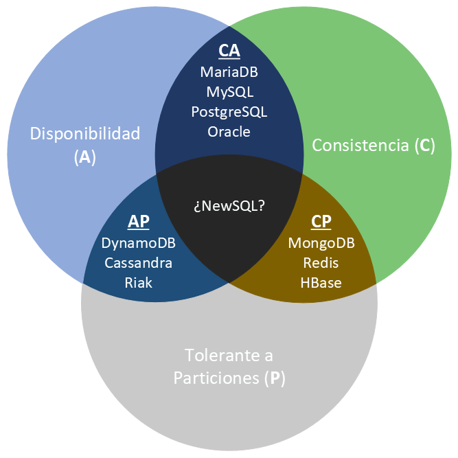

# 1.3. Conceptos de almacenamiento

Diseñar la solución (criterio **a)**) es elegir **dónde vive el dato** y **qué garantías** ofreces. No hace falta haber cursado un módulo de bases de datos: cada idea se explica aquí con un ejemplo, y **después** aparece la sigla, si la tiene.

## Base de datos relacional

Imagina una hoja de cálculo bien hecha, con reglas. Los datos viven en **tablas**:

- cada **fila** es un hecho (una venta, un alumno, una reserva);
- cada **columna** es un dato de ese hecho (fecha, importe, grupo).

Antes de guardar nada, declaras **cómo es** la tabla: qué columnas hay, de qué tipo (número, texto, fecha) y qué no se puede romper (un DNI no se puede repetir, un importe no puede estar vacío). A ese “contrato” se le llama **esquema**. El lenguaje habitual para preguntar y cambiar esas tablas es **SQL**.

Un **índice** es como el índice de un libro: evitas leerse todas las páginas para encontrar un DNI.

Este modelo encaja cuando el trabajo es **muchas operaciones cortas del día a día**: cobrar una línea, reservar una plaza, matricular a alguien. Cada una tiene que quedar **bien hecha**, no a medias.

**Por qué cuesta en Big Data:** estas bases suelen crecer **en vertical** (un servidor más gordo). Cuando la tabla ya no cabe, o cruzar tres tablas enormes no termina, el relacional deja de ser el almacén *único*. **No desaparece**: sigue siendo el origen típico del que **copias** datos hacia el lago o hacia el almacén de informes. La caja del supermercado seguirá aquí; el análisis de tres años de tickets, probablemente no.

!!! tip "La pregunta de aula"
    “¿Las relacionales sirven para Big Data?”  
    Como **único** almacén del volumen extremo: en general **no**, por el techo vertical.  
    Como **fuente** y como sitio de las operaciones de negocio: **sí**, y mucho.

## Base de datos NoSQL

Nacen para **volumen**, **variedad** y crecer **añadiendo máquinas**. “NoSQL” no es un producto: es una **familia**. Elegir “NoSQL” sin decir cuál es como decir “voy en vehículo” sin decir si es bici o camión.

| Familia | Idea | Ejemplo de uso |
| --- | --- | --- |
| Documento | Un registro parece un JSON; no todos tienen los mismos campos | Perfil de usuario, catálogo |
| Clave-valor | Guardar y recuperar muy rápido con una clave (`usuario:17`) | Caché, sesiones |
| Columnar / *wide-column* | Familias de columnas, bien para series largas | Logs, sensores |
| Grafo | Puntos unidos por relaciones | Fraude, “quién conoce a quién” |

Cada familia habla un idioma distinto. Lo que ves en tutoriales de MongoDB **no** sirve igual en las otras.

**¿Sirven para Big Data?** Sí, cuando el problema es **repartir y crecer**. **No** sustituyen a un relacional si el negocio no puede verse a medias (una transferencia, el stock al cobrar, una nota oficial). Un carrito de la compra *puede* vivir en un documento; el asiento del banco, no.

## Dataset

Un **dataset** (conjunto de datos) es una colección que **tiene sentido tratar junta**: los tweets de una campaña, las lecturas de una estación, las facturas de 2026. Puede vivir en CSV, JSON, una tabla, Parquet o una carpeta en la nube.

No es un programa que se instala. Es la **unidad de trabajo** del análisis. Cuando en práctica te dicen “usa el dataset de Airbnb”, te están diciendo *qué* vas a procesar, no *en qué motor* está.

## Data warehouse (almacén de datos)

Es un sitio **central**, pensado para **informes y decisiones** (lo que en empresa llaman inteligencia de negocio, *BI*), con **histórico**. Los datos no se pican ahí: **se copian** desde las aplicaciones del día a día (caja, reservas, facturación). Es una **foto** periódica, no el sitio donde el cajero cobra.

Las columnas se deciden **antes** de guardar: si mañana aparece un campo nuevo, hay que **cambiar el modelo**. A cambio, quien hace el informe encuentra tablas limpias, con nombres que el negocio entiende, listas para un cuadro de mando.

Piensa en un **almacén de un supermercado**: todo etiquetado, pasillos fijos, pensado para sacar el pedido de siempre. No tiras ahí la caja sin abrir del camión.

## Data lake

El **data lake** (lago de datos) guarda el dato **como llegó** (tabla, JSON, vídeo, log). Encaja con ciencia de datos y ML: no tiras el bruto por si **mañana** cambia la pregunta.

El “cómo se interpreta” se aplica **al leer**, no al guardar. Cargas desde sensores, APIs, logs, a menudo en continuo. El riesgo clásico es el ***data swamp*** (ciénaga): un lago sin catálogo, sin dueño y sin calidad. Entonces “tenemos un lake” significa “tenemos un disco sucio”.

| | Data warehouse | Data lake |
| --- | --- | --- |
| Imagen | Almacén etiquetado | Embalse: el agua llega como llega |
| Dato | Limpio, modelado | Bruto o poco curado |
| Cuándo fijas las columnas | Al **guardar** | Al **leer** |
| Usuarios típicos | Negocio, informes | Ingeniería y ciencia de datos |
| Pregunta | Ya la conoces | Puede aparecer después |

En la práctica muchas organizaciones tienen **los dos**: el lago para el bruto y el warehouse para lo que el director ve el lunes. No eliges uno “para siempre”: eliges **para cada pregunta**.

## Cómo se guarda (bloque, objeto, lakehouse)

No es lo mismo el **disco del PMS** que el sitio donde gerencia lee el histórico.

| Forma | Idea | En el hotel |
| --- | --- | --- |
| **Bloque** | El sistema operativo parte el disco en bloques y monta un sistema de ficheros. Es el disco de *una* máquina (o un NAS compartido). | El volumen donde corre PostgreSQL de recepción. |
| **Objeto** | Guardas el fichero **entero** (un objeto) con una clave, en un cubo. No “abres el byte 17”: bajas o sustituyes el objeto. Típico en nube ([S3](https://aws.amazon.com/s3/), Azure Blob…). | `reservas/2026-08-19.parquet` en un cubo; se replica sin que tú mires el disco. |
| **Lakehouse** | El lago **más** tablas: esquema, actualizaciones e incluso borrados (un huésped ejerce el derecho de supresión) **sin** montar un warehouse aparte. Productos que oiréis: [Delta Lake](https://delta.io/), Snowflake. | Bruto de sensores **y** la tabla limpia de ocupación, en el mismo sitio. |

**Calcular y guardar se pueden separar.** En un clúster Hadoop clásico el dato y la CPU **conviven** en el nodo (lo viste en [1.2](clusters.md)). En un lago en cubo, el disco escala solo; el motor (Spark, un job de Pentaho, Athena…) se enciende, lee, escribe y se apaga. A veces hay un híbrido: copias un trozo a HDFS **solo para el job** y el resultado vuelve al cubo.

!!! tip "RAM frente a disco (orden de magnitud)"
    La RAM es **órdenes** más rápida que un SSD, y el SSD más que un disco de platos. Por eso Spark “en memoria” y por eso el panel de las 8 no puede barrer 8 TB desde un HDD como si fuera una variable. El formato (Parquet, columnas) está en [1.7](formatos.md).

## Qué es una transacción (hace falta para entender ACID)

En la calle, “transacción” suena a pago. En bases de datos es más concreto: **un paquete de cambios que o se hacen todos o no se hace ninguno**.

Ejemplo: transferir 50 € de la cuenta A a la B son **dos** cambios (quitar en A, poner en B). Si el sistema se cae a mitad, no puedes dejar a A sin el dinero y a B sin recibirlo. Ese paquete es la **transacción**.

Cuando el paquete termina bien, el sistema lo **confirma** (queda grabado). Si algo falla, **deshace** todo el paquete y el mundo queda como al principio.

## ACID: cuando el negocio no puede verse a medias

Son las cuatro garantías que se piden a una base usada para esas transacciones (casi siempre, una relacional). El acrónimo se entiende con la misma transferencia de 50 €:

| Letra | Nombre | Qué exige | Si fallara |
| --- | --- | --- | --- |
| **A** | Atomicidad | Todo o nada | Se resta en A y no se suma en B |
| **C** | Consistencia | Se cumplen las reglas (un saldo no puede quedar “prohibido”) | Queda escrito un saldo negativo que el banco no admite |
| **I** | Aislamiento | Nadie ve el paquete a medias | Otra persona lee A ya descontada y B aún no ingresada |
| **D** | Durabilidad | Lo confirmado **no se pierde** | Tras confirmar, un corte de luz borra el ingreso |

Para conseguirlo, el sistema suele **bloquear** un momento lo que está tocando (como reservar un asiento en el cine mientras pagas). Escribir en disco (durabilidad) es más lento que dejarlo solo en la memoria RAM: por eso estas bases no son las más rápidas del mundo, son las más **serias** para dinero y notas oficiales.

No toda base “relacional” cumple esto al 100 % si la configuras en modo relajado. Para **caja, nómina o matrícula oficial** sí debes exigir estas cuatro letras.

## Teorema CAP: qué pasa cuando se parte la red

Hasta ahora imaginabas **un** servidor. En un [clúster](clusters.md) el dato está en **varios** ordenadores. El teorema de Brewer (CAP) dice que, **si se corta la red entre ellos**, no puedes tener a la vez las tres cosas siguientes:

- **C**onsistencia: quien pregunta recibe el dato **más reciente**, o un error. Nunca un valor viejo haciéndose pasar por actual.
- **A**vailability (disponibilidad): quien pregunta recibe **alguna** respuesta válida (aunque no sea la última).
- **P**artition tolerance: el sistema **sigue funcionando** aunque se corte el enlace entre nodos.

En un clúster real **P no es opcional**: un cable se corta, un *switch* se cuelga, un centro de datos pierde enlace. La decisión de diseño suele ser:

| Tipo | Prioriza | En una frase de aula |
| --- | --- | --- |
| **CP** | C + P | “Prefiero no responder a enseñar un saldo mentira.” |
| **AP** | A + P | “Prefiero responder; ya se pondrán de acuerdo los nodos.” |
| **CA** | C + A | Un relacional en **un** sitio: el dato no está partido, así que “cortar la red entre nodos” **no entra** en el problema |

!!! example "Dos sedes"
    El nodo de Santander acaba de registrar un pago. Se corta la red con el de Torrelavega.

    - **CP:** Torrelavega puede **negar** la lectura del saldo hasta recuperar el enlace.
    - **AP:** Torrelavega **da un saldo** (quizá el de hace dos minutos). El cliente ve *algo*; puede no ser lo último.

Muchos productos **se configuran**. No memorices “Mongo es CP” como dogma: pregunta *qué hace este sistema si se parte la red*.

## BASE: el otro extremo de ACID

Cuando una base distribuida elige **responder aunque algún nodo vaya atrasado** (A + P), el diseño típico se llama **BASE**. Otra vez, primero la idea y luego las letras:

- **B**asically **A**vailable: siempre hay respuesta (éxito o error claro), no un silencio eterno.
- **S**oft state (estado blando): dos lecturas seguidas pueden diferir **aunque tú no hayas escrito**. Un nodo aún no había recibido la copia.
- **E**ventual consistency (consistencia **eventual**): *al rato* (segundos o más) todos los nodos dicen lo mismo.

!!! failure "¿BASE para la caja o para la nota oficial?"
    **No.** Una venta cobrada, un asiento bancario o una calificación publicada quieren **ACID**. BASE encaja en un timeline, un catálogo replicado, lecturas de sensores, un carrito que **aún no** es el cobro.

## Cómo elegir (criterio a)

Recorre las preguntas **en este orden**:

1. ¿Hay un paquete de cambios que no puede verse a medias? → relacional con **ACID**.
2. ¿El volumen o la variedad rompen un solo servidor? → **clúster** + NoSQL o ficheros repartidos.
3. ¿La pregunta de negocio ya está clara y se repetirá cada lunes? → **warehouse**.
4. ¿Aún no sabes qué preguntarás o el bruto es de muchos tipos? → **lake**, y luego curas hacia el warehouse.
5. ¿Necesitas el bruto **y** tablas que se puedan actualizar o borrar (un NIF que hay que retirar)? → **lakehouse**, o lago + warehouse a la vez.

En [1.4](procesamiento.md) verás otro par de siglas (OLTP y OLAP): no son otro tipo de base, son **dos trabajos distintos** (operar el día a día frente a analizar el histórico).

Si puedes justificar esas frases con un caso (hotel, supermercado, sensores), has caracterizado el diseño. Eso es lo que pide el RA1, no recitar definiciones.
