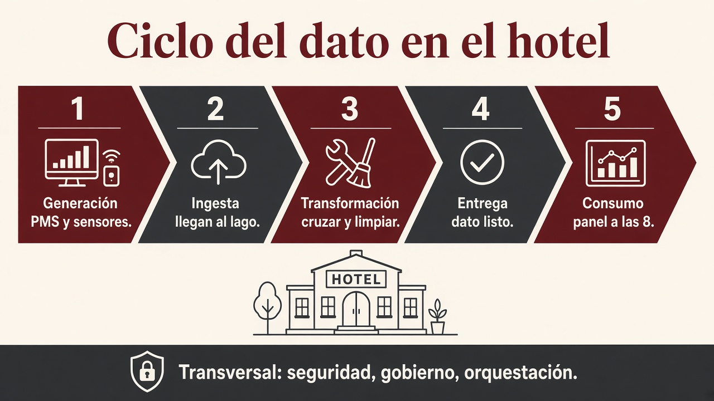
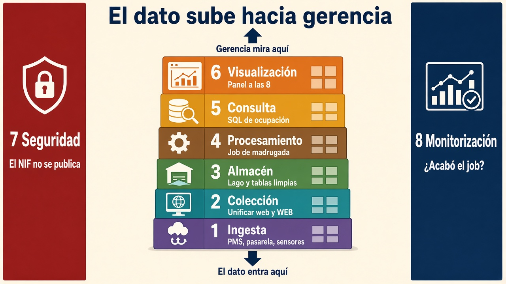
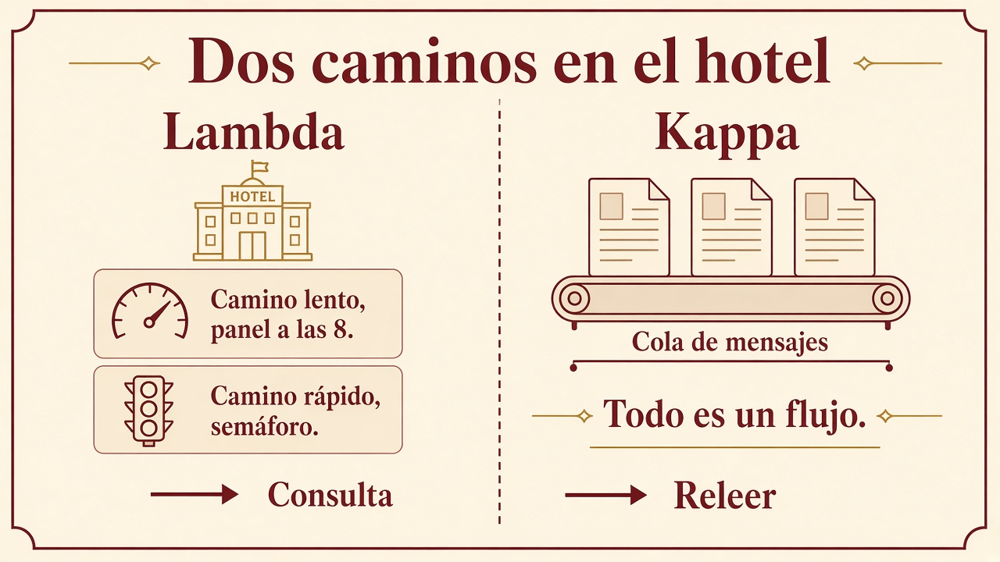
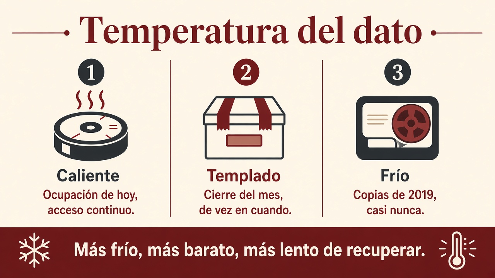

# 1.5. Arquitectura por capas y paisaje de herramientas

Un sistema Big Data no es “un programa que lo hace todo”. Si metéis ingesta, limpieza, modelos y el PDF para gerencia en el mismo script, no podéis probar, ni sustituir una pieza, ni explicar el diseño (criterio **a)**).

Se parte en **capas** que se hablan entre sí. Cada capa tiene **una** responsabilidad. Así sabéis dónde encajan la [ingesta](ingesta.md), el [formato](formatos.md), [Pentaho](pentaho.md) y el cuadro de mando.

Este apartado es el **mapa del oficio** que en [1.1](por-que-big-data.md) llamamos ingeniería de datos: no el gráfico del lunes, sino que ese gráfico **pueda** hacerse. El hilo es el [grupo hotelero](caso-hotel.md).

!!! info "Cómo se lee esta página"
    Primero el **ciclo** (fases: de que nace el dato hasta que gerencia lo usa). Luego el **edificio** (ocho capas: el dato entra abajo y gerencia mira arriba). Después **cómo se combinan** lote y flujo (Lambda / Kappa) con los relojes 23:00 / 8:00 / semáforo. Los logos van al final: se sitúan en una capa; no se recitan.

## El ciclo (generación → consumo)

Antes de los logos, el dato recorre un ciclo. Las tecnologías cambian; **estas fases no**.

1. **Generación.** Quién, dónde y cuándo nace el dato: PMS, pasarela, sensor, un Excel de Comillas, una API.
2. **Ingesta.** Moverlo al almacén. El detalle (pipeline, push/pull/poll, ETL/ELT) está en [1.6](ingesta.md).
3. **Transformación.** Cruzar, limpiar, agregar. Aquí vive Pentaho y, a escala, Spark SQL. No es lo mismo que unificar nombres (eso es la capa 2, más abajo). El resultado suele **añadirse** al lago, no pisar el fichero: si un huésped pide borrar el NIF, no editáis el Parquet a mano ([1.7](formatos.md)).
4. **Entrega** (*serving*). El dato **ya es de fiar** y se lo dais a un consumidor: panel, modelo, fichero para el científico.
5. **Consumo.** Gerencia a las 8, un analista, un entrenamiento. Si el consumidor no confía, el ciclo ha fallado **antes**.

Sobre el almacén (lago, warehouse, *lakehouse*, cubo de objetos: [1.3](almacenamiento.md)) se apoyan ingesta, transformación y entrega. Seguridad y monitorización son **capas** que atraviesan el edificio. Gobierno, DataOps y orquestación son **corrientes** (no una novena capa): van más abajo.

### A quién servís

No es el mismo reloj.

| Entrega | Pregunta | Reloj en el hotel |
| --- | --- | --- |
| **Analítica de negocio** | ¿Qué pasó / por qué? Decisiones de **días o semanas**. | El panel de las 8 (lote). |
| **Analítica operacional** | ¿Qué hago **ahora**? | El semáforo de recepción (sensores). |
| **Analítica embebida** | El dato vive **dentro** de otra app. | “¿Queda doble al mar?” en la web de reservas. |

A veces el resultado **vuelve al origen**: el modelo etiqueta bien una cancelación y escribís el hecho otra vez en el PMS. Eso se llama *reverse ETL*. No lo montáis en este módulo; sí sabéis que el ciclo **no es de un solo sentido**.

## Las capas (el dato entra abajo y gerencia mira arriba)

El ciclo son **fases** (qué le pasa al dato). Las ocho capas son el **edificio** (dónde vive cada responsabilidad). En [1.6](ingesta.md) veréis un resumen de **cuatro** pisos: allí el 4 es el panel; **aquí el 4 es el job**. No mezcléis los números.

### 1. Ingesta

Entráis a las fuentes que **ya existen**: el PMS, la pasarela, el JSON del canal, los sensores, un CSV de Comillas. **No** elegís cómo habla el origen: os adaptáis (SQL, HTTP, fichero, cola).

Si esta capa falla, el resto analiza el vacío. El detalle está en [1.6](ingesta.md).

### 2. Colección / integración

Unificáis **formato y semántica**. El mismo canal no puede llamarse `web` en Laredo y `WEB` en Potes sin un criterio. El mismo huésped no puede tener tres NIF. Aquí nace (o se rompe) la calidad.

Esto **no** es el cruce reservas ⋈ cobros: eso es transformar (capa 4). Aquí es poner el mismo nombre a la misma cosa.

### 3. Almacenamiento

Lago, warehouse, *lakehouse*, HDFS, objeto en cloud… [distribuido](clusters.md) si el volumen lo pide. Aquí aplicáis lo de [1.3](almacenamiento.md): ¿el cobro puede verse a medias o no? ¿lago, almacén de informes o los dos?

### 4. Procesamiento

Infraestructura **batch**, **streaming** o híbrida. *No* extrae valor ella sola: deja el dato **listo** (agregado, limpio, unido). El job de madrugada, Spark o un script viven aquí. Lote o flujo, en [1.4](procesamiento.md).

### 5. Consulta y analítica

SQL, notebooks, modelos. Aquí sale **conocimiento**: “Laredo cancela más el viernes por la web”.

### 6. Visualización

Informes y cuadros de mando para **gerencia**. Es el criterio **e)**: fácil de interpretar. Un `.ktr` o un Parquet crudo **no** son esta capa. El panel de las 8 **sí**.

### 7. Seguridad (transversal) { #7-seguridad-transversal }

Atraviesa todas las anteriores: quién lee el NIF, cifrado, copias, amenazas internas (un práctico con más permisos de la cuenta) y externas. Principio de **menor privilegio**: solo el tiempo y las columnas que hacen falta. Enmascarar el DNI del huésped no es un adorno.

### 8. Monitorización (transversal)

¿El job de anoche acabó **antes de las 8**? ¿El dato del panel es de ayer o de marzo? Auditoría. Sin esto, el prototipo de clase funciona y el de producción **miente** sin que nadie lo sepa.

!!! warning "Las dos que se olvidan en el trabajo de clase"
    Seguridad y monitorización. El flujo “CSV → filtro → Excel” llega al 10. Las otras seis capas, si el caso es real, también existen aunque sean simples (una carpeta con permisos y un log de Pentaho).

## Qué tiene que cumplir el edificio

Las capas de arriba son el **edificio**. Una arquitectura Big Data, además, tiene que **aguantar** volumen y velocidad.

| Exigencia | En castellano | En el hotel |
| --- | --- | --- |
| **Escala** | Añadís disco o CPU sin rediseñar | Abrís Noja y el panel de las 8 sigue saliendo |
| **Aguanta fallos** | Un nodo muerto no tumba el **histórico** | Se funde un disco en Potes; el **panel** sigue ([1.2](clusters.md)). El cobro en recepción es el PMS, no el clúster |
| **Dato repartido** | Nada de un único SPOF (un solo punto que, si cae, cae todo) | No un USB con “el histórico” |
| **Proceso repartido** | El cálculo también se parte | El job de ocupación no corre en un portátil |
| **Dato cerca del cálculo** | Menos red, menos espera | Hadoop clásico; en nube a veces se **separa** ([1.2](clusters.md), [1.3](almacenamiento.md)) |

!!! failure "Sobreingeniería"
    Montar Kafka + Spark + tres nubes “porque es Big Data” cuando el Excel de Comillas cabe en un PC. Primero la pregunta de gerencia; luego el edificio. Los proveedores publican listas (p. ej. *Well-Architected*): la idea es la misma, no hace falta recitar la guía.

Principios que evitan el zoo:

1. **Componentes comunes** pocos y bien elegidos: cubo de objetos, Git, orquestador, un motor de proceso.
2. **Todo falla.** **RTO:** cuánto podéis tardar en recuperar el panel (si el job muere a las 02:10, ¿llegáis a las 8?). **RPO:** hasta qué hora de reservas aceptáis **perder** (un fallo a las 22:00, ¿se pierde el día o solo la última hora?).
3. **Elástico**, también hacia abajo (noviembre: apagáis nodos; [1.2](clusters.md)).
4. **Viva:** el negocio cambia; la arquitectura también.
5. **Poco acoplada:** cola o API; cambiáis NiFi por un script sin reescribir el PMS.
6. **Reversible:** una decisión mala se deshace (versión del job, no “ya está en producción para siempre”).
7. **Menos privilegio:** el práctico no lee el DNI ([seguridad](#7-seguridad-transversal)).

## Dos caminos: lote y flujo (Lambda y Kappa)

Lote y *streaming* ya están en [1.4](procesamiento.md). Aquí es **cómo se combinan** en el edificio.

- **Lote:** tiene principio y fin. El cierre de las 23:00. Preciso; tarda. **Eso es el panel de las 8.**
- **Flujo:** no acaba. Cada evento de sensor. Rápido; a menudo **menos** preciso (una ventana, no todo el histórico). **Eso es el semáforo.**

“Tiempo real” **no** es instantáneo: es responder en un plazo **finito** y útil. El semáforo de recepción sí; el panel de las 8 no hace falta.

### Lambda: los dos a la vez

Cada hecho nuevo (reserva, cobro, sensor) puede entrar por **dos** caminos. Luego se consulta **el que toca**:

1. **Capa lenta (lote).** El lago **inmutable**: se **añade**, no se pisa. Por la noche recorréis **todo** y calculáis la vista del panel (ocupación e importe **cerrados**). Precisión alta; latencia de horas. Gerencia a las **8** mira **solo** esta vista: es **ayer**, no el semáforo.
2. **Capa rápida (flujo).** Solo el **incremento** desde el último lote: el semáforo, la ocupación “de ahora”. Baja latencia; podéis muestrear o mirar diez segundos de cada minuto.
3. **Capa de consulta.** ¿Cierre de ayer? Vista lenta. ¿Queda doble? Vista rápida. **No** mezcléis las dos en el panel de las 8. La mezcla es **otra** pregunta (p. ej. a las 11, “importe de *hoy* hasta ahora”: cierre de anoche + el flujo de la mañana).

El linaje se conserva porque no reescribís: una cancelación es **otro** registro, no un borrado silencioso.

En el hotel eso es natural: **no** es el mismo algoritmo pintar el panel de las 8 (todo el día, todas las fuentes) y actualizar el semáforo (un evento).

### Kappa: un solo flujo

Si el lote no es más que “un flujo que se puede **releer**”, tiréis la capa lenta. Todo pasa por una **cola de mensajes** ([Kafka](https://kafka.apache.org/) y similares). El bruto no se muta; si cambiáis la transformación, **reprocesáis** desde un punto (el *replay*).

Cuatro ideas:

1. Todo es un flujo (el lote es un caso).
2. El origen no se pisa.
3. Un solo código que mantener.
4. Podéis volver a lanzar el proceso sobre los mismos eventos.

Hace falta que los eventos se guarden **en orden**. Si el algoritmo del panel **no** es el del semáforo (p. ej. un modelo de cancelación sobre tres años de Parquet), Kappa se queda corto: ese entrenamiento quiere el camino lento.

| Pregunta | Os inclináis a |
| --- | --- |
| ¿El cálculo del panel y el del semáforo son **el mismo** (o casi)? | **Kappa** (un código, una cola) |
| ¿El modelo de cancelación necesita **todo** el histórico y el semáforo no? | **Lambda** |
| ¿Solo el panel de las 8, sin semáforo? | Un lote. No montéis flujo “por si acaso” |
| ¿Solo el semáforo, y el 8 se puede **rehacer** releyendo la cola? | **Kappa** |

Spark se cita tanto porque **el mismo** código puede cubrir lote y flujo: en Lambda reduce el doble mantenimiento. El detalle del motor, en la [UT2](../ut2/ecosistema.md).

### Temperatura: no todo el dato se toca igual

| | **Caliente** | **Templado** | **Frío** |
| --- | --- | --- | --- |
| Se consulta | Sin parar | De vez en cuando | Casi nunca |
| Disco típico | RAM / SSD | Cubo “normal” | Cinta, archivo barato |
| En el hotel | Semáforo, caché de “¿queda habitación?” | Cierre del mes | Copias de 2019 |
| Recuperar | Barato en tiempo, caro en € | Equilibrio | Barato guardar, **lento** sacar |

El camino rápido de Lambda vive en caliente. El histórico del lote, de templado a frío. Pagar SSD por las fotos de la reforma de 2019 es mal diseño.

El [principio SCV](procesamiento.md#scv) (velocidad / precisión / volumen del **cálculo**) explica el trueque: el semáforo (S + V) **no** usa todas las filas; el panel de las 8 (C + V) **no** es instantáneo. No lo confundáis con CAP ([1.3](almacenamiento.md)).

## Gobierno, DataOps y orquestación

No son una novena capa con logo. Son **corrientes** que atraviesan el ciclo.

**Gobierno del dato.** Que se pueda **encontrar**, saber **de dónde salió** (linaje) y qué **significa** `canal`. Metadatos, catálogo, ética y privacidad (el NIF no se va a un cubo público). Sin esto el lago es ciénaga ([1.3](almacenamiento.md)).

**DataOps.** Entregar valor **antes**, con menos error: automatizar el job, **observar** cuando el CSV llega vacío, y tener un plan si Kitchen falla a las 02:10 (repetir, o volver a la versión de ayer). CI/CD aquí es “el flujo se prueba antes de pintar el panel”.

**Orquestación.** Quién dispara qué, en qué orden, y qué pasa si un paso muere. En aula lo veréis como **Kitchen** ([1.8](pentaho.md)). En industria oiréis [Apache Airflow](https://airflow.apache.org/): no transforma el dato; **coordina**. Un ingeniero de datos sin orquestación es un cron a ciegas.

## Cómo se lee un paisaje (*Big Data landscape*)

Si buscáis esa expresión veréis pósters con cientos de logos. **No los memoricéis.** Situad **la capa**:

| Capa | Ejemplos que veréis | Pregunta que responde |
| --- | --- | --- |
| 1 Ingesta / mensajería | Sqoop, Flume, NiFi, Kafka, Kinesis | ¿Cómo entra el dato? |
| 3 Almacén | HDFS, S3, warehouses cloud, MongoDB, HBase | ¿Dónde reposa? |
| 4 Proceso | MapReduce, Spark, Hive, Pig | ¿Quién transforma a escala? |
| Orquestación (corriente) | Oozie, Airflow, **Kitchen** (Pentaho) | ¿En qué orden y qué pasa si falla? |
| 6 Visualización | Power BI, Tableau, informes Pentaho | ¿Qué ve gerencia? |

**Hadoop** fue la plataforma pionera de **lotes** sobre HDFS (un sistema de ficheros **repartido**). **Spark** cubre lotes y streaming **en memoria** y convive con ese ecosistema: por eso aparece en las dos capas de Lambda. **Pentaho** se usa en este módulo para **ETL visual** y para **mostrar** el resultado sin programar el motor. La cola de Kappa suele ser Kafka; el detalle de ingesta está en [1.6](ingesta.md).

Los mapas cambian de año (nace una marca, muere otra). **Las capas no.** Un mapa reciente que se cita en el ciclo: [MAD landscape](https://mad.firstmark.com/) (orientación, no para recitar).

## Big Data y cloud

El BOE cita cloud. Un *bucket* S3 o un Glue no cambian el razonamiento: seguís decidiendo las 5 V, dónde vive el dato, lote o stream y el formato. Cambia **quién** opera los discos y **cómo pagáis**. El cubo es almacén de **objetos**; el clúster de cálculo puede **no** vivir en las mismas máquinas ([1.3](almacenamiento.md)).

En varios servicios analíticos de nube pagáis por **dato escaneado**, no solo por dato guardado. Por eso en [1.7](formatos.md) Parquet no es “un capricho moderno”: es menos euros y menos minutos.

## Destrezas del oficio (no un tutorial)

No hace falta dominarlas todas el primer día. Sí conviene saber **que existen** y para qué las usa un ingeniero:

- Linux / consola, SSH y redes (entrar en el nodo).
- APIs REST (traer un origen que no es un CSV).
- Git (el job también es código).
- Contenedores (Docker): levantar una herramienta sin pelearos con el Windows del aula.
- SQL (lingua franca de la transformación) y un lenguaje de scripts (en clase, Python).
- Un cuaderno Jupyter para probar; a producción, el mismo flujo en un orquestador.

Un ingeniero de datos **no** es un desarrollador de producto. Sí escribe el script que evita el clic manual a las 02:00.

## El mismo oficio, otro sitio

El hotel es el hilo. El edificio se parece fuera: una comercializadora (o un ayuntamiento con contadores) no quiere perder lecturas, detectar un consumo raro y un panel el lunes. Mismas ocho capas; otras fuentes. No hace falta cambiar de caso para entender el plano.

!!! success "Al terminar 1.5"
    Dibujad las **ocho** capas del [hotel](caso-hotel.md). Ponéd **una** herramienta o responsabilidad en cada una y justificad la de almacenamiento. Decid si pide **Lambda, Kappa o solo lote**. Si podéis explicarlo a un compañero que no ha leído el tema, el apartado está entendido.

## Actividad

No puntúa en Moodle. Una línea de por qué.

1. Situad cada herramienta en **una** de las ocho capas, o en la corriente de orquestación.

    | Herramienta | Pista |
    | --- | --- |
    | [Power BI](https://www.microsoft.com/es-es/power-platform/products/power-bi) | Lo que gerencia **ve** |
    | SQL | Preguntar ocupación ya curada |
    | [MongoDB](https://www.mongodb.com/) | Dónde reposa un JSON |
    | [Airflow](https://airflow.apache.org/) | Orden de los pasos |
    | [S3](https://aws.amazon.com/s3/) | Cubo de objetos |

2. En Lambda, el semáforo va más rápido que el panel de las 8. ¿Qué **pagáis** a cambio? El panel de las 8, ¿mezcla los dos caminos?
3. Lote frente a flujo: una frase de **volumen** y otra de **reloj**, con el cierre de las 23:00 y los sensores.
4. ¿Por qué oiréis tanto Spark en este dibujo, y no “un programa para el lote y otro para el flujo”?
5. Los sensores de Potes disparan a saco. Según el [SCV](procesamiento.md#scv), si queréis **velocidad y volumen**, ¿qué soltáis?

!!! tip "Comprobación"
    (1) Visualización (6) / consulta (5) / almacén (3) / orquestación / almacén (3). (2) Precisión o histórico; el panel de las 8 **no** mezcla. (3) Lote = mucho dato, fin; flujo = continuo, ventana. (4) Un motor, dos modos. (5) Precisión (muestreo).
