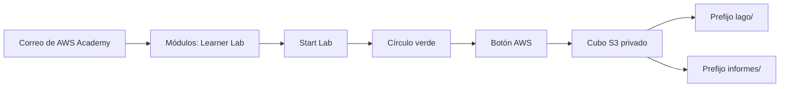
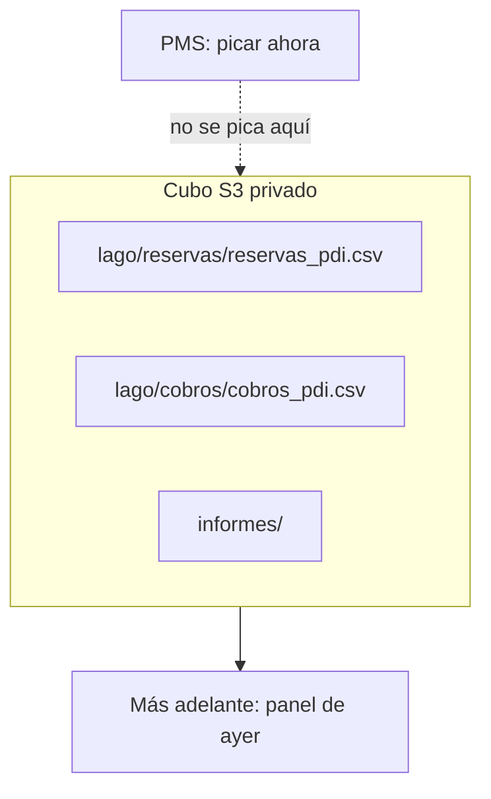

# Taller: AWS Academy y un cubo S3

Primer contacto con la nube del módulo. No es una cuenta personal de Amazon. No es el PMS. No son los 500 GB. Es **un cubo de objetos** donde aterriza una **copia** pequeña del hotel, con la consola que os da [AWS Academy Learner Lab](https://aws.amazon.com/training/awsacademy/){target="_blank" rel="noopener"}.

El criterio **a)** ya pidió *dónde vive el dato*. En [1.3](almacenamiento.md){target="_blank" rel="noopener"} el cubo es **objeto**: fichero entero, una clave, se replica sin que miréis el disco. Aquí lo tocáis. Glue, Athena, EC2 y las claves para [Pentaho](pentaho.md){target="_blank" rel="noopener"} **no** entran hoy.

!!! info "Cómo se lee esta página"
    Primero **entrar** al lab (Start Lab → AWS). Luego **crear un cubo privado** y **subir** un CSV del hotel. Al final, cuatro preguntas de por qué. El profesor os da el enlace de invitación; no lo busquéis en Google como “cuenta AWS gratis”.



## Qué es el Learner Lab (y qué no)

AWS Academy os presta una **cuenta de prácticas** mientras dura el curso del profesor. Cada alumno tiene un crédito de plataforma (en el lab veréis el saldo; el recuento puede ir **con retraso** de horas). Los servicios permitidos están en el **Readme** del propio lab: si un botón no aparece, no está en este sandbox.

| Esto | No es esto |
| --- | --- |
| Invitación del profesor → LMS de Academy → **Start Lab** | Entrar en aws.amazon.com con el correo del instituto y una tarjeta |
| Sesión de **unas 4 horas** (se puede **Start Lab** otra vez para alargar) | Dejar EC2 “por si acaso”: come crédito aunque no estéis delante |
| **End Lab**: para instancias; el cubo S3 **sigue** | **Reset**: borra **toda** la cuenta de prácticas. No tiene deshacer |
| Cubo **privado** (Block Public Access) | Cubo abierto al mundo (`Principal: *`) ni web pública |

El disco (S3) y el cálculo (un job, un clúster) **no tienen por qué vivir juntos**. Eso es el diseño nube de [1.2](clusters.md){target="_blank" rel="noopener"}: el dato en el cubo; la CPU donde haga falta.

## 1. Entrar

1. Abrid el correo de **invitación** (el que os ha mandado el profesor, no un enlace de un compañero).
2. Cread la cuenta de AWS Academy si es la primera vez y aceptad las condiciones.
3. En el curso: **Modules** (o Módulos) → enlace **Learner Lab**.
4. **Start Lab**. Esperad a que el círculo junto a **AWS** se ponga **verde**.
5. Pulsad **AWS**. Se abre la consola en **otra pestaña**, ya dentro de la cuenta del lab.

Si el círculo no pasa a verde, esperad un minuto y recargad el lab. No abráis a la vez una consola personal de Amazon: mezclar las dos es el error más caro del primer día.

## 2. Región

Arriba a la derecha hay una **región**. Usad **la del Readme** (casi siempre *N. Virginia*, `us-east-1`).

Si cambiáis a Irlanda o España “porque estamos en Cantabria”, el cubo **deja de verse**. No se ha perdido: está en la otra región. Volved a la de origen.

## 3. Crear el cubo

1. Buscad **S3** → **Create bucket**.
2. **Nombre** (tiene que ser único en todo Amazon, en minúsculas):

    `bda-ut1-cantabria-<apellidos>`

    Ejemplo: `bda-ut1-cantabria-lopez-garcia`. Sin espacios, sin tildes, sin `Ñ`. Si está ocupado, añadid el aula (`-a1`).
3. Dejad **ACLs disabled**.
4. **Block all public access**: **activado**. No lo desmarcáis “para probar el enlace”.
5. Cifrado por defecto: el que venga. No hace falta versionado el primer día.
6. **Create bucket**.

Ese cubo **no cobra en recepción**. Es el sitio del **histórico copiado** (lago o informe), no la tabla del PMS.

## 4. Prefijos: parecen carpetas, son claves

En S3 no hay carpetas de disco: hay **claves** con barras. La consola las pinta como carpetas para que no os volváis locos.

Cread (Create folder) estos prefijos:

```text
lago/reservas/
lago/cobros/
informes/
```

| Prefijo | Oficio en el hotel |
| --- | --- |
| `lago/reservas/` | Bruto copiado del PMS (aún no es el panel de las 8) |
| `lago/cobros/` | Bruto de la pasarela |
| `informes/` | Lo que gerencia **ya** puede leer (cuando lo hayáis curado) |



Hoy **no** pintáis el panel. Solo dejáis el bruto en el cubo.

## 5. Subir dos CSV (pesan poco)

Descargad desde este sitio (no hace falta el de Hola ETL ni el del 1.7):

- [reservas_pdi.csv](../assets/practicas/reservas_pdi.csv){target="_blank" rel="noopener"}
- [cobros_pdi.csv](../assets/practicas/cobros_pdi.csv){target="_blank" rel="noopener"}

En S3:

1. Entrad en `lago/reservas/` → **Upload** → el `reservas_pdi.csv`.
2. Entrad en `lago/cobros/` → **Upload** → el `cobros_pdi.csv`.

Abrid un objeto. Apuntad:

- **Key** (clave): `lago/reservas/reservas_pdi.csv` — eso es el “path”.
- **Size**: unos KB. **No** subáis los 500 GB de la [tarea de clase](tarea-clase.md){target="_blank" rel="noopener"}: el crédito del lab no es un disco infinito y el aula no lo necesita para entender el cubo.

No subáis DNI, fotos de huéspedes ni un Excel con NIF. El lago de clase usa reservas **de práctica**.

## 6. Comprobar que no es público

1. En el objeto, copiad **Object URL**.
2. Pegadla en una ventana de **incógnito** (sin la consola abierta).
3. Tiene que fallar (`AccessDenied` o similar). Si se descarga el CSV, el cubo está abierto: **cerrad el acceso público** y avisad al profesor.

Eso es la capa de **seguridad** de [1.5](arquitectura.md){target="_blank" rel="noopener"}: el NIF no se va a un cubo público. Hoy no hay NIF; la costumbre sí.

## 7. Cerrar la sesión

Cuando acabéis:

1. Volved a la pestaña del **lab** (no solo cerréis Chrome).
2. **End Lab**. No pulseis **Reset**.
3. El cubo **sigue**. El próximo día: Start Lab otra vez, misma región, mismo cubo.

Si lanzáis una máquina EC2 “a ver qué es” y os vais, **sigue cobrando** hasta que la paréis o hagáis End Lab. S3 de unos KB no os va a dejar sin crédito; un clúster olvidado, sí.

## Actividad

No puntúa en Moodle. Una línea de por qué.

1. El PostgreSQL de recepción y este cubo: ¿bloque u objeto? ¿Se puede “abrir el byte 17” en S3?
2. ¿Por qué **Block Public Access** y no un enlace para que gerencia mire el CSV en el móvil del pasillo?
3. ¿Subiríais aquí los 500 GB del histórico “porque en la nube cabe todo”? ¿Qué V o qué crédito duele?
4. Este cubo, ¿sustituye al PMS para cobrar una estancia?

!!! tip "Comprobación"
    Objeto (el fichero entero; no hay byte 17) / el CSV del lago no es el panel y no va a internet / no: crédito y no es el ejercicio / no: el cobro sigue siendo ACID en el PMS.

## Errores que se repiten

- Entrar en la consola **personal** en vez del botón **AWS** del lab.
- Cambiar de región y “se ha borrado el cubo”.
- Nombre del cubo con mayúsculas, espacios o tildes.
- Desmarcar Block Public Access para que “funcione el enlace”.
- **Reset** en vez de End Lab.
- Crear un usuario IAM y unas claves el primer día (en Learner Lab a menudo **no se puede**; no hace falta para este taller).
- Usar este cubo como destino de Spoon **hoy**. El [1.8](pentaho.md){target="_blank" rel="noopener"} admite S3 **si** el profesor lo abre más adelante; si no, el CSV acaba en una carpeta.

!!! success "Al terminar"
    Habéis **entrado** al sandbox, **creado** un almacén de objetos y **copiado** un bruto del hotel sin publicarlo. Eso ya es cloud del [RA1](ra1.md){target="_blank" rel="noopener"}: no el logo, el **dónde** y el **quién puede leer**.
