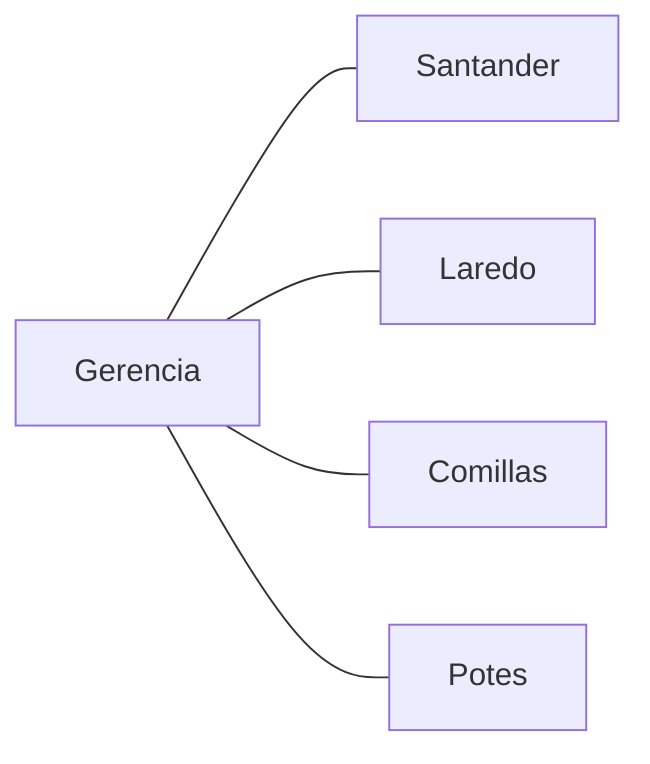
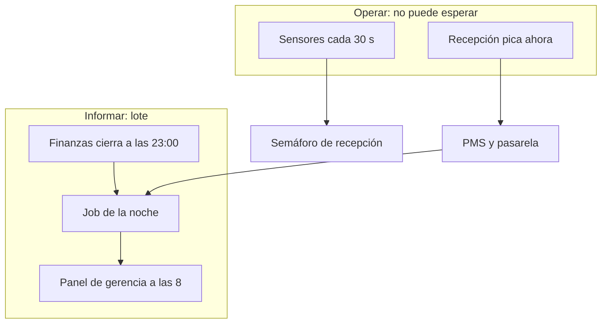

# El caso: grupo hotelero de Cantabria

Este es el **hilo de las dos unidades**: una cadena pequeña, inventada, con sede en Cantabria. No es una empresa real. Sirve para que reservas, cobros, sensores y el panel de gerencia salgan **siempre del mismo sitio**.

Si entras directo a [ingesta](ingesta.md) o a la [UT2](../ut2/index.md), empieza por aquí.

## Quiénes son

Cuatro establecimientos. Mismo dueño, mismo PMS, **estacionalidades distintas** (playa, ciudad, interior). Por eso un modelo de agosto en Laredo **no** se copia ciego a Potes en noviembre.

| Hotel | Dónde encaja | Para qué lo usamos en clase |
| --- | --- | --- |
| **Santander** | Ciudad, todo el año | Volumen estable; a menudo el “hotel grande” |
| **Laredo** | Costa, pico en agosto | Temporada alta, cancelaciones, *hotspot* si partes mal |
| **Comillas** | Costa oeste | Otro ritmo que Laredo; no es el mismo perfil de huésped |
| **Potes** | Interior (Liébana) | Invierno / puente; el contraejemplo de la playa |

En [1.7](formatos.md) y [1.8](pentaho.md) pueden aparecer **más filas** (Noja, Santoña, un Excel de un hotel nuevo). Eso no cambia la cadena: es el “mañana abre otro”. El esqueleto de la teoría son estos cuatro.

## Dos relojes (no los mezcles)

El dato **ya existe** en tres sitios. El problema del módulo es llevarlo a **otro** sitio, a tiempo, sin mentir.

| Quién | Qué hace | Reloj |
| --- | --- | --- |
| **Recepción** | Pica reservas y check-in en el PMS (*Property Management System*: el programa de reservas). No puede parar. | Ahora |
| **Pasarela de pago** | Sabe qué estancias se han cobrado. | Cada cobro |
| **Sensores de habitación** | Publican ocupación. | Cada ~30 s |
| **Finanzas** | Cierra el día. Hasta entonces el importe del martes **no** está cerrado. | **23:00** |
| **Dirección / gerencia** | Quiere **ocupación e importe cobrado por hotel**. | Cada mañana a las **8:00** |

Las 8:00 **no** son tiempo real. Finanzas cierra a las 23:00; por la noche corre un **lote**; a las 8 gerencia abre el panel. Si pides el dato a las 8:05 del mismo día, o no está o es de ayer.

Los sensores **sí** van casi al momento. Eso alimenta el **semáforo de recepción** (“¿queda habitación?”), no el cuadro de mando de las 8. En [ingesta](ingesta.md) verás por qué una cola de mensajes y un volcado nocturno **no** son el mismo diseño.

## Qué te van a pedir (el hilo)

1. **[1.1](por-que-big-data.md)** — Un evento (reserva, sensor, cobro) tiene que acabar en una **decisión** (menos habitaciones vacías). Un hotel de playa no es un albergue de montaña.
2. **[1.6](ingesta.md)** — Llevar PMS, cobros y sensores al lago o al almacén. El panel de las 8 es el **destino**; no se pinta en el taller *Hola ETL*.
3. **[1.7](formatos.md)** — Dirección solo mira tres números; el CSV arrastra doce columnas.
4. **[1.8](pentaho.md)** — El mismo cruce reservas ⋈ cobros, ahora agregado por hotel y canal.
5. **[UT2](../ut2/index.md)** — El martes por la mañana el CSV ya no abre en Excel. Hay que **depositar** y **procesar** en el sitio, y acabar el job **antes de las 8**.

!!! note "La página 1.5 usa otro ejemplo"
    [Arquitectura](arquitectura.md) recorre las capas con una comercializadora eléctrica (o un ayuntamiento). El oficio es el mismo: ingesta abajo, panel arriba. El hotel vuelve en 1.6.

!!! tip "Frase para no perderte"
    Recepción **opera**. Gerencia **informa**. Las 23:00 cierran el día. Las 8:00 enseñan el cierre de **ayer**.
