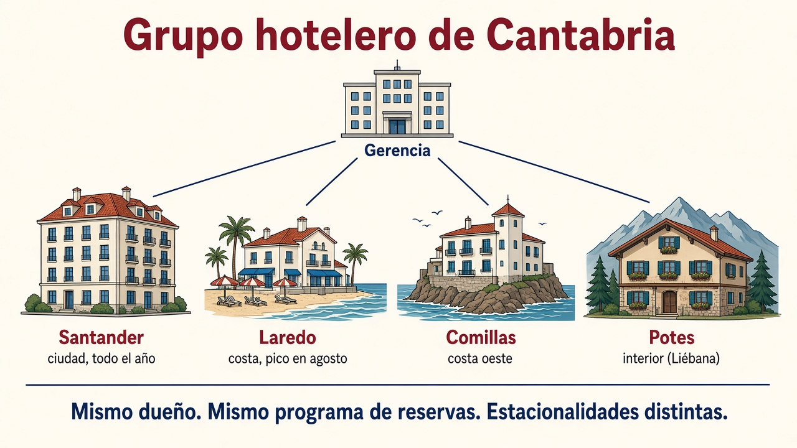
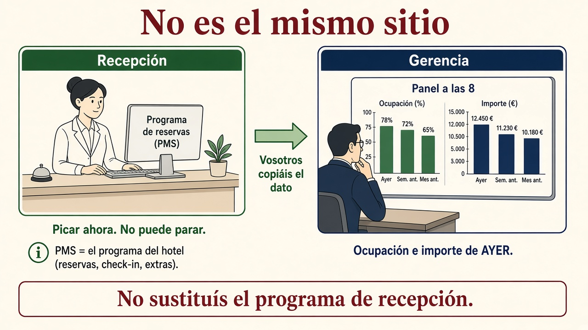
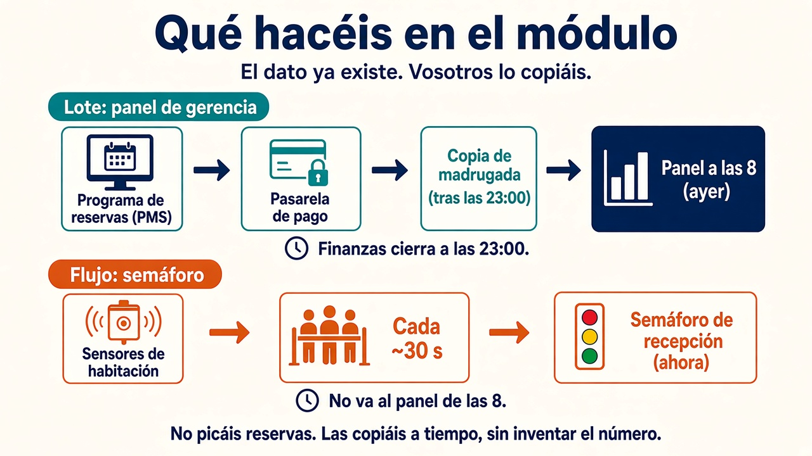

# El caso: grupo hotelero de Cantabria

Este es el **hilo de las dos unidades**: una cadena pequeña, **inventada**, con sede en Cantabria. No es una empresa real. Reservas, cobros, sensores y el panel de gerencia salen **siempre de aquí**, para que no cambiéis de historia en cada apartado.

Si entráis directo a [ingesta](ingesta.md){target="_blank" rel="noopener"} o a la [UT2](../ut2/index.md){target="_blank" rel="noopener"}, empezad por esta página.

## Quiénes son

Cuatro hoteles. Mismo dueño. **Estacionalidades distintas** (playa, ciudad, interior). Por eso un modelo de agosto en Laredo **no** se copia a ciegas a Potes en noviembre.

| Hotel | Dónde encaja | Para qué lo usamos en clase |
| --- | --- | --- |
| **Santander** | Ciudad, todo el año | Volumen estable; a menudo el “hotel grande” |
| **Laredo** | Costa, pico en agosto | Temporada alta y cancelaciones |
| **Comillas** | Costa oeste | Otro ritmo que Laredo; no es el mismo perfil de huésped |
| **Potes** | Interior (Liébana) | Invierno / puente; el contraejemplo de la playa |

En [1.7](formatos.md){target="_blank" rel="noopener"} y [1.8](pentaho.md){target="_blank" rel="noopener"} pueden salir **más filas** (Noja, Santoña, un Excel de un hotel nuevo). Eso es el “mañana abre otro”. El esqueleto de la teoría son estos cuatro.

## El programa de reservas (PMS)

En recepción **no** pican el Excel de gerencia. Usan un **programa de hotel**: alta de reserva, check-in, extras, habitación ocupada. En la jerga se llama **PMS** (*Property Management System*: sistema de gestión del establecimiento). En clase diréis «el programa de reservas» o «el PMS»: es **lo mismo**.

No es un servidor. El PMS es el **programa**. Suele vivir en un ordenador que está siempre encendido (un **servidor**). Si ese programa se cae, recepción no puede hacer check-in: **no puede parar**.

Los cuatro hoteles usan **el mismo** PMS (mismo dueño). Eso no significa que Laredo en agosto y Potes en noviembre se comporten igual.

Gerencia **no** abre el PMS a las 8 para sumar a mano. Quiere **un panel**: ocupación e importe cobrado **por hotel**.

## Qué hacéis vosotros (punto de partida)

El dato **ya está** en los programas del día a día. Vosotros **no lo inventáis** y **no picáis reservas**. El oficio de este módulo es **copiarlo** a un sitio pensado para informes, **a tiempo**, y **sin falsear** el número.

De dónde sale (tres orígenes):

1. **Programa de reservas (PMS).** Quién tiene habitación y para qué noches.
2. **Pasarela de pago.** El cobro de la tarjeta. Reservar **no** es cobrar: por eso luego hay que **cruzar** reservas y cobros.
3. **Sensores de habitación.** ¿Hay alguien dentro? Publican cada ~30 s.

A dónde lo lleváis (un destino para gerencia):

- Cada mañana a las **8:00**, **ocupación e importe cobrado por hotel**. Eso es el **cierre de ayer**, no el directo de ahora.

**Sin falsear** quiere decir: no coléis como cobrado lo que no se ha cobrado; no presentéis a las 8:05 del martes el martes como si ya hubiera cerrado; no mezcléis el semáforo de recepción con el cuadro de mando.

## Dos relojes (no los mezcléis)

| Reloj | Qué pasa |
| --- | --- |
| **Ahora** | Recepción pica en el PMS. No espera al informe. |
| Cada cobro | La pasarela anota si se ha cobrado. |
| Cada ~**30 s** | Los sensores alimentan el **semáforo** (“¿queda habitación?”). **No** es el panel de las 8. |
| **23:00** | Finanzas **cierra el día**. Hasta entonces el importe del martes no está cerrado. |
| De madrugada | Corre la **copia** (el *job*): cruza reservas y cobros y deja el informe. |
| **8:00** | Gerencia abre el panel. Si pedís el dato a las 8:05 **del mismo día**, o no está o es de **ayer**. |

Las 8:00 **no** son tiempo real. El semáforo **sí** va casi al momento. En [1.6](ingesta.md){target="_blank" rel="noopener"} veréis por qué eso son **dos tubos**, no uno.

## El hilo de la unidad

Con este caso en la cabeza, cada apartado pregunta una cosa:

1. **[1.1](por-que-big-data.md){target="_blank" rel="noopener"}** — Un evento (reserva, sensor, cobro) tiene que acabar en una **decisión**. Un hotel de playa no es un albergue de montaña.
2. **[1.2](clusters.md){target="_blank" rel="noopener"}** — El programa de reservas de Laredo cabe en **un** servidor. El trabajo de madrugada de los **cuatro** hoteles, no. Si se funde un disco, el panel de las 8 no puede caerse.
3. **[1.3](almacenamiento.md){target="_blank" rel="noopener"}** — El cobro tiene que quedar bien en el PMS. El histórico de gerencia va a **otro** sitio. Fotos y JSON, a un lago.
4. **[1.4](procesamiento.md){target="_blank" rel="noopener"}** — Recepción **opera** ahora. Gerencia **informa** (lote de las 8). El semáforo es **otro** reloj.
5. **[1.5](arquitectura.md){target="_blank" rel="noopener"}** — Panel de las 8 y semáforo: **dos caminos** o **una cola**.
6. **[1.6](ingesta.md){target="_blank" rel="noopener"}** — Cómo se **copian** PMS, cobros y sensores. El panel de las 8 es el **destino**; no se pinta en el primer taller.
7. **[1.7](formatos.md){target="_blank" rel="noopener"}** — Dirección solo mira tres números; el fichero gordo arrastra doce columnas.
8. **[1.8](pentaho.md){target="_blank" rel="noopener"}** — El mismo cruce reservas y cobros, agregado por hotel y canal. Gerencia abre el **CSV**, no Spoon.
9. **[UT2](../ut2/index.md){target="_blank" rel="noopener"}** — El martes el CSV ya no abre en Excel. Hay que depositar y procesar **en el sitio**, y acabar **antes de las 8**.

!!! tip "Frase para no perderos"
    Recepción **opera**. Gerencia **informa**. Las 23:00 cierran el día. Las 8:00 enseñan el cierre de **ayer**. Vosotros **copiáis**; no picáis.
