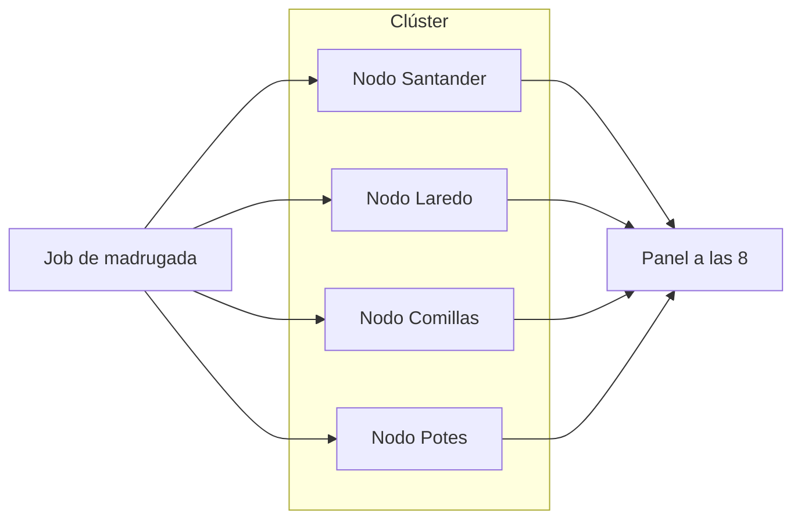

# 1.2. Clústeres de computadoras

Cuando una sola máquina no da más de sí, la tentación es “comprar el servidor más gordo del catálogo”. Eso funciona un tiempo (escalado **vertical**) y luego choca con un techo: precio, enchufe, lo que el fabricante vende.

Un **clúster** es otro planteamiento: varios ordenadores (**nodos**) unidos por **red** que se coordinan para un mismo trabajo. **No** son un único PC con mucha RAM: cada nodo tiene su CPU, su disco y su memoria. En Big Data es la pieza que permite crecer **añadiendo máquinas**, no solo agrandando *esa*.

Hoy se montan sobre **servidores normales** (no hace falta un *mainframe*) más un programa que **reparte** tareas y datos.

No lo confundáis con varios núcleos **dentro** de un portátil. Eso es paralelo en **una** máquina ([1.4](procesamiento.md)). El clúster son **varias** máquinas. Lo pondréis a prueba en la [tarea de los 500 GB](tarea-clase.md): el i7 no es un clúster.

En el [grupo hotelero](caso-hotel.md): el PMS de Laredo cabe en un servidor. El job de madrugada (ocupación e importe de los cuatro hoteles) tiene que **acabar antes de las 8**. Si solo hincháis *esa* máquina, el techo llega pronto. Cuatro nodos (o más) parten el histórico; si se funde el disco de Potes, hace falta **réplica** para que el panel no se caiga.

## Qué ganáis (y qué significa cada cosa)

| Propiedad | En la práctica | En el hotel |
| --- | --- | --- |
| **Alto rendimiento** | Partís el trabajo y lo ejecutáis a la vez | El job de la noche termina **antes de las 8** *si* se puede trocear |
| **Alta disponibilidad** | Si un nodo cae, otro tiene réplica o asume el servicio | Se funde un disco en Potes: el panel **sigue** |
| **Equilibrio de carga** | No mandáis todo al mismo nodo | Laredo en agosto no se come el 100 % y Potes vacío |
| **Escalabilidad** | Añadís nodos cuando crece el dato | Abrís otro hotel sin reescribir el PMS |

Estas cuatro se apoyan entre sí. Un clúster “rápido” pero sin réplica es frágil. Uno muy replicado pero mal balanceado deja un nodo al 100 % y el resto de brazos cruzados.

### Alto rendimiento

Cada nodo es un ordenador completo (CPU, RAM, disco). Si el trabajo se puede **trocear**, mandáis un trozo a cada uno y juntáis el resultado. Ocho nodos **no** convierten 8 horas en 1 hora por arte de magia: la red, el reparto y el trozo que no se puede partir se comen tiempo. A veces rinde como 6 o 7; a veces casi como 1.

La idea clásica es “llevar el cálculo al dato”: mejor mover una función pequeña que mover petabytes hacia una sola CPU. En Hadoop de libro el fichero **ya está** en el nodo que calcula. En la nube a menudo **no** (más abajo).

### Alta disponibilidad

Los nodos se vigilan. Si uno desaparece (luz, disco, red), el sistema puede:

- Rearrancar ese nodo o levantar otro.
- Seguir sirviendo desde una **réplica** (una copia **en marcha**, no un ZIP en un cajón).

Sin réplica, “varios ordenadores” solo es más potencia, no más seguridad. El job bien hecho **no publica** el panel a medias: o acaba, o se reintenta, o gerencia ve el de ayer.

### Equilibrio de carga

Un mal balanceo es mandar todos los jobs al nodo que “siempre ha ido bien”. El algoritmo debería mirar:

- Lo grande que es el trabajo.
- Lo ocupado que está cada nodo.
- Lo potente que es cada nodo (no todos son iguales).

Si no, creáis un **cuello de botella**: la latencia media sube aunque el clúster “tenga máquinas libres”.

### Escalabilidad

No hace falta acertar el tamaño el día 1. Empezáis con lo que podéis pagar y crecéis. El volumen del hotel **no** se estima bien a priori: si os pasáis de pesimistas, habéis tirado el dinero; si os quedáis cortos, el job no llega a las 8.

Añadir nodos **no** convierte solo un Excel de finanzas en clúster: el programa del job tiene que **saber** partirse. El PMS de recepción puede seguir en **un** servidor.

## Escalado vertical y horizontal

| | Vertical (*scale-up*) | Horizontal (*scale-out*) |
| --- | --- | --- |
| Qué hacéis | Más CPU, RAM o disco **en la misma máquina** | **Más máquinas** en el clúster |
| Analogía | Un camión más grande | Más furgonetas (o más nodos-hotel) |
| Límite | El mejor hardware del catálogo (y su precio) | Red, coordinación, presupuesto de nodos |
| Típico en | El PMS o una base relacional en un solo servidor | Hadoop, almacenes repartidos, muchas NoSQL |

!!! warning "Cuidado con el nombre *scale-in*"
    En el material antiguo a veces se llamaba *scale-in* al vertical. En la jerga habitual:

    - **scale-up** = vertical (agrandar *una* máquina)
    - **scale-out** = horizontal (añadir máquinas)
    - **scale-in** = **quitar** nodos (reducir el clúster cuando sobra capacidad: noviembre en Laredo)

    En clase decimos **vertical** y **horizontal** y no hay duda.

El vertical **sigue existiendo** (un nodo de informes más gordo, un PMS más RAM). En Big Data **no basta solo** con eso: hay un techo de catálogo y un precio absurdo cerca de ese techo. El horizontal es el que encaja cuando el volumen no para de crecer.

## Cuándo un clúster no hace magia

Añadir nodos **no** acorta el tiempo de forma lineal si la tarea **no se puede partir**. Si cada paso depende del resultado del anterior, el segundo nodo está esperando al primero: tenéis más máquinas y el mismo cuello.

Eso se desarrolla en [1.4](procesamiento.md). El clúster brilla cuando hay **independencia** entre trozos: sumar noches por hotel, procesar ficheros distintos, consultas que el motor puede repartir.

También hay coste de **coordinación**: la red, quien reparte, el momento de juntar resultados.

## El cálculo y el disco no tienen por qué ir juntos

El Hadoop “de libro” **pegaba** el fichero al nodo que lo procesaba (“lleva el cálculo al dato”). En la nube suele ser al revés: los datos viven en un **cubo de objetos** (un almacén de ficheros en red; el detalle en [1.3](almacenamiento.md)) y el clúster de cálculo **crece o se apaga** por su cuenta. Ganáis réplica y disco barato; pagáis red.

Las dos frases no se pisan: son **dos diseños**. Clúster clásico = dato y CPU en el mismo nodo. Nube = dato en el cubo, CPU donde haga falta.

## Relación con el RA1

Diseñar el almacenamiento masivo implica **varias** decisiones, no una sola:

- ¿Hace falta un **clúster** (el dato ya no cabe o no llega a tiempo en una máquina)?
- Eso **no** sustituye a “el cobro no puede verse a medias”: esa garantía (ACID) es de [1.3](almacenamiento.md). El PMS puede seguir en un servidor; el histórico, en el clúster.
- Cómo **ingieres** (un destino o muchos nodos) y qué **formato** usas (que se pueda trocear) vienen después.

Caracterizar *si* hace falta repartir, y *qué* pasa si un nodo cae a mitad del job, es el criterio **a)**.

## Actividad

No puntúa en Moodle. Una línea de por qué.

1. Finanzas pide **más RAM** en el servidor del PMS porque agosto se atasca al picar. ¿Vertical u horizontal?
2. El job de ocupación no llega a las 8. Añadís **dos máquinas** que ya tienen copia del histórico. ¿Vertical u horizontal?
3. En noviembre apagáis dos nodos porque sobran. ¿Eso es *scale-out* o *scale-in*?
4. Se funde el disco de Potes y el panel de las 8 **sigue**. ¿Rendimiento, disponibilidad, equilibrio o escalabilidad?

!!! tip "Comprobación"
    Vertical / horizontal / *scale-in* (quitar, no crecer) / alta disponibilidad (réplica).
