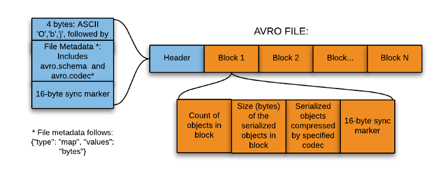
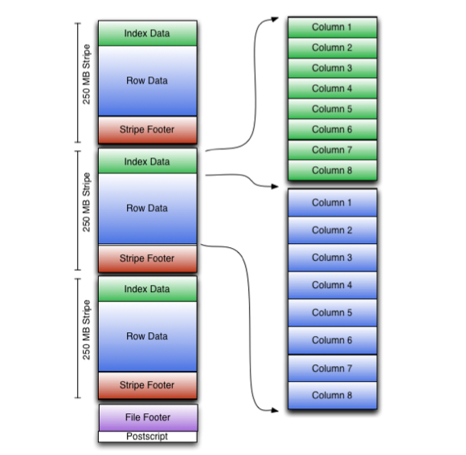
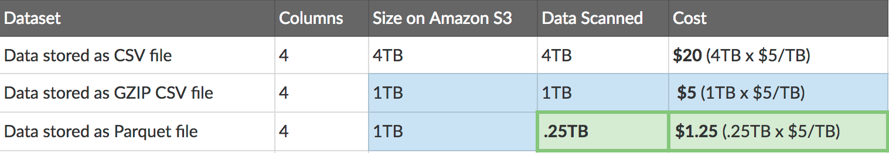

# 1.7. Formatos de datos

El criterio **c)** pide **elegir el formato adecuado para el almacenamiento**. Conforme el dato viaja por los [pipelines](ingesta.md), hay que **serializarlo** (pasarlo a bytes) y a menudo **convertirlo**. El mismo dataset en CSV o en Parquet cambia:

- el tiempo de la consulta,
- el **coste** en cloud (a menudo pagas por lo *escaneado*),
- si Spark o Hadoop pueden **partir** el fichero entre nodos.

No es “cuál es más moderno”. Es “qué operación voy a hacer mil veces”.

!!! info "Ficheros y cuadernos de las prácticas"
    - Esquema Avro: [empleado.avsc](../assets/practicas/empleado.avsc) (descárgalo al lado de tus scripts).
    - Ventas (CSV, `;`): [pdi_sales.csv](https://aitor-medrano.github.io/iabd/de/resources/pdi_sales.csv) (es grande; no lo subas al repo).
    - Colab — Avro (librería oficial): [cuaderno](https://colab.research.google.com/drive/1zxfPwEdHjaYHjkKjPOwXuj9fXGD8Anc1?usp=sharing) (adjunta el `.avsc`).
    - Colab — Fastavro: [cuaderno](https://colab.research.google.com/drive/1z0ZsCX2Ws-3kSFLQEJS74CDkkot--Y-n?usp=sharing) (adjunta el `.avsc`).
    - Colab — Fastavro + pandas: [cuaderno](https://colab.research.google.com/drive/1zaM4132cmUIsOWL5rbiCre5dCIyVL1RC?usp=sharing) (adjunta el CSV de ventas).

## Qué se le pide a un formato

Un formato “bueno” en Big Data suele cumplir ([Apache Avro](https://avro.apache.org/), [Parquet](https://parquet.apache.org/), [ORC](https://orc.apache.org/), [Arrow](https://arrow.apache.org/)):

- **Independiente del lenguaje.** Lo escribe Java y lo lee Python.
- **Expresivo.** Anidados, nulos, tipos (un entero no es un texto `"10"`).
- **Eficiente.** Pocos bytes y poca CPU al leer.
- **Evolucionable / dinámico.** Añadir un campo sin reescribir el histórico entero.
- **Autónomo** (*standalone*). El fichero lleva lo necesario para interpretarlo.
- **Partible** (*splittable*) y **comprimible.** Si no se puede cortar, **un** nodo lo lee entero y el clúster no sirve.

“Partible” es la propiedad que más se olvida: un JSON con un array de 10 millones de objetos entre `[` y `]` **no** se trocea bien. Diez millones de **líneas** JSONL, sí.

Elegir bien suele dar: lecturas o escrituras más rápidas, trozos para el clúster, esquemas que pueden cambiar y menos euros de disco y de red (por ejemplo con [Snappy](https://github.com/google/snappy)).

### De un vistazo

| Característica | CSV | XML / JSON | Avro | Parquet | ORC |
| --- | --- | --- | --- | --- | --- |
| Independiente del lenguaje | Sí | Sí | Sí | Sí | Sí |
| Expresivo (anidados, tipos) | No | Sí | Sí | Sí | Sí |
| Eficiente (tamaño / CPU) | No | No | Sí | Sí | Sí |
| Esquema que evoluciona bien | A medias | A medias | **Sí** | Regular | Regular |
| Autónomo (esquema con el dato) | A medias | Sí | Sí | Sí | Sí |
| Partible en el clúster | A veces | A veces | Sí | Sí | Sí |
| Orientado a **columnas** | No | No | No | **Sí** | **Sí** |
| Encaje con Hive | — | — | Regular | Sí | **Sí** |

CSV y JSON ganan en “lo abre un humano”. Avro, Parquet y ORC ganan cuando el volumen duele.

## Texto frente a binario

| | Texto (CSV, JSON, XML) | Binario (Avro, Parquet, ORC) |
| --- | --- | --- |
| Abrirlo con el Bloc de notas | Sí | No (hace falta herramienta o librería) |
| Tamaño | Mayor | Menor, sobre todo con compresión |
| Esquema | Implícito o a medias | Suele viajar **con** el fichero |
| Uso típico | Intercambio, APIs, que un humano lo mire | Lago y analítica a escala |

**CSV.** Universal y simple. No tipa bien (`01` ¿texto o número?), se rompe con comas y saltos dentro de un campo, y para sumar *una* columna sueles leer **todas**.

**JSON.** Expresivo (objetos anidados). Un documento único enorme es mala idea en el clúster.

**JSON Lines (JSONL)** — **un objeto por línea**:

```json
{"nombre": "Carlos", "altura": 180, "edad": 44}
{"nombre": "Juan", "altura": 175, "edad": null}
```

`null` es JSON. `None` es **Python**. Si mezclas los dos, el parser revienta.

**XML.** Sigue en administraciones y facturas. Más verboso; las mismas precauciones de “¿se puede partir?”.

## Filas frente a columnas


**Por filas** (CSV, JSON, Avro): `Ana, 170, 30` juntos. Leer a Ana entera es barato. Sumar *solo* las edades obliga a saltar. Añadir registros es sencillo.

**Por columnas** (Parquet, ORC): las edades juntas. Sumar edades lee **una** columna. Actualizar *una* fila es caro (descomprimir, tocar, recomprimir). Por eso se parte (particiones, *clustering*). La caja ([OLTP](procesamiento.md)) suele ir en **filas**; el análisis, en **columnas**.

Artículo de costes CSV frente a Parquet (Athena ~5 $/TB escaneado): [How to be a hero with Parquet](https://blog.openbridge.com/how-to-be-a-hero-with-powerful-parquet-google-and-amazon-f2ae0f35ee04). Orden de magnitud: **1 TB** CSV → ~**130 GB** Parquet.

!!! example "Agregar"
    “Ventas de Alemania” no necesita el nombre de cada cliente. Columnar + particiones = menos bytes leídos.

## Comprimir: menos disco, más CPU

Comprimir busca **repeticiones**. El fichero ocupa menos y viaja menos; **comprimir y descomprimir gastan CPU**. Sobre 100 GB, “media” ≈ 50 GB y “alta” ≈ 40 GB. En Big Data suele ganar el algoritmo **rápido**. Más contexto: [Data Compression in Hadoop](http://comphadoop.weebly.com).

| Algoritmo | Velocidad | Cuánto aprieta | Dónde lo verás |
| --- | --- | --- | --- |
| Gzip / deflate | Media | Media | Avro, Parquet |
| Bzip2 | Lenta | Alta | Archivado en HDFS |
| [Snappy](https://github.com/google/snappy) | Alta | Media | Avro, Parquet, ORC |
| [Zstandard (zstd)](https://facebook.github.io/zstd/) | Alta | Alta | Parquet reciente |

Tamaños del recorte de ventas (Alemania) en el temario: CSV ~9,7 MiB → Avro ~6,9 → Avro+gzip ~1,9 → Avro+Snappy ~2,8 → Parquet ~2,3 → Parquet+gzip ~1,6 → ORC sin comprimir ~7.

```python
# Parquet + zstd (PyArrow / pandas)
pq.write_table(tabla, "empleados_zstd.parquet", compression="zstd")
df.to_parquet("pdi_sales_zstd.parquet", compression="zstd")
```

```bash
pip install python-snappy
```

En Fastavro, el codec va al escribir: `writer(f, schemaParseado, records, "deflate")`.

## Avro



**[Apache Avro](https://avro.apache.org/)** guarda **por filas**, en binario. El esquema (JSON) va en la **cabecera**. Guía Python: [Getting started](https://avro.apache.org/docs/1.11.1/getting-started-python/). Lectura recomendada: [Handling Avro files in Python](https://www.perfectlyrandom.org/2019/11/29/handling-avro-files-in-python/).

Tipos simples: `null`, `boolean`, `int`, `long`, `float`, `double`, `bytes`, `string`.  
Compuestos: `record`, `enum`, `array`, `map`, `union`, `fixed`.

**Cuándo brilla:** escritura continua, esquema que cambia, **Kafka**.

El paquete `avro-python3` está **obsoleto** (Avro ≥ 1.11): instala `avro`.

```bash
pip install avro
# o: conda install -c conda-forge avro
```

### Práctica A — Librería oficial

Descarga [empleado.avsc](../assets/practicas/empleado.avsc). Cuaderno: [Colab Avro](https://colab.research.google.com/drive/1zxfPwEdHjaYHjkKjPOwXuj9fXGD8Anc1?usp=sharing).

```python
import copy
import json

from avro.datafile import DataFileReader, DataFileWriter
from avro.io import DatumReader, DatumWriter
import avro.schema

schema = avro.schema.parse(open("empleado.avsc", "rb").read())

with open("empleados.avro", "wb") as f:
    writer = DataFileWriter(f, DatumWriter(), schema)
    writer.append({"nombre": "Carlos", "altura": 180, "edad": 44})
    writer.append({"nombre": "Juan", "altura": 175})
    writer.close()

with open("empleados.avro", "rb") as f:
    reader = DataFileReader(f, DatumReader())
    metadata = copy.deepcopy(reader.meta)
    schema_from_file = json.loads(metadata["avro.schema"])
    empleados = [empleado for empleado in reader]
    reader.close()

print("Schema del .avsc:\n", schema)
print("Schema del fichero:\n", schema_from_file)
print("Empleados:\n", empleados)
```

Juan no trae `edad`: el esquema admite `null`. Verás `edad: None` **en Python** (en el fichero es nulo Avro).

### Práctica B — Fastavro (más rápido)

[fastavro](https://github.com/fastavro/fastavro) (trozos en Cython). Cuaderno: [Colab Fastavro](https://colab.research.google.com/drive/1z0ZsCX2Ws-3kSFLQEJS74CDkkot--Y-n?usp=sharing).

```bash
pip install fastavro
# o: conda install -c conda-forge fastavro
```

```python
import copy
import json

import fastavro

with open("empleado.avsc", "rb") as f:
    schema_dict = fastavro.parse_schema(json.load(f))

empleados = [
    {"nombre": "Carlos", "altura": 180, "edad": 44},
    {"nombre": "Juan", "altura": 175},
]

with open("empleadosf.avro", "wb") as f:
    fastavro.writer(f, schema_dict, empleados)

with open("empleadosf.avro", "rb") as f:
    reader = fastavro.reader(f)
    metadata = copy.deepcopy(reader.metadata)
    schema_from_file = json.loads(metadata["avro.schema"])
    leidos = [empleado for empleado in reader]

print(schema_dict)
print(schema_from_file)
print(leidos)
```

### Práctica C — Fastavro + pandas (ventas Alemania)

CSV: [pdi_sales.csv](https://aitor-medrano.github.io/iabd/de/resources/pdi_sales.csv). Cuaderno: [Colab ventas](https://colab.research.google.com/drive/1zaM4132cmUIsOWL5rbiCre5dCIyVL1RC?usp=sharing).

```python
import pandas as pd
from fastavro import parse_schema, writer

df = pd.read_csv("pdi_sales.csv", sep=";")
df["Zip"] = df["Zip"].str.strip()
df = df[df["Country"] == "Germany"]

schema = parse_schema({
    "name": "Sales",
    "namespace": "bda.ut1",
    "type": "record",
    "fields": [
        {"name": "ProductID", "type": "int"},
        {"name": "Date", "type": "string"},
        {"name": "Zip", "type": "string"},
        {"name": "Units", "type": "int"},
        {"name": "Revenue", "type": "float"},
        {"name": "Country", "type": "string"},
    ],
})

with open("sales.avro", "wb") as f:
    writer(f, schema, df.to_dict("records"))
```

En el recorte de Alemania, sin comprimir ~6,9 MiB; gzip ~1,9; Snappy ~2,8.

### Avro en HDFS (si tenéis clúster)

Extensiones [hdfs.ext.avro](https://hdfscli.readthedocs.io/en/latest/api.html#module-hdfs.ext.avro) y [hdfs.ext.dataframe](https://hdfscli.readthedocs.io/en/latest/api.html#module-hdfs.ext.dataframe). Sesión de contexto: [HDFS y Python](https://aitor-medrano.github.io/iabd/hadoop/hdfs.html#hdfs-y-python). Cambia el host por el de **vuestro** laboratorio (el ejemplo original usaba `iabd-virtualbox`).

```python
import pandas as pd
from fastavro import parse_schema
from hdfs import InsecureClient
from hdfs.ext.avro import AvroWriter
from hdfs.ext.dataframe import write_dataframe

hdfs_client = InsecureClient("http://NOMBRE-DE-TU-NODO:9870")

with hdfs_client.read("/user/iabd/pdi_sales.csv") as reader:
    df = pd.read_csv(reader, sep=";")

df["Zip"] = df["Zip"].str.strip()
df = df[df["Country"] == "Germany"]

schema = parse_schema({
    "name": "Sales",
    "namespace": "bda.ut1",
    "type": "record",
    "fields": [
        {"name": "ProductID", "type": "int"},
        {"name": "Date", "type": "string"},
        {"name": "Zip", "type": "string"},
        {"name": "Units", "type": "int"},
        {"name": "Revenue", "type": "float"},
        {"name": "Country", "type": "string"},
    ],
})

with AvroWriter(hdfs_client, "/user/iabd/sales.avro", schema) as writer:
    for record in df.to_dict("records"):
        writer.write(record)

write_dataframe(hdfs_client, "/user/iabd/sales2.avro", df)
write_dataframe(hdfs_client, "/user/iabd/sales3.avro", df, schema=schema)
# con Snappy: AvroWriter(..., 'snappy')  o  write_dataframe(..., codec='snappy')
```

## Arrow y Feather

**[Apache Arrow](https://arrow.apache.org/)** es columnar **en RAM** (no en disco): *zero-copy*, vectorización, mismo layout en Python/R/Java. Docs: [PyArrow](https://arrow.apache.org/docs/python/). Recetas: [cookbook](https://arrow.apache.org/cookbook/py/).

```bash
pip install pyarrow
```

```python
import pyarrow as pa

schema = pa.schema([
    ("nombre", pa.string()),
    ("altura", pa.int32()),
    ("edad", pa.int32()),
])
tabla = pa.Table.from_pydict(
    {"nombre": ["Carlos", "Juan"], "altura": [180, 175], "edad": [44, None]},
    schema=schema,
)
print(tabla)
```

Backend Arrow en pandas 2 (textos, nulos, fechas):

```python
import pandas as pd

df = pd.read_csv("pdi_sales.csv", sep=";", dtype_backend="pyarrow")
print(df.dtypes)
```

**Feather** (Arrow IPC): fichero **intermedio** rápido, no archivo de años.

```python
import pandas as pd
import pyarrow.feather as feather

df = pd.read_csv("pdi_sales.csv", sep=";")
feather.write_feather(df, "pdi_sales.feather")
df2 = feather.read_feather("pdi_sales.feather")
```

!!! tip "¿Feather o Parquet?"
    **Feather** = entre dos fases del mismo pipeline. **Parquet** = lago / Spark / Athena.

## Parquet

**[Apache Parquet](https://parquet.apache.org/)** es **columnar**, autodocumentado, pensado para muchas columnas. Snappy suele dejar ~75 %. Metadatos al **final** del fichero; datos en *row groups*.

pandas: [`to_parquet`](https://pandas.pydata.org/docs/reference/api/pandas.DataFrame.to_parquet.html) / [`read_parquet`](https://pandas.pydata.org/docs/reference/api/pandas.read_parquet.html).

### Práctica D — Diccionario → Parquet

```python
import pyarrow as pa
import pyarrow.parquet as pq

schema = pa.schema([
    ("nombre", pa.string()),
    ("altura", pa.int32()),
    ("edad", pa.int32()),
])
empleados = {
    "nombre": ["Carlos", "Juan"],
    "altura": [180, 175],
    "edad": [None, 34],
}
tabla = pa.Table.from_pydict(empleados, schema)
pq.write_table(tabla, "empleados.parquet")
table2 = pq.read_table("empleados.parquet")
print(table2.schema)
print(table2)
```

### Práctica E — JSONL → Parquet (job de [ingesta](ingesta.md))

Fichero `empleados.json` (un objeto por línea, no un array):

```json
{"nombre": "Carlos", "altura": 180, "edad": 44}
{"nombre": "Juan", "altura": 175}
```

```python
import pyarrow.parquet as pq
from pyarrow import json as pajson

tabla = pajson.read_json("empleados.json")
pq.write_table(tabla, "empleados-json.parquet")
print(pq.read_table("empleados-json.parquet"))
```

### Práctica F — CSV de ventas → Parquet

```python
import pandas as pd

df = pd.read_csv("pdi_sales.csv", sep=";")
df["Zip"] = df["Zip"].str.strip()
df = df[df["Country"] == "Germany"]
df.to_parquet("pdi_sales.parquet")
df_parquet = pd.read_parquet("pdi_sales.parquet")
```

En HDFS, si `core-site.xml` tiene `fs.defaultFS` (ejemplo de lab: `hdfs://NOMBRE:9000`):

```python
df.to_parquet("hdfs://NOMBRE-DE-TU-NODO:9000/sales.parquet")
```

### Consultar sin tragárselo: DuckDB

**[DuckDB](https://duckdb.org/)** es SQL **dentro** de tu programa (como SQLite, para análisis). No cargas el Parquet entero.

```bash
pip install duckdb
```

```python
import duckdb

print(duckdb.sql(
    "SELECT * FROM 'pdi_sales.parquet' WHERE Country = 'Germany' LIMIT 5"
))
```

SQL sobre un DataFrame:

```python
import duckdb
import pandas as pd

df = pd.read_parquet("pdi_sales.parquet")
print(
    duckdb.sql(
        "SELECT Country, SUM(Revenue) AS total FROM df "
        "GROUP BY Country ORDER BY total DESC"
    ).df()
)
```

Varios ficheros particionados:

```python
print(duckdb.sql("SELECT * FROM 'ventas/*.parquet' WHERE año = 2024"))
```

Por dentro usa Arrow: el paso a pandas o a `pa.Table` es casi sin copia.

## ORC



**[Apache ORC](https://orc.apache.org/)** (*Optimized Row Columnar*) nació para **Hive**. Compresión típica **zlib**. Tiras (*stripes*) con índice y estadísticas. pandas: [`read_orc`](https://pandas.pydata.org/docs/reference/api/pandas.read_orc.html) / [`to_orc`](https://pandas.pydata.org/docs/reference/api/pandas.DataFrame.to_orc.html) (desde 1.5; por defecto **sin** comprimir).

```python
df_orc = pd.read_orc("pdi_sales.orc")
df_orc.to_orc("pdi_sales_pd.orc")
df_orc.to_orc("pdi_sales_zlib.orc", engine_kwargs={"compression": "zlib"})
```

```python
import pandas as pd
import pyarrow as pa
import pyarrow.orc as orc

df = pd.read_csv("pdi_sales.csv", sep=";")
df["Zip"] = df["Zip"].str.strip()
df = df[df["Country"] == "Germany"]
table = pa.Table.from_pandas(df, preserve_index=False)
orc.write_table(table, "pdi_sales.orc")
```



## Formatos de tabla (Delta, Iceberg, Hudi)

Avro/Parquet/ORC resuelven el **fichero**. Para actualizar, borrar y versionar hace falta un **diario**: [Delta Lake](https://delta.io/), [Iceberg](https://iceberg.apache.org/), [Hudi](https://hudi.apache.org/). Sesión posterior (Spark): [Delta Lake](https://aitor-medrano.github.io/iabd/spark/deltalake.html).

| Formato | Base | Lo verás sobre todo en |
| --- | --- | --- |
| **Delta Lake** | Parquet + registro en JSON | Spark, Databricks |
| **Apache Iceberg** | Parquet / ORC / Avro + catálogo | Spark, Trino, Athena |
| **Apache Hudi** | Parquet + índice | Spark, EMR |

No se edita el fichero viejo: se escribe uno **nuevo** y se anota. Eso permite viajar en el tiempo, [ACID](almacenamiento.md) sobre el lago, evolucionar columnas y compactar.

```python
# PySpark (cuando lleguéis a Spark)
df.write.format("delta").save("/ruta/ventas_delta")
df_v0 = spark.read.format("delta").option("versionAsOf", 0).load("/ruta/ventas_delta")
```

Parquet **sigue debajo**. “Tabla Delta” no es un rival: es Parquet con gobierno.

## Cómo decidir (criterio c)

| Situación | Formato razonable | Por qué |
| --- | --- | --- |
| Intercambio con un humano o una API | JSON / CSV | Se lee y se depura |
| Kafka, esquema que cambia | **Avro** | Filas + esquema + evolución |
| Paso intermedio del pipeline | **Feather** | Lectura/escritura muy rápidas |
| Lago + Spark + pocas columnas | **Parquet** | Menos escaneo |
| Hive | **ORC** (o Parquet si el equipo es Spark) | Encaje Hive |
| Explorar en el portátil | **DuckDB** (motor, no formato) | SQL sin cargar 500 GB |
| Caja / reservas | Ni Parquet ni ORC como almacén de operación | Actualizar una fila es caro |
| Actualizar el lago con historial | Delta / Iceberg / Hudi | Diario encima de Parquet |

- Escribir muchos registros → **filas** (Avro).
- Leer un subconjunto de columnas → **columnas**.
- Cambiar el esquema a menudo → **Avro**.
- Anidado y subcolumnas → **Parquet**.
- Hive → ORC; Spark → Parquet; Kafka → Avro.

| Formato | Escritura | Lectura | Tamaño |
| --- | --- | --- | --- |
| CSV | Lenta | Lenta | Grande |
| Feather / Arrow | Muy rápida | Muy rápida | Medio |
| Parquet (Snappy) | Rápida | Rápida | Pequeño |
| Avro | Rápida | Rápida | Medio |
| ORC | Media | Media | Pequeño |

!!! tip "Serializar y deserializar"
    Serializar = memoria → bytes. Deserializar = lo contrario. Elige formato en la frontera y no conviertas en cada capa.

## Para practicar (criterio c)

No sustituye a Moodle. Dataset de vuelos (comas): [Airline delay 2009–2018 (Kaggle)](https://www.kaggle.com/datasets/yuanyuwendymu/airline-delay-and-cancellation-data-2009-2018). Cuenta: [Kaggle](https://www.kaggle.com/) (instancia gratis ~73 GB disco / 30 GB RAM / 12 h).

**1.** Elige un CSV de un año. Genera:

- `air<año>.parquet`
- `air<año>.orc`
- `air<año>_snappy.orc` (ORC + Snappy)
- `air<año>_small.avro` y `air<año>_small.parquet` solo con `FL_DATE`, `OP_CARRIER`, `DEP_DELAY`

```python
df_small = df[["FL_DATE", "OP_CARRIER", "DEP_DELAY"]]
```

Anota **tamaño** y **tiempo** (tabla Markdown). En Kaggle, tamaños en *Output* o:

```python
import os
import time

print(os.path.getsize("/kaggle/working/air20XX.parquet"))

inicio = time.time()
# operación
print(time.time() - inicio)
```

**2.** Sin pandas como capa principal, [PyArrow](https://arrow.apache.org/docs/python/): `pyarrow.csv.read_csv()`, esquema inferido, Feather, compara tiempo y tamaño frente al CSV (`time.time()` o `%%time`).

**3.** Con **DuckDB** sobre el Parquet (sin cargarlo en pandas):

- ¿Cuántos vuelos por `OP_CARRIER`? (mayor a menor)
- Retraso medio de salida (`DEP_DELAY`) por aerolínea, sin nulos ni adelantos (retraso negativo).

La entrega formal, si la hay, se indica en Moodle (no hace falta compartir el cuaderno con cuentas de otros centros).

## Referencias

- [Introduction to Big Data Formats (PDF)](https://webcdn.nexla.com/n3x_ctx/uploads/2018/05/An-Introduction-to-Big-Data-Formats-Nexla.pdf)
- [Data serialization in Hadoop](https://www.xenonstack.com/blog/data-serialization-hadoop)
- [Big Data file formats demystified](https://www.datanami.com/2018/05/16/big-data-file-formats-demystified/)
- Material de partida de esta práctica: [Formatos de datos (IABD)](https://aitor-medrano.github.io/iabd/de/formatos.html)
