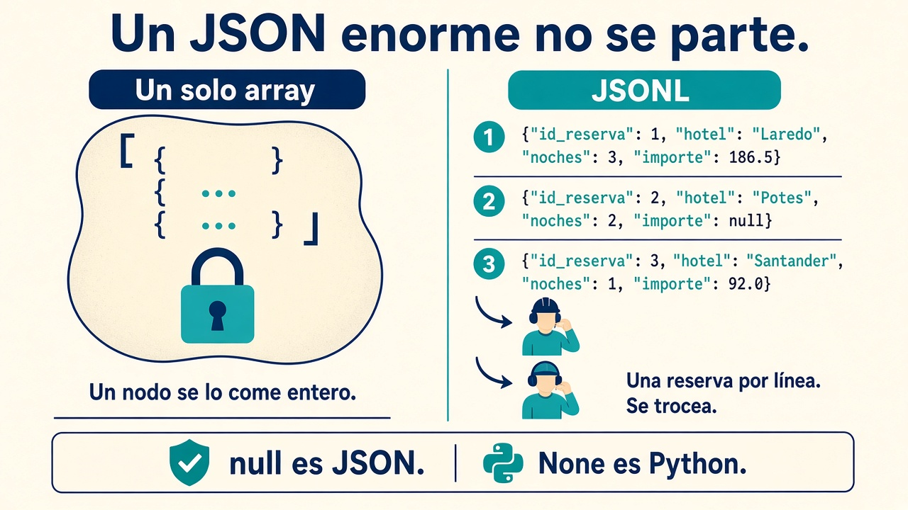

# 1.7. Formatos de datos

El criterio **c)** es este: **en qué forma dejáis el dato** para que el siguiente paso no se ahogue. No es una moda. Es una decisión de diseño, igual que elegir lago o warehouse.

!!! info "Cómo se lee esta página"
    Primero el **caso** y la tarjeta (fila frente a columna). Luego **Avro** (talleres 1–2: el mensaje). Después **Parquet + DuckDB** (el lago del panel). El **taller medido** va al final. ORC y Delta son una idea, no un segundo curso. Los relojes: gerencia a las **8** ve el cierre de **ayer**.

## Un caso para no perderse

El [grupo hotelero de Cantabria](caso-hotel.md){target="_blank" rel="noopener"} (Santander, Laredo, Comillas, Potes) guarda cada reserva con **muchas** columnas en el PMS. Gerencia, a las **8**, solo quiere *ocupación e importe por hotel*. Si el fichero es un CSV gordo, el motor **lee todas las columnas** para calcular tres números. En cloud, a menudo **pagáis por lo que escaneáis**, no solo por lo que guardáis.

Esa es la pregunta del apartado: ¿el dato viaja **fila a fila** (bien para *esta* reserva en un mensaje o en el PMS) o **campo a campo** (bien para el panel)? ¿Hace falta que un humano lo abra, o que Spark lo **trocee** entre nodos?

Las prácticas **no dependen de un CSV ajeno**. Generáis el dataset en el cuaderno (Jupyter o un [Colab](https://colab.research.google.com/){target="_blank" rel="noopener"} en blanco). Esquema Avro: [reserva.avsc](../assets/practicas/reserva.avsc){target="_blank" rel="noopener"}. **Noja** es el “mañana abre otro”, no un quinto hotel del esqueleto. Este `reservas.csv` **no** es el de [Hola ETL](ingesta.md){target="_blank" rel="noopener"} (allí había cobros).

```python
import numpy as np
import pandas as pd

rng = np.random.default_rng(2026)
n = 200_000
hoteles = ["Santander", "Laredo", "Comillas", "Potes", "Noja"]
df = pd.DataFrame({
    "id_reserva": np.arange(n, dtype="int32"),
    "entrada": pd.date_range("2024-01-01", periods=n, freq="min").astype(str),
    "hotel": rng.choice(hoteles, n),
    "noches": rng.integers(1, 8, n, dtype="int32"),
    "importe": rng.uniform(48, 420, n).round(2),
    "canal": rng.choice(["web", "ota", "recepcion"], n),
    "regimen": rng.choice(["SA", "AD", "MP"], n),
    "comentarios": rng.choice(["ok", "vista mar", ""], n),
})
df.to_csv("reservas.csv", index=False)
```

Con `n = 200_000` ya notáis tamaño y tiempo. Subid a un millón si la máquina lo aguanta. `regimen` y `comentarios` están para que veáis **lo que el informe no debe leer**.

## Qué tiene que cumplir el formato

Para que un clúster (Hadoop, Spark) o un almacén en la nube pueda **repartir** el trabajo, el fichero tiene que dejarse **cortar en trozos**. Un JSON con un array de diez millones de objetos entre `[` y `]` es un solo bloque: **un** nodo se lo come entero.

Además suele pedirse:

| Exigencia | En castellano |
| --- | --- |
| Independiente del lenguaje | Lo escribe Java y lo lee Python |
| Expresivo | Nulos de verdad, anidados, un número no es el texto `"10"` |
| Compacto | Pocos bytes y poca CPU al leer |
| Que pueda crecer | Añadir un campo sin reescribir cinco años de histórico |
| Autónomo | El fichero lleva cómo interpretarlo (el esquema) |
| Comprimible | Snappy, gzip, zstd… a cambio de CPU |

Dos familias, no dos religiones:

| | Lo abre el Bloc de notas | Lo come el lago |
| --- | --- | --- |
| Ejemplos | CSV, JSON, XML | Avro, Parquet, ORC |
| Tamaño | Grande | Menor |
| Esquema | A medias o en la cabeza | Suele ir **dentro** del fichero |
| Uso | API, entrega a un compañero | Analítica a escala |

**CSV.** Universal. `01` ¿texto o número? Una coma dentro del campo lo rompe. Para sumar *importe* soléis arrastrar *canal* y *comentarios*.

**JSON / JSONL.** El JSON “de libro” (un objeto enorme) no se parte bien. **JSON Lines** = **una reserva por línea**:

```json
{"id_reserva": 1, "hotel": "Laredo", "noches": 3, "importe": 186.5}
{"id_reserva": 2, "hotel": "Potes", "noches": 2, "importe": null}
```

`null` es JSON. `None` es **Python**. Mezclarlos tumba el parser.



**XML.** Sigue en facturas y administraciones. Más verboso; misma duda: ¿se puede trocear?

## Una reserva junta o un campo junto


Pensad en mil reservas `hotel | noches | importe | comentarios`.

**Todo el registro junto** (CSV, JSON; **Avro** en un bus): leer la reserva 17 es barato. Sumar *solo* importes obliga a saltar el resto mil veces. **Añadir** reservas al final es natural.

Eso **no** convierte Avro en el PMS. Recibir el cobro en recepción es la tabla del [1.3](almacenamiento.md){target="_blank" rel="noopener"} (ACID). Avro es el **mensaje** (Kafka): también va por filas, con esquema.

**Cada campo en su sitio** (Parquet, ORC): los importes van juntos. El panel de las **8** lee **una** racha. Reconstruir la reserva 17 cruza trozos. Cambiar *una* fila duele. Por eso se **parte** por fecha o por hotel. Encaja en el cuadro de mando; **no** como almacén de la caja ([operar frente a analizar](procesamiento.md){target="_blank" rel="noopener"}).

!!! example "A las 8 no hace falta el comentario"
    Agregar es resumir. “Importe medio en Laredo” no lee `comentarios`. Columnar + partición `hotel=Laredo` = menos disco, menos factura.

En servicios tipo Athena o BigQuery el orden de magnitud que veréis citado es: **1 TB** de texto plano puede quedar cerca de **un octavo** en columnar comprimido. La cifra exacta cambia; la idea no: **elegir mal el formato en la [carga](ingesta.md){target="_blank" rel="noopener"} se paga cada consulta**.

## Comprimir no es gratis

El algoritmo busca **repeticiones** (`Laredo, Laredo, Laredo…`) y las recodifica. Viaja menos por la red. A cambio, la CPU **aprieta y destapa**. Sobre 100 GB, “media” deja unos 50 GB y “alta” unos 40. En Big Data suele ganar el que es **rápido**, no el que más aprieta.

| Códec | Velocidad | Ahorro | Típico en |
| --- | --- | --- | --- |
| Gzip / deflate | Media | Medio | Avro, Parquet |
| Bzip2 | Lenta | Alto | Archivado |
| Snappy | Alta | Medio | Avro, Parquet, ORC |
| Zstandard (zstd) | Alta | Alto | Parquet reciente |

```python
df.to_parquet("reservas_zstd.parquet", compression="zstd")
```

```bash
pip install python-snappy   # si usáis Snappy con Avro
```

No memoricéis megas de un recorte ajeno. **Medid el vuestro** al final del taller.

## Avro: el mensaje que se explica solo

[Avro](https://avro.apache.org/){target="_blank" rel="noopener"} guarda **por filas**, en binario. El esquema (JSON) viaja en la **cabecera**. Quien lee sabe cómo se escribió. Encaja cuando **escribís mucho**, el esquema **cambia** y el destino es un bus ([Kafka](ingesta.md){target="_blank" rel="noopener"}), no el PMS. Guía: [Getting started (Python)](https://avro.apache.org/docs/1.11.1/getting-started-python/){target="_blank" rel="noopener"}.

!!! tip "Orden de los talleres"
    1–2: Avro con nulos. 3: del `df` a Avro (opcional). 4–6: Parquet; el 6 filtra **al leer**. DuckDB: preguntar sin tragarse el fichero. Luego el [taller medido](#taller-medido-lo-que-se-examina){target="_blank" rel="noopener"}.

Tipos simples: `null`, `boolean`, `int`, `long`, `float`, `double`, `bytes`, `string`.  
Compuestos: `record`, `enum`, `array`, `map`, `union`, `fixed`.

El paquete viejo `avro-python3` está muerto. Instalad `avro` (o **fastavro** si el volumen duele: [GitHub](https://github.com/fastavro/fastavro){target="_blank" rel="noopener"}).

```bash
pip install avro fastavro
```

### Taller 1 — Una reserva con hueco

Descargad [reserva.avsc](../assets/practicas/reserva.avsc){target="_blank" rel="noopener"}. La segunda reserva no trae importe: el esquema admite nulo.

```python
import copy
import json

import avro.schema
from avro.datafile import DataFileReader, DataFileWriter
from avro.io import DatumReader, DatumWriter

schema = avro.schema.parse(open("reserva.avsc", "rb").read())

with open("reservas.avro", "wb") as f:
    w = DataFileWriter(f, DatumWriter(), schema)
    w.append({"id_reserva": 1, "hotel": "Laredo", "noches": 3, "importe": 186.5})
    w.append({"id_reserva": 2, "hotel": "Potes", "noches": 2})
    w.close()

with open("reservas.avro", "rb") as f:
    r = DataFileReader(f, DatumReader())
    meta = copy.deepcopy(r.meta)
    print(json.loads(meta["avro.schema"]))
    print(list(r))
    r.close()
```

En pantalla veréis `importe: None`: eso es Python. En el fichero el nulo es Avro.

### Taller 2 — Lo mismo, más rápido (fastavro)

```python
import json
import fastavro

with open("reserva.avsc", "rb") as f:
    schema = fastavro.parse_schema(json.load(f))

filas = [
    {"id_reserva": 1, "hotel": "Laredo", "noches": 3, "importe": 186.5},
    {"id_reserva": 2, "hotel": "Potes", "noches": 2},
]
with open("reservas_fa.avro", "wb") as f:
    fastavro.writer(f, schema, filas)
```

### Taller 3 — Del DataFrame al Avro

Usad el `df` del generador (o filtrarlo: solo `hotel == "Laredo"`).

```python
from fastavro import parse_schema, writer

schema = parse_schema({
    "name": "Reserva",
    "namespace": "bda.ut1",
    "type": "record",
    "fields": [
        {"name": "id_reserva", "type": "int"},
        {"name": "hotel", "type": "string"},
        {"name": "noches", "type": "int"},
        {"name": "importe", "type": "float"},
        {"name": "canal", "type": "string"},
    ],
})
laredo = df[df["hotel"] == "Laredo"][["id_reserva", "hotel", "noches", "importe", "canal"]]
with open("laredo.avro", "wb") as f:
    writer(f, schema, laredo.to_dict("records"), codec="deflate")
```

Si algún día lo escribís en HDFS, cambiad el host por el de **vuestro** lab; el patrón es el de la librería `hdfs` (`InsecureClient` + `AvroWriter`). No copiéis un nombre de máquina de otro ciclo.

## Arrow: el dato *en la RAM*

[Parquet](https://parquet.apache.org/){target="_blank" rel="noopener"}, [Avro](https://avro.apache.org/){target="_blank" rel="noopener"} y [ORC](https://orc.apache.org/){target="_blank" rel="noopener"} viven en **disco**. **[Arrow](https://arrow.apache.org/){target="_blank" rel="noopener"}** describe columnas **en memoria** para que Python, R o Java las compartan sin copiarlas (*zero-copy*) y el procesador calcule en bloque. Docs: [PyArrow](https://arrow.apache.org/docs/python/){target="_blank" rel="noopener"}. Arrow **no** es Avro.

```bash
pip install pyarrow
```

```python
import pyarrow as pa

schema = pa.schema([
    ("hotel", pa.string()),
    ("noches", pa.int32()),
    ("importe", pa.float32()),
])
tabla = pa.Table.from_pydict(
    {"hotel": ["Laredo", "Potes"], "noches": [3, 2], "importe": [186.5, None]},
    schema=schema,
)
print(tabla)
```

pandas 2 puede leer el CSV con motor Arrow (`dtype_backend="pyarrow"`): textos y nulos suelen ir mejor que con NumPy.

**Feather** (Arrow IPC) es el fichero **entre dos celdas** del mismo pipeline: rapidísimo, no es el archivo de 2020–2026.

```python
import pyarrow.feather as feather

feather.write_feather(df, "reservas.feather")
otro = feather.read_feather("reservas.feather")
```

!!! tip "Dos sitios, dos ficheros"
    Feather = “se lo paso al script de al lado”. Parquet = “lo dejo en el lago para Spark o Athena”.

## Parquet: el lago del informe

[Parquet](https://parquet.apache.org/){target="_blank" rel="noopener"} es **columnar**, lleva el esquema consigo y parte en *row groups*. El informe que pide `hotel` e `importe` no arrastra `canal`. pandas: `to_parquet` / `read_parquet`.

### Taller 4 — Tabla Arrow → Parquet

```python
import pyarrow.parquet as pq

pq.write_table(tabla, "reservas.parquet")
print(pq.read_table("reservas.parquet"))
```

### Taller 5 — JSONL → Parquet (la L de un [ETL](ingesta.md){target="_blank" rel="noopener"})

`reservas.jsonl`:

```json
{"hotel": "Laredo", "noches": 3, "importe": 186.5}
{"hotel": "Potes", "noches": 2}
```

```python
import pyarrow.parquet as pq
from pyarrow import json as pajson

pq.write_table(pajson.read_json("reservas.jsonl"), "reservas_desde_json.parquet")
```

### Taller 6 — Filtrar *al leer* (no tragarse el Parquet)

Escribir Parquet y luego hacer `read_parquet` **entero** + un filtro en pandas es usar el lago **como un CSV**. El formato sirve si recortáis **en la lectura**:

```python
df.to_parquet("reservas.parquet")
# Solo Laredo, solo las columnas del panel
solo_laredo = pd.read_parquet(
    "reservas.parquet",
    columns=["hotel", "importe"],
    filters=[("hotel", "==", "Laredo")],
)
```

En HDFS, si el clúster define `fs.defaultFS`: `df.to_parquet("hdfs://TU-NODO:9000/reservas.parquet")`. DuckDB, en el apartado siguiente, hace lo mismo con SQL y **sin** cargar el fichero a RAM.

### Preguntar sin cargarlo: DuckDB

[DuckDB](https://duckdb.org/){target="_blank" rel="noopener"} es SQL **dentro** del cuaderno (como SQLite, pensado para resúmenes). No traga el Parquet a RAM.

```bash
pip install duckdb
```

```python
import duckdb

print(duckdb.sql(
    "SELECT hotel, AVG(importe) AS media, COUNT(*) AS n "
    "FROM 'reservas.parquet' GROUP BY hotel ORDER BY media DESC"
))
```

Sobre el DataFrame que ya tenéis:

```python
print(duckdb.sql(
    "SELECT canal, SUM(importe) AS total FROM df GROUP BY canal"
).df())
```

Si particionáis por año: `FROM 'reservas/*.parquet'`. Por dentro habla Arrow: pasar a pandas es casi sin copia.

## ORC: cuando el ecosistema es Hive

[ORC](https://orc.apache.org/){target="_blank" rel="noopener"} (*Optimized Row Columnar*) nació para **Hive**. Tiras (*stripes*) con mín/máx para **no leer** lo que no puede cumplir el filtro. Compresión habitual `zlib`. pandas `to_orc` (desde 1.5) sale **sin** comprimir si no lo pides.

```python
df.to_orc("reservas.orc")
df.to_orc("reservas_zlib.orc", engine_kwargs={"compression": "zlib"})
```

```python
import pyarrow.orc as orc

orc.write_table(pa.Table.from_pandas(df, preserve_index=False), "reservas_pa.orc")
```

Si el equipo “es Spark”, veréis más Parquet. No es que ORC sea peor: es **dónde vive el SQL**.

## Cuando el lago también tiene que *actualizar*

Un `.parquet` suelto no os da “borra esta reserva” ni “cómo estaba el domingo”. El lago es **append**: se **añade**; no abrís el fichero y tacháis una fila (un NIF que hay que retirar). [Delta Lake](https://delta.io/){target="_blank" rel="noopener"}, [Iceberg](https://iceberg.apache.org/){target="_blank" rel="noopener"} y [Hudi](https://hudi.apache.org/){target="_blank" rel="noopener"} son **Parquet (u ORC) + un diario**: no se edita el fichero viejo; se escribe uno nuevo y se anota.

Eso permite viajar en el tiempo, un [ACID](almacenamiento.md){target="_blank" rel="noopener"} de **tabla** (un `MERGE` no deja la ocupación a medias) y compactar ficheros pequeños. **Eso no cobra en recepción:** el cobro sigue en el PMS. En esta UT basta la idea. En Spark lo veréis como `format("delta")`.

```python
# Cuando lleguéis a Spark, sobre el mismo df de reservas
# df.write.format("delta").save("/ruta/reservas_delta")
```

## Cómo elegir (tarjeta para el examen)

| Situación | Formato | Por qué |
| --- | --- | --- |
| Lo tiene que leer un humano o una API | CSV / JSON | Se depura |
| Kafka, campos nuevos el mes que viene | **Avro** | Fila + esquema que evoluciona |
| Entre dos celdas del mismo cuaderno | **Feather** | Velocidad |
| Lago + “solo hotel e importe” | **Parquet** | Menos escaneo |
| Tablas Hive | **ORC** | Encaje Hive |
| Explorar en el portátil | **DuckDB** (motor) | SQL sin 500 GB en RAM |
| Picar la reserva en recepción | Ni Parquet ni ORC como almacén | Una fila se actualiza caro |
| Borrar/versionar en el lago | Delta / Iceberg / Hudi | Diario encima |

- Muchas **escrituras** de registros completos → filas (Avro).
- **Lecturas** de tres campos de un millón → columnas.
- Esquema inquieto → Avro. Anidado y subcampos → Parquet.
- Hive → ORC. Spark → Parquet. Cola → Avro.

| | Escribir | Leer | Ocupa |
| --- | --- | --- | --- |
| CSV | Lento | Lento | Mucho |
| Feather | Muy rápido | Muy rápido | Medio |
| Parquet + Snappy | Rápido | Rápido | Poco |
| Avro | Rápido | Rápido | Medio |
| ORC | Medio | Medio | Poco |

!!! tip "Serializar"
    Memoria → bytes (y al revés). Cada conversión puede **perder el tipo**. Elegid formato en la frontera y no traduzcáis en cada capa.

## Taller medido (lo que se examina)

Abrid un cuaderno **en blanco**. Generad el `df` (`n ≥ 200_000`). Cronometrad y anotad tamaños (`os.path.getsize`) de:

1. `reservas.csv`
2. `reservas.parquet` y `reservas_zstd.parquet`
3. `reservas.orc`
4. `laredo.avro` (solo un hotel, tres o cuatro columnas)
5. `reservas.feather` — comparad **tiempo de lectura** frente al CSV

Luego, **sin** cargar el Parquet entero en pandas (como el taller 6):

- importe medio por `hotel` (DuckDB);
- recuento por `canal`;
- misma media **solo con las columnas** `hotel` e `importe` (¿baja el tiempo?).

```python
import os
import time

t0 = time.perf_counter()
df.to_parquet("reservas.parquet")
print("escritura s:", round(time.perf_counter() - t0, 3))
print("bytes:", os.path.getsize("reservas.parquet"))
```

Lo que tenéis que poder decir en voz alta: por qué el Parquet ocupó menos que el CSV, por qué Feather se leyó antes y por qué Avro sigue teniendo sentido si el canal de reservas **añade un campo** en abril.

La entrega, si la hay, es Moodle. No hace falta ningún dataset de otro centro ni compartir el cuaderno fuera.

## Actividad

No puntúa en Moodle. Una línea de por qué.

1. El panel de las 8 solo usa `hotel` e `importe`. ¿CSV o Parquet para el lago?
2. El JSON del canal viaja por Kafka y el mes que viene añaden un campo. ¿Avro, Parquet o Feather?
3. `{"hotel": "Laredo", "importe": None}` ¿es JSON válido?
4. ¿Dejáis tres años de histórico en **Feather** en el cubo? ¿Por qué?

!!! tip "Comprobación"
    Parquet / Avro / no (`None` es Python; en JSON es `null`) / no (Feather es entre celdas, no el archivo del lago).

## Autoevaluación del 1.7

Quince preguntas (A–D, **una** correcta) sobre lo esencial del apartado. No puntúan en Moodle. En **cada** una, **Comprobar respuesta**: si es correcta o no, y una explicación breve. Podéis repetir el test.

<div class="dwec-quiz" data-dwec-quiz data-src="../../assets/quizzes/ut1-1-7.json"></div>

