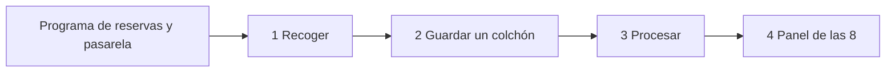

# 1.6. Ingesta de datos

Este apartado es el criterio **b)** del [RA1](ra1.md): cómo **entran** los datos en el sistema. Todavía no hace falta saber Kafka, Spark ni Parquet. Sí hace falta entender el problema con un ejemplo y, después, ponerle nombre a cada idea.

Si este paso falla, el modelo y el cuadro de mando trabajan sobre arena: la cifra queda bien presentada y es mentira.

## Qué es ingerir datos

**Ingerir datos** es el proceso de coger información que ya existe en varios sitios —un fichero, una base de datos, una web, un sensor— y llevarla a **otro** sistema, donde se podrá guardar o procesar.

En el grupo hotelero que usamos en esta unidad:

- Recepción pica las reservas en el **programa de reservas** del hotel (en la jerga, PMS: *Property Management System*).
- La pasarela de pago sabe qué estancias se han cobrado.
- En las habitaciones hay sensores de ocupación.
- Dirección quiere, cada mañana a las 8, **ocupación e importe cobrado por hotel**.

Esos datos **ya existen**. No están, de entrada, en el sitio donde gerencia los mira. Llevarlos de un sitio al otro es ingesta.

Hasta que el dato no entra, el resto de la [arquitectura](arquitectura.md) está vacía. Un buen proceso de ingesta tiene que ser:

- **Flexible:** mañana aparece otra fuente (una OTA —web tipo Booking que vende habitaciones—, un Excel de un hotel nuevo) y no tiras el diseño.
- **Ágil:** si gerencia cambia la pregunta, no tardas tres meses en volver a meter los datos.

La productividad del equipo depende más de esto que del logo de la herramienta.

## Empieza por el problema, no por la herramienta

Finanzas cierra el día a las 23:00. Los sensores publican cada medio minuto. Recepción no puede parar.

Antes de elegir un programa, diseñas **hacia atrás**:

1. ¿Qué tiene que ver gerencia a las 8? (destino)
2. ¿Hay que cruzar reservas con cobros, quitar canceladas, unificar el nombre del canal? (transformación)
3. ¿El dato vive en el programa de reservas, en la pasarela, en una carpeta FTP (un sitio en red donde se dejan ficheros) o en los sensores? (origen)

Sin esa pregunta de negocio, unificar veinte fuentes en un único almacén es un proyecto largo que no sabes cuándo termina.

A ese almacén único, cuando guarda datos de muchas fuentes **en bruto** (aún poco limpios), se le llama **lago de datos** (*data lake*). Lo verás con más detalle en [1.3](almacenamiento.md). Aquí basta: es el “sitio común” al que suele llegar lo ingerido.

## Pipeline de datos

Un **pipeline** (tubería) es una forma de organizar el trabajo en **fases**. No es un producto que compras. Describe los pasos y, si hace falta, las tecnologías entre un origen y un destino.

En lo más simple: recoger, guardar, procesar y **dejar algo útil**.


### Por qué no se analiza en recepción

Sumar importes de mil reservas es caro para la máquina. Si lanzas ese cálculo **sobre el programa que cobra**, el mostrador espera: el cliente también.

Por eso se **copia** el hecho a otro sitio:

- El sistema que opera el día a día (picar la reserva, cobrar) se llama **OLTP** (*Online Transaction Processing*). Ejemplo: el programa de recepción.
- El sistema que analiza e informa (el panel de las 8) se llama **OLAP** (*Online Analytical Processing*). Ejemplo: el almacén de informes de gerencia.

No son dos marcas. Son dos oficios. El pipeline los separa para que uno no tumbe al otro.



1. **Recoger.** Copias el hecho fuera de recepción: un fichero, una consulta a la base de datos, un mensaje.
2. **Guardar un colchón.** Si el panel va lento, el dato no se pierde. Puede ser una carpeta, una zona bruta o una cola de mensajes.
3. **Procesar.** Filtras, cruzas, sumas. Aquí se limpia de verdad.
4. **Dejar algo útil.** El panel, un Excel, una base de informes.

Un mismo **job** (trabajo programado: “a las 02:00, lanza esta tubería”) que “lo hace todo” parece más simple el día 1. El martes que el programa de reservas añade una columna, se rompe recoger, cruzar y pintar a la vez.

### Limpiar por el camino

Las fuentes no hablan igual. Un canal llega como `web` y otro como `WEB`. Un número llega como texto `"10"`. Hay huecos.

Dejar el dato **listo** para usarlo se llama **data wrangling** (manipulación o disputa de datos). No es un programa: es el oficio de pasar del bruto al dato que ya tiene sentido.

### El pipeline se itera

Gerencia pregunta: “¿cancelan más los del viernes?”. Si ese campo no está, vuelves al origen, ingestes otra vez e integras. No es un acto único el día 1.

### Pipeline y ETL no son lo mismo

Más abajo verás **ETL** (extraer → transformar → cargar). Se confunden mucho.

- Toda ETL es un pipeline (mueve datos en fases).
- **No** todo pipeline es una ETL. Un sensor que deja un mensaje en una cola y un filtro que tira duplicados también es tubería, aunque no hagas un cruce ni una carga a un almacén de informes.

## Quién mueve el dato

Hay tres formas de iniciar el movimiento. No son tres productos.

| | **Push** (empujar) | **Pull** (tirar) | **Poll** (preguntar) |
| --- | --- | --- | --- |
| Quién inicia | El **origen** envía | El **destino** va a buscar | El destino **mira** de vez en cuando; si hay cambio, tira |
| En el hotel | Cada alta de reserva se publica al momento | A las 02:00 lees la tabla de ocupaciones | Cada 15 min listas la carpeta FTP; solo bajas si cambió la fecha |
| Encaja | Evento, sensor, aviso automático (*webhook*: el origen llama a una URL tuya cuando pasa algo) | Lote nocturno, leer una base **SQL** (el lenguaje de las bases de datos en tablas) | Carpetas, buzones, **API** (un “mostrador” por internet que, si preguntas bien, te devuelve datos) |
| Riesgo | Te inundan, o el origen no sabe adónde empujar | Tiras en hora punta y tumbas la recepción | Preguntas poco = te enteras tarde; preguntas mucho = molestas |

No hay uno “más Big Data”. En la misma empresa conviven. El *push* encaja con el flujo continuo; *pull* y *poll*, con el trabajo por lotes.

Más adelante hay un catálogo con nombre y para qué sirve cada herramienta. Primero clava **quién da el primer paso**.

## A qué ritmo llega el dato

El movimiento puede ser:

| | **Lote** (*batch*) | **Micro-lote** | **Continuo** (*streaming*) |
| --- | --- | --- | --- |
| Cuándo | Cada X horas o al llegar un fichero | Cada pocos minutos, un bloque pequeño | En cuanto aparece el dato |
| Retraso | Horas; a menudo da igual | Compromiso | Segundos o menos |
| Encaja | Cierre de finanzas, volcado nocturno | Panel “casi en vivo” | Sensor, clic, log |

**Síncrono:** esperas a que el destino confirme que lo ha recibido. **Asíncrono:** sueltas el mensaje y sigues trabajando.

### Colas de mensajes (la idea, no el producto)

Si el sensor de habitación no puede esperar al informe de las 8, hace falta **desacoplar** al que produce el dato del que lo consume: cada uno trabaja a su ritmo.

Una **cola de mensajes** es un buzón intermedio. No es una base de datos de informes: solo guarda avisos un rato.

- Un **productor** deja el evento (la habitación se ocupó).
- Un **consumidor** lo recoge cuando puede (el panel, un script).
- Si el consumidor va lento, la cola **aguanta** el chaparrón. Eso es *contrapresión* (*back pressure*): no tiras el origen porque el destino no da abasto.

En muchas colas clásicas, al recoger el mensaje **desaparece**. En sistemas repartidos en varios ordenadores (varios PCs colaborando) el orden entre canales no está garantizado: hay que contar con que un nodo falle.

Herramientas de este oficio (las verás con más detalle al final de la página):

- **Apache Kafka:** un “bus” de mensajes. Muchos productores publican en un canal (*topic*, como un tablón con nombre: `reservas.altas`) y muchos consumidores se suscriben. El mensaje no tiene por qué desaparecer al leerlo.
- **RabbitMQ:** una cola más clásica: el productor deja el recado, el consumidor lo recoge y, en general, se borra.
- En la nube hay equivalentes: **Kinesis** (Amazon), **Event Hubs** (Azure), **Pub/Sub** (Google).

En voz alta: “desacoplar al que pica la reserva del que pinta el panel” → familia **mensajería**, no un volcado nocturno.

## ETL: extraer, transformar, cargar

Una **ETL** es un proceso que lleva información de un punto A a un punto B en tres fases. Las siglas vienen del inglés:

1. **E** — *Extract* (extraer)
2. **T** — *Transform* (transformar)
3. **L** — *Load* (cargar)

Se puede hacer con un script, con Python o con una herramienta visual. En Big Data la herramienta tiene que ser **flexible** (varios formatos), **tolerante a fallos** (si cae a mitad, que se sepa) y capaz de **conectarse** a muchos orígenes.

Unificar veinte fuentes **gasta** el proyecto. La veracidad del dato se cuida aquí: si entra basura, el panel miente.


### Extraer

Recopilas los datos del origen y los llevas a una zona de trabajo, sin cambiar todavía el programa de recepción.

Orígenes típicos:

- **CSV:** fichero de texto en tabla, columnas separadas por comas (o punto y coma). Excel lo abre.
- **Tabla SQL:** datos en filas y columnas dentro de un gestor (PostgreSQL, MySQL, SQL Server…).
- **API / REST:** pides datos por HTTP (el mismo protocolo del navegador) y sueles recibir **JSON** (texto con llaves `{ }` que un programa lee fácil).
- Un mensaje de un bus (Kafka u otra cola).

Dos reglas:

1. Tiene que ser **ligera**. Recepción casi no se entera.
2. **No** se modifica el dato operativo. Si colapsa el programa de reservas, la empresa pierde dinero *cobrando*.

Compruebas que el lote **trae lo que dice traer** (columnas, tipos). Si no, se **aparta**: un job “en verde” con filas cojas envenena el panel.

La **carga inicial** (tres años de reservas) no es el job del martes (solo lo de ayer). Mezclarlas es un error caro.

### Transformar

Dejas formato y contenido que el destino entiende. En el hotel suele ser:

- Cambiar codificación o mayúsculas (`WEB` → `web`).
- Quitar duplicados de `id_reserva`.
- Cruzar reservas con cobros.
- Agregar importe por hotel.
- Inventar un identificador estable (`hotel-fecha`).
- Calcular un indicador (ocupación %).
- Quedarte solo con las filas que el informe necesita.

**Sí:** mejorar calidad, integrar, normalizar.  
**No:** inventar noches que nadie picó, borrar el canal porque “estorbaba”, ni una regla que un día sí y otro no.

En continuo, una transformación pesada (cruzar veinte fuentes) **no** va en el mismo milisegundo que el sensor. A veces la T gorda espera al lote.

### Cargar

Escribes en el destino, **adaptándote** a cómo ese destino espera recibir datos: una sentencia SQL masiva, un fichero que el almacén lee, una carpeta en la nube.

Cada destino tiene su vía rápida. Tres palancas que, si las ignoras, tiran una carga grande:

| Palanca | Si la ignoras |
| --- | --- |
| **Índices** (atajos de búsqueda, como el índice de un libro) | Reconstruirlos fila a fila en millones de reservas tira la carga |
| **Partición** (guardar en “cajones”: por fecha o por hotel) | Si partes mal, el panel barre todo |
| **Tamaño de la transacción** (cuántas filas confirmas de golpe) | Una de diez millones o diez mil de una fila: las dos mienten |

Cien filas de práctica **no** demuestran la carga.

## ELT: el mismo trabajo, otro orden

**ELT** cambia las letras: extraer → **cargar** → transformar.

Los datos se dejan primero en el lago o en un **almacén de datos** (*data warehouse*: base pensada para informes, no para picar reservas), **aún sin limpiar**. La transformación la hace después el destino: SQL, un notebook, o **Apache Spark** (un motor que reparte el cálculo entre varios ordenadores; **PySpark** es Spark usado desde Python).

| | **ETL** | **ELT** |
| --- | --- | --- |
| Orden | Extraer → **transformar** → cargar | Extraer → **cargar** → transformar |
| Dónde se limpia | Un motor en medio (script, [Pentaho](pentaho.md), Talend) | El destino (el almacén o el lago) |
| Cuándo | El destino **no** debe tragar basura | El destino es elástico y hay **varios** consumidores del mismo bruto |
| Ver el crudo | Más tarde | Antes |
| Si gerencia cambia la pregunta | Retocas la T **antes** de recargar | A menudo una consulta nueva sobre lo ya cargado |

ELT no es “ETL al revés para quedar moderno”. Cambia **quién** trabaja y **cuándo** se ve el dato:

- El ingeniero deja el bruto **pronto**. Finanzas y ciencia de datos pueden mirarlo antes del cruce perfecto.
- La limpieza la puede hacer quien conoce el negocio, no solo el equipo de tuberías.

El mercado en la nube empuja ELT (el almacén es potente). **ETL sigue** cuando el destino es rígido, o cuando en aula usas Pentaho. En una cadena hotelera real **conviven**: el cierre de facturación suele ser ETL; el lago de ocupación, ELT.

## Herramientas ETL

No hace falta una herramienta con las letras “ETL” en el nombre: un script también extrae, transforma y carga. Cuando el volumen y las fuentes crecen, conviene un programa que ya traiga conectores, planificación y registro de errores.

### Qué se le pide a la herramienta

En Big Data no vale “cualquier copiar y pegar”. Tiene que:

- **Conectar** con muchos sitios y formatos: Excel, bases transaccionales (las del día a día), XML, CSV, JSON, HDFS, Hive, S3, peticiones HTTP / REST, APIs de terceros, logs…
- **Planificar** el trabajo: cada noche (*batch*), cuando llega un fichero (evento) o en continuo (*streaming*).
- **Transformar** a tres niveles:
    - simples: tipos, textos, codificaciones, un cálculo;
    - intermedias: sumar por hotel, *lookup* (buscar un código en otra tabla, p. ej. el nombre del canal);
    - complejas: un modelo de IA o código de otro lenguaje (eso se sale de esta UT).
- **Dejar rastro y gestionar errores:** qué corrió, qué falló, y qué hacer entonces. Sin eso, el job “en verde” es teatro.

(*Hadoop* es el ecosistema clásico de Big Data: varios PCs compartiendo disco y cálculo. *HDFS* es su sistema de ficheros: una carpeta enorme repartida. *Hive* permite consultar esos ficheros con SQL. *S3* es el almacén de objetos de Amazon: carpetas en la nube. *XML* es otro formato de texto etiquetado, más viejo que JSON. Un *log* es el diario de lo que hace un programa. *HTTP* / *REST* son la forma habitual de pedir datos a una API por internet.)

### Suites que verás escritas

Son programas (muchos con pantalla) para diseñar el flujo sin escribirlo todo a mano:

| Herramienta | Qué es, en una frase | En esta aula |
| --- | --- | --- |
| **Pentaho Data Integration (PDI)** | Suite de ETL visual. **Spoon** es el editor; **Pan** y **Kitchen** ejecutan transformaciones y jobs. | La practicáis en [1.8](pentaho.md) |
| **Talend Open Studio** | Otra ETL visual, muy usada en empresas | La oiréis; no la montamos aquí |
| **Informatica Data Integration** | Suite comercial grande, típica en corporaciones | Nombre de catálogo |
| **Oracle Data Integrator (ODI)** | ETL del ecosistema Oracle | Nombre de catálogo |
| **MuleSoft** | Más bien integración de aplicaciones (APIs), no solo ficheros | Nombre de catálogo |

Un *job* es un trabajo programado: “a las 02:00, lanza esta tubería”.

### Enfoque híbrido (lo más habitual hoy)

Las empresas no eligen “solo Pentaho” o “solo Python”. Mezclan:

- la **suite visual** para conectores y planificación;
- **Python** para lo nuevo, lo no estructurado o lo que la pantalla no cubre:
    - **pandas:** librería para trabajar con tablas en memoria (`DataFrame`). Es el Excel de Python.
    - **PySpark:** el mismo oficio, pero el cálculo se reparte en un **clúster** (varios ordenadores trabajando como uno).
    - **DuckDB:** base analítica *embebida* (no hay servidor que instalar): SQL directo sobre CSV o Parquet en tu disco.
- **Apache Airflow:** un **orquestador**. No transforma el dato: dispara pasos (“primero extrae, luego cruza, luego carga”) y avisa si uno falla. No lo montáis en esta UT; sí sabéis para qué existe.

Sin planificación y sin registro de errores, da igual la herramienta.

## Taller: reservas y cobros

En [Pentaho](pentaho.md) harás un cruce en **Spoon** (la pantalla de PDI). Aquí las **tres letras** se ven en código, con el hotel.

Necesitas un cuaderno de Python:

- **Jupyter:** programa en tu PC que mezcla texto y código, celda a celda.
- **Google Colab:** lo mismo, pero en el navegador, sin instalar nada ([colab.research.google.com](https://colab.research.google.com/)).

**pandas** es la librería de Python para tablas. Un `DataFrame` es una hoja: filas y columnas con nombre. **NumPy** (`numpy`) genera números al azar para inventar el ejemplo.

En [1.7](formatos.md) volverás a estos ficheros.

- `reservas.csv`: quién reservó, en qué hotel, por qué canal, noches e importe.
- `cobros.csv`: qué reservas **ya** están cobradas y por qué medio. No todas las reservas tienen fila. Eso es real.

Objetivo: reservas del canal `web` **con cobro**, y una etiqueta `hotel (web)`.

- **E** = leer los dos ficheros.
- **T** = filtrar, cruzar por `id_reserva` y crear la etiqueta. Un *join* (cruce) une filas que comparten una clave.
- **L** = escribir un **JSON** (texto estructurado) para verlo en clase.

```python
import numpy as np
import pandas as pd

rng = np.random.default_rng(2026)
n = 8_000
hoteles = ["Santander", "Laredo", "Comillas", "Potes"]
reservas = pd.DataFrame({
    "id_reserva": np.arange(n, dtype="int32"),
    "hotel": rng.choice(hoteles, n),
    "canal": rng.choice(["web", "ota", "recepcion"], n),
    "noches": rng.integers(1, 8, n, dtype="int32"),
    "importe": rng.uniform(48, 420, n).round(2),
})
# ~70 % de las reservas tienen cobro
mask = rng.random(n) < 0.7
cobros = pd.DataFrame({
    "id_reserva": reservas.loc[mask, "id_reserva"].to_numpy(),
    "medio": rng.choice(["tarjeta", "efectivo", "bizum"], mask.sum()),
    "cobrado": reservas.loc[mask, "importe"].to_numpy(),
})
reservas.to_csv("reservas.csv", index=False)
cobros.to_csv("cobros.csv", index=False)
```

### pandas

Leemos CSV, filtramos, cruzamos y escribimos JSON. `merge(..., how="inner")` es un **inner join**: solo las reservas que **sí** tienen cobro. Un `left` (*left join*) dejaría reservas web sin `medio`: útil para ver impagados; no es el objetivo de este taller.

```python
# E
df_r = pd.read_csv("reservas.csv")
df_c = pd.read_csv("cobros.csv")

# T
web = df_r[df_r["canal"] == "web"]
cruce = web.merge(df_c, on="id_reserva", how="inner")
cruce["etiqueta"] = cruce["hotel"] + " (web)"

# L
cruce.to_json("web_cobrado.json", orient="records", force_ascii=False)
```

### DuckDB

**DuckDB** es una base de datos **analítica** y **embebida**:

- Analítica: está pensada para leer mucho y agregar (sumar por hotel), no para que recepción pique una reserva.
- Embebida: no instalas un servidor. Es una librería (`pip install duckdb`). Corre **dentro** de Python, en tu proceso.
- Habla **SQL** directo sobre ficheros locales (CSV, Parquet, JSON) **sin** cargarlos antes en PostgreSQL. Por dentro es **columnar**: guarda por columnas, así que “importe por hotel” no tiene que leer las doce columnas.

Para ETL, eso significa: extraes (lees el CSV como tabla), transformas (un `SELECT` con `JOIN` y `WHERE`) y cargas (`COPY` a otro fichero).

Instalación: `pip install duckdb`.

Mismas tres letras que pandas, idioma SQL:

```python
import duckdb

duckdb.sql("""
COPY (
    SELECT
        r.id_reserva,
        r.hotel,
        r.importe,
        c.medio,
        r.hotel || ' (web)' AS etiqueta
    FROM read_csv('reservas.csv', header=true) AS r
    INNER JOIN read_csv('cobros.csv', header=true) AS c
        USING (id_reserva)
    WHERE r.canal = 'web'
) TO 'web_cobrado_ddb.json' (FORMAT JSON)
""")
```

Compara en clase líneas de código, tiempo y si el JSON se abre. Más detalle de DuckDB y formatos: [1.7](formatos.md). En 1.8 verás el **mismo oficio** en Spoon: cambia la herramienta, no las letras.

## La carga también elige formato

Escribir “un fichero” no basta. El siguiente paso tiene que **partir** el archivo, comprimirlo y consultarlo sin arruinarte.

El catálogo completo está en [1.7](formatos.md). Aquí solo la decisión de la **L**. Qué es cada nombre:

- **CSV / JSON:** texto que un humano abre. JSONL es JSON **una reserva por línea** (se puede partir; un único array `[...]` enorme, no).
- **Avro:** cada fila viaja con su **esquema** (de qué tipo es cada campo). Típico en colas: mañana añaden un campo y el consumidor no se rompe del todo.
- **Parquet:** formato **columnar** (guarda la columna `importe` junta). El informe de las 8 lee hotel e importe y **no** carga las doce columnas. Muy usado en lagos y en Spark.
- **ORC:** parecido a Parquet; nació en el mundo Hive.
- **Feather / Arrow:** pensado para pasar tablas **rápido** entre procesos Python/R. No es el archivo de “guardar tres años”.
- **Snappy** (y gzip, zstd): **códecs** de compresión. Ocupan menos y viajan menos; cuestan CPU.

| Destino de esta carga | Formato habitual | Por qué, en una frase |
| --- | --- | --- |
| Que lo abra un compañero | CSV / JSON | Se depura |
| Cola de mensajes; mañana añaden un campo | Avro | Cada fila lleva su esquema |
| Lago / informe de las 8 | Parquet | Lee hotel e importe, no las doce columnas |
| El script de al lado, ahora | Feather | Rápido; no es archivo de años |
| Tablas Hive | ORC (o Parquet si el equipo usa Spark) | Encaje con esa pila |
| El programa de recepción | Ni Parquet ni ORC como almacén | Actualizar una fila es caro |

Un JSON con un array enorme entre `[` y `]` **no se trocea**. Una reserva por línea, o un formato columnar, sí.

El JSON del taller vale para **ver**. Si el cruce pesara mucho y el destino fuera el lago:

```python
cruce.to_parquet("web_cobrado.parquet")
```

Comprimir ocupa menos y viaja menos; cuesta CPU. En volumen suele ganar un códec **rápido** (por ejemplo Snappy).

!!! tip "Antes de dar el procedimiento por cerrado"
    ¿El destino **escribe** muchos registros o **lee** tres columnas? ¿Se puede **partir** el fichero? El detalle de cada formato, en [1.7](formatos.md).

## De dónde sale y adónde entra

La ingesta es la **primera** capa de la [arquitectura](arquitectura.md). Suele ser la más pesada: muchas fuentes, ritmos distintos. El día 1 **priorizas** (no todas importan), **validas** cada lote aparte y **enrutas**.

| Orígenes habituales | Destinos habituales |
| --- | --- |
| Una cola que ya recogió sensores (p. ej. Kafka) | Otra cola |
| Una tabla **SQL**, a menudo por **JDBC** (el “enchufe” estándar de Java/muchas ETL para hablar con la base) | SQL o **NoSQL** (bases no solo en tablas: documentos, clave-valor… p. ej. **MongoDB**) |
| Una API REST que devuelve JSON | El lago: carpeta en **HDFS** (Hadoop) o **S3** (Amazon) |
| Una carpeta de ficheros | Una **plataforma de datos**: **Snowflake** o **Databricks** son almacenes/analítica en la nube; no los montáis aquí |

Cuatro preguntas que recuerdan a las [5 V](por-que-big-data.md), aplicadas al *cómo entra*:

| Pregunta | En el hotel |
| --- | --- |
| ¿A qué ritmo llega? | Sensor cada 30 s frente a cierre a las 23:00 |
| ¿Cuántos GB/día, y si abrís otro hotel? | Tamaño y crecimiento |
| ¿Lote, trozo o continuo? | Finanzas frente a recepción |
| ¿Tabla, JSON, imagen del DNI? | Formato (el DNI, a menudo, **no** se ingiere) |

Un CSV de canales y un sensor cada 30 segundos **no** van por el mismo tubo.

La ingesta corta puede filtrar un poco **antes** de escribir. El cruce gordo y las sumas para el informe viven en un pipeline **siguiente**. No es pereza: es no bloquear la puerta.

## El origen no se queda quieto

El martes el programa de reservas añade `motivo_cancelacion`. Tres preguntas:

1. **¿Quién te avisa?** Si nadie, el job sigue “bien” y el campo nuevo se pierde.
2. **¿Guardas historial o pitas encima?** Un *update* borra cómo estaba la reserva el lunes. Borrar e insertar, o versionar, dejan rastro.
3. **¿Reprocesas?** Si gerencia cambia el indicador, a veces basta una consulta nueva sobre el bruto (ELT). A veces hay que **volver a ingerir**. Reusar lo ya cargado evita tragarte otra vez tres años de SQL.

Si transformaste al vuelo y tiraste el original, el cambio de pregunta te obliga a pedir otra extracción. Eso duele.

## Cómo elegir el mecanismo

En un supuesto de aula o de examen, clava **estas** decisiones y justifícalas. No hace falta un cuestionario de treinta ítems.

1. **Origen.** ¿Tabla, API, carpeta, sensor? ¿Hay que **cruzar** dos sistemas (reservas + cobros)?
2. **Quién inicia.** Push, pull o poll.
3. **Reloj.** ¿El dato que llega tarde sigue valiendo? El cierre de ayer sí; el semáforo de habitación libre, no.
4. **ETL o ELT.** ¿El destino traga bruto? ¿Pierdes el original si transformas al vuelo?
5. **Destino y [formato](formatos.md).** ¿Una carpeta “tonta” o un almacén con SQL? ¿Uno o varios destinos?
6. **Calidad.** ¿Apartas el lote roto? ¿Sabes de dónde salió esta cifra? ¿Hay valores imposibles (`noches = -1`)?
7. **Personas.** ¿El DNI se enmascara o **no entra**? ¿Quién ve el campo, y en qué estado?
8. **Cambio.** Si el origen añade una columna, ¿te enteras? ¿Puedes reprocesar sin volver a pedir tres años al origen?

!!! example "Tres supuestos del grupo hotelero"
    1. “A las 02:00, la tabla de reservas → el lago.” → lote *pull*, no una cola.  
    2. “El semáforo de habitación libre en recepción, en pocos segundos.” → flujo + cola.  
    3. “Reservas web ya cobradas → fichero para gerencia.” → el taller de esta página o el mismo flujo en Spoon.

!!! success "Criterio b) en un examen"
    Origen + push/pull/poll + reloj + ETL o ELT + destino + formato de la carga + **por qué no** el de al lado. Un nombre de producto solo no puntúa.

## Herramientas de ingesta

Citas la **familia**. El producto concreto cambia de año. No memorices logos; sí debes poder decir *para qué sirve* cada una si te la nombran.

### Por lotes y flujos

- **Apache Sqoop:** puente **SQL ↔ Hadoop**. Copia tablas enteras (o incrementales) hacia HDFS/Hive/**HBase** (base NoSQL sobre Hadoop) y al revés. Se usa sobre todo por **comandos**. El proyecto está en mantenimiento: la *idea* (volcado nocturno *pull*) sigue; el binario concreto, no siempre.
- **Apache Flume:** tubería de **logs y eventos** hacia HDFS o HBase, en flujo. Encaja con clics o sensores, no con “toda la tabla de reservas”.
- **Apache NiFi:** pantalla con **cajas y flechas** (un grafo). Cargas de un origen, pasas por procesos y vuelcas a otro. Vale lote y flujo.
- **Logstash** (Elastic): nació para meter logs en **Elasticsearch** (un motor de búsqueda de documentos/texto, no una base de reservas). Hoy admite muchas entradas y salidas, también nube.
- **AWS Glue:** ETL **gestionada** en Amazon: no instalas servidor; lo lanzas desde la consola. Descubre esquemas. Lo usan también **Athena** (SQL sobre ficheros en S3) y otros servicios AWS.

### Mensajería (ingesta asíncrona)

Ya las vimos como idea. Recapitulación:

- **Kafka:** publicador/suscriptor, pensado para mucho volumen.
- **RabbitMQ:** cola clásica productor-consumidor.
- **Kinesis / Event Hubs / Pub/Sub:** lo mismo en AWS, Azure y Google.

### Conectores ELT (SaaS → lago)

**SaaS** = software que usas por internet (el PMS en la nube, el CRM, la pasarela). En vez de programar cada API:

- **Fivetran:** plataforma comercial con cientos de conectores; mueve datos casi “enchufar y listo”.
- **Airbyte:** la misma idea, con versión **open source** y otra gestionada en cloud.

### Mapa rápido

| Necesidad | Familia | Ejemplos |
| --- | --- | --- |
| Tabla SQL grande, de noche, hacia el lago | Puente por lotes (*pull*) | Sqoop, job Spark, Pentaho |
| Logs o clics que tienen que verse ya | Flujo (*push*) | Flume, Kafka + consumidor, NiFi |
| Varias fuentes y un grafo en pantalla | ETL visual | NiFi, [Pentaho](pentaho.md) |
| Logs hacia un buscador | Tubería de logs | Logstash |
| ETL gestionado en un proveedor | Servicio cloud | Glue (AWS) |
| El productor no espera al consumidor | Mensajería | Kafka, RabbitMQ, Kinesis, Event Hubs, Pub/Sub |
| Cientos de aplicaciones hacia el lago | Conectores ELT | Airbyte, Fivetran |

## Taller medido y supuestos

No sustituye a Moodle. Comprueba que lo sostienes en voz alta.

1. Gerencia quiere el panel de las 8. ¿Qué decides **primero**: la herramienta o la pregunta de negocio? Di las tres marchas atrás (destino → transformación → origen).
2. Una cola solo guarda altas de reserva, sin limpiar ni cruzar. ¿Es un pipeline? ¿Es una ETL? ¿Por qué?
3. El almacén de finanzas **no** admite filas sucias. El lago de ocupación **sí** guarda el bruto. ¿ETL, ELT o los dos? ¿Dónde duele si cambian el indicador?
4. Con `reservas.csv` y `cobros.csv`: importe **cobrado** por hotel **solo** en canal `recepcion` (pandas y DuckDB). Cuenta también cuántas reservas de ese canal **aún no** tienen cobro.
5. Misma transformación del punto 4, **tres cargas**: JSON (verlo), Parquet (lago) y CSV. Anota tamaños y di cuándo usarías cada una.
6. Dos procedimientos en el mismo hotel: (a) sensores cada 30 s para el semáforo de recepción; (b) cierre de cobros a las 23:00 para finanzas. Para cada uno: quién inicia, reloj, ETL/ELT, destino y formato. No mezcles los dos en un solo job.
7. El programa de reservas añade `motivo_cancelacion`. El job de las 02:00 sigue en verde. ¿Qué falló? ¿ETL o ELT te salva mejor un indicador nuevo de cancelaciones?
8. Misma transformación del punto 4, pero ahora **agrega**: por hotel, número de reservas cobradas y suma de `cobrado`. pandas y DuckDB. El resultado, un CSV. ¿Esa agregación la harías al recoger o al procesar? ¿Por qué?
9. La cadena lanza una app de fidelización y quiere reacción en redes las primeras 48 h. Del guion de esta página, responde al menos tres ítems de origen, tres de reloj y tres de personas/calidad. Nombra la **familia**, no hace falta un producto.

## Para ampliar

El mismo criterio, con otro hilo (productos y fabricantes) y otro taller pandas/DuckDB, está en los apuntes de Aitor Medrano: [Ingesta de datos. Pipeline y ETL](https://aitor-medrano.github.io/iabd/de/etl.html). Aquí el caso es el grupo hotelero; allí, el catálogo. Las letras E–T–L no cambian.
