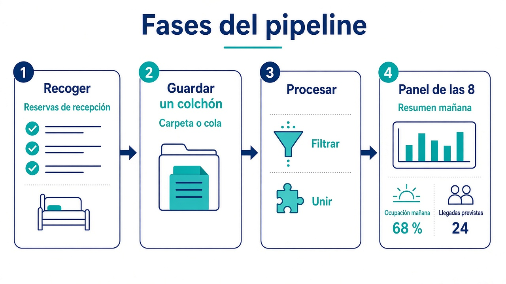
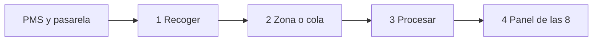
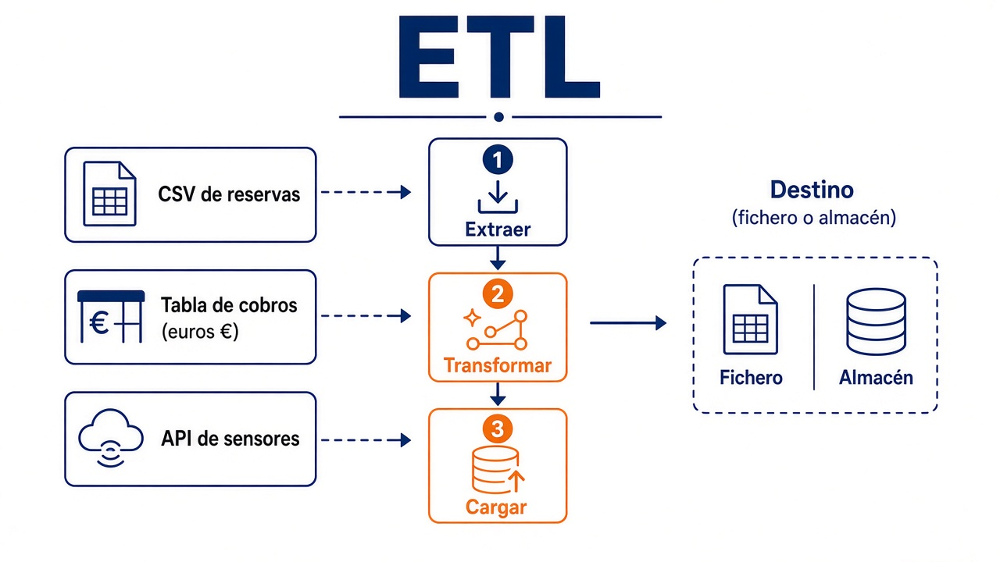

# 1.6. Ingesta de datos

El criterio **b)** no pregunta “¿qué logo pones en el diagrama?”. Pregunta **cómo** metes el dato: de dónde sale, quién da el primer paso, a qué ritmo, si lo limpias antes o después de guardarlo, en qué forma lo dejas y **por qué** no el mecanismo de al lado.

Si este paso falla, el modelo y el cuadro de mando trabajan sobre arena: la cifra queda bien presentada y es mentira.

**Ingerir**, en el RA1, es el procedimiento que saca el dato de donde nace (PMS, pasarela, sensor, CSV, API) y lo deja en un sitio desde el que ya se puede trabajar: una zona bruta, un almacén, una cola. Hasta que no entra, el resto de la [arquitectura](arquitectura.md) está vacía. La productividad del equipo no depende del logo de la herramienta: depende de si este procedimiento es **ágil** (cuando gerencia cambia la pregunta, no tiras tres meses) y **flexible** (mañana aparece otra fuente).

## El lunes a las 8, no la herramienta

Dirección de un grupo hotelero quiere, cada mañana a las 8, **ocupación e importe cobrado por hotel**. Recepción sigue picando reservas. Finanzas cierra el día a las 23:00. Hay sensores de ocupación en habitación que publican cada medio minuto.

Antes de abrir Kafka, Pentaho o un script, diseñas **hacia atrás**:

1. ¿Qué tiene que ver gerencia a las 8? (destino / presentación)
2. ¿Hay que cruzar reservas con cobros, quitar canceladas, recodificar canales? (transformación)
3. ¿El dato vive en el programa de reservas, en la pasarela de pago, en un FTP o en los sensores? (origen)

Sin esa pregunta de negocio, unificar veinte fuentes en un **lago** es un proyecto largo que no sabes cuándo termina.



Un **pipeline** (tubería) es solo eso: fases y tecnologías entre un origen y un destino. En lo mínimo: recoger, guardar, procesar y **dejar algo útil**. No es un producto. No es sinónimo de ETL.

- Toda **ETL** (extraer → transformar → cargar) es un pipeline.
- No todo pipeline es una ETL: un sensor que deja un mensaje en una cola y un filtro que tira los duplicados también es tubería.

El análisis **no** se hace en la recepción. Sumar importes es caro para la máquina; si lo lanzas sobre el programa que cobra, el mostrador espera. Se **copia** el hecho a otro sitio: el oficio de [operar](procesamiento.md) sigue; el de informar trabaja aparte (en los libros, OLTP frente a OLAP). A menudo el primer sitio consolidado es el lago; luego se cura una copia hacia el warehouse del panel. Dos procedimientos, no uno mágico.

La tubería **se itera**. Gerencia pregunta “¿cancelan más los del viernes?”. Si falta el campo, vuelves al origen, ingestes otra vez e integras. No es un acto único el día 1. Por el camino **limpias**: `web` frente a `WEB`, huecos, un número que llega como texto `"10"`. Eso es dejar el dato **listo** (en la jerga, *data wrangling*). No es un software: es el oficio.

## Cuatro paradas, no un único job

En el hotel, el mismo hecho (una reserva cobrada) pasa por **paradas**. Cada parada puede ser otra tecnología. Eso es el pipeline de verdad, no “un script que hace de todo”.



1. **Recoger.** Copias el hecho fuera de recepción. Un *topic*, un volcado JDBC, un CSV en S3.
2. **Aguantar.** Si el panel va lento, el dato no se pierde: cola o zona bruta. Kafka, aquí, no “analiza”: **espera**. Es el colchón entre el que pica y el que calcula.
3. **Procesar.** Filtras, cruzas, agregas. Lote o continuo. Aquí suele vivir la T pesada.
4. **Dejar algo útil.** Warehouse del panel, JSON de gerencia, o una colección NoSQL. La visualización es el último metro, no el primero.

Un pipeline corto puede hacer una T **ligera** al recoger (tirar el evento sin `id_habitacion`) y dejar el cruce reservas–cobros para más tarde. Si mezclas las cuatro paradas en un único job “porque es más simple”, el martes que el PMS añade una columna rompes el panel, el cruce y la carga a la vez.

## Quién mueve el dato (antes que Sqoop o Kafka)

Tres planteamientos. No son tres productos.

| | **Push** | **Pull** | **Poll** |
| --- | --- | --- | --- |
| Quién inicia | El **origen** empuja | El **destino** va a buscar | El destino **mira** de vez en cuando; si hay cambio, tira |
| En el hotel | Cada alta se publica en un canal | A las 02:00 lees la tabla de ocupaciones | Cada 15 min listas el FTP; solo bajas si cambió la fecha |
| Encaja | Evento, sensor, *webhook* | Lote nocturno, conector SQL | Carpetas, buzones, APIs mudas |
| Riesgo | Te inundan o el origen no sabe adónde empujar | Tiras en hora punta y tumbas la recepción | Preguntas poco = te enteras tarde; preguntas mucho = molestas |

No hay uno “más Big Data”. El *push* encaja con el flujo continuo; *pull* y *poll*, con el lote. En la misma empresa conviven.

## Tres relojes

| | **Lote** | **Micro-lote** | **Continuo** |
| --- | --- | --- | --- |
| Cuándo | Cada X horas o al llegar un fichero | Cada pocos minutos, un bloque chico | En cuanto aparece el dato |
| Retraso | Horas; a menudo da igual | Compromiso | Segundos o menos |
| Encaja | Cierre de finanzas, volcado SQL → lago | Panel “casi en vivo” | Sensor, clic, log |
| Familia típica | Job nocturno, Pentaho, script, puente SQL | Spark a trozos | Cola + consumidor |

**Síncrono:** esperas a que el destino confirme. **Asíncrono:** sueltas el mensaje y sigues. Las colas son lo segundo.

Si el sensor de habitación no puede esperar al informe de las 8, hace falta **mensajería** (Kafka, RabbitMQ, Kinesis…): un **productor** deja el evento; un **consumidor** lo recoge; si el consumidor va lento, la cola **aguanta** el chaparrón (*contrapresión*). En muchas colas clásicas, al recoger el mensaje **desaparece**. Un bus repartido no es “una carpeta”: el orden entre varios canales no está garantizado y hay que contar con nodos que fallan.

!!! tip "En voz alta"
    “Desacoplar al que pica la reserva del que pinta el panel” → familia **mensajería**, no un volcado nocturno.

## Extraer, transformar, cargar (el orden cambia el oficio)

Tres verbos, siempre. Las siglas **ETL** y **ELT** solo cambian **cuándo** haces el 2.

1. **Extraer.** Leer el origen (tabla, CSV, API) y llevarlo a una zona de trabajo. Tiene que ser **ligera**: que recepción casi no se entere. **No** se cambia el dato operativo. Si colapsa el programa de reservas, la empresa pierde dinero *cobrando*. La carga histórica (tres años atrás) es **otro** procedimiento que el incremental del martes. Si el lote no trae las columnas esperadas, se **aparta**: no se cuela para que el job “acabe en verde”.
2. **Transformar.** Dejar formato y contenido que el destino entiende: tildes, duplicados, cruzar reservas con cobros, agregar por hotel, inventar un identificador estable, calcular ocupación %. **Mejora** calidad. **No** inventa hechos ni borra lo que el informe necesita. En continuo, la T pesada a veces espera al lote; si transformas al vuelo, pregunta si pierdes el original.
3. **Cargar.** Escribir **adaptándote** al destino: *bulk* SQL, carpeta que el warehouse lee, API de S3/HDFS. Reconstruir el **índice** fila a fila mata una carga de diez millones. Parte por fecha o por hotel. Confirma por **bloques**, no por fila. Cien filas de práctica mienten.

Qué se espera de cada letra, sin memorieta:

**E — no molestar al mostrador.** Orígenes reales: tabla SQL, CSV con otro separador, JSON de una API, mensajes de un bus. El proceso tiene que ser **ligero e independiente** de la máquina que cobra. Compruebas que el lote **trae lo que dice traer** (columnas, tipos). Si no, se aparta: un job “en verde” con filas cojas envenena el panel. La **carga inicial** (tres años de reservas) no es el job del martes (solo lo de ayer). Mezclarlas es el error de aula más caro.

**T — mejorar, no inventar.** En el hotel suele ser: unificar `web`/`WEB`, quitar duplicados de `id_reserva`, cruzar reservas con cobros, agregar importe por hotel, generar un código estable (`hotel-fecha`), calcular ocupación %. **Sí:** calidad, integración, normalizar. **No:** inventar noches que el PMS no picó, borrar el canal porque “estorbaba”, ni una regla que un día sí y otro no. En continuo, una T pesada (el cruce de veinte fuentes) **no** va en el mismo milisegundo que el sensor.

**L — escribir como el destino espera.** Cada destino tiene su vía rápida: *bulk* SQL, `COPY` a fichero, API de S3/HDFS. Tres palancas que tumbaron prácticas reales:

| Palanca | Si la ignoras |
| --- | --- |
| Índices | Reconstruirlos fila a fila en diez millones de reservas tira la carga |
| Partición / clave de distribución | Por fecha o por hotel; por `id_reserva` aleatorio el panel barre todo el lago |
| Tamaño del *commit* | Una transacción de diez millones o diez mil de una fila: las dos mienten |

Cien filas de Colab **no** demuestran la L.



| | **ETL** | **ELT** |
| --- | --- | --- |
| Orden | Extraer → **transformar** → cargar | Extraer → **cargar** → transformar |
| Dónde la T | Motor de en medio (Pentaho, Talend, un script) | El destino (SQL del warehouse, Spark o DuckDB sobre el lago) |
| Cuándo | El destino es rígido y no debe tragar basura | Destino elástico y **varios** consumidores del mismo bruto |
| Ver el crudo | Más tarde | Antes |
| Si gerencia cambia la pregunta | Retocas la T **antes** de recargar | A menudo una consulta nueva sobre lo ya cargado |

Unificar veinte fuentes **gasta** el proyecto. La veracidad se cuida **aquí**. El mercado cloud empuja **ELT** (el almacén es potente; el lago se llena pronto). **ETL sigue** cuando el destino no admite basura o cuando en aula usas [Pentaho](pentaho.md) (PDI se enseña como ETL visual). Lo habitual en empresas es **híbrido**: la suite + pandas / PySpark / DuckDB + un orquestador (**Airflow**) que dispara pasos y avisa si uno falla. No montas Airflow en esta UT; sí sabes para qué existe.

ELT no es “ETL al revés para quedar moderno”. Cambia **quién** trabaja y **cuándo** se ve el dato:

- El ingeniero deja el bruto en el lago **pronto**. Ciencia de datos y finanzas pueden mirar el crudo **antes** de que alguien modele el cruce perfecto.
- La T la puede hacer quien conoce el negocio (SQL del warehouse, un notebook), no solo el equipo de pipelines. Hacen falta menos personas *en medio* y más criterio *en destino*.
- El coste baja cuando el destino es elástico. Sube cuando el warehouse **no** debe tragar basura: entonces ETL (o una zona de cuarentena) sigue mandando.

Por eso en cloud ves ELT; en aula con Spoon practicas ETL visual. En una cadena hotelera real **conviven**: el cierre de facturación es ETL; el lago de ocupación es ELT.

La herramienta, en Big Data, tiene que ser **flexible** (CSV, JSON, Parquet, SQL, HTTP), **tolerante a fallos** (si cae a mitad, no dejes el destino a medias sin saberlo) y **conectada** a muchos orígenes. Conviene **rastro** (qué corrió, qué falló) y **planificación** (noche, al llegar un fichero, o continuo).

Una suite (PDI, Talend, Informatica) no es “el botón ETL”. Cubre tres oficios que un script suelto olvida:

| Oficio | En el hotel | Dificultad |
| --- | --- | --- |
| Cambiar tipo, recortar cadena, recodificar canal | `WEB` → `web` | Baja |
| Agregar por hotel, *lookup* del catálogo de canales | Importe cobrado / hotel | Media |
| Modelo, código de un tercero, otro lenguaje dentro del flujo | Se sale de esta UT | Alta |

Sin planificación y sin registro de errores, el job “en verde” es teatro.

## Taller: reservas y cobros (las tres letras en código)

En [Pentaho](pentaho.md) harás el mismo cruce en Spoon, con CSV de reservas y cobros del aula. Aquí generas **dos orígenes** en el cuaderno (Jupyter o un [Colab](https://colab.research.google.com/) en blanco), como en [1.7](formatos.md).

- `reservas.csv`: quién reservó, en qué hotel, por qué canal, noches e importe de la estancia.
- `cobros.csv`: qué reservas **ya** están cobradas y por qué medio. No todas las reservas tienen fila: el *join* a la izquierda deja huecos. Eso es real.

Objetivo: reservas del canal `web` **con cobro**, y una etiqueta `hotel (web)`.

**E** = leer los dos ficheros. **T** = filtrar, cruzar (`id_reserva`) y crear la etiqueta. **L** = escribir un JSON para verlo en clase.

```python
import numpy as np
import pandas as pd

rng = np.random.default_rng(2026)
n = 8_000
hoteles = ["Santander", "Laredo", "Comillas", "Potes"]
reservas = pd.DataFrame({
    "id_reserva": np.arange(n, dtype="int32"),
    "hotel": rng.choice(hoteles, n),
    "canal": rng.choice(["web", "ota", "recepcion"], n),
    "noches": rng.integers(1, 8, n, dtype="int32"),
    "importe": rng.uniform(48, 420, n).round(2),
})
# ~70 % de las reservas tienen cobro
mask = rng.random(n) < 0.7
cobros = pd.DataFrame({
    "id_reserva": reservas.loc[mask, "id_reserva"].to_numpy(),
    "medio": rng.choice(["tarjeta", "efectivo", "bizum"], mask.sum()),
    "cobrado": reservas.loc[mask, "importe"].to_numpy(),
})
reservas.to_csv("reservas.csv", index=False)
cobros.to_csv("cobros.csv", index=False)
```

### pandas

```python
# E
df_r = pd.read_csv("reservas.csv")
df_c = pd.read_csv("cobros.csv")

# T
web = df_r[df_r["canal"] == "web"]
cruce = web.merge(df_c, on="id_reserva", how="inner")
cruce["etiqueta"] = cruce["hotel"] + " (web)"

# L
cruce.to_json("web_cobrado.json", orient="records", force_ascii=False)
```

`how="inner"` = “solo las que **sí** tienen cobro”. Un `left` dejaría reservas web sin `medio`: útil para ver impagados; no es el objetivo de este taller.

### DuckDB

[DuckDB](formatos.md) trata el CSV como tabla. Mismas tres letras, idioma SQL.

```python
import duckdb

duckdb.sql("""
COPY (
    SELECT
        r.id_reserva,
        r.hotel,
        r.importe,
        c.medio,
        r.hotel || ' (web)' AS etiqueta
    FROM read_csv('reservas.csv', header=true) AS r
    INNER JOIN read_csv('cobros.csv', header=true) AS c
        USING (id_reserva)
    WHERE r.canal = 'web'
) TO 'web_cobrado_ddb.json' (FORMAT JSON)
""")
```

Compara en clase **líneas de código**, **tiempo** y si el JSON se abre. En 1.8 verás el **mismo oficio** en Spoon: cambia la herramienta, no las letras.

## La L también es una decisión de formato

Escribir “un fichero” no basta. El siguiente paso tiene que **partir**, comprimir y consultar sin arruinarte. Serializar (memoria → bytes) y convertir gasta CPU y puede **perder tipos**. No cambies de formato en cada capa por capricho. El catálogo está en [1.7](formatos.md); aquí eliges **el de la carga**.

El fichero tiene que ser **partible**. Un JSON con un array de diez millones de objetos entre `[` y `]` no se trocea. Una reserva por línea (JSONL), Avro o Parquet, sí.

| Destino de esta carga | Formato | Por qué |
| --- | --- | --- |
| Que lo abra un compañero | CSV / JSON | Se depura |
| Cola; el mes que viene añaden un campo | **Avro** | Fila + esquema; típico en *push* |
| Lago / Spark / Athena (el informe de las 8) | **Parquet** | Lee hotel e importe, no las doce columnas |
| El script de al lado, ahora | **Feather** | Rápido; no es archivo de años |
| Tablas Hive | **ORC** (o Parquet si el equipo es Spark) | Encaje |
| El programa de recepción | Ni Parquet ni ORC como almacén | Actualizar una fila es caro |

En servicios que cobran por **dato escaneado**, dejar el bruto en CSV “porque es simple” se paga **cada lunes**. Un orden de magnitud habitual: el texto plano queda en una fracción en columnar comprimido. La cifra exacta cambia; el procedimiento no.

El JSON del taller vale para **ver**. Si el cruce pesara 50 GB y el destino fuera el lago:

```python
cruce.to_parquet("web_cobrado.parquet")
```

Si el siguiente script lo necesita ya:

```python
import pyarrow.feather as feather

feather.write_feather(cruce, "web_cobrado.feather")
```

Job típico de ingesta: llega JSONL y lo dejas en Parquet, sin pasar por pandas:

```python
import pyarrow.parquet as pq
from pyarrow import json as pajson

pq.write_table(pajson.read_json("reservas.jsonl"), "reservas.parquet")
```

Comprimir (Snappy, gzip, zstd) ocupa menos y viaja menos; cuesta CPU. En volumen suele ganar el códec **rápido**.

!!! tip "Antes de dar el procedimiento por cerrado"
    ¿El destino **escribe** muchos registros o **lee** tres columnas? ¿Se puede **partir** el fichero? ¿Mañana cambia el esquema (Avro) o solo suman un campo (Parquet)?

## De dónde sale y adónde entra

La ingesta es la **primera** capa de la [arquitectura](arquitectura.md). Suele ser la más pesada: muchas fuentes, ritmos distintos. El día 1 **priorizas** (no todas importan), **validas** cada lote aparte y **enrutas**.

Orígenes habituales: una cola que ya recogió IoT; una tabla SQL (enchufe JDBC); una API JSON; una carpeta en HDFS o S3.  
Destinos habituales: otra cola; SQL o NoSQL; el lago; una plataforma (Snowflake, Databricks…).

Cuatro preguntas que recuerdan a las [5 V](por-que-big-data.md), aplicadas al *cómo entra*:

| Pregunta | En el hotel |
| --- | --- |
| ¿A qué ritmo llega? | Sensor cada 30 s frente a cierre a las 23:00 |
| ¿Cuántos GB/día, y si abrís otro hotel? | Tamaño y crecimiento |
| ¿Lote, trozo o continuo? | Finanzas frente a recepción |
| ¿Tabla, JSON, imagen del DNI? | Formato (el DNI, a menudo, **no** se ingiere) |

Esos cuatro ejes (ritmo, tamaño, frecuencia, forma) son las [5 V](por-que-big-data.md) vistas desde la **puerta de entrada**. El día 1 no ingestas las veinte fuentes: priorizas las que el panel de las 8 necesita, validas **cada** lote aparte y enrutas. Un CSV de canales y un sensor de 2 Hz no van por el mismo tubo.

La ingesta corta puede filtrar o enriquecer un poco **antes** de escribir. El *join* gordo, las agregaciones y las ordenaciones para el informe viven en un pipeline **siguiente**. No es pereza: es no bloquear la puerta.

## El origen no se queda quieto

El martes el PMS añade `motivo_cancelacion`. Tres preguntas que no están en el logo de Kafka:

1. **¿Quién te avisa?** Si nadie, el job sigue “bien” y el campo nuevo se pierde.
2. **¿Guardas historial o pitas encima?** Un *update* in-place borra cómo estaba la reserva el lunes. *Delete + insert* o una zona versionada dejan rastro.
3. **¿Reprocesas?** Si gerencia cambia el KPI, a veces basta una consulta nueva sobre el bruto (ELT). A veces hay que **volver a ingerir**. Reusar el dataset ya cargado evita tragarte otra vez tres años de SQL.

Si transformaste al vuelo y tiraste el original, el cambio de KPI te obliga a pedir otra extracción al PMS. Eso duele. Dos destinos a la vez (lago en S3 **y** Mongo del panel) duplican la pregunta: ¿el mismo formato en los dos, o cada uno el suyo?

## Cómo elegir el mecanismo (guion de aula)

No rellenes un cuestionario de treinta ítems. En un supuesto, clava **estas** decisiones y justifícalas.

1. **Origen.** ¿Tabla, API, carpeta, sensor? ¿Hay que **cruzar** dos sistemas (reservas + cobros) para tener la foto?
2. **Quién inicia.** Push, pull o poll.
3. **Reloj.** ¿El dato que llega tarde sigue valiendo? El cierre de ayer sí; el semáforo de habitación libre, no.
4. **ETL o ELT.** ¿El destino traga bruto? ¿Pierdes el original si transformas al vuelo?
5. **Destino y [formato](formatos.md).** ¿S3 “tonto” o warehouse con SQL? ¿Uno o varios destinos? ¿Avro o Parquet? ¿Partir por hotel?
6. **Calidad.** ¿Apartas el lote roto? ¿Linaje (de dónde salió esta cifra)? ¿Hay duplicados o valores imposibles (`noches = -1`)?
7. **Personas.** ¿El DNI se enmascara o **no entra**? ¿Quién ve el campo, y en qué estado?
8. **Cambio.** Si el PMS añade una columna, ¿te enteras? ¿Pitas encima o versionas? ¿Puedes reprocesar sin volver a pedir tres años al origen?

## Familias, no un catálogo para memorizar

Citas la **familia**. El nombre concreto cambia de año.

| Necesidad | Familia | Ejemplos que verás escritos |
| --- | --- | --- |
| Tabla SQL grande, de noche, hacia el lago | Puente **batch** (*pull*) | Sqoop (la idea; el proyecto está en mantenimiento), job Spark, Pentaho |
| Logs o clics que tienen que verse ya | **Flujo** (*push*) | Flume, Kafka + consumidor, NiFi |
| Varias fuentes y un grafo en pantalla | ETL **visual** | NiFi, [Pentaho](pentaho.md) |
| Logs hacia un buscador | Tubería de logs | Logstash |
| ETL gestionado en un proveedor | Servicio cloud | Glue (AWS) y equivalentes |
| El productor no espera al consumidor | **Mensajería** | Kafka, RabbitMQ, Kinesis, Event Hubs, Pub/Sub |
| Cientos de aplicaciones SaaS hacia el lago | Conectores **ELT** | Airbyte, Fivetran |

Las suites (PDI, Talend, Informatica…) venden conectores, planificación, errores y metadatos. Transformar un tipo es simple; agregar o buscar en otra tabla es el día a día; un modelo de IA dentro del flujo se sale de esta UT.

!!! example "Tres supuestos del grupo hotelero"
    1. “A las 02:00, la tabla PostgreSQL de reservas → el lago.” → lote *pull*, no un bus.  
    2. “El semáforo de habitación libre en recepción, en pocos segundos.” → flujo + cola.  
    3. “Reservas web ya cobradas → fichero para gerencia.” → el taller de esta página o el mismo flujo en Spoon.

!!! success "Criterio b) en un examen"
    Origen + push/pull/poll + reloj + ETL o ELT + destino + formato de la carga + **por qué no** el de al lado. “Kafka” solo no puntúa.

## Taller medido y supuestos

No sustituye a Moodle. Comprueba que lo sostienes en voz alta.

1. Gerencia quiere el panel de las 8. ¿Qué decides **primero**: la herramienta o la pregunta de negocio? Di las tres marchas atrás (destino → T → origen).
2. Un *topic* solo guarda altas de reserva, sin limpiar ni cruzar. ¿Es un pipeline? ¿Es una ETL? ¿Por qué?
3. El warehouse de finanzas **no** admite filas sucias. El lago de ocupación **sí** guarda el bruto para que ciencia de datos explore. ¿ETL, ELT o los dos? ¿Dónde duele si cambian el KPI?
4. Con `reservas.csv` y `cobros.csv`: importe **cobrado** por hotel **solo** en canal `recepcion` (pandas y DuckDB). Cuenta también cuántas reservas de ese canal **aún no** tienen cobro.
5. Misma T del punto 4, **tres L**: JSON (verlo), Parquet (lago) y Feather (el script de al lado). Anota tamaños y di cuándo usarías cada una.
6. Dos procedimientos en el mismo hotel: (a) sensores cada 30 s para el semáforo de recepción; (b) cierre de cobros a las 23:00 para finanzas. Para cada uno: quién inicia, reloj, ETL/ELT, destino y formato. No mezcles los dos en un solo job “porque es más simple”.
7. El PMS añade `motivo_cancelacion`. El job de las 02:00 sigue en verde. ¿Qué falló (aviso, esquema, historial)? ¿ETL o ELT te salva mejor el KPI nuevo “cancelaciones por tarifa no reembolsable”?
8. Misma T del punto 4, pero ahora **agrega**: por hotel, número de reservas cobradas y suma de `cobrado`. pandas y DuckDB. El resultado, un CSV. ¿Esa agregación la harías en la parada 1 (recoger) o en la 3 (procesar)? ¿Por qué?
9. La cadena lanza una app de fidelización y quiere **reacción en redes** las primeras 48 h (menciones, idioma, hora). Del guion de esta página, responde **al menos tres** ítems de origen, **tres** de reloj/latencia y **tres** de personas/calidad. No hace falta nombrar un producto: nombra la **familia**.

## Para ampliar

El mismo criterio, con otro hilo (productos y fabricantes) y otro taller pandas/DuckDB, está en los apuntes de Aitor Medrano: [Ingesta de datos. Pipeline y ETL](https://aitor-medrano.github.io/iabd/de/etl.html). Aquí el caso es el grupo hotelero; allí, el catálogo. Las letras E–T–L no cambian.
