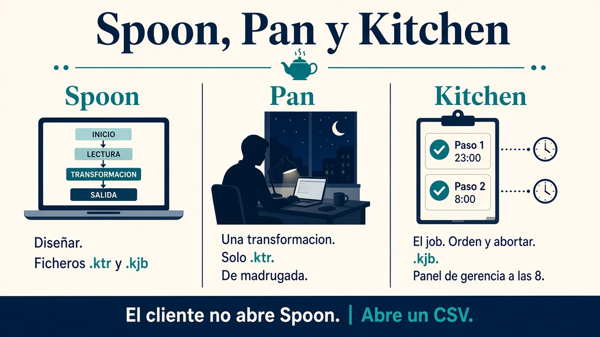
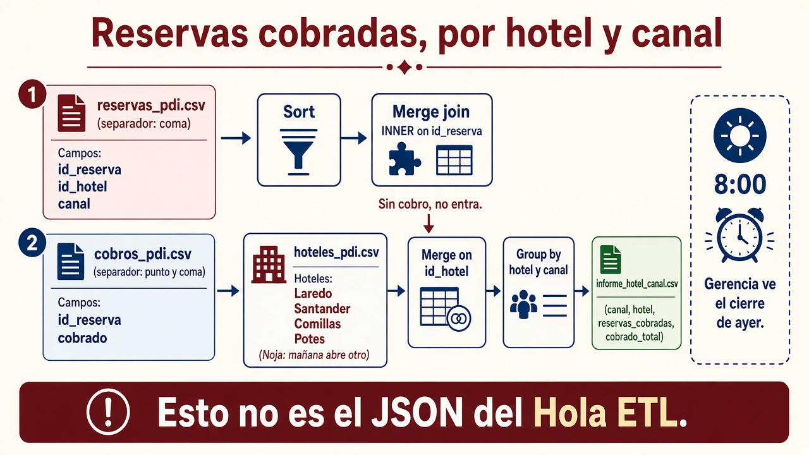

# 1.8. Pentaho: procesar y presentar

Los criterios **d)** y **e)** del RA1 se cierran aquí: **procesar** el dato ya almacenado y **enseñárselo** a alguien que no abre Spoon.

En el aula usáis **Pentaho Data Integration (PDI / Kettle)**, de Hitachi Vantara. No sustituye a Spark en un clúster de petabytes. Sí os deja **ver** un [ETL](ingesta.md){target="_blank" rel="noopener"}: extraer, filtrar, unir, agregar y cargar **sin programar el motor**.

!!! info "Cómo se lee esta página"
    **0** es el entorno. **1–3** se hacen en clase (filtro, cruce, JSON). **4–5** son nube y el job de **madrugada**: si el aula no tiene cubo, el CSV acaba en una carpeta. **6** solo si hay PostgreSQL o MariaDB. Los relojes: finanzas cierra a las **23:00**; Kitchen corre de noche; gerencia a las **8** ve el cierre de **ayer**. El **e)** es el fichero o la tabla, no un informe de Pentaho Server.

El PDF de prácticas ([Pentaho.pdf](../assets/originales/Pentaho.pdf){target="_blank" rel="noopener"}) sirve para **reconocer menús** (dónde está *Filter rows*, *Minimal width*…). **No** copiéis sus ficheros ni sus rutas: allí salen códigos postales de Nueva York, Airbnb de Madrid y un RDS deportivo. Aquí el caso es el [grupo hotelero de Cantabria](caso-hotel.md){target="_blank" rel="noopener"}. Tampoco copiéis credenciales que aparezcan en capturas.

Los CSV y el SQL de esta página:

| Fichero | Taller |
| --- | --- |
| [alojamientos_cp.csv](../assets/practicas/alojamientos_cp.csv){target="_blank" rel="noopener"} | 1 |
| [reservas_pdi.csv](../assets/practicas/reservas_pdi.csv){target="_blank" rel="noopener"}, [cobros_pdi.csv](../assets/practicas/cobros_pdi.csv){target="_blank" rel="noopener"}, [hoteles_pdi.csv](../assets/practicas/hoteles_pdi.csv){target="_blank" rel="noopener"} | 2 |
| [cadenas_pdi.csv](../assets/practicas/cadenas_pdi.csv){target="_blank" rel="noopener"} | 4 |
| [alojamientos_opiniones.csv](../assets/practicas/alojamientos_opiniones.csv){target="_blank" rel="noopener"} | 3 |
| [incidencias.csv](../assets/practicas/incidencias.csv){target="_blank" rel="noopener"}, [incidencias2.csv](../assets/practicas/incidencias2.csv){target="_blank" rel="noopener"}, [hotel_pdi.sql](../assets/practicas/hotel_pdi.sql){target="_blank" rel="noopener"} | 6 |

Estos `reservas_pdi.csv` / `cobros_pdi.csv` **no** son los que generáis en [Hola ETL](ingesta.md#hola-etl){target="_blank" rel="noopener"} ni el `reservas.csv` de [1.7](formatos.md){target="_blank" rel="noopener"}. Misma **idea** (reservas ⋈ cobros); otras columnas (`id_hotel`, no el nombre) y otro grano (informe, no JSON fila a fila).

## Qué es PDI (y qué no)

Pentaho es una plataforma de integración y análisis. **PDI** es la pieza ETL: un lienzo donde arrastráis pasos y el motor mueve las filas. En esta UT no montáis el servidor de informes: el criterio **e)** es el CSV, el JSON o la tabla que gerencia ya entiende.

En jerga de Kettle se dice herramienta de **metadatos** porque vosotros declaráis *qué* tiene que ocurrir (leer este CSV, filtrar Trasmiera, escribir allí) y el *cómo* (buffers, tipos) lo resuelve el motor. Ese XML (`.ktr` / `.kjb`) **no** es el catálogo de negocio del [1.5](arquitectura.md){target="_blank" rel="noopener"} (qué significa `canal`). Se puede ejecutar igual en vuestro Windows y en un servidor sin pantalla.

Con Spoon, sin escribir el motor:

- conectar orígenes (CSV, Excel, XML, JSON, SQL, APIs);
- filtrar, limpiar, tipar, *lookup*, *merge join*, agregar, fórmulas;
- cargar a fichero, tabla o nube;
- **esbozar** hechos y dimensiones (reservas ⋈ hoteles): un trozo de esquema en [estrella](procesamiento.md){target="_blank" rel="noopener"}, no un almacén entero.

**No** es el programa de recepción: no picáis la reserva en PDI. Procesáis una **copia**.

| Característica | En el aula |
| --- | --- |
| Multiplataforma | Windows, Linux, macOS |
| Community / comercial | En clase, Community; la empresa puede pagar soporte |
| Motores SQL | PostgreSQL viene; MySQL/MariaDB piden el `.jar` en `lib` |
| Escala | Local, programada o en un servidor. Petabytes → otro stack |

!!! warning "Versión y Java"
    Usad la versión de PDI que indique el aula (en las prácticas, **9.4** Community). PDI 9.x espera **Java 8**. Si Spoon no arranca, lo primero es `java -version`, no “reinstalar Windows”. En Windows: descomprimid el zip y lanzad `spoon.bat`. En Linux: `spoon.sh` (puede hacer falta un JDK 8 y, en algunas distros antiguas, una librería WebKit; el profesor os dirá el paquete del lab).

Descarga Community (Hitachi / el espejo que indique el aula): el zip es `pdi-ce-9.4.0.0-343.zip` (carpeta `data-integration`, con `spoon.bat`). **No** bajéis `pme-ce-…`: eso es otro programa (editor de metadatos), no Spoon.

## Tres ejecutables que se confunden



| Pieza | Analogía | Qué lanza | Fichero |
| --- | --- | --- | --- |
| **Spoon** | El taller | Diseñar (arrastrar pasos) | `.ktr` y `.kjb` |
| **Pan** | El obrero de *una* pieza | Una **transformación** sin ventana | `.ktr` |
| **Kitchen** | El capataz | Un **job**: orden, condiciones, abortar | `.kjb` |

Spoon es para **clase y diseño**. En producción (o en la entrega “como en empresa”) lanzáis **Pan** o **Kitchen**. Si solo funciona cuando pulsáis Play, el procedimiento no está cerrado.

!!! example "Regla"
    ¿Un solo flujo leer → filtrar → escribir? → transformación → **Pan**.  
    ¿“Si no está el CSV, aborta; si está, borra el informe viejo y lanza dos transformaciones”? → job → **Kitchen**. Eso es el lote de **después de las 23:00**.

En PDI hay **dos** tipos de diseño:

- **Transformación:** el dato **cambia** (filas in, filas out).
- **Job:** **orquesta** (¿existe el fichero? ¿falló el paso anterior?).

Al conectar dos pasos, Spoon pregunta a menudo:

- **Main output of step:** el camino bueno (en *Filter rows*, la rama que **cumple**).
- **Error handling of step:** qué hacéis si *este* paso revienta.

*Filter rows* tiene **dos** salidas: la que cumple y la que no. Unid el *Sort* a la que cumple. El *Dummy* cierra la otra.

El lienzo (árbol de categorías a la izquierda, zona de trabajo, panel de *Logging* / métricas abajo) es el mismo en todos los talleres. El menú emergente sobre un paso (editar, previsualizar, conectar salida) lo usaréis hasta el cansancio.

## Criterio d) y criterio e)

Habéis **procesado** (d) cuando la salida **no es** la entrada: menos filas, columnas con nombre de negocio, un agregado, un JSON que otra app entiende.

El cliente **no** abre Spoon. “Fácil de interpretar” (e) es:

- un CSV con **cabeceras claras** y solo las columnas pedidas,
- un JSON coherente,
- una **tabla** que Power BI o un informe ya entienden,
- un **agregado** (importe por hotel y canal) en lugar de veinte mil reservas crudas.

!!! tip "Prueba del cliente"
    Cerrad Spoon. Abrid el fichero como lo abriría alguien de empresa: Excel, un visor JSON, una consulta SQL. Si tiene que preguntaros “¿qué es `id_cadena`?”, el **e)** no está cerrado.

## Cómo atacar cada taller

1. Escribid en una **nota** del lienzo (botón derecho → *New Note*) la pregunta del cliente y **vuestro nombre**.
2. Marcad origen, la T **mínima** y el destino. Si no cabe en una frase, el flujo está sobrado o incompleto.
3. **Preview** (ojo de la barra o clic derecho): 1000 filas por defecto. Ahí cazáis el nulo y el tipo raro. *Stop* para cortar.
4. Mirad las métricas. En el log veréis letras del estilo `I` (input), `O` (output), `R` (read), `W` (written), `U` (updated), `E` (errors). `E=1` no es un detalle: es una fila que no hizo lo que pedisteis.
5. Volved a ejecutar con **Pan** o **Kitchen**.
6. Abrid el artefacto **sin Spoon**.

Rutas: no dejéis `C:\Users\tu-cuenta\...` tapadas si el `.ktr` tiene que correr en el aula. Usad una carpeta de trabajo acordada o variables.

!!! warning "Nube y secretos"
    Credenciales de AWS o Azure **nunca** van en el `.ktr` que subís a Moodle ni en un repo. Variables de entorno, no capturas del `appId` / `password`. Un *bucket* público con `s3:*` y `Principal: *` es un ejemplo de **qué no** dejar en producción.

---

## Taller 0 — Que Spoon hable

Objetivo: una transformación que **no** lee un CSV. Comprobáis que PDI arranca y veis la versión.

1. *File → New → Transformation* (o `Ctrl+N`).
2. Categoría **Input** → **Get system info** (*Información del sistema*). Doble clic: un campo `Version_PDI` alimentado de *Kettle Version*.
3. Categoría **Utility** → **Write to log**. Arrastrad un hop del primero al segundo (*New hop* / nueva conexión).
4. *Run* o `F9`. El panel *Logging* debe mostrar la versión.

Si esto falla, no paséis al taller 1: el entorno no está listo.

---

## Taller 1 — Filtrar, ordenar, persistir y Pan

Cliente: *“Listado de alojamientos de la comarca **Trasmiera**, ordenados por código postal, en un CSV limpio.”*

Fichero: [alojamientos_cp.csv](../assets/practicas/alojamientos_cp.csv){target="_blank" rel="noopener"} (`hotel`, `comarca`, `codigo_postal`). Hay más nombres que los cuatro del esqueleto (Noja, Santoña, Isla…): es el “mañana abre otro”.

### Leer

1. Nueva transformación.
2. **CSV file input**. Ruta al CSV. *Get fields* / *Traer campos*: comprobad nombres y tipos.
3. *Preview*: deben salir filas de Santander, `Liebana` (**sin tilde**, así está el CSV) y Trasmiera.

### Filtrar

**Flow → Filter rows.** Condición: `comarca = Trasmiera` (el texto tiene que coincidir; `trasmiera` no vale). Conectad la rama que **cumple** hacia el *Sort*.

Preview sobre el filtro: Laredo, Noja, Santoña, Isla… *Stop* cuando os baste.

### Ordenar y un error a propósito

**Transform → Sort rows.** Campo `codigo_postal`.

Para ver cómo avisa Spoon: escribid `CP` en vez de `codigo_postal`. Preview: icono de prohibido, log y métricas con el campo inexistente. Corregid. Así dejáis de “adivinar” el nombre.

### Escribir

**Output → Text file output.** Conectad desde el *Sort*. Primera ejecución: a menudo **rellena con espacios** (anchura fija). Pestaña *Fields* → **Minimal width**. Segunda ejecución: `Mirador Laredo;Trasmiera;39770` sin cola de blancos.

Habéis **procesado** (menos filas, ordenadas) y **presentado** (CSV que se abre en Excel).

### Pan (sin Spoon)

Guardad `taller1_trasmiera.ktr`. Borrad el CSV de salida. En la carpeta de PDI:

```text
pan.bat /file="C:\ruta\taller1_trasmiera.ktr"
```

En Linux/macOS: `pan.sh /file=...`. El log debe terminar en *Finished* y el fichero debe **reaparecer**. Eso es el procedimiento de madrugada.

Parámetros útiles (también en Kitchen): `/level:Basic` (o `Error`, `Debug`, `Rowlevel`…) y `/param:"nombre=valor"` si el flujo espera variables.

---

## Taller 2 — Unir dos orígenes y agregar

Cliente: *“Importe cobrado y número de reservas **por hotel y canal**. Las que aún no tienen cobro no entran.”*

Es la **misma idea** que el [Hola ETL](ingesta.md#hola-etl){target="_blank" rel="noopener"} (reservas ⋈ cobros, solo cobradas). **No** reutilicéis aquellos CSV: aquí el hotel va por `id_hotel`, el cobro va con **punto y coma**, y gerencia quiere un **agregado**, no el JSON de una fila.



| Fichero | Separador | Rol |
| --- | --- | --- |
| [reservas_pdi.csv](../assets/practicas/reservas_pdi.csv){target="_blank" rel="noopener"} | coma | Hecho (estancia) |
| [cobros_pdi.csv](../assets/practicas/cobros_pdi.csv){target="_blank" rel="noopener"} | **punto y coma** | Cobro |
| [hoteles_pdi.csv](../assets/practicas/hoteles_pdi.csv){target="_blank" rel="noopener"} | punto y coma | Dimensión (Laredo, Santander, Potes, Comillas; Noja es extra) |

1. Dos (o tres) **CSV file input**. En cobros y hoteles, `Delimiter = ;`.
2. En reservas, *Get fields* y dejad `id_reserva` / `id_hotel` como **Integer** (o String si Spoon se come un código con ceros; aquí no hace falta).
3. **Join → Merge join.** En Spoon, el hop se tira **desde el Merge hacia cada origen** (así nombra *left* y *right*). Clave: `id_reserva` (reservas ⋈ cobros). Tipo *INNER*: las reservas **sin** fila en cobros no entran.

Spoon **avisa**: si los flujos no están **ordenados por la clave**, el join miente. Añadid **Sort rows** por `id_reserva` **en cada rama** *antes* del merge. Preview del merge: aún **no** está el nombre del hotel (falta la dimensión); sí debe estar `cobrado`.

4. Tercer origen `hoteles_pdi.csv` + otro *Merge join* por `id_hotel` (otra vez: **ordenar ambas entradas** por `id_hotel`). Ahí aparecen Laredo, Santander, Comillas, Potes.
5. **Statistics → Group by.** Agrupad por `hotel` y `canal`. Agregados: `SUM(cobrado)` con nombre **`cobrado_total`**, `COUNT` de `id_reserva` con nombre **`n_reservas`**. Esos nombres los ponéis vosotros en la columna *Name*; Spoon no los inventa.
6. El *Group by* también quiere el flujo **ordenado** por las columnas de agrupación. *Sort* por `hotel`, `canal` entre el merge y el grupo.
7. **Text file output** → `informe_hotel_canal.csv`.

Criterio **e):** gerencia lee **unas pocas filas** (hotel × canal), no el cruce fila a fila.

---

## Taller 3 — Limpiar, filtrar en serio y JSON

Cliente: *“Alojamientos para un **escaparate web** (no es el PMS ni el panel de las 8): no habitación privada, precio real menor de 200 €, estancia mínima de 4 noches o menos. En JSON, claves en castellano.”*

Fichero: [alojamientos_opiniones.csv](../assets/practicas/alojamientos_opiniones.csv){target="_blank" rel="noopener"}. Hay **nulos** a propósito (`puntuacion`, `estancia_min`) y un precio `-1`.

### Leer y elegir columnas

**CSV file input**, separador `,`. *Get fields*: `precio` y `puntuacion` como **Number**; `id`, `dormitorios`, `huespedes` como Integer.

**Transform → Select values:** quedaos con `id`, `tipo`, `comarca`, `dormitorios`, `puntuacion`, `huespedes`, `precio`, `estancia_min` y renombrad, por ejemplo:

| Original | Salida |
| --- | --- |
| `id` | `alojamiento_id` |
| `tipo` | `alojamiento_tipo` |
| `comarca` | `comarca` |
| `precio` | `precio` |
| `estancia_min` | `noches_min` |

### Nulos

Un **Java Filter** sobre `noches_min` **revienta o miente** si el campo es nulo. No copiéis un `< 4`: el cliente pide **4 o menos** (`<= 4`).

**Utility → If field value is null.** Sustituid nulos de `precio` y `noches_min` por `-1`. Luego el filtro **debe** excluir esos `-1`: no los coléis como “baratos”.

### Filtro simple y filtro Java

**Filter rows** basta para `precio < 200`. Condiciones con `&&` / `||` y texto se leen mejor en **Flow → Java Filter**. Ejemplo (ajustadlo a **vuestros** nombres de campo):

```text
(precio >= 0 && precio < 200) && (noches_min >= 0 && noches_min <= 4) && !alojamiento_tipo.equals("Habitacion privada")
```

Podéis poner **Dummy** en la rama que no cumple (no hace nada; cierra el camino) y la salida JSON en la que sí.

### JSON

**Output → JSON output.**

- *Filename:* ruta de `escaprate_cantabria.json`.
- *Json bloc name:* p. ej. `alojamientos`.
- *Nr rows in a bloc:* `0` = un solo documento con todos; `1` = un fichero por fila (casi nunca lo queréis aquí).
- Pestaña *Fields* → **Get fields**. Si no, el JSON sale con objetos vacíos.

Ejecutad. Abrid el JSON **sin Spoon**. Si un compañero de DAW entiende las claves, el **e)** va bien.

---

## Taller 4 — Fórmula y dejar el informe en la nube

Cliente: *“Por **costa / ciudad / interior**: noches cobradas, importe cobrado y **precio medio por noche**. El CSV tiene que acabar en el almacenamiento del centro (S3, Azure o la carpeta que diga el profesor).”*

Partís del taller 2 (reservas ⋈ cobros ⋈ hoteles). Añadís [cadenas_pdi.csv](../assets/practicas/cadenas_pdi.csv){target="_blank" rel="noopener"} (`Costa`, `Ciudad`, `Interior`):

1. CSV de cadenas (`;`) → *Sort* por `id_cadena`.
2. *Sort* del flujo de hoteles por `id_cadena`.
3. **Merge join** `id_cadena`.
4. *Sort* por `cadena` → **Group by:** `id_cadena`, `cadena`. En *Name* del agregado: `SUM(noches)` → **`noches_total`**, `SUM(cobrado)` → **`importe_total`**.
5. **Transform → Calculator.** Operación *A/B* (o la equivalente en vuestra versión): `importe_total / noches_total` → `precio_medio_noche`. Recorred el desplegable: hay texto, fechas y números; no memoricéis la lista.

Si el aula **no** tiene cubo, *Text file output* a `informe_cadenas.csv` en la carpeta de trabajo y listo: el oficio de d) y e) ya está.

### Destino S3 (si el aula usa AWS)

1. *Bucket* del **centro** (el nombre lo da el profesor; no copiéis el de otro ciclo).
2. Credenciales por **variables de entorno** (`AWS_ACCESS_KEY_ID`, `AWS_SECRET_ACCESS_KEY`, y si aplica `AWS_SESSION_TOKEN`) o el perfil `~/.aws/credentials`.
3. Paso **S3 file output**. URI: `s3n://NOMBRE-BUCKET/informe_cadenas` y extensión `csv`. **No** pongáis `s3n://s3n/…` (ese doble `s3n` es un error conocido de PDI).

Una política `Principal: *` + `s3:*` deja el cubo abierto al mundo. En clase, si os la muestran, es para que el paso *funcione*; **no** es el diseño de una empresa.

### Destino Azure (si el aula usa cuenta de estudiante)

El PDF detalla clics de Azure; aquí basta el oficio:

1. En Azure: grupo de recursos → **cuenta de almacenamiento** → **contenedor**.
2. En el PC: Azure CLI (`winget install -e --id Microsoft.AzureCLI`), cerráis y abrís PowerShell, `az version`.
3. Para automatizar: un *service principal* con rol **Storage Blob Data Contributor** *sobre vuestro* ámbito; `az login --service-principal` con `CLIENT_ID`, `CLIENT_SECRET`, `TENANT_ID` en variables de entorno. **No** peguéis esos valores en el apunte, en el PDF ni en Git.
4. Subida idempotente:

```bash
az storage container create --account-name TU_CUENTA --name practicas-bda --auth-mode login --only-show-errors
az storage blob upload --account-name TU_CUENTA --container-name practicas-bda --file informe_cadenas.csv --name informe_cadenas.csv --overwrite true --auth-mode login
```

Alternativa: token **SAS** (sin `az login`). Caduca; no lo subáis a un repo.

En Spoon, si vuestra versión trae paso de Azure Blob, usadlo con las mismas precauciones. Si no, el job (taller 5) puede llamar a un script *después* de generar el CSV local.

Habéis procesado (d: agregáis y calculáis) y presentado (e: tres números por costa/ciudad/interior, en un sitio que gerencia ya usa).

---

## Taller 5 — Un job que no se miente

Cliente: *“A las 23:00 cierra el día. De madrugada: si ya existe el informe del taller 2, bórralo; regenera 2; si ese CSV **no** apareció, **para** (no pintéis el panel de las 8 con un hueco); luego el 4.”*

El taller 4 **vuelve a leer** los CSV de reservas; no consume `informe_hotel_canal.csv`. El *File exists* del 2 es la **compuerta**: si el cruce falló, no seguís.

1. *File → New → Job.*
2. **General → Start.**
3. **Conditions → File exists** sobre `informe_hotel_canal.csv`.
4. Si existe: **Delete files** + (opcional en clase) **Display msgbox info** “He borrado el informe viejo”. En un servidor **sin ventana**, el *msgbox* estorba: en la entrega “empresa” quitadlo.
5. **General → Transformation:** el `.ktr` del taller 2. Unid tanto la rama “no existía” como la de “ya lo borré” a esta transformación.
6. Otro **File exists** sobre el CSV que **debe** haber dejado el 2. Si no está: **Utility → Abort job**. Así no dais por bueno un panel vacío.
7. Segunda **Transformation** (taller 4). Si comprobáis objeto en S3/Azure, el mismo *File exists* admite esquema S3 (URL del *bucket*) en muchas versiones; si no, un paso *Shell* / script del aula. Sin cubo: comprobad el CSV local.

Guardad `taller5_noche.kjb`.

```text
kitchen.bat /file="C:\ruta\taller5_noche.kjb" /level:Basic
```

Linux: `kitchen.sh /file=taller5_noche.kjb`.

---

## Taller 6 — Hablar con una base de datos

Cliente: *“Las incidencias del mostrador llegan en CSV; los nombres están en la tabla de huéspedes. Inserta el cierre, actualiza si ya existía, y si el id no encaja, que se vea **por qué** falló.”*

En el PDF el ejemplo es RDS y deporte. Aquí el esquema es el **hotel**, en **local** (PostgreSQL o MariaDB). RDS vale si el profesor lo monta; el oficio no cambia.

### Preparar

1. Cread una base `hotel_pdi` y ejecutad [hotel_pdi.sql](../assets/practicas/hotel_pdi.sql){target="_blank" rel="noopener"} (tabla `huespedes` + `fases_incidencia`). Si lo ejecutáis **dos** veces, los `INSERT` de huéspedes chocan con la clave; no hace falta repetirlos.
2. PDI trae driver de **PostgreSQL**. Para MySQL/MariaDB: copiad un conector JDBC **compatible con vuestra 9.4** en la carpeta `lib` de PDI y **reiniciad Spoon**. El “último jar del universo” a veces no carga.
3. *File → New → Database connection.* Host `localhost`, base, usuario de **aula**. Probad la conexión.

### Lookup (enriquecer el CSV)

Leed [incidencias.csv](../assets/practicas/incidencias.csv){target="_blank" rel="noopener"} (`id_huesped;tipo;fecha`).

La tabla `huespedes` tiene siempre `tipo = huesped`. El segundo campo está para practicar una **clave de dos columnas** (en otros oficios no basta el id):

1. **Transform → Add constants:** `tipo_entidad` = `huesped`.
2. **Lookup → Database lookup:** claves `id_huesped` + `tipo_entidad` → `nombre` (y lo que pidáis).

Preview: nombres de Ana, Luis… Si un id no existe, los campos salen **nulos**. Marcad *Do not pass the row if the lookup fails* si no queréis esa fila en el flujo bueno.

### Insertar

Misma lectura. **Get system info:** campo `sysdate` = fecha/hora del sistema (el cierre “termina ahora”).

**Output → Table output** → `fases_incidencia`. *Get fields* y mapead `id_huesped`, `tipo`, `fecha` del CSV → columna **`fecha_inicio`**, `sysdate` → **`fecha_fin`**.

Comprobad en SQL:

```sql
SELECT * FROM fases_incidencia ORDER BY fecha_fin DESC;
```

### Actualizar y ver el error

Leed [incidencias2.csv](../assets/practicas/incidencias2.csv){target="_blank" rel="noopener"}. **Output → Update:** claves de búsqueda `id_huesped` y `fecha` del flujo, mapeadas a **`id_huesped`** y **`fecha_inicio`** de la tabla; campos a pintar (`tipo`, `lado`, `comentario`). El *Update* mira `fases_incidencia`, **no** la tabla de huéspedes.

Tras el insert del CSV 1 (ids 1–4), este segundo fichero trae 1, 3, **5** y **99**:

- 1 y 3: hay fase → actualizan.
- **5** (Eva): está en huéspedes, **no** hay fase previa → el *Update* falla.
- **99**: no hay huésped ni fase → también falla.

Esperad **`E=2`**, no `E=1`. Clic derecho en el *Update* → **Error handling…**: rellenad *Error description fieldname* y *Error fields fieldname*. Conectad esa salida a **Write to log**. Al repetir veréis *qué* clave falló, no solo “ha habido un error”.

### Upsert

Si en vez de fallar queréis **insertar** lo que no exista: **Insert / Update** (no es el mismo paso que *Update*). Eso es la carga diaria que no duplica la clave. En este esquema no hay PK en `fases_incidencia`: las claves de búsqueda las definís vosotros en el paso.

---

## Mapa de pasos ↔ criterios

| Taller | Pasos que tenéis que saber nombrar | d / e |
| --- | --- | --- |
| 0 | Get system info, Write to log | Entorno |
| 1 | CSV input, Filter, Sort, Text file output, **Pan** | d + e (CSV) |
| 2 | Merge join, Sort (obligatorio), Group by | d + e (agregado hotel × canal) |
| 3 | Select values, If null, Java Filter, JSON output | d + e (JSON) |
| 4 | Merge extra, Calculator, S3 / Azure / carpeta | d + e (nube o carpeta del aula) |
| 5 | Start, File exists, Delete, Abort, Transformation, **Kitchen** | Procedimiento (23:00 → 8:00) |
| 6 | Conexión JDBC, Constant, DB lookup, Table output, Update, Error handling, Insert/Update | d con una BD |

*Upsert* = si la fila existe, actualiza; si no, inserta.

## Errores que se repiten

- Kitchen sobre un `.ktr` o Pan sobre un `.kjb`.
- Filtrar “en la cabeza” y no en un paso: no es reproducible.
- *Merge join* / *Group by* **sin** ordenar por la clave.
- Java Filter + nulos sin *If field value is null*.
- JSON output sin *Get fields*.
- Cumplir d) (el fichero se genera) y olvidar e) (nadie entiende las claves).
- Rutas absolutas de vuestra cuenta de casa.
- Seguir el PDF con `listings.csv` de Madrid o un `sports` de RDS.

!!! success "Al terminar la UT1"
    Ante un problema propuesto: almacén (a), ingesta (b), formato (c), **procesar** con PDI u otra herramienta del centro (d) y **enseñar** un resultado que no requiera ser ingeniero (e).

## Actividad

No puntúa en Moodle. Una línea de por qué.

1. Habéis diseñado un solo flujo leer → filtrar → CSV. En el servidor sin ventana, ¿**Pan** o **Kitchen**?
2. La reserva 4 de Santander no tiene fila en `cobros_pdi.csv`. ¿Sale en el informe del taller 2?
3. Java Filter con `noches_min` nulo, sin *If field value is null*. ¿Qué pasa?
4. Gerencia pide el cierre de ayer. ¿Les dejáis el `.ktr` o `informe_hotel_canal.csv`?

!!! tip "Comprobación"
    Pan / no (inner: sin cobro no entra) / el filtro revienta o miente / el CSV (el criterio e no es Spoon).

## Autoevaluación del 1.8

Quince preguntas (A–D, **una** correcta) sobre lo esencial del apartado. No puntúan en Moodle. En **cada** una, **Comprobar respuesta**: si es correcta o no, y una explicación breve. Podéis repetir el test.

<div class="dwec-quiz" data-dwec-quiz data-src="../../assets/quizzes/ut1-1-8.json"></div>

## Para practicar (Moodle manda)

No sustituye a la entrega. Comprobad que lo sostenéis en voz alta.

1. Talleres **0 a 3**: `.ktr` + captura del lienzo **con nota** (nombre completo + pregunta del cliente). Abrid el CSV/JSON **fuera** de Spoon.
2. Talleres **4 y 5**: el informe costa/ciudad/interior en el destino que indique el profesor (S3, Azure o carpeta del aula) y el `.kjb` lanzado con Kitchen.
3. Taller **6** (si el aula tiene BD): lookup + insert + update con el error de las filas **5 y 99** **explicado** (captura del log, `E=2`).
4. Opcional: el tutorial Community de Hitachi Vantara (lista de correo: limpiar, tipar y cargar un CSV a una tabla). Mismo oficio, otro enunciado.

La entrega, si la hay, es Moodle. No hace falta compartir el `.ktr` fuera del centro.
