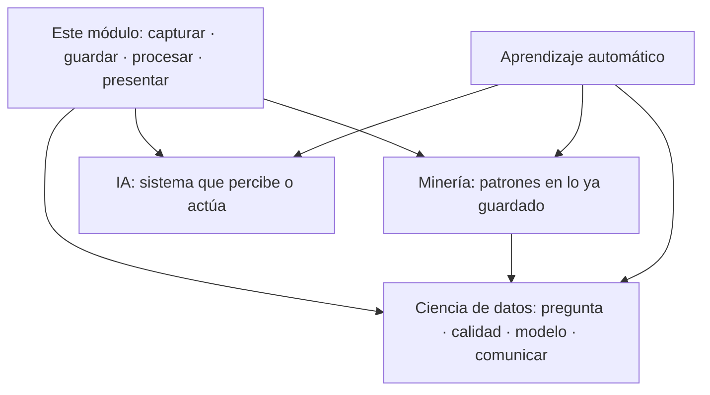

# 1.1. Por qué Big Data y las 5 Vs

En el [grupo hotelero](caso-hotel.md) esto se ve pronto: un servidor, el programa de reservas y un informe por la noche. Durante años basta. El disco no se llena, recepción pica sin esperar y las reservas tienen las mismas columnas.

Un día hay cuatro hoteles, sensores, logs de la web cada segundo y marketing quiere cruzar todo *ahora*. El servidor no “se pone un poco lento”: **deja de ser el diseño adecuado**. Ahí entran las metodologías de **macrodatos** / **Big Data**.

**Big Data no es “tener muchos Excel”.** Es un conjunto de métodos y tecnologías para capturar, almacenar, procesar y presentar datos que **un sistema de una sola máquina, al estilo clásico, no puede** tratar con garantías de tiempo, coste o variedad.

No hay una ley que diga “a partir de X terabytes ya es Big Data”. El criterio práctico es este: **el sistema tradicional no escala** en volumen, velocidad o variedad (o el coste de agrandar *esa* máquina es inasumible).

!!! tip "Pregunta que debéis saber responder"
    “¿Esto es un problema de Big Data?” no se contesta con el logo de una herramienta. Se contesta mirando si el diseño de siempre (un servidor, un esquema fijo, un lote nocturno) **sigue siendo viable**.

!!! info "Cómo se lee esta página"
    Tres bloques, **en este orden**: (1) el **viaje** del evento al valor; (2) los **oficios** que extraen ese valor (minería, ciencia de datos, IA) — van **antes** de las V, no las sustituyen; (3) las **V** para pasar revista al hotel. Los relojes del [caso](caso-hotel.md): finanzas cierra a las **23:00**; de madrugada corre el job; a las **8** gerencia abre el panel de **ayer**. Eso no es tiempo real.

## Un PC no basta (y a veces sí)

No todo proyecto con datos es Big Data. El **día 1**, recepción de Laredo pica reservas en el programa del hotel (PMS: *Property Management System*) y finanzas saca el Excel del mes: eso es **Small Data**. Cabe en un PC. Las destrezas de este módulo (limpiar, unir, guardar con criterio) **también** sirven ahí.

A los seis meses hay cuatro hoteles, sensores cada 30 s, logs de la web y fotos de reformas. Un servidor **ya no es el diseño**. Ahí sí hablamos de Big Data: hay que **repartir** el trabajo.

Se dice a menudo que los datos son el petróleo. La analogía se queda corta: el crudo sin refinar no mueve el coche. Guardar por guardar, en la década de 2020, **no** basta. Hay que **conocer** el dato y **cuidarlo** (calidad, linaje, permiso). Si no, gerencia decide con un número bonito y falso.

## De los eventos al valor

Antes de hablar de clústeres, Parquet o Pentaho, hay que ver **el viaje del dato**. Es el mismo viaje que luego recorreréis en las [capas de la arquitectura](arquitectura.md).

Pensad en el grupo en agosto (Laredo ayuda a imaginar temporada alta):

1. **Evento.** Ocurre algo en el mundo: un huésped reserva, un sensor de ocupación cambia, alguien paga con tarjeta.
2. **Dato.** Ese hecho queda registrado: una fila, un JSON, una foto del DNI, una línea de log. Todavía no “significa” nada por sí solo; solo está guardado.
3. **Información.** Organizáis esos datos: reservas del día en una tabla, fotos en carpetas por fecha. Ya podéis *consultar* (“¿cuántas llegadas hay mañana?”).
4. **Conocimiento.** Encajáis patrones: “los que reservan el viernes por la tarde cancelan más”. Eso ya no es una fila: es una regla o un modelo.
5. **Sabiduría.** Sabéis *cuándo* aplicar esa regla. El modelo de cancelaciones de Laredo en agosto **no** se copia ciego a Potes en noviembre.
6. **Valor.** Tomáis una decisión que **mejora** el resultado: overbooking más fino, menos habitaciones vacías, una oferta a tiempo. La diferencia entre actuar con esos datos y actuar a ciegas **es el valor**.

| Escalón | Qué es | Ejemplo del hotel |
| --- | --- | --- |
| **Evento** | Algo ocurre | Se confirma una reserva |
| **Dato** | Queda registrado | JSON de la reserva en el canal |
| **Información** | Datos organizados | Tabla “reservas_2026” |
| **Conocimiento** | Regla o modelo | Patrón de cancelación |
| **Sabiduría** | Usarlo en su contexto | Solo en temporada alta |
| **Valor** | Mejor decisión | Menos habitaciones vacías |

Las tecnologías de Big Data **capturan, integran, almacenan y procesan**. Extraer valor lo hacen tres oficios que se pisan y **no** son lo mismo: **minería de datos**, **ciencia de datos** e **inteligencia artificial** (IA). Las tres **beben** de la infraestructura de este módulo; ninguna **es** Big Data. Quién *construye* esa infraestructura (el ingeniero) está al final de la página.

### Tres oficios sobre el mismo dato (y no son sinónimos)

Un viernes en Laredo tenéis el JSON de reservas, los logs de la web y el sensor del parking. Tres personas miran **el mismo** sitio donde está el bruto (el **lago**; el detalle en [1.3](almacenamiento.md)) y hacen **trabajos distintos**:

| Oficio | Pregunta que se hace | Qué entrega | Ejemplo del hotel |
| --- | --- | --- | --- |
| **Minería de datos** | «¿Qué patrones *ya están* en lo guardado?» | Reglas, grupos, anomalías | «Quien reserva el viernes por la web y pide parking **cancela más**.» |
| **Ciencia de datos** | «¿Qué hay que preguntar, con qué dato *limpio*, y cómo se lo cuento a quien decide?» | Pregunta bien hecha, análisis, modelo **y** un relato que gerencia entiende | «¿Por qué los martes de noviembre estamos vacíos?» Separa canal web y OTA (agencias tipo Booking), elige el indicador, enseña un gráfico y **no** copia el modelo de playa a Potes. |
| **IA** | «¿Qué *sistema* percibe, decide o genera *sin* que un humano mire cada fila?» | Un producto que **actúa** (o responde) | Al confirmar la reserva, un modelo puntúa el riesgo de cancelación y el canal ofrece tarifa flexible; un *chatbot* responde «¿queda habitación al mar?»; una cámara cuenta coches del parking. |

La minería **descubre**. La ciencia de datos **encuadra, limpia, modela y explica**. La IA **pone un sistema a hacer** una tarea que parece inteligente (percibir, clasificar, dialogar, recomendar). Podéis minar un Excel de 50 MB; podéis hacer ciencia de datos con una encuesta de 200 filas; podéis tener IA con reglas (un motor de ajedrez clásico) **sin** un lago. El clúster ayuda cuando las V de más abajo duelen; **no** define el oficio.

#### En qué se parecen

- Las tres buscan **valor**: una decisión mejor que ir a ciegas.
- Las tres se hunden si falla la **veracidad** (sensores descalibrados, el mismo huésped con tres NIF).
- Las tres pueden vivir **sin** un clúster si el conjunto cabe en una máquina.
- Ninguna sustituye a capturar, guardar y procesar: sin dato usable, el algoritmo más brillante puntúa basura.

#### En qué se distinguen

**Minería de datos** (*data mining*) viene del descubrimiento de conocimiento en bases de datos (a menudo veréis **KDD**: *Knowledge Discovery in Databases*). Caja de técnicas: asociación (“esto se reserva con aquello”), agrupación (tipos de huésped), clasificación, detección de rarezas. El centro de gravedad es el **algoritmo sobre una tabla ya bastante lista**. No obliga a un cuadro de mando ni a un *chatbot*.

**Ciencia de datos** (*data science*) es un oficio **más ancho**. Incluye formular la pregunta de negocio, decidir qué dato hace falta, **cuidar la calidad**, explorar, modelar (estadística clásica o aprendizaje automático) y **comunicar** el resultado a quien no va a leer un cuaderno de código. La minería es **una** herramienta de esa caja, no el nombre nuevo de la caja. Por eso es falso el atajo «ciencia de datos = minería pero cuando hay Big Data».

**Inteligencia artificial** es el campo de los sistemas que se comportan de forma inteligente en una tarea. Dentro hay muchas familias: búsqueda, sistemas expertos con reglas, robótica, visión, lenguaje… El **aprendizaje automático** (*machine learning*, **ML**: el programa **mejora con ejemplos** en vez de llevar todas las reglas escritas a mano) es hoy el camino más habitual hacia un producto de IA. Un árbol de decisión puede ser “minería” si lo usáis para *entender* una regla, o “ML / IA” si lo **desplegáis** para puntuar cada reserva nueva. No discutáis la etiqueta: mirad **para qué** sirve el artefacto.

!!! failure "Tres frases que estropean el mapa"
    - «La IA contiene a la ciencia de datos, que contiene a la minería» (no es una matrioska).
    - «Ciencia de datos = minería + Hadoop» (se puede hacer ciencia de datos con 200 filas; el logo del clúster no bautiza el oficio).
    - «IA = el *chatbot*» (visión, reglas, un puntuador de cancelaciones… también son IA).

Solapes, no escalera. La infraestructura de este módulo **alimenta** a los tres; no es un peldaño que “se convierte” en IA:

- El **ML** es el puente frecuente: la minería lo usa para descubrir; la ciencia de datos, para un modelo que se explica; la IA, para un servicio en producción.
- La **IA** no es solo un modelo: es el sistema (datos de entrada, modelo, umbral, acción, supervisión). Un *chatbot* sin el JSON de habitaciones al día **alucina** huecos.
- La **ciencia de datos** puede terminar en un informe **sin** desplegar IA. Gerencia a veces solo necesita el gráfico del martes vacío.

#### De un estudio al panel (en el hotel)

No hay una receta única. Un trabajo de ciencia de datos casi siempre recorre este bucle. El **ingeniero** de este módulo alimenta sobre todo la recuperación y la preparación; si fallan, el modelo puntúa basura.

1. **Objetivo.** Gerencia quiere menos habitaciones vacías los martes.
2. **Recuperación.** PMS, pasarela, sensores, un Excel de Comillas. Sale **bruto**.
3. **Preparación.** Unificáis `web` y `WEB`, quitáis canceladas, cruzáis reserva con cobro (eso, en [1.6](ingesta.md), es la T de un ETL: extraer, transformar, cargar).
4. **Exploración.** El viernes por la web cancela más.
5. **Modelado.** Estima el riesgo de que no se presente (*no-show*) o el cupo.
6. **Presentación y vuelta.** El gráfico o el panel de las 8. Si no cuadra, **volvéis al paso 2**.

En el [curso de especialización](../index.md) otros módulos os pondrán a modelar. **Aquí** diseñáis el almacén, la ingesta, el formato y la presentación. Si el lago está sucio o no se puede leer a tiempo, da igual el nombre del algoritmo: no hay valor.

!!! tip "Frase para el examen y para el pasillo"
    Big Data **prepara** el dato. La minería **busca patrones**. La ciencia de datos **hace la pregunta y cuenta el resultado**. La IA **encarna** una tarea en un sistema. Se solapan; no se sustituyen.

## Las V: un diagnóstico, no una lista para recitar

Al principio se usaban **tres V**: **volumen**, **velocidad** y **variedad**. Luego **valor** y **veracidad** (cinco). En algunos textos, **viabilidad** y **visualización** (siete). No memoricéis el recuento: **pasad revista** al hotel. Si varias duelen a la vez, casi seguro necesitáis un diseño de Big Data. Si solo os duele una y el resto cabe en el sistema de siempre, a lo mejor no.

### Volumen

Es la cantidad de **bytes**. Hoy se habla con naturalidad de terabytes y petabytes; los centros grandes llegan a exabytes.

| Nombre (SI) | Símbolo | Bytes (aprox.) | Para situaros |
| --- | --- | --- | --- |
| Kilobyte | kB | 10³ | Una página de texto |
| Megabyte | MB | 10⁶ | Una foto no enorme |
| Gigabyte | GB | 10⁹ | Una película comprimida |
| Terabyte | TB | 10¹² | Un disco de sobremesa |
| Petabyte | PB | 10¹⁵ | Muchos racks o un lago serio |
| Exabyte | EB | 10¹⁸ | Escala de un operador o un ministerio |
| Zettabyte | ZB | 10²¹ | Orden de magnitud de “todo internet” |

En informática también existen KiB, MiB, GiB (potencias de 2: 1 KiB = 1024 bytes). El fabricante anuncia 1 TB como **1000 GB** (base 10). El explorador suele mostrar **cerca de 931 GB** porque cuenta GiB y a veces los llama “GB”. El disco no está roto: **cuentan distinto**.

En el hotel el volumen sale de reservas, logs de la web, sensores, fotos de habitación y del DNI. Fuera veréis lo mismo a otra escala: redes, genómica, satélites.

!!! example "Un cálculo para notar la escala"
    Si guardáis **4 bytes al día** (un número: el peso) por cada persona del planeta (~8·10⁹) durante un año:

    `4 × 8×10⁹ × 365 ≈ 12 TB`

    Eso es **un** atributo, sin fotos ni historial. Multiplica por imágenes de habitación o por años de logs y ves por qué “un disco más grande en el mismo PC” deja de ser el plan.

**Qué implica en el diseño:** si el dato ya no cabe (o no se lee a tiempo) en **una** máquina, hay que **repartir** (clúster, lago, formatos que se puedan trocear). Eso es el criterio **a)** empezando a trabajar.

### Velocidad

No basta con que quepa: los datos **siguen llegando**. El reto es capturarlos, integrarlos y, si el negocio lo pide, reaccionar **antes de que dejen de servir**.

En el hotel:

- La web de reservas escribe un log por cada clic.
- Los sensores publican cada ~30 s (el semáforo de recepción no puede esperar al lote de las 23:00).
- Finanzas cierra a las 23:00; el panel de las 8 es el lote de **ayer**.

Dimensionar el disco **no** arregla un atasco de ingesta. Si el embudo es más ancho pero el cuello sigue igual, el agua se derrama. De ahí el flujo continuo y las [colas](ingesta.md) (desacoplan “quien produce” de “quien consume”).

!!! example "Mismo volumen, distinta V"
    10 TB de cobros históricos que cargas **una vez** al mes → duele sobre todo el **volumen**.  
    10 TB al día en eventos de sensores que hay que cruzar con el PMS **ahora** → duele la **velocidad** (y luego el volumen).

### Variedad

No todos los datos se parecen a una hoja de cálculo. En el mismo hotel conviven tres familias:

| Tipo | Qué es | Cómo lo reconoces | En el hotel |
| --- | --- | --- | --- |
| **Estructurado** | Esquema fijo (filas y columnas) | Todas las filas tienen las mismas columnas | Tabla SQL de reservas del PMS |
| **Semiestructurado** | Hay marcas o claves; el esquema puede variar | Un registro trae un campo que otro no tiene | JSON del canal web, logs |
| **No estructurado** | No hay columnas fijas de entrada | No lo filtras como una tabla | Foto del DNI, PDF de incidencia, vídeo del hall |

Un **data warehouse** (almacén de informes) espera dato ya en tablas: decidís las columnas **antes** de guardar. Un **data lake** (lago) acepta el dato “como llega” y decide cómo interpretarlo **al leer**. Un **data mart** es un **recorte** de ese almacén (finanzas, marketing, solo Laredo), no otro lago. El detalle está en [1.3](almacenamiento.md).

La variedad es la V que más sorprende al que solo ha visto SQL: el problema no es solo “que quepa”, es que **no todo es tabla**.

### Veracidad

¿Os podéis fiar de lo que hay? Duplicados, sensores descalibrados, campos vacíos, relojes mal puestos, el mismo huésped con tres NIF.

A más volumen, más basura **si no hay calidad y gobierno**: linaje (“de dónde salió esta cifra”), metadatos y reglas de limpieza. Un modelo sobre datos sucios no es “más Big Data”: es una **peor** decisión, más rápida.

!!! failure "La trampa de la veracidad"
    “Como hay muchos datos, el error se compensa.” A veces el error está **sesgado** (todos los sensores de Potes fallan igual en invierno) y el modelo lo aprende como si fuera verdad.

### Valor

Es la V que **justifica el gasto**. Almacenar por almacenar no es Big Data: es un archivo caro. El valor aparece cuando una decisión (cupo, tarifa, overbooking, una oferta a tiempo) **mejora** respecto a no usar esos datos.

Si no sabéis qué decisión vais a mejorar, todavía no tenéis un proyecto: tenéis un disco.

### Viabilidad y visualización (cuando se habla de 7)

No entran en el recuento clásico. Sirven para no diseñar un sistema que **nadie puede usar**.

| V extra | Pregunta | En el hotel |
| --- | --- | --- |
| **Viabilidad** | ¿La empresa puede **usar** de verdad esos datos? ¿Cuántos hacen falta para la predicción que importa? | Poner sensores en Potes y no tener a nadie que limpie el JSON **no** es viable. |
| **Visualización** | ¿Gerencia **ve** el número a tiempo, en un gráfico o un indicador? | El panel de las 8. Un lago de 8 TB sin cuadro de mando no decide nada. |

La visualización no es “hacerlo bonito”. En [1.8](pentaho.md) y en el criterio **e)** del RA1 es presentar para que alguien que no abre el cuaderno pueda decidir.

## Qué pregunta hacéis (cuatro analíticas)

La **inteligencia de negocio** (*business intelligence*, **BI**) coge lo ya guardado y responde sobre el **pasado**: qué ocurrió y por qué. Con más dato y, a veces, IA, podéis mirar **adelante**: qué pasará y qué conviene hacer.

| Analítica | Pregunta | En el hotel | Suele vivir en |
| --- | --- | --- | --- |
| **Descriptiva** | ¿Qué pasó? | Ocupación de agosto en Laredo | BI, panel, SQL |
| **Diagnóstica** | ¿Por qué pasó? | Los martes de noviembre, vacíos | BI + exploración |
| **Predictiva** | ¿Qué pasará? | Cancelaciones del viernes | Ciencia de datos / IA |
| **Prescriptiva** | ¿Qué hacemos? | Overbooking y tarifa flexible | Una regla de negocio; a veces IA |

El BI **no** desaparece cuando llega el lago. Gerencia sigue necesitando el “qué pasó”. Big Data **no** es un sinónimo de predicción: a veces el valor es un informe de ayer que llega **a las 8**, no un modelo.

## Quién hace qué (un solo mapa)

Los tres oficios de arriba **beben** del dato. Este módulo forma sobre todo a quien **deja ese dato usable**: el **ingeniero**.

| Rol | Encargo | En el hotel |
| --- | --- | --- |
| **Analista de datos** | Convierte dato en información (SQL, gráficos). Conoce el negocio. | El informe de ocupación por canal. |
| **Científico de datos** | Pregunta, calidad, modelo (a menudo IA) y el relato a gerencia. | El riesgo de cancelación; no copia playa a Potes. |
| **Ingeniero de datos** | Extraer, transformar, cargar y guardar (ETL). **Aquí.** | El job de madrugada, **antes de las 8**. |
| **Arquitecto de datos** | Estrategia: qué crece, quién accede, linaje, seguridad. | Si mañana abre otro hotel, el diseño **aguanta**. |

El arquitecto **elige** el plano. El ingeniero **construye** las tuberías. El científico **pregunta** con el dato ya usable. El analista **cuenta a las 8** lo que gerencia puede leer. Minería e IA no son “otros nombres del ingeniero”: usan lo que el ingeniero deja listo.

El ciclo generación → ingesta → transformación → entrega → consumo está en [1.5](arquitectura.md).

## Fuera de este apartado (y no lo copies aquí)

OLTP frente a OLAP (operar en recepción / informar a gerencia) se desarrolla en [1.4](procesamiento.md). Dónde guardar (relacional, NoSQL, almacén de informes, lago) está en [1.3](almacenamiento.md). El paisaje de herramientas y Lambda/Kappa, en [1.5](arquitectura.md). La ingesta, en [1.6](ingesta.md).

## El mismo oficio, otros sitios

El hotel es el hilo. El oficio se parece fuera:

- **Industria:** sensores que no pueden perder lecturas (como los de habitación).
- **Vídeo bajo demanda:** cada clic y cada pausa, para recomendar (como el canal web del hotel).
- **Mapas:** tráfico de muchos conductores a la vez (velocidad + volumen).
- **Redes sociales:** texto libre, sentimiento, publicidad (variedad + veracidad dudosa).

Si podéis decir *qué V duele* en cada uno, el 1.1 está asimilado.

## Qué conseguimos (si el diseño es bueno)

Cuando el diseño responde a las V que duelen, podéis:

- Integrar fuentes que antes vivían en silos (PMS, web, sensores).
- Replicar y distribuir para **no parar** si cae un nodo.
- Procesar en paralelo lo que una máquina no termina a tiempo.
- Alimentar minería / IA y **cuadros de mando** para quien decide (más adelante, criterio **e)**).

!!! failure "Errores frecuentes en clase y en empresas"
    - “Tenemos Big Data porque usamos Hadoop.” La herramienta no define el problema.
    - “Todo tiene que ser en tiempo real.” El panel de las 8 es un lote; el [SCV](procesamiento.md#scv) os dirá por qué no pedís las tres cosas a la vez.
    - Confundir los GB de marketing del disco con lo que el explorador muestra (base 10 frente a GiB).
    - Medir el éxito en terabytes guardados, no en decisiones mejoradas.

## Para el criterio a)

Antes de elegir Mongo, Parquet o Pentaho, hay que **caracterizar** el problema:

1. ¿Qué Vs duelen de verdad (y cuáles no)?
2. ¿El dato es de operación (caja, reserva) o de análisis (informe, modelo)?
3. ¿Hace falta guardar el histórico en bruto por si cambia la pregunta?

Eso es diseñar la solución de almacenamiento. Instalar software viene **después**.

## Actividades

No puntúan en Moodle. Sirven para comprobar si podéis **caracterizar** (criterio **a)**) sin recitar la lista.

1. **¿Qué V duele?** Para cada frase, elige la V principal y justifica en una línea.
    1. Los sensores de Potes publican cada 30 s y el semáforo de recepción no puede esperar al lote de las 23:00.
    2. El mismo huésped aparece como `García`, `GARCIA` y `Garcìa` en tres canales.
    3. Dirección pide guardar *todo* “por si acaso”, pero no sabe qué decisión va a mejorar.
2. **Cuatro preguntas.** Clasifica cada una en descriptiva, diagnóstica, predictiva o prescriptiva.
    1. «¿Cuántas noches cobramos en Laredo en agosto?»
    2. «¿Por qué Comillas se vacía los martes de noviembre?»
    3. «¿Cuántos no-show habrá el viernes en Santander?»
    4. «¿Subimos el overbooking un 4 % o mandamos tarifa flexible?»
3. **Un rol.** El panel de las 8 llega a las 11 y las cifras no cuadran con recepción. ¿Lo arregla sobre todo el analista, el científico o el ingeniero? ¿Por qué?

!!! tip "Comprobación rápida"
    Si en (1) habéis puesto velocidad / veracidad / valor, en (2) descriptiva → prescriptiva en ese orden, y en (3) ingeniero (ingesta y calidad **antes** del gráfico), el apartado está asimilado.

## Autoevaluación del 1.1

Quince preguntas (A–D, **una** correcta) sobre lo esencial del apartado. No puntúan en Moodle. En **cada** una, **Comprobar respuesta**: si es correcta o no, y una explicación breve. Podéis repetir el test.

