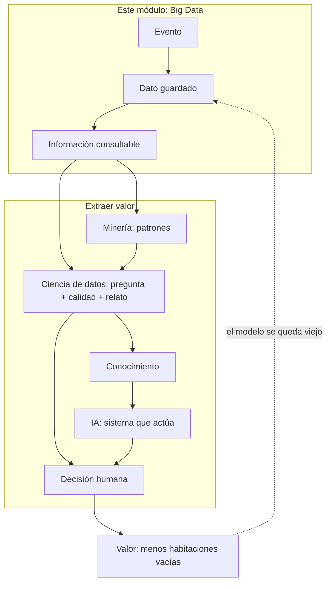
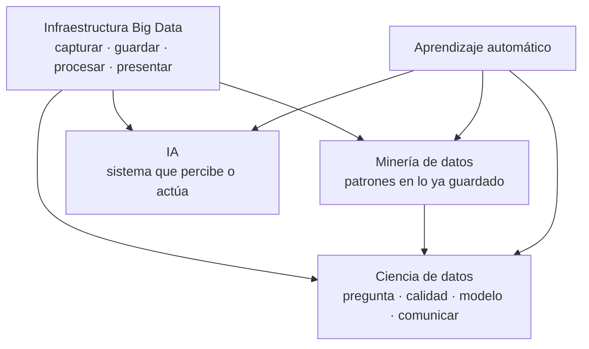

# 1.1. Por qué Big Data y las 5 Vs

Imagina una empresa que empezó con un servidor, una base de datos relacional y un proceso que, cada noche, genera un informe. Durante años eso basta: el disco no se llena, las ventas se pican en caja sin esperar y todas las facturas tienen las mismas columnas.

Un día el volumen de clientes se multiplica, aparecen sensores, la web deja logs cada segundo y marketing quiere cruzar todo eso *ahora*. El servidor no “se pone un poco lento”: **deja de ser el diseño adecuado**. Ahí entran las metodologías de **macrodatos** / **Big Data**.

**Big Data no es “tener muchos Excel”.** Es un conjunto de métodos y tecnologías para capturar, almacenar, procesar y presentar datos que **un sistema de una sola máquina, al estilo clásico, no puede** tratar con garantías de tiempo, coste o variedad.

No hay una ley que diga “a partir de X terabytes ya es Big Data”. El criterio práctico es este: **el sistema tradicional no escala** en volumen, velocidad o variedad (o el coste de agrandar *esa* máquina es inasumible).

!!! tip "Pregunta que debes saber responder"
    “¿Esto es un problema de Big Data?” no se contesta con el logo de una herramienta. Se contesta mirando si el diseño de siempre (un servidor, un esquema fijo, un lote nocturno) **sigue siendo viable**.

## De los eventos al valor

Antes de hablar de Hadoop, Parquet o Pentaho, hay que ver **el viaje del dato**. Es el mismo viaje que luego recorrerás en las [capas de la arquitectura](arquitectura.md).

Piensa en el [grupo hotelero de Cantabria](caso-hotel.md) en agosto (empieza por Laredo si te ayuda a imaginar temporada alta):

1. **Evento.** Ocurre algo en el mundo: un huésped reserva, un sensor de ocupación cambia, alguien paga con tarjeta.
2. **Dato.** Ese hecho queda registrado: una fila, un JSON, una foto del DNI, una línea de log. Todavía no “significa” nada por sí solo; solo está guardado.
3. **Información.** Organizas esos datos: reservas del día en una tabla, fotos en carpetas por fecha. Ya puedes *consultar* (“¿cuántas llegadas hay mañana?”).
4. **Conocimiento.** Encajas patrones: “los que reservan el viernes por la tarde cancelan más”. Eso ya no es una fila: es una regla o un modelo.
5. **Sabiduría.** Sabes *cuándo* aplicar esa regla. El modelo de cancelaciones del hotel de playa **no** se copia ciego a un albergue de invierno.
6. **Valor.** Tomas una decisión que **mejora** el resultado: overbooking más fino, menos habitaciones vacías, una oferta a tiempo. La diferencia entre actuar con esos datos y actuar a ciegas **es el valor**.

| Escalón | Qué es | Ejemplo del hotel |
| --- | --- | --- |
| **Evento** | Algo ocurre | Se confirma una reserva |
| **Dato** | Queda registrado | JSON de la reserva en el canal |
| **Información** | Datos organizados | Tabla “reservas_2026” |
| **Conocimiento** | Regla o modelo | Patrón de cancelación |
| **Sabiduría** | Usarlo en su contexto | Solo en temporada alta |
| **Valor** | Mejor decisión | Menos habitaciones vacías |

Las tecnologías de Big Data **capturan, integran, almacenan y procesan**. Extraer valor (modelos, predicciones, diagnósticos, un sistema que actúa) lo hacen tres oficios que se pisan y **no** son lo mismo: **minería de datos**, **ciencia de datos** e **inteligencia artificial** (IA). Las tres **beben** de la infraestructura de este módulo; ninguna **es** Big Data.

### Tres oficios sobre el mismo dato (y no son sinónimos)

Un viernes en Laredo tenéis el JSON de reservas, los logs de la web y el sensor del parking. Tres personas miran **el mismo** lago y hacen **trabajos distintos**:

| Oficio | Pregunta que se hace | Qué entrega | Ejemplo del hotel |
| --- | --- | --- | --- |
| **Minería de datos** | «¿Qué patrones *ya están* en lo guardado?» | Reglas, grupos, anomalías | «Quien reserva el viernes por la web y pide parking **cancela más**.» |
| **Ciencia de datos** | «¿Qué hay que preguntar, con qué dato *limpio*, y cómo se lo cuento a quien decide?» | Pregunta bien hecha, análisis, modelo **y** un relato que gerencia entiende | «¿Por qué los martes de noviembre estamos vacíos?» Limpia canal web frente a OTA, elige el KPI, enseña un gráfico y **no** copia el modelo de playa a Potes. |
| **IA** | «¿Qué *sistema* percibe, decide o genera *sin* que un humano mire cada fila?» | Un producto que **actúa** (o responde) | Al confirmar la reserva, un modelo puntúa el riesgo de cancelación y el canal ofrece tarifa flexible; un *chatbot* responde «¿queda habitación al mar?»; una cámara cuenta coches del parking. |

La minería **descubre**. La ciencia de datos **encuadra, limpia, modela y explica**. La IA **pone un sistema a hacer** una tarea que parece inteligente (percibir, clasificar, dialogar, recomendar). Podéis minar un Excel de 50 MB; podéis hacer ciencia de datos con una encuesta de 200 filas; podéis tener IA con reglas (un motor de ajedrez clásico) **sin** un lago. El clúster ayuda cuando las 5 V de más abajo duelen; **no** define el oficio.

#### En qué se parecen

- Las tres buscan **valor**: una decisión mejor que ir a ciegas.
- Las tres se hunden si falla la **veracidad** (sensores descalibrados, el mismo huésped con tres NIF).
- Las tres pueden vivir **sin** Hadoop si el conjunto cabe en una máquina.
- Ninguna sustituye a capturar, guardar y procesar: sin dato usable, el algoritmo más brillante puntúa basura.

#### En qué se distinguen

**Minería de datos** (*data mining*) viene del descubrimiento de conocimiento en bases de datos (a menudo veréis la sigla **KDD**, *Knowledge Discovery in Databases*). Caja de técnicas: asociación (“esto se compra con aquello”), agrupación (*clustering*: tipos de huésped), clasificación, detección de rarezas. El centro de gravedad es el **algoritmo sobre una tabla ya bastante lista**. No obliga a un *dashboard* ni a un *chatbot*.

**Ciencia de datos** (*data science*) es un oficio **más ancho**. Incluye formular la pregunta de negocio, decidir qué dato hace falta, **cuidar la calidad**, explorar, modelar (estadística clásica o aprendizaje automático) y **comunicar** el resultado a quien no va a leer un *notebook*. La minería es **una** herramienta de esa caja, no el nombre nuevo de la caja. Por eso es falso el atajo «ciencia de datos = minería pero cuando hay Big Data».

**Inteligencia artificial** es el campo de los sistemas que se comportan de forma inteligente en una tarea. Dentro hay muchas familias: búsqueda, sistemas expertos con reglas, robótica, visión, lenguaje… El **aprendizaje automático** (*machine learning*, **ML**: el programa **mejora con ejemplos** en vez de llevar todas las reglas escritas a mano) es hoy el camino más habitual hacia un producto de IA. Un árbol de decisión puede ser “minería” si lo usáis para *entender* una regla, o “ML / IA” si lo **desplegáis** para puntuar cada reserva nueva. No discutáis la etiqueta: mirad **para qué** sirve el artefacto.

!!! failure "Tres frases que estropean el mapa"
    - «La IA contiene a la ciencia de datos, que contiene a la minería» (no es una matrioska).
    - «Ciencia de datos = minería + Hadoop» (se puede hacer ciencia de datos con 200 filas; Hadoop no bautiza el oficio).
    - «IA = el *chatbot*» (visión, reglas, un puntuador de cancelaciones… también son IA).

Mejor pensad en **solapes** y en una **dependencia** de la infraestructura:

- El **ML** es el puente frecuente: la minería lo usa para descubrir; la ciencia de datos, para un modelo que se explica; la IA, para un servicio en producción.
- La **IA** no es solo un modelo: es el sistema (datos de entrada, modelo, umbral, acción, supervisión). Un *chatbot* sin el JSON de habitaciones al día **alucina** huecos.
- La **ciencia de datos** puede terminar en un informe **sin** desplegar IA. Gerencia a veces solo necesita el gráfico del martes vacío.

#### De qué dependen (y de qué depende este módulo)

| Esta pieza… | …necesita | …y alimenta |
| --- | --- | --- |
| Minería / ciencia de datos / IA | Dato **accesible y gobernado** (el viaje evento → información) | Conocimiento, modelos, productos |
| Un modelo en producción | **Reentrenar** cuando el verano no se parece al invierno | Otra vuelta de ingesta y calidad |
| Este módulo **BDA** | Un problema con Vs que duelen | El **combustible** de los tres oficios |

En el [curso de especialización](../index.md) otros módulos os pondrán a modelar y a evaluar. **Aquí** diseñáis el almacén, la ingesta, el formato y la presentación. Si el lago está sucio o no se puede leer a tiempo, da igual el nombre del algoritmo: no hay valor.

!!! tip "Frase para el examen y para el pasillo"
    Big Data **prepara** el dato. La minería **busca patrones**. La ciencia de datos **hace la pregunta y cuenta el resultado**. La IA **encarna** una tarea en un sistema. Se solapan; no se sustituyen.

## Las 5 Vs: un diagnóstico, no una lista para recitar

Las cinco V sirven para **pasar revista** a un problema. Si varias fallan a la vez, casi seguro necesitas un diseño de Big Data. Si solo te duele una y el resto cabe en el sistema de siempre, a lo mejor no.

### Volumen

Es la cantidad de **bytes**. Hoy se habla con naturalidad de terabytes y petabytes; los centros grandes llegan a exabytes.

| Nombre (SI) | Símbolo | Bytes (aprox.) | Para situarte |
| --- | --- | --- | --- |
| Kilobyte | kB | 10³ | Una página de texto |
| Megabyte | MB | 10⁶ | Una foto no enorme |
| Gigabyte | GB | 10⁹ | Una película comprimida |
| Terabyte | TB | 10¹² | Un disco de sobremesa |
| Petabyte | PB | 10¹⁵ | Muchos racks o un lago serio |
| Exabyte | EB | 10¹⁸ | Escala de un operador o un ministerio |
| Zettabyte | ZB | 10²¹ | Orden de magnitud de “todo internet” |

En informática también existen KiB, MiB, GiB (potencias de 2: 1 KiB = 1024 bytes). El fabricante del disco suele anunciar GB en **base 10**; el sistema operativo a menudo muestra GiB. Por eso “el disco de 1 TB no llega a 1000 GB en el explorador”: no está roto, **cuentan distinto**.

El volumen no nace solo de “la base de clientes”. Sale de transacciones, logs, redes sociales, sensores e IoT, historiales clínicos, genómica, satélites, Open Data, cámaras, RFID, industria.

!!! example "Un cálculo para notar la escala"
    Si guardas **4 bytes al día** (un número: el peso) por cada persona del planeta (~8·10⁹) durante un año:

    `4 × 8×10⁹ × 365 ≈ 12 TB`

    Eso es **un** atributo, sin fotos ni historial. Multiplica por imágenes, vídeo o genomas y ves por qué “un disco más grande en el mismo PC” deja de ser el plan.

**Qué implica en el diseño:** si el dato ya no cabe (o no se lee a tiempo) en **una** máquina, tienes que **repartir** (clúster, lake, formatos que se puedan trocear). Eso es el criterio **a)** empezando a trabajar.

### Velocidad

No basta con que quepa: los datos **siguen llegando**. El reto es capturarlos, integrarlos con lo que ya tienes y, si el negocio lo pide, reaccionar **antes de que dejen de servir**.

Ejemplos de ritmo (órdenes de magnitud, para hacerse una idea, no para memorizar):

- Publicaciones y vídeos subiendo sin parar.
- Motores y sensores industriales generando decenas o cientos de GB.
- Una web de reservas escribiendo un log por cada clic.

Dimensionar el disco **no** arregla un atasco de ingesta. Si llenas un embudo más ancho pero el cuello sigue igual de estrecho, el agua se derrama. De ahí el procesamiento **en streaming** y las colas (Kafka y similares): desacoplan “quien produce” de “quien consume”.

!!! example "Mismo volumen, distinta V"
    10 TB de facturas históricas que cargas **una vez** al mes → duele sobre todo el **volumen**.  
    10 TB al día en eventos de sensores que hay que cruzar con el stock **ahora** → duele la **velocidad** (y luego el volumen).

### Variedad

No todos los datos se parecen a una hoja de cálculo. En el mismo proyecto conviven tres familias:

| Tipo | Qué es | Cómo lo reconoces | Ejemplo |
| --- | --- | --- | --- |
| **Estructurado** | Esquema fijo (filas y columnas) | Todas las filas tienen las mismas columnas | Tabla SQL de facturas |
| **Semiestructurado** | Hay marcas o claves; el esquema puede variar | Un registro trae un campo que otro no tiene | JSON, XML, logs |
| **No estructurado** | No hay columnas fijas de entrada | No lo filtras como una tabla | PDF, foto, audio, vídeo, texto libre |

Un **data warehouse** (almacén de informes) espera dato ya en tablas: decides las columnas **antes** de guardar. Un **data lake** (lago) acepta el dato “como llega” y decide cómo interpretarlo **al leer**. El detalle está en [1.3](almacenamiento.md).

La variedad es la V que más sorprende al que solo ha visto SQL: el problema no es solo “que quepa”, es que **no todo es tabla**.

### Veracidad

¿Te puedes fiar de lo que hay? Duplicados, sensores descalibrados, encuestas sesgadas, bots, campos vacíos, relojes mal puestos, el mismo cliente con tres NIF.

A más volumen, más basura **si no hay calidad y gobierno**: linaje (“de dónde salió esta cifra”), metadatos y reglas de limpieza. Un modelo sobre datos sucios no es “más Big Data”: es una **peor** decisión, más rápida.

!!! failure "La trampa de la veracidad"
    “Como hay muchos datos, el error se compensa.” A veces el error está **sesgado** (todos los sensores del almacén Norte fallan igual) y el modelo lo aprende como si fuera verdad.

### Valor

Es la V que **justifica el gasto**. Almacenar por almacenar no es Big Data: es un archivo caro. El valor aparece cuando una decisión (precio, ruta, alerta, diagnóstico, cupo del hotel) **mejora** respecto a no usar esos datos.

Si no sabes qué decisión vas a mejorar, todavía no tienes un proyecto: tienes un disco.

## Qué conseguimos (si el diseño es bueno)

Cuando el diseño responde a las V que duelen, puedes:

- Integrar fuentes que antes vivían en silos (caja, web, sensores).
- Replicar y distribuir para **no parar** si cae un nodo.
- Procesar en paralelo lo que una máquina no termina a tiempo.
- Alimentar minería / IA y **cuadros de mando** para quien decide (criterio **e)** del RA1).

!!! failure "Errores frecuentes en clase y en empresas"
    - “Tenemos Big Data porque usamos Hadoop.” La herramienta no define el problema.
    - “Todo tiene que ser en tiempo real.” El [principio SCV](procesamiento.md) te dirá por qué no.
    - Confundir los **MB de marketing** del disco con lo que cabe de verdad en RAM.
    - Medir el éxito en terabytes guardados, no en decisiones mejoradas.

## Para el criterio a)

Antes de elegir Mongo, Parquet o Pentaho, debes **caracterizar** el problema:

1. ¿Qué Vs duelen de verdad (y cuáles no)?
2. ¿El dato es de operación (caja, reserva) o de análisis (informe, modelo)?
3. ¿Hace falta guardar el histórico en bruto por si cambia la pregunta?

Eso es diseñar la solución de almacenamiento. Instalar software viene **después**.
