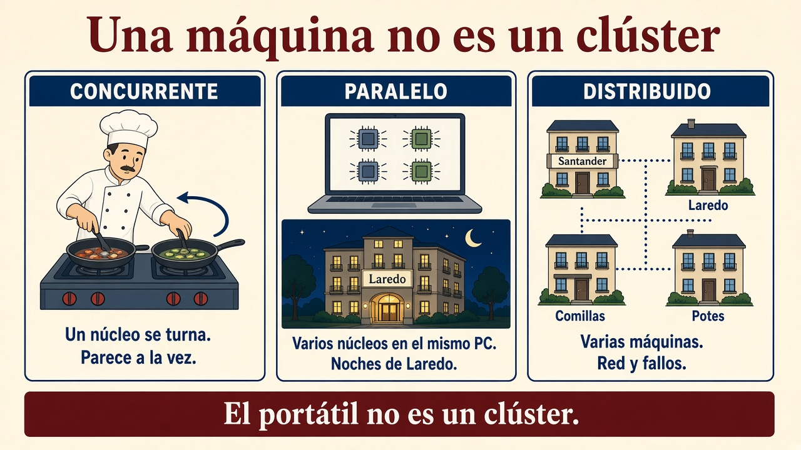
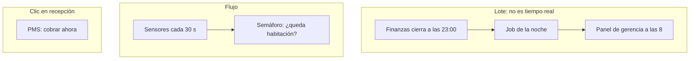
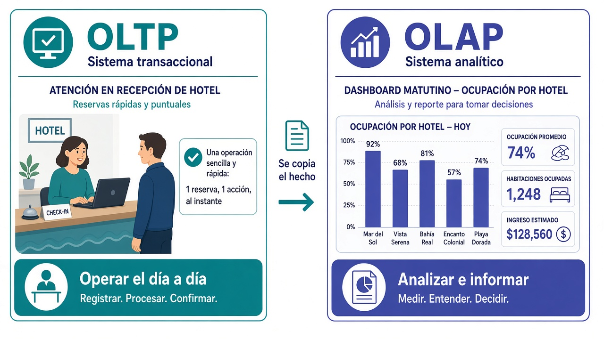
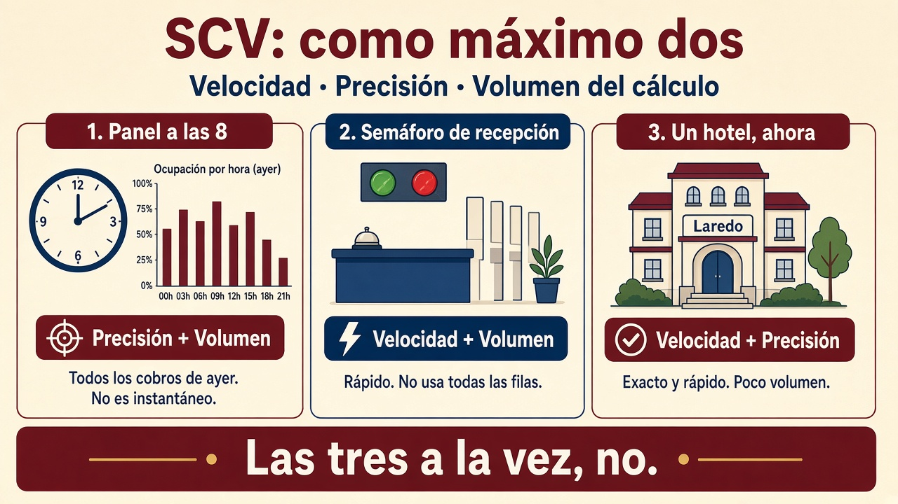

# 1.4. Procesamiento de datos

Almacenar no basta: el criterio **d)** pide **procesar** lo guardado. El **a)** también entra: hay que caracterizar *cómo* se parte el trabajo y *con qué prisa* tiene que salir el número. Un dato en el lago que nadie transforma no sirve a gerencia.

En el [grupo hotelero](caso-hotel.md) eso ya está partido en dos relojes:

- **Recepción** opera ahora (PMS, cobro). No puede esperar.
- **Finanzas** cierra a las **23:00**; de madrugada corre el **lote**; a las **8** gerencia abre el panel de **ayer**.
- Los sensores (~30 s) alimentan el **semáforo** (“¿queda habitación?”), no el cuadro de las 8.

En clase lo aplicáis en la [tarea de los 500 GB](tarea-clase.md): concurrente, paralelo y distribuido, con un portátil que **no** puede tragarse el fichero.

!!! info "Cómo se lee esta página"
    Primero **dónde** corre el cálculo (un núcleo, varios núcleos, varias máquinas). Luego el **ritmo** (lote, clic, consulta, flujo). Después los **dos oficios** (operar / informar) y el **SCV** (no podéis pedir las tres letras a un análisis). Cómo se combinan lote y flujo en el edificio va en [1.5](arquitectura.md), no aquí.

## Concurrente, paralelo y distribuido

Tres palabras que en el pasillo se usan como sinónimos. No lo son. Si las mezcláis, no sabréis si os basta el portátil o hace falta un [clúster](clusters.md).

| Tipo | Dónde corre | ¿A la vez de verdad? | En el hotel |
| --- | --- | --- | --- |
| **Concurrente** | Una o varias máquinas | **No necesariamente** | Un núcleo que se **turna**: el job y el antivirus |
| **Paralelo** | Varios **núcleos** de **una** máquina | Sí | Diez núcleos suman noches de **Laredo** |
| **Distribuido** | **Varias máquinas** en red | Sí, en general (más red y fallos) | Un nodo por hotel: Santander, Laredo, Comillas, Potes |

**Concurrente.** El sistema operativo **reparte el tiempo** entre programas. Si solo hay **un núcleo**, la “multitarea” es **simulada**: el procesador atiende un rato a cada uno (ventanas de milisegundos). Tenéis la *impresión* de que el vídeo, el editor y el antivirus van a la vez; en realidad se turnan tan rápido que no lo notáis.

**Paralelo (multinúcleo).** Varios núcleos físicos, cada uno una CPU de verdad. Ahí sí hay paralelismo real.

**Multihilo:** un núcleo *comparte* recursos entre hilos. Mientras un hilo espera un dato de memoria, el otro puede multiplicar. Si **los dos** necesitan la misma unidad a la vez, uno espera. Por eso un procesador “4 núcleos / 8 hilos” **no** es lo mismo que 8 núcleos físicos.

### Cuándo se puede paralelizar

**Sí (independiente):** sumar noches por hotel. Partís en cuatro trozos (Santander, Laredo, Comillas, Potes), cada núcleo (o cada nodo) suma el suyo, al final sumáis cuatro parciales. El último paso es barato.

**No (dependiente):** cada paso necesita el resultado del anterior (si el acumulado va *par* sumáis, si va *impar* restáis). Aunque cortéis la lista, el segundo trozo **no sabe** qué hacer hasta que acabe el primero. Más núcleos no acortan ese cuello: es lo que [1.2](clusters.md) llamaba “el clúster no hace magia”.

!!! tip "Pregunta para el examen"
    “Si solo hay un núcleo y el sistema cambia de programa cada X ms, ¿hace varias tareas al mismo tiempo?”  
    **No.** Es multitarea **simulada** (concurrente). El usuario lo percibe como simultáneo; el silicio no.

## Distribuido (entre máquinas)

El procesamiento **distribuido** reparte subtareas a **nodos de un clúster**. Es paralelo *más* tres problemas que en un solo PC no teníais:

- Los datos **no** están todos en la misma RAM.
- La **red** tarda y a veces falla.
- Un nodo puede caer **a mitad** del trabajo (si se funde el disco de Potes, el job tiene que **reintentar**, no publicar el panel a medias).

En Hadoop de libro la consigna es “**lleva el cálculo al dato**”: copiar 200 GB al portátil para sumarlos es absurdo; mandáis la función al nodo que **ya** tiene el trozo. En un [cubo de objetos](almacenamiento.md) a menudo es al revés: el dato vive en el cubo y el motor **lee por red** ([1.2](clusters.md)). Las dos frases no se pisan: son **dos diseños**.

MapReduce y Spark viven aquí. En este módulo no tenéis que programarlos aún; sí debéis saber *por qué* existen. El i7 de la [tarea](tarea-clase.md) **no** es un clúster.

## Estrategias: no todo es “tiempo real”

El **ritmo** del trabajo no es la [transacción ACID](almacenamiento.md) del cobro. ACID es la garantía (todo o nada). Aquí es **cuánto podéis esperar** el número.

| Estrategia | ¿Urge el resultado? | En el hotel |
| --- | --- | --- |
| **Por lotes** (*batch*) | No | Finanzas cierra a las 23:00; el job de madrugada; el **panel de las 8** (ayer) |
| **Por transacciones** | Sí (muy por debajo de 1 s) | Picar el cobro en el **PMS**. Es el reloj del clic, no “ACID” |
| **Interactivo** | Sí, mientras miráis | A las 11 filtráis Laredo en el almacén: “¿cómo vamos *hoy*?”. **No** es el panel de las 8 |
| **Flujo** (*streaming*) | Sí, **al ritmo** en que llegan | Sensores cada ~30 s → **semáforo** de recepción |

!!! tip "Trampa de vocabulario (muy examinable)"
    Un **cobro** ocurre en tiempo real (recepción no espera).  
    Un **análisis** en tiempo real **no** es lo mismo: no estáis confirmando un cobro, estáis **consultando o resumiendo**.  
    El panel de las 8 **no** es tiempo real: es el lote de **ayer**.  
    La palabra inglesa *online* aquí solo significa “mientras usáis el sistema”, no “hay una transacción de dinero”.

**Streaming** añade otra dificultad: las cuentas se actualizan **conforme llegan** los datos. Suele hacerse en memoria, así que hay un **techo** de cuánto podéis tener “caliente”. No es “un lote, pero más rápido”: es otro contrato. Cómo se **combinan** lote y flujo (Lambda / Kappa) está en [1.5](arquitectura.md).

## Dos trabajos: operar el día a día o analizar el histórico

En el hotel conviven **dos oficios** que parecen el mismo (“usar el ordenador con datos”) y no lo son.

**Oficio 1 — Operar.** Recepción pica la reserva y el cobro. Muchas personas a la vez, cada una toca **poca** información, y tiene que terminar **en milisegundos**. Si esto se atasca, hay cola en el mostrador.

**Oficio 2 — Analizar.** Gerencia pregunta “ocupación de agosto en Laredo frente a julio” o “importe cobrado por hotel”. Eso recorre **mucho** histórico, resume, compara. Nadie está esperando con la tarjeta en la mano, pero el número tiene que ser **defendible**.

Mezclar los dos en **la misma** tabla “para no duplicar” suele acabar así:

- recepción espera porque el informe está recorriendo el PMS, o
- el informe tarda una eternidad porque la tabla está pensada para cobrar, no para resumir.

Por eso se **copian** los hechos del oficio 1 hacia un almacén del oficio 2 (eso es la [ingesta](ingesta.md)). El segundo **no sustituye** al primero: **se alimenta** de él.

### Cómo se llaman en los libros: OLTP y OLAP

Cuando leáis documentación o un examen, esos dos oficios aparecen con siglas inglesas. No asumáis que las conocéis: son solo **nombres** de lo de arriba.

| | **OLTP** | **OLAP** |
| --- | --- | --- |
| Significa | *Online Transaction Processing*: procesar **operaciones** del día a día | *Online Analytical Processing*: procesar **consultas de análisis** |
| En el hotel | PMS: cobrar, reservar, check-in | Panel de las 8, ocupación por hotel |
| Pregunta típica | “Cobra *esta* estancia” | “Ocupación e importe por hotel” |
| Cuánto toca cada vez | Pocas filas | Muchas filas, resúmenes |
| Tiempo | Milisegundos | Segundos (o el lote de la noche) |
| Usuarios | Recepción, web | Gerencia, analistas |
| Relación | **Produce** los hechos | **Lee** esos hechos ya copiados e integrados |

*Online* vuelve a significar “en el sistema, ahora”, no “pago por internet”.

A veces el almacén de análisis guarda el dato ya **cortado por ejes** (tiempo, hotel, canal). En los libros eso se llama **cubo OLAP**. La idea es simple: el panel de las 8 no tiene que cruzar diez tablas cada vez; el cruce **ya está hecho**. Si además cabe en RAM, va rapidísimo… y tiene un límite de tamaño.

**No es el cubo de objetos** de [1.3](almacenamiento.md) (S3, un fichero entero con una clave). Mismo mote, dos sitios distintos: uno es **disco en red**; el otro es un **resumen ya cortado** para el informe.

En [1.3](almacenamiento.md) el **warehouse** es el sitio típico del oficio 2; el PMS relacional es el sitio típico del oficio 1.

## Principio SCV (solo para análisis) { #scv }

Parece el [CAP](almacenamiento.md) de las bases repartidas, pero **no habla de si el saldo se ve igual en todos los nodos**. Habla de **hacer un cálculo** en un sistema de análisis. Como máximo podéis pedirle **dos** de estas tres cosas:

| Letra | Aquí significa | No lo confundáis con |
| --- | --- | --- |
| **S**peed (velocidad) | Poco tiempo desde que el dato está en el sistema de análisis hasta el **número** | La “velocidad” de las 5 V (ritmo al que *llegan* los datos) |
| **C**onsistency (aquí: **precisión**) | Usáis **todos** los datos, sin muestrear | La C de CAP (mismo valor en todos los nodos) ni la C de ACID (reglas del cobro) |
| **V**olume | Podéis atacar conjuntos enormes | El “volumen” de las 5 V, aplicado al *trabajo* de cálculo |

En Big Data **V casi siempre está** (si no, no estaríais aquí). Entonces el menú real es:

| Eliges | Qué sacrificáis | En el hotel |
| --- | --- | --- |
| **C + V** | Speed | **Panel de las 8**: todos los cobros de ayer; no es instantáneo |
| **S + V** | Precisión (muestreo o ventana) | **Semáforo**: rápido; no usa todas las filas del lago |
| **S + C** | Volume | Consulta **un** hotel ahora (Laredo): exacto y rápido; poco volumen |

!!! example "Pregunta de aula"
    ¿Análisis en tiempo real con *todos* los petabytes del lago y la misma precisión que el cierre de las 23:00?  
    En general **no**: sería S + C + V. O muestreamos (pierde precisión el semáforo) o esperáis al lote (pierde velocidad el panel).

!!! success "Para el criterio d)"
    Procesar no es “darle a Ejecutar”. Es elegir **lote o flujo**, **operar o analizar** (OLTP u OLAP), y ser conscientes del **SCV**. Luego, en [Pentaho](pentaho.md), lo hacéis visible con un flujo que cambia el dato.

## Actividad

No puntúa en Moodle. Una línea de por qué.

1. El portátil tiene 10 núcleos y sumáis noches de Laredo **en esa máquina**. ¿Paralelo o distribuido?
2. El job de madrugada parte el histórico en **cuatro nodos** (un hotel cada uno). ¿Paralelo o distribuido?
3. Recepción cobra una estancia; gerencia abre ocupación por hotel a las 8. ¿OLTP u OLAP en cada caso?
4. El semáforo quiere ir **al momento**, con **todas** las filas del lago y la misma precisión que el cierre. Según el SCV, ¿se puede? ¿Qué suelta?

!!! tip "Comprobación"
    Paralelo (una máquina) / distribuido (varias) / OLTP luego OLAP / no: S+C+V no cabe; el semáforo suelta precisión (S+V) o esperáis al lote (C+V).
