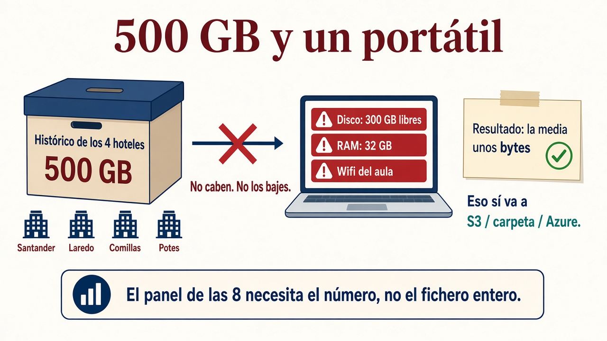
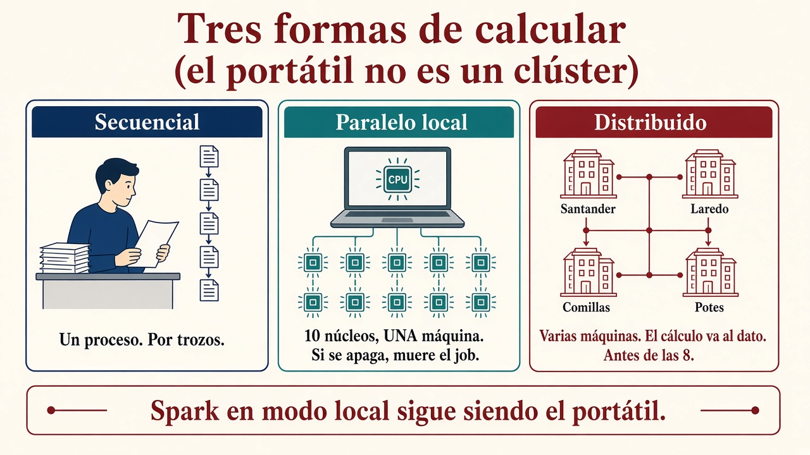

# Tarea para practicar en clase

Esta sesión une [1.2 Clústeres](clusters.md){target="_blank" rel="noopener"} y [1.4 Procesamiento](procesamiento.md){target="_blank" rel="noopener"} con el **RA2**: guardar mucho, calcular en varias máquinas, aguantar que una se caiga y crecer **añadiendo** recursos. Hoy **no** instaláis Spark ni Dask. Sí tenéis que saber **qué tipo de ejecución** estáis pidiendo y **por qué el portátil no es un clúster**.

No se entrega en Moodle salvo que el profesor lo indique. Se trabaja **en clase** (individual o por parejas) y se comenta al final.

!!! info "Cómo se lee esta página"
    Primero el **caso** (500 GB del [grupo hotelero](caso-hotel.md){target="_blank" rel="noopener"}, un portátil). Luego un **repaso** de concurrente / paralelo / distribuido (ya lo visteis en el 1.4). Después **siete preguntas**. El número tiene que servir para el **panel de las 8** (cierre de **ayer**).

## El caso: 500 GB y un portátil

Sois técnicos de la cadena. Os piden **un número** sobre un fichero de **500 GB** (CSV, JSON o log del histórico: reservas, cobros o ambos) de Santander, Laredo, Comillas y Potes. Ese número (importe medio, noches medias, o un campo puesto en escala 0–1) tiene que poder usarse en el **panel de las 8**. **No** picáis en el [PMS](caso-hotel.md){target="_blank" rel="noopener"}. **No** copiáis los 500 GB al informe.

El fichero está en la **red de la empresa** (una URL interna o una carpeta compartida), no en vuestro disco.

**Operación** (elegid **una**): media, desviación típica, o *normalizar* un campo (dejarlo en una escala comparable, p. ej. 0–1).

**Destino del resultado** (elegid **uno**, el que diga el profesor): cubo **S3**, **Azure** (Blob / Data Lake) o **carpeta del aula**. Si ya usáis MongoDB Atlas, vale. El resultado de una media ocupa **casi nada**; no lo confundáis con mover los 500 GB.

**Vuestra única máquina (el portátil):**

| Recurso | Dato | Qué implica |
| --- | --- | --- |
| Disco | 1 TB, **70 % ocupado** → ~**300 GB libres** | 500 GB **no caben** enteros |
| RAM | **32 GB** | Un `read_csv` / DataFrame de 500 GB **no cabe** |
| CPU | i7, **10 núcleos / 20 hilos** | Hay paralelismo *local*, no un clúster |
| GPU | RTX 4060, 6 GB | ¿Ayuda a *esta* media o no? |

## Concurrente, paralelo y distribuido (repaso)

Tres palabras que en el pasillo se usan como sinónimos. **No** lo son. El detalle está en el [1.4](procesamiento.md){target="_blank" rel="noopener"}; aquí basta para no mezclar el i7 con un clúster.

| Tipo | Dónde corre | En esta tarea |
| --- | --- | --- |
| **Secuencial / concurrente** | Un proceso (un núcleo se puede *turnar*) | Leéis el fichero **por trozos** y actualizáis suma y recuento |
| **Paralelo local** | Varios **núcleos** de **una** máquina | Los **10 núcleos** del portátil; si se apaga, muere el job |
| **Distribuido** | **Varias máquinas** en red | El cálculo va **al dato**; réplicas si se funde un disco; acabar **antes de las 8** |

**Spark en modo local sigue siendo el portátil:** varios núcleos, **una** máquina. No lo presentéis como la opción 3.

!!! tip "Las tres pueden convivir"
    Un plan honesto suele mezclarlas: no bajar el fichero; si exploráis, paralelo **local** sobre una muestra; el histórico de verdad, **distribuido**. No elijáis “la palabra más moderna”.

## Qué tenéis que entregar (en clase)

Responded por escrito (o en un pad) a **todas** las preguntas. No hace falta código que compile; sí un razonamiento que se pueda defender en voz alta.

### 1. Limitaciones del portátil

Explicad por qué **no** es buena idea:

1. Descargar los 500 GB al disco local, y
2. Cargar **todo** en memoria (por ejemplo, un DataFrame de Pandas).

Hablad al menos de: **espacio en disco**, **RAM**, **entrada/salida de disco** (leer y escribir es lento) y **red** (bajar 500 GB por la wifi del aula no es “un rato”).

!!! example "Pista, no la respuesta"
    Libres ≈ 300 GB < 500 GB. Pandas quiere el dataset **entero** (y suele ocupar *más* RAM que el fichero en disco). Aunque el disco llegara, la RAM no. Y copiar 500 GB es un cuello de **red y disco**, no de la RTX.

### 2. Opción 1 — Local secuencial (por trozos)

¿Se puede calcular la media / desviación / normalización **sin** guardar el fichero entero ni cargarlo en RAM?

Describid, a alto nivel, un plan en Python:

- Lectura **línea a línea** o por **bloques** (*chunks*: trozos que caben en RAM).
- Cálculo **incremental** (una pasada: vais actualizando suma y recuento; la media es `suma/n` al final).
- Escribís **solo** el resultado (unos bytes) hacia el destino elegido.

Relacionadlo con **secuencial**: un solo proceso que lee y actualiza contadores.

### 3. Opción 2 — Local **paralela**

¿Cómo aprovecháis los **10 núcleos / 20 hilos**?

Comentad una vía: Spark **en modo local**, **Dask** o `multiprocessing`. Hoy no hace falta instalarlas: el oficio es el diseño.

Qué **mejora** respecto a la opción 1 (varios trozos a la vez) y qué **sigue igual** (el disco no ha crecido, la red sigue siendo vuestra, si se apaga el portátil el job muere). El panel de las 8 **no** puede depender de ese portátil.

### 4. Opción 3 — Distribuido

La empresa puede usar un clúster (Hadoop/Spark, propio o en nube) o el servicio que indique el profesor.

Explicad, en general:

1. **Dónde** dejáis el fichero (HDFS, S3, Blob…) — “llevar el cálculo al dato”, no el dato al portátil.
2. **Cómo** lanzáis el cálculo (un *job*: trabajo programado; de madrugada, para tener el número **antes de las 8**).
3. Por qué encaja: **volumen**, **tiempo**, **tolerancia a fallos** (si se funde un disco, el panel no se cae: [1.2](clusters.md){target="_blank" rel="noopener"}), **crecimiento** (añadir nodos = [escalado horizontal](clusters.md){target="_blank" rel="noopener"}).

### 5. Opción 4 — Cargar y consultar

Valorad cargar el fichero (o **particionarlo**) en un almacén de informes / *lakehouse* o, si el aula lo usa, MongoDB, y hacer la media con una **consulta**.

¿Cuándo tiene sentido frente a un job Spark? Ventajas e inconvenientes: **modelo de datos**, **coste** (¡a menudo pagáis por lo **escaneado**!, [1.7](formatos.md){target="_blank" rel="noopener"}), **curva de aprendizaje**.

### 6. ¿Y la GPU?

¿La RTX 4060 **cambia de verdad** este problema (una estadística sobre un campo de un CSV/JSON de reservas)?

Decid en qué tareas de datos **sí** suele ayudar (entrenar un modelo, álgebra pesada) y por qué aquí el cuello puede ser **leer bytes de red/disco**, no multiplicar matrices.

### 7. Elección final

Recomendad **una opción o una combinación** a gerencia.

Justificadla con los criterios del **RA2**:

| Criterio RA2 (idea) | Cómo se nota en vuestra respuesta |
| --- | --- |
| Importancia del **almacenamiento** | ¿Dónde vive el fichero? ¿Por qué no en el portátil? |
| Modelo de **computación distribuida** | ¿Quién ejecuta el cálculo? ¿Acaba antes de las 8? |
| **Tolerancia a fallos** | ¿Qué pasa si se cuelga una máquina a mitad? |
| Guardar **mucho** y decidir después | ¿El bruto sigue accesible o lo tirasteis? |
| **Crecer** añadiendo recursos | ¿Mañana son 5 TB? ¿Una máquina más gorda o más nodos? |

## Cómo lo hacemos en el aula

1. 10 minutos: leed el caso y el repaso. Aclarad dudas de vocabulario.
2. 25–35 minutos: responded 1–7 (parejas bienvenidas).
3. 10 minutos: puesta en común. El profesor puede contrastar con el [cuaderno Dask de 500 GB](https://colab.research.google.com/drive/1DWyILxlyHpWqjcC9EItymv30OESSmaCE?usp=sharing){target="_blank" rel="noopener"} o la [demo de GitHub](https://github.com/josedavidmi/demo_dask_500gb-){target="_blank" rel="noopener"}.

!!! success "Qué se espera"
    No un clúster montado hoy. Sí una recomendación **argumentada**: qué no hacer con el portátil, qué aporta lo paralelo local, cuándo pasar a distribuido (job de madrugada, panel de las 8) y dónde acaba el **número**.

## Relación con el módulo

Es el **puente hacia el RA2** (almacenamiento masivo y cómputo distribuido), colocada al final de la UT1 porque ya tenéis el vocabulario de [1.2](clusters.md){target="_blank" rel="noopener"} y [1.4](procesamiento.md){target="_blank" rel="noopener"}. Os obliga a **elegir y justificar**. El laboratorio de HDFS y Spark es la UT2.

La entrega formal, si la hay, se indica en Moodle.

## Para profundizar (si el profesor lo indica)

No es de esta sesión. Si os piden probar código, Dask se parece a Pandas; PySpark es el de libro en clústeres grandes; Ray aparece más en ML. Hoy no hace falta instalarlas.

| | **Dask** | **PySpark** | **Ray** |
| --- | --- | --- | --- |
| Encaje | Paralelo y distribuido “estilo Pandas” | Volumen masivo en el ecosistema Spark | Cómputo distribuido genérico |
| Hoy | Solo si el profesor abre el cuaderno | No lo programáis aún ([1.4](procesamiento.md){target="_blank" rel="noopener"}) | Fuera de esta tarea |

- Tutorial Berkeley (Dask y un poco de Ray): [Flexible parallel processing](https://computing.stat.berkeley.edu/tutorial-dask-future/){target="_blank" rel="noopener"}
- Plan ETL con **Dask** (Colab): [cuaderno](https://colab.research.google.com/drive/1hFZ2G6I6pfz5RSv8OKt28QOJ5v7xfVGb?usp=sharing){target="_blank" rel="noopener"}
- Plan ETL con **Ray** (Colab): [cuaderno](https://colab.research.google.com/drive/1Hfk8uMndNU6bQIVBNVXsPjiJMlu7xdju?usp=sharing){target="_blank" rel="noopener"}
- Estudio del profesor: 500 GB con Dask (Colab): [cuaderno](https://colab.research.google.com/drive/1DWyILxlyHpWqjcC9EItymv30OESSmaCE?usp=sharing){target="_blank" rel="noopener"}
- Demo en GitHub (Dask, origen remoto → S3, desde un portátil): [josedavidmi/demo_dask_500gb-](https://github.com/josedavidmi/demo_dask_500gb-){target="_blank" rel="noopener"}
