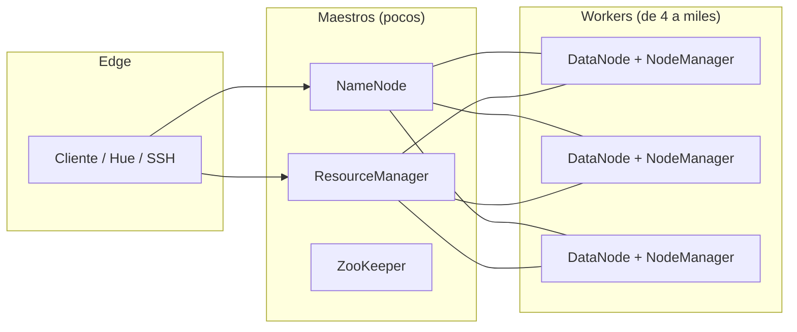
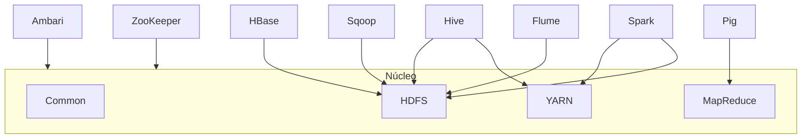
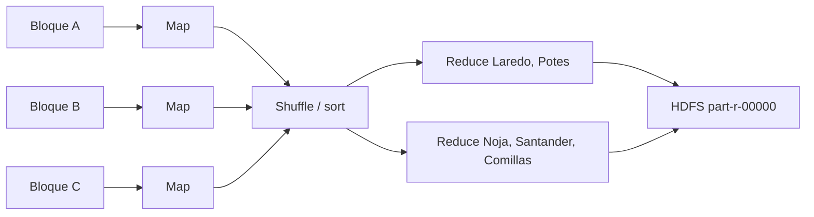

# 2.2. Ecosistema Hadoop

Si Big Data es la *filosofía* de trabajo con grandes volúmenes (volumen, velocidad, variedad), [Apache Hadoop](https://hadoop.apache.org/) es el **catalizador** que la industria usó durante años para materializarla. Un clúster Hadoop puede crecer hasta **miles de máquinas** y un almacén del orden de **petabytes**.

No es “un `.exe` que instalas y ya”. Es un **proyecto** de código abierto: un núcleo (ficheros + recursos + un modelo de programación sencillo) y un **ecosistema** de módulos que se enchufan encima. El criterio **e)** del RA2 es exactamente eso: el sistema **crece añadiendo piezas** (un *datanode*, Hive, Spark) sin reescribir el programa de reservas de Laredo.

Hoy se trabaja sobre Hadoop **3.x** (la rama **3.4.x** es la vigente en documentación). Sigue habiendo jobs compilados para la **2**. En la **1** el cómputo era *JobTracker* + *TaskTracker*; eso ya no se instala, pero sale en textos viejos y en entrevistas.

El grupo hotelero no “compra Hadoop porque está de moda”. Lo usa porque **deposita cualquier fichero** (logs, Parquet, fotos de habitación) y **procesa en el mismo sitio** donde está guardado. Eso es el criterio **a)** del RA2: importancia del almacén para depositar y procesar *cualquier* tipo, rápido, a escala.

## Qué promete (y por qué importa al RA2)

| Promesa | En castellano de recepción | Criterio |
| --- | --- | --- |
| **Confiable** | Copia el dato solo. Si un nodo muere a media noche, **relanza** la tarea en otro | **c)** |
| **Tolerante a fallos** | El disco *commodity* **se rompe**. Hadoop lo trata como **norma**, no como excepción. Al volver, el nodo se reintegra al clúster | **c)** |
| **Escalable** | De un servidor a miles. Cada máquina aporta **disco y CPU** locales (*scale-out*, no *scale-up*) | **e)** |
| **Portable** | Linux de aula, Windows en un *edge*, cloud (EMR, HDInsight, Dataproc) | **a)** |

**Confiable** y **tolerante a fallos** no son lo mismo, aunque se parecen. La primera habla de **copias** y de **reintentar** el cálculo. La segunda habla de **recuperación automática**: el hardware cae, el clúster sigue, y cuando el disco vuelve a estar sano **entra otra vez** en el grupo. En un hotel de 80 nodos, un disco muerto **cada semana** no es un incidente: es el calendario.

**Escalable** aquí significa *horizontal*. No cambiáis el servidor de 64 GB por uno de 512 GB (eso es *scale-up*). Enchufáis **otro worker** y sumáis terabytes *y* contenedores a la vez.

**Portable** no es “corre en el móvil”. Es que el mismo job se lanza en la VM del aula, en un *edge* de Windows y en un EMR de AWS **sin reescribir** el `mapper`.

## Procesamiento en el mismo clúster que el dato

Hadoop está pensado para **data-local computing**: no arrastras 8 TB de reservas al portátil; **mandas el cálculo** al nodo que ya tiene el bloque.

La filosofía, en una frase: *almacena todo en un sitio y procesa en ese mismo sitio*. Mueves el **programa**, no el lago. Mover petabytes por la red suele ser más caro (tiempo y euros) que enviar 200 KB de bytecode al DataNode que ya tiene el trozo.

Eso exige un entorno **repartido** de datos **y** de procesos. El sistema de ficheros es [HDFS](hdfs.md) (bloques, réplicas, NameNode: el detalle está allí). Encima, el cómputo se sienta en los **mismos** *workers*. Un DataNode no es “solo disco”: también corre *maps*, *reduces* y contenedores Spark.



### Tres roles de máquina

| Rol | Oficio | Cuántos (orden de magnitud) |
| --- | --- | --- |
| **Maestro** | Gestión global: NameNode, ResourceManager, a menudo ZooKeeper. Controla *dónde* está el dato y *quién* corre el job | Típicamente **unos pocos** (a menudo **3**, para no tener un solo punto frágil). Hardware más exigente |
| **Worker** | Guarda bloques y ejecuta *maps* / *reduces* / contenedores Spark | De 4 a **10 000**. Hardware **barato de reponer** |
| **Edge / borde** | Puente con el exterior: SSH, Hue, clientes, el portátil del analista, el script de Sqoop | Pocos. No es el almacén masivo |

El maestro **no** guarda los 8 TB de reservas. Guarda el **mapa** (qué bloque está en qué disco) y **reparte** CPU. Si metéis el lago en el maestro, habéis entendido mal el dibujo.

!!! warning "Commodity no es el PC de casa"
    *Commodity hardware* = servidor **x86 no especializado**: no exige la resiliencia de un *mainframe*. Se reponen. **No** es el sobremesa del aula (aunque en clase uséis una VM *pseudo-distribuida*: un solo PC hace de maestro y de esclavo a la vez). Tampoco es “el más barato de Amazon”: es *estándar de rack*, no *exótico*.

### Números de catálogo (para situaros, no para memorizar)

En un *datacenter* real veréis órdenes de magnitud así. No los recitáis en un examen al decimal; sí debéis **notar** que el *worker* es disco y el maestro es CPU/RAM.

- **Worker:** 64–128 GB de RAM; 12–24 discos de 4–12 TB en **JBOD** (*just a bunch of drives*, a menudo **sin RAID**); 2 CPU × 6–8 núcleos.
- **Maestro:** 128–256 GB; 2 SSD de 2–4 TB en RAID; 2 CPU × 8–16 núcleos. Aquí pesa más la **CPU y la RAM** que los terabytes: el NameNode vive en memoria.
- **Edge:** del orden de 256 GB de RAM; 2 discos de 2–3 TB en RAID; 2 CPU × 8 núcleos. Mucha RAM para clientes; poco disco de lago.

¿Por qué **JBOD y no RAID** en el *worker*? Porque HDFS **ya replica** el bloque en otros nodos. Un RAID-5 dentro del servidor duplica el trabajo y **esconde** el fallo que Hadoop sabe gestionar. El hotel prefiere tres copias en tres racks a un RAID local que no entiende YARN.

Cada *worker* que enchufáis **suma capacidad de disco y de jobs a la vez**. Eso es el criterio **e)** en el armario, no solo en el diagrama. Añadir un nodo no es “más carpeta”: es más **HDFS** y más **contenedores**.

## El núcleo: cuatro piezas

| Pieza | Oficio |
| --- | --- |
| **Hadoop Common** | Librerías y utilidades compartidas (configuración, IPC, autenticación) |
| **HDFS** | Sistema de **ficheros** repartido. El detalle: [2.3](hdfs.md) |
| **YARN** | *Yet Another Resource Negotiator*: **presta CPU y RAM** a quien las pide |
| **MapReduce** | Modelo: **mapear** y **reducir** pares clave/valor |

Para el analista, el clúster **parece** una carpeta enorme (`hdfs dfs -ls /`). Por debajo hay miles de discos. Las aplicaciones se escriben **sin** programar sockets ni saber la topología: el científico se centra en la pregunta (“noches por hotel”), no en la red.

Eso no significa que el clúster sea “como un USB enorme”. Hay un NameNode, hay réplicas, hay *splits*. Pero **el código del job** no abre un socket a `datanode-17`. Hadoop lo hace.

## El ecosistema (módulos que se añaden)

El RA2 habla del **amplio ecosistema**. No certificáis todos. Sí debéis **citar la familia** y saber *cuándo* se enchufa. El núcleo **no cambia**: HDFS sigue siendo HDFS cuando llega Hive.



| Módulo | Qué resuelve | Encaje en el hotel |
| --- | --- | --- |
| **Hive** | Accede a HDFS **como si fuera una base de datos**. *HiveQL* se parece a SQL | Gerencia: `SELECT hotel, SUM(noches)` sin escribir Java. Simplifica el día a día |
| **HBase** | NoSQL **columnar** encima de HDFS. Tablas de miles de millones de filas × millones de columnas. Escrita en Java | Series de sensores de habitación que **sí** se actualizan. HDFS solo es WORM (*write once, read many*): no editas un bloque a medias |
| **Pig** | *Pig Latin*: lenguaje textual de alto nivel. Un **compilador** que genera MapReduce | Flujos de limpieza cuando no queréis Hive ni Java |
| **Sqoop** | Puente **eficiente** SQL ↔ HDFS (y viceversa) | Volcado nocturno de la tabla Oracle/PostgreSQL de reservas ([ingesta](../ut1/ingesta.md)) |
| **Flume** | Recoger, agregar y **empujar** logs / redes. Arquitectura *streaming* con flujos configurables | Logs del motor de reservas y del Wi‑Fi hacia el lago |
| **ZooKeeper** | Configuración, líder, coordinación. No es solo de Hadoop | Quién es el NameNode activo; réplicas de otros sistemas; quita complejidad de “quién manda” |
| **Spark** | Motor **en memoria**; *batch* y *near-real-time*. Una orden de magnitud más rápido que MapReduce en jobs **iterativos** (IA). Puede vivir **sin** Hadoop | Entrenar un modelo de cancelación: veinte pasadas sobre el mismo Parquet |
| **Ambari** | Instalar, configurar, **mantener y vigilar** el clúster | El *panel* del administrador: no editáis veinte XML a mano en 80 nodos |

**HBase** merece un párrafo extra porque se confunde con HDFS. HDFS es un **sistema de ficheros**: dejas un Parquet y lo lees. HBase es una **tabla** (familias de columnas, *row key*) que **vive encima** de HDFS y permite lecturas/escrituras de **celdas**. Si el sensor de la 214 cambia la temperatura cada minuto, HBase encaja; un CSV de 40 GB en HDFS, no.

**Spark** no “sustituye a Hadoop” en todos los sitios. Sustituye a **MapReduce** cuando el job **itera**. Puede leer HDFS, S3, un CSV local. En este módulo lo citáis como *módulo del ecosistema*; el RA2 os pide entender el núcleo primero.

**Distribuciones** (el clúster ya cableado, con versiones que encajan entre sí):

- **Amazon EMR** (Elastic MapReduce) en AWS.
- **CDH / Cloudera** (la línea que heredó el stack on-prem más visto en empresas).
- **Azure HDInsight** en Microsoft.
- **Google Dataproc**.

En aula: la VM o Docker que indique el profesor. No hace falta pagar EMR para entender NameNode y YARN.

Criterio **e)** en una frase: *añades Hive cuando quieres SQL, Spark cuando el job itera, un datanode cuando no cabe el año 2026*.

!!! warning "No es oro todo lo que reluce"
    Hadoop facilita el trabajo con grandes volúmenes, pero **montar un clúster funcional no es una tarde**. Ambari o Mesos alivian; la tendencia empresarial es **cloud** (os ahorráis el cableado). El punto débil del Hadoop clásico para IA es lo **iterativo**: cada pasada de MapReduce **escribe a disco**. Spark mejora el rendimiento **un orden de magnitud** al quedarse en RAM. Por eso el hotel usa Hadoop para el **lago** y Spark (u otro motor) para el **modelo**.

## MapReduce (el modelo que paraleliza)

MapReduce es un paradigma de programación **funcional** en **dos fases** (más el *shuffle* / *sort* en medio). Define el algoritmo que Hadoop usa para **paralelizar**. Parte el dato, procesa en paralelo, **reordena**, combina y agrega. El formato de trabajo es **clave → valor**.

Sirve para agregados, logs, minería “de una pasada”, conteos. **No** encaja con análisis interactivo (“dame ya el top 10 mientras cambio el filtro”) ni con algoritmos que dan **muchas vueltas** al mismo dataset: entre fase y fase **persiste a disco**. Con datasets grandes, eso es una penalización. En IA, duele.

Un *job* de MapReduce se compone de **varias tareas**. La salida de una puede ser la entrada de la siguiente (un *pipeline* de pasadas).

### Ejemplo de aula: noches por hotel

Cada noche el PMS deja en HDFS un fichero con líneas `id,hotel,canal,noches,importe`. Dirección pregunta: *¿cuántas noches cobradas hay por hotel?*

Imaginad tres bloques (tres *mappers*):

| Bloque (mapper) | Líneas que ve | Emisiones |
| --- | --- | --- |
| A (Laredo / Potes) | `Laredo,web,3` · `Potes,ota,5` · `Laredo,recepcion,1` | `Laredo→3`, `Potes→5`, `Laredo→1` |
| B (Santander / Noja) | `Santander,ota,4` · `Noja,web,3` | `Santander→4`, `Noja→3` |
| C (resto) | `Potes,web,2` · `Noja,ota,2` · `Comillas,web,4` | `Potes→2`, `Noja→2`, `Comillas→4` |

Hasta que no se **reduzca**, hay **duplicados** de clave: dos `Laredo`, dos `Potes`, dos `Noja`.

- **Map:** cada bloque emite pares. No suma todavía.
- **Shuffle / sort:** el clúster **junta** todas las `Laredo` en el mismo *reducer* (el gesto de un `GROUP BY`).
- **Reduce:** suma las noches de Laredo (`3+1=4`), de Potes (`5+2=7`), etc. Escribe el resultado otra vez en HDFS.



Pasos reales (más que “map y ya”):

1. Lectura desde HDFS de los ficheros de entrada como pares clave/valor (a menudo la **línea** es el valor; la clave puede ser el *offset*).
2. Cada línea va a un *mapper*. Hay **tantos *mappers* como *splits*** (orden de magnitud: tantos como bloques).
3. El *mapper* parsea el hotel (clave) y las noches (valor) y emite `(hotel, noches)`.
4. Para facilitar la agregación, se **ordenan y barajan** los datos por clave. Aquí viajan por la red: es el momento caro si el *mapper* no es *data-local*.
5. El *reducer* suma las ocurrencias de cada hotel y genera un fichero por **partición** de salida.
6. Las partes se ven como `part-r-00000` (o `part-00000` en Streaming) más un `_SUCCESS` si el job acabó bien.

A veces hay una fase **Combine** entre el map y el shuffle: un “mini-reduce” **en el mismo nodo** del *mapper*. Si el mapper A emite `Laredo→3` y `Laredo→1`, el *combiner* puede emitir ya `Laredo→4` y **ahorrar red**. No todos los problemas admiten *combiner* (la media no es asociativa de esa forma; la suma sí).

El criterio **b)** (comprobar el *poder* del modelo) se cierra cuando **lanzáis** un job, no cuando recitáis las dos palabras. Más abajo hay un *Hola job*; el [2.4](computacion-distribuida.md) insiste en medirlo contra un `GROUP BY` local.

## YARN: quién presta la CPU

**YARN** (*Yet Another Resource Negotiator*) es un **planificador de tareas** y **gestor de recursos** distribuidos. Forma parte de Hadoop desde la **versión 2**. Abstrae la gestión de recursos de los procesos MapReduce: la asignación es más efectiva y **no** está atada a un solo marco.

Encima conviven **MapReduce v2**, Tez, Impala, Spark… Varias aplicaciones **a la vez**, en el mismo clúster, sin que un *wordcount* se coma toda la RAM del hotel.

Objetivo: separar en **dos oficios** lo que en Hadoop 1 iba mezclado:

1. Un **gestor de procesos** (prioridades, convivencia, recuperación ante fallos).
2. Las **aplicaciones**, que se desarrollan con un marco más ligero, no atadas a un modelo rígido de “así se ejecuta un MapReduce”.

YARN **asigna** recursos, **vigila** el estado de las aplicaciones y **recupera** si algo cae.

Ciclo típico con HDFS:

1. Los datos **ya** están en HDFS (el lago de reservas).
2. La aplicación (Spark, un jar MapReduce) **pide** recursos a YARN.
3. YARN abre **contenedores** *cerca* de los bloques (*data locality*).
4. Se procesa.
5. El resultado **vuelve** a HDFS.

### Tres procesos (y uno opcional)

La idea: **un ResourceManager por clúster** (el planificador global) y **un ApplicationMaster por aplicación** (un job o un conjunto de jobs cíclicos).

| Proceso | Dónde | Vida |
| --- | --- | --- |
| **ResourceManager (RM)** | Uno por clúster. Equivale, en espíritu, al NameNode del *cómputo* | Siempre encendido |
| **NodeManager (NM)** | Uno por *worker* (junto al DataNode). Tantos NM como DataNodes | Siempre; si cae, el RM manda el trabajo a otro |
| **ApplicationMaster (AM)** | **Uno por aplicación**, en un *worker* | Nace y muere con el job |
| **Job History Server** | Archiva logs de jobs | Opcional; **recomendable** para auditar |

El RM y los NM forman el *framework* de computación. El RM **orquesta** recursos entre **todas** las aplicaciones. Cada NM gestiona CPU, memoria, disco y red de **su** nodo y **reporta** al RM.

El AM es una librería **específica del framework** (el AM de MapReduce no es el de Spark): negocia recursos con el RM y trabaja con los NM para ejecutar y vigilar **sus** tareas.

Si todos los AM vivieran en el maestro, el RM sería un cuello de botella: no podrías lanzar cientos de jobs. Por eso el AM corre en un **worker**.

### ResourceManager

Mantiene la lista de NM **vivos** y su holgura. El cliente **siempre** habla con él. El RM:

- aplica **políticas de prioridad** (quién come primero);
- **reparte** el ejecutable a los *workers* que van a correr;
- si una tarea se cae, la **relanza** en otro nodo;
- **libera** recursos al terminar.

Por dentro tiene dos mitades. No las mezcléis:

- **Scheduler (planificador):** solo **reparte** CPU, RAM, disco y red. **No** vigila tu *bug* ni garantiza que el job acabe. **No** repara el hardware. Planifica según lo que cada app **pide**. Si el *mapper* entra en un bucle infinito, el *scheduler* no es el policía: lo es el NodeManager (cuota del contenedor).
- **ApplicationsManager:** **acepta** jobs, negocia el **primer contenedor** (donde nace el AM) y **reinicia** el AM si peta.

En el `config.env` del aula veréis un **Capacity Scheduler**: colas (`root.default`), un tope de aplicaciones (`maximum-applications=10000`), un porcentaje máximo de recursos para ApplicationMasters (`0.1`). Eso es política de hotel: *el job de gerencia no se come el 100 % del clúster*.

### NodeManager

En cada *worker*:

- informa al RM del consumo (CPU, memoria) de sus contenedores;
- manda *heartbeat* (“sigo vivo”) y el estado de recursos;
- vigila el **ciclo de vida** de los contenedores;
- **mata** tareas **colgadas** o que **se pasan** de la cuota;
- deja log en HDFS (auditoría del nodo);
- puede lanzar el proceso AM.

Si el NM desaparece, el RM lo nota (como el NameNode con un DataNode) y **redirige** las aplicaciones a los nodos que siguen vivos. Criterio **c)** otra vez: el fallo es norma.

### Contenedor

Unidad mínima de ejecución. Representa una cantidad **fija** de memoria, núcleos y, a veces, disco/red. Ejemplo de catálogo: **4 GB + 1 núcleo**.

**Todas** las tareas YARN corren **en un contenedor**. Un job puede tener muchas tareas; cada tarea, su contenedor. Al arrancar, YARN asigna; al terminar, el trozo se **libera** y pasa a otra tarea.

El número de tareas a la vez ≈ número de contenedores libres. El techo del clúster es **aritmética**, no magia.

!!! example "Cuentas de servilleta (las mismas que veréis en cualquier manual)"
    20 nodos × 256 GB de RAM × 12 núcleos. YARN se queda con **toda** esa capacidad: **5 TB** de RAM y **240** núcleos. Si el contenedor es de **32 GB**, hay como máximo **160** contenedores → **160** tareas concurrentes.

    Añadir un *worker* (criterio **e)**) **sube** ese techo: eso es poder de procesamiento (criterio **b)**). Quitar un nodo (avería) lo **baja**: el RM reparte lo que queda.

El NM **mata** el proceso que se sale de su caja (más RAM de la pedida). También monta variables de entorno, dependencias y servicios auxiliares (el *shuffle* de MapReduce es uno: `mapreduce_shuffle`).

### ApplicationMaster

Negocia **más** contenedores con el RM, habla con los NM, **coordina** las tareas de *su* job y vigila el progreso.

Hay **un AM por aplicación**. Corre en un *worker* (escalabilidad). Cuando el job acaba, el AM **muere**. RM y NM **siguen** aunque no haya nadie trabajando: son el *sistema operativo* del clúster. Cada vez que lanzáis un job nuevo, el RM reserva un contenedor y **ahí** nace otro AM.

### Secuencia de un job

```mermaid
sequenceDiagram
  participant C as Cliente
  participant RM as ResourceManager
  participant AM as ApplicationMaster
  participant NM as NodeManager
  C->>RM: Envía la aplicación
  RM->>NM: Reserva contenedor para el AM
  AM->>RM: Se registra y pide más recursos
  AM->>NM: Lanza contenedores (map / reduce)
  AM->>RM: Informa del progreso
  AM->>RM: Terminado; se liberan contenedores
```

Paso a paso, en prosa:

1. El cliente envía la aplicación al RM.
2. El RM reserva un contenedor para el AM (el *ApplicationsManager* negocia ese primero).
3. El AM se registra y pide el resto de recursos (más mapas, más *reduces*).
4. El AM pide a los NM que **lancen** contenedores; ahí corre el código.
5. El AM informa del progreso al RM.
6. Al terminar, se notifica al RM y se liberan contenedores.

**Reservation System:** podéis reservar un **perfil** (CPU/RAM) y una **fecha tope** (*deadline*) para jobs que *tienen* que acabar antes de las 8 (el informe de ocupación del fin de semana). Control de admisión + aviso dinámico al *scheduler*. No es “nice to have”: es cómo el hotel evita que un *wordcount* de prácticas se coma el job de gerencia.

**Federación:** varios clústeres YARN se **ven como uno** (escala de **miles** de nodos). Trabajos enormes sin un solo RM saturado. En aula no lo montáis; en un texto de arquitectura sale.

### Hadoop 1 (para leer textos antiguos)

MapReduce en Hadoop 2.x **mantiene el API** de la 1: se **recompila** y corre sobre YARN. No reescribís el `Mapper` de 2012.

En la v1, el *JobTracker* vivía en el maestro (junto al NameNode) y los *TaskTracker* en los esclavos (junto a los DataNodes). Eso **era** el cómputo antes de YARN. Un solo JobTracker era **punto único de fallo** y de escala: por eso se partió en RM + AM + NM.

## Cómo se instala (aula, no la VM de otro ciclo)

Tres caminos. El profesor dirá cuál:

1. **VM Linux** del centro, en modo *pseudo-distribuido*: un solo host hace de **maestro y esclavo a la vez**. Entendéis los **procesos**. En producción hay un maestro (o HA) y muchos esclavos.
2. **Docker** con la imagen oficial `apache/hadoop:3` (existe desde mediados de **2023**).
3. **Cloud** (EMR, HDInsight, Dataproc) si no hay disco local o no queréis pelearos con XML.

No hace falta la OVA ni el usuario de otro ciclo. Si instaláis a mano en Ubuntu, el artículo típico es “Apache Hadoop en Ubuntu 22.04”; la versión de Hadoop la marca el aula (3.3.x / 3.4.x). El raíz suele ser `/opt/hadoop` y `$HADOOP_HOME/etc/hadoop` guarda los XML.

### Mini-clúster Docker de este módulo

Ficheros en [hotel-hadoop](../assets/practicas/hotel-hadoop/compose.yaml): proyecto `hotel-hadoop`, hostnames `namenode` / `resourcemanager`. **No** copies el proyecto ni los contenedores `iabd-*` de otro temario.

[compose.yaml](../assets/practicas/hotel-hadoop/compose.yaml):

```yaml
name: hotel-hadoop

services:
  namenode:
    image: apache/hadoop:3
    hostname: namenode
    command: ["hdfs", "namenode"]
    ports:
      - "9870:9870"
    env_file:
      - ./config.env
    environment:
      ENSURE_NAMENODE_DIR: "/tmp/hadoop-root/dfs/name"

  datanode:
    image: apache/hadoop:3
    hostname: datanode
    command: ["hdfs", "datanode"]
    env_file:
      - ./config.env

  resourcemanager:
    image: apache/hadoop:3
    hostname: resourcemanager
    command: ["yarn", "resourcemanager"]
    ports:
      - "8088:8088"
    env_file:
      - ./config.env

  nodemanager:
    image: apache/hadoop:3
    hostname: nodemanager
    command: ["yarn", "nodemanager"]
    env_file:
      - ./config.env
```

[config.env](../assets/practicas/hotel-hadoop/config.env) (la imagen oficial traduce estas variables a XML):

```text
CORE-SITE.XML_fs.default.name=hdfs://namenode
CORE-SITE.XML_fs.defaultFS=hdfs://namenode
HDFS-SITE.XML_dfs.namenode.rpc-address=namenode:8020
HDFS-SITE.XML_dfs.replication=1
MAPRED-SITE.XML_mapreduce.framework.name=yarn
MAPRED-SITE.XML_yarn.app.mapreduce.am.env=HADOOP_MAPRED_HOME=$HADOOP_HOME
MAPRED-SITE.XML_mapreduce.map.env=HADOOP_MAPRED_HOME=$HADOOP_HOME
MAPRED-SITE.XML_mapreduce.reduce.env=HADOOP_MAPRED_HOME=$HADOOP_HOME
YARN-SITE.XML_yarn.resourcemanager.hostname=resourcemanager
YARN-SITE.XML_yarn.nodemanager.pmem-check-enabled=false
YARN-SITE.XML_yarn.nodemanager.vmem-check-enabled=false
YARN-SITE.XML_yarn.nodemanager.delete.debug-delay-sec=600
YARN-SITE.XML_yarn.nodemanager.aux-services=mapreduce_shuffle
CAPACITY-SCHEDULER.XML_yarn.scheduler.capacity.maximum-applications=10000
CAPACITY-SCHEDULER.XML_yarn.scheduler.capacity.maximum-am-resource-percent=0.1
CAPACITY-SCHEDULER.XML_yarn.scheduler.capacity.resource-calculator=org.apache.hadoop.yarn.util.resource.DefaultResourceCalculator
CAPACITY-SCHEDULER.XML_yarn.scheduler.capacity.root.queues=default
CAPACITY-SCHEDULER.XML_yarn.scheduler.capacity.root.default.capacity=100
CAPACITY-SCHEDULER.XML_yarn.scheduler.capacity.root.default.user-limit-factor=1
CAPACITY-SCHEDULER.XML_yarn.scheduler.capacity.root.default.maximum-capacity=100
CAPACITY-SCHEDULER.XML_yarn.scheduler.capacity.root.default.state=RUNNING
CAPACITY-SCHEDULER.XML_yarn.scheduler.capacity.root.default.acl_submit_applications=*
CAPACITY-SCHEDULER.XML_yarn.scheduler.capacity.root.default.acl_administer_queue=*
CAPACITY-SCHEDULER.XML_yarn.scheduler.capacity.node-locality-delay=40
```

Arranque (PowerShell o bash; `docker compose` es el plugin actual):

```text
cd ruta\docs\assets\practicas\hotel-hadoop
docker compose up -d
docker compose exec namenode bash
```

UIs desde el **host** (el Windows del aula):

- NameNode / explorador HDFS: [http://localhost:9870](http://localhost:9870)
- YARN (jobs y contenedores): [http://localhost:8088](http://localhost:8088)

`ENSURE_NAMENODE_DIR` le dice a la imagen que **prepare** el directorio del NameNode la primera vez (equivale, en espíritu, a no tener que formatear a mano en este compose). En una VM clásica **sí** formateáis vosotros.

En el portátil, `dfs.replication=1`: no hay tres discos. En el hotel de verdad, **3**. `pmem-check` y `vmem-check` a `false` evitan que el NodeManager mate tareas por límites de memoria **virtual** demasiado estrictos en Docker (un clásico de aula).

### Ficheros XML (`$HADOOP_HOME/etc/hadoop`)

Tanto en la VM como en Docker el raíz suele ser `/opt/hadoop`. En *pseudo-distribuido* veréis `localhost` o el hostname de **esa** máquina. No copies el hostname de otro instituto.

**`core-site.xml`** — cuál es el sistema de ficheros y **quién** es el NameNode:

```xml
<configuration>
  <property>
    <name>fs.defaultFS</name>
    <value>hdfs://namenode:8020</value>
  </property>
</configuration>
```

En una VM de un solo host es habitual `hdfs://localhost:9000` (puerto 9000 o 8020 según la guía). `fs.defaultFS` es el nombre moderno; `fs.default.name` sale en textos viejos: mismo oficio.

**`hdfs-site.xml`** — réplica y carpetas de metadatos / bloques:

```xml
<configuration>
  <property>
    <name>dfs.replication</name>
    <value>1</value>
  </property>
  <property>
    <name>dfs.namenode.name.dir</name>
    <value>/opt/hadoop-data/hdfs/namenode</value>
  </property>
  <property>
    <name>dfs.datanode.data.dir</name>
    <value>/opt/hadoop-data/hdfs/datanode</value>
  </property>
</configuration>
```

En un clúster **de verdad**, el maestro solo configura `name.dir`; cada *worker*, su `data.dir`. Mezclar ambos en el mismo XML del aula es comodidad *pseudo-distribuida*.

**`yarn-site.xml`** — quién es el RM y el *shuffle* de MapReduce:

```xml
<configuration>
  <property>
    <name>yarn.resourcemanager.hostname</name>
    <value>resourcemanager</value>
  </property>
  <property>
    <name>yarn.nodemanager.aux-services</name>
    <value>mapreduce_shuffle</value>
  </property>
  <property>
    <name>yarn.nodemanager.aux-services.mapreduce_shuffle.class</name>
    <value>org.apache.hadoop.mapred.ShuffleHandler</value>
  </property>
</configuration>
```

Sin `mapreduce_shuffle`, los *maps* no pueden **entregar** sus datos intermedios a los *reduces*. El job se queda a medias y el log habla de *shuffle*.

**`mapred-site.xml`** — MapReduce **corre sobre YARN** (no sobre el JobTracker de la v1):

```xml
<configuration>
  <property>
    <name>mapreduce.framework.name</name>
    <value>yarn</value>
  </property>
</configuration>
```

En Docker, las variables `HADOOP_MAPRED_HOME` del `config.env` evitan el error clásico *“HADOOP_MAPRED_HOME not set”* al lanzar el AM de MapReduce.

La **primera** vez, en una VM, hay que **formatear** el NameNode. **Borra metadatos**. No lo repitas a la ligera (perderíais el mapa de bloques; los datos en los DataNodes quedarían huérfanos):

```text
hdfs namenode -format
```

En el compose de este módulo, `ENSURE_NAMENODE_DIR` cubre ese primer arranque.

Si no podéis con la VM ni con Docker, el plan B del ciclo es un servicio cloud (EMR). El oficio (NameNode, YARN, un job) **es el mismo**; cambian los clics.

## Arrancar y mirar

En una instalación clásica (scripts en `$HADOOP_HOME/sbin`):

```text
start-dfs.sh      # NameNode, DataNodes y Secondary NameNode
jps               # ¿qué procesos Java hay?
start-yarn.sh     # ResourceManager + NodeManager
```

`start-dfs.sh` no arranca YARN. `start-yarn.sh` no arranca HDFS. Son **dos** arranques. Si el job falla con *connection refused* al RM, casi siempre se os ha olvidado el segundo.

El **Secondary NameNode** no es un NameNode de reserva en caliente. Es un proceso que **fusiona** periódicamente la imagen (*fsimage*) y el diario de ediciones (*edits*) para que el NameNode no tarde una eternidad al reiniciar. El detalle de HA (NameNode activo + standby) está en el [2.3](hdfs.md).

`jps` es el “¿está vivo?” de aula. En un *pseudo-distribuido* sano deberíais ver, más o menos:

- `NameNode`
- `DataNode`
- `SecondaryNameNode`
- `ResourceManager`
- `NodeManager`

Y, si lo habéis arrancado, `JobHistoryServer`.

- HDFS UI: puerto **9870**. Explorador de ficheros, *live nodes*, capacidad.
- YARN UI: puerto **8088**. Aplicaciones, contenedores, cola del *scheduler*.

En Docker no usáis `start-dfs.sh`: cada **servicio** del compose *es* un proceso (`hdfs namenode`, `yarn resourcemanager`…). El equivalente de `jps` es `docker compose ps` más entrar al contenedor.

## Primer job: el *wordcount* (y el nuestro)

El “Hola mundo” histórico de Hadoop cuenta **palabras** de un texto. Hadoop trae ejemplos ya compilados en `$HADOOP_HOME/share/hadoop/mapreduce/hadoop-mapreduce-examples-*.jar` (`wordcount`, `pi`, *grep*…).

En este módulo **no** usamos el Quijote como caso de gerencia. Contáis palabras de [opiniones.txt](../assets/practicas/hotel-hadoop/opiniones.txt) (reseñas de Laredo, Potes, Santander, Noja y Comillas) o noches de [reservas.csv](../assets/practicas/hotel-hadoop/reservas.csv). El jar de ejemplo sirve igual: entra un fichero, sale un recuento.

Comandos de HDFS (el detalle de cada uno está en el [2.3](hdfs.md)):

```text
hdfs dfs -mkdir -p /user/bda
hdfs dfs -put opiniones.txt /user/bda/
hdfs dfs -ls /user/bda
```

El *wordcount* (sustituid la versión del jar por la de vuestra instalación; `3.3.6` y `3.4.x` conviven en aulas):

```text
yarn jar $HADOOP_HOME/share/hadoop/mapreduce/hadoop-mapreduce-examples-3.3.6.jar \
  wordcount /user/bda/opiniones.txt /user/bda/salida_wc
```

`hadoop jar …` hace **lo mismo** en Hadoop 3: acaba hablando con YARN. En textos viejos veréis solo `hadoop jar`.

### Cómo leer el log (no lo ignoreis)

Una traza realista de aula se parece a esto. Los *timestamps* y el `application_…` cambian; los **oficios** no:

```text
INFO client.DefaultNoHARMFailoverProxyProvider: Connecting to ResourceManager at resourcemanager:8032
INFO mapreduce.JobResourceUploader: Disabling Erasure Coding for path: /tmp/hadoop-yarn/staging/root/.staging/job_1710000000000_0001
INFO input.FileInputFormat: Total input files to process : 1
INFO mapreduce.JobSubmitter: number of splits:1
INFO impl.YarnClientImpl: Submitted application application_1710000000000_0001
INFO mapreduce.Job: The url to track the job: http://resourcemanager:8088/proxy/application_1710000000000_0001/
INFO mapreduce.Job: Running job: job_1710000000000_0001
INFO mapreduce.Job: Job job_1710000000000_0001 running in uber mode : false
INFO mapreduce.Job:  map 0% reduce 0%
INFO mapreduce.Job:  map 100% reduce 0%
INFO mapreduce.Job:  map 100% reduce 100%
INFO mapreduce.Job: Job job_1710000000000_0001 completed successfully
```

Qué os está diciendo, línea a línea:

| Trozo del log | Oficio |
| --- | --- |
| `Connecting to ResourceManager` | El cliente **encontró** el RM (si falla aquí, YARN no está) |
| `Total input files` / `number of splits` | Cuántos ficheros y **cuántos *maps*** (un *split* ≈ un map) |
| `Submitted application application_…` | YARN ha aceptado el job. Esa URL es la de **8088** |
| `uber mode : false` | *Uber* = job tan pequeño que corre **dentro** del AM. Aquí no |
| `map 100% reduce 0%` | Los *maps* han acabado; el *shuffle* / *reduce* aún no |
| `completed successfully` | Hay `_SUCCESS` en HDFS |

Un fichero de opiniones de **pocos KB** lanza **un** *map*: el arranque (AM, contenedores, JVM) **pesa más** que el cálculo. El poder del criterio **b)** se ve con **varios bloques** o con más datos, no con diez líneas. Aun así, el oficio (enviar, partir, reducir, escribir) es el mismo.

Después del éxito aparecen los **Counters**. No los memoricéis todos; sí debéis **saber leer** estos:

```text
Job Counters
        Launched map tasks=1
        Launched reduce tasks=1
        Data-local map tasks=1
File System Counters
        HDFS: Number of bytes read=…
        HDFS: Number of bytes written=…
Map-Reduce Framework
        Map input records=10
        Map output records=…
        Combine input records=…
        Combine output records=…
        Reduce input groups=…
        Reduce output records=…
```

| Contador | Pregunta de aula |
| --- | --- |
| `Launched map tasks` | ¿Cuántos *mappers*? ¿Coincide con los *splits*? |
| `Data-local map tasks` | ¿El map corrió **en el nodo que tenía el bloque**? Si es 0 en un clúster grande, algo va mal (red de más) |
| `Map input records` | Líneas (o registros) que entraron al map |
| `Combine output records` | Si es menor que `Map output records`, el *combiner* **ahorró** tráfico |
| `Reduce input groups` | Claves distintas que vio el *reducer* (palabras distintas, hoteles distintos) |
| Bytes HDFS leídos / escritos | Volumen real, no “el CSV pesa X en Windows” |

Para el historial **gráfico** (la URL del log cobra sentido):

```text
mapred --daemon start historyserver
```

Sin History Server podéis ver el job **mientras corre** en el 8088; al terminar, los detalles finos se archivan ahí. En un examen de capturas, el profesor os pedirá las **dos** UIs.

### Qué hay en HDFS al acabar

Si el job fue bien, la carpeta de salida contiene:

- `_SUCCESS` — marcador vacío: “este job **terminó**”. Los sistemas posteriores (Hive, un cron) lo miran antes de leer.
- `part-r-00000` — el resultado (un *reducer* → un `part`). Si hubiera más *reducers*, `part-r-00001`, etc.

Si la carpeta de salida **ya existe**, el job **falla** a propósito (Hadoop no pisa un resultado a medias):

```text
hdfs dfs -rm -r /user/bda/salida_wc
```

Listar y leer:

```text
hdfs dfs -ls /user/bda/salida_wc
hdfs dfs -cat /user/bda/salida_wc/part-r-00000
hdfs dfs -head /user/bda/salida_wc/part-r-00000
```

`-ls` ve la carpeta; `-cat` / `-head` ven el recuento. En la autoevaluación del temario de referencia esas dos preguntas salen tal cual: son el gesto mínimo de “el job existió”.

### El estimador de π (paralelismo visible)

Otro ejemplo del mismo jar:

```text
yarn jar $HADOOP_HOME/share/hadoop/mapreduce/hadoop-mapreduce-examples-3.3.6.jar \
  pi 8 24
```

Estima π con **8** *maps* y **24** muestras por map. Si cambiáis a `pi 4 50`:

- **8 → 4:** menos paralelismo (menos *maps*).
- **24 → 50:** más muestras **por** map (más trabajo en cada uno, otra precisión).

No es “el botón mágico de Hadoop”. Es un job que **parte** un experimento de Montecarlo. El resultado **varía** un poco: es una estimación, no una constante memorizada. El criterio **b)** aquí es *ver* 8 mapas en el 8088, no recitar 3,1416.

## MapReduce en Python: Hadoop Streaming

El API nativo de MapReduce está escrito en **Java**. **Hadoop Streaming** permite cualquier lenguaje que lea `stdin` y escriba `stdout` (la tubería Unix `|`). Hadoop manda el crudo al *mapper*; tras el *shuffle*, al *reducer*.

Oficio: no reescribís el *framework*. Escribís dos scripts tontos y **el clúster** los reparte.

Los scripts de esta página están en [hotel-hadoop](../assets/practicas/hotel-hadoop/mapper.py): [mapper.py](../assets/practicas/hotel-hadoop/mapper.py), [reducer.py](../assets/practicas/hotel-hadoop/reducer.py), y el par de **noches por hotel** ([mapper_noches.py](../assets/practicas/hotel-hadoop/mapper_noches.py), [reducer_noches.py](../assets/practicas/hotel-hadoop/reducer_noches.py)).

### Mapper (palabra → 1)

Lee línea a línea el trozo que le toca. Emite `palabra<TAB>1`. Limpia puntuación (`str.translate` + `string.punctuation`) y pasa a minúsculas para que `Laredo` y `laredo` sean la **misma** clave.

```python
#!/usr/bin/env python3
import string
import sys

tabla = str.maketrans("", "", string.punctuation)

for linea in sys.stdin:
    linea = linea.strip()
    if not linea:
        continue
    for palabra in linea.translate(tabla).lower().split():
        if palabra:
            print(f"{palabra}\t1")
```

Prueba **local**, sin clúster (PowerShell redirige igual):

```text
python mapper.py < opiniones.txt
```

Salida (recorte):

```text
el	1
hotel	1
de	1
laredo	1
tiene	1
vistas	1
al	1
mar	1
```

Si esto no funciona **en el portátil**, no lo subáis a YARN. Streaming no depura vuestro `SyntaxError`.

### Reducer que no se come la RAM

Un patrón que **veréis en muchos apuntes**: meter **todas** las palabras en un `dict` e incrementar. Funciona con diez reseñas. **Revienta** cuando el vocabulario o las claves no caben en la RAM de **cada** DataNode.

```python
# NO hagáis esto en un lago. Solo para ver el oficio en un fichero de aula.
dict_palabras = {}
for linea in sys.stdin:
    linea = linea.strip()
    palabra, cuenta = linea.split("\t", 1)
    dict_palabras[palabra] = dict_palabras.get(palabra, 0) + int(cuenta)
for palabra, n in dict_palabras.items():
    print(f"{palabra}\t{n}")
```

Hadoop **ya agrupa claves consecutivas** después del *sort*. Basta acumular la clave **actual** (el patrón de `itertools.groupby`, o el bucle de [reducer.py](../assets/practicas/hotel-hadoop/reducer.py)):

```python
#!/usr/bin/env python3
import sys

actual, total = None, 0
for linea in sys.stdin:
    linea = linea.strip()
    if not linea:
        continue
    palabra, n = linea.split("\t", 1)
    try:
        n = int(n)
    except ValueError:
        continue
    if palabra != actual:
        if actual is not None:
            print(f"{actual}\t{total}")
        actual, total = palabra, n
    else:
        total += n
if actual is not None:
    print(f"{actual}\t{total}")
```

Tubería local **completa**. El `sort` imita el shuffle de Hadoop (en el clúster **no** lo ponéis vosotros):

```text
python mapper.py < opiniones.txt | sort | python reducer.py
```

Debéis ver `desayuno`, `laredo`, `parking`… con sus cuentas. Si el `sort` falta, el reducer de clave actual **rompe** (ve `laredo`, luego `potes`, luego `laredo` otra vez y emite dos líneas de Laredo).

### Noches por hotel (el job que sí entiende gerencia)

El *wordcount* demuestra Streaming. El job del RA2 es el agregado:

```text
python mapper_noches.py < reservas.csv | sort | python reducer_noches.py
```

El *mapper* salta la cabecera (`id_reserva,…`), parte por comas y emite `Laredo\t3`. El *reducer* suma. El [2.4](computacion-distribuida.md) os pide **contrastar** esa salida con un `GROUP BY` en DuckDB o pandas sobre el mismo CSV.

### Lanzar en el clúster

Sintaxis general:

```text
mapred streaming \
  -input carpetaOFicheroHDFS \
  -output carpetaSalidaHDFS \
  -mapper scriptMapper \
  -reducer scriptReducer
```

Permisos de ejecución (Linux / contenedor). Sin `+x`, Streaming no puede lanzar el script:

```text
chmod u+x mapper.py reducer.py
```

Si los scripts están **solo** en vuestro disco (el caso habitual de aula), `-file` **los sube** al job:

```text
mapred streaming \
  -input /user/bda/opiniones.txt \
  -output /user/bda/salida_stream \
  -mapper mapper.py -file mapper.py \
  -reducer reducer.py -file reducer.py
```

Sin `-file`, Hadoop busca el script **ya** en HDFS (o en la ruta del contenedor). Si la carpeta de salida existe: `hdfs dfs -rm -r /user/bda/salida_stream`.

En Hadoop **1.x** no existía `mapred streaming`. Se usaba:

```text
hadoop jar $HADOOP_HOME/share/hadoop/tools/lib/hadoop-streaming-*.jar \
  -input ... -output ... -mapper ... -reducer ...
```

Comprobar:

```text
hdfs dfs -head /user/bda/salida_stream/part-00000
```

Ojo al nombre: el jar de ejemplos escribe `part-r-00000`; Streaming suele escribir `part-00000`. El `_SUCCESS` es el mismo oficio.

El job de noches:

```text
mapred streaming \
  -input /user/bda/reservas.csv \
  -output /user/bda/salida_noches \
  -mapper mapper_noches.py -file mapper_noches.py \
  -reducer reducer_noches.py -file reducer_noches.py
```

## Relación con el RA2

| Criterio | Dónde lo has visto en este apartado |
| --- | --- |
| **a)** | Un solo sitio para **cualquier** fichero + proceso **encima** (*data-local*) |
| **b)** | MapReduce + YARN + un job real (`wordcount`, Streaming, `pi`, noches por hotel) |
| **c)** | Fallo como norma; NM/DataNode que se sustituyen; réplica (detalle en [2.3](hdfs.md)) |
| **d)** | Dejas el CSV/Parquet en HDFS y **mañana** Hive o Spark lo interpretan |
| **e)** | Módulos (Hive, Spark, HBase) y **más workers** = más contenedores y más disco |

!!! success "En voz alta"
    “Hadoop es núcleo + ecosistema. El dato y el cálculo **conviven**. YARN **alquila** CPU. MapReduce **parte**. Si no cabe el año, **enchufo un nodo o un módulo**, no reescribo la recepción.”

## Para practicar (Moodle manda la nota)

Copiad el comando y, si el profesor lo pide, una captura donde se vea el resultado.

1. Arranca HDFS y YARN (`jps` o `docker compose ps`; UI **9870** y **8088**). Explica qué proceso es cada uno y por qué el Secondary NameNode **no** es el standby.
2. Sube [opiniones.txt](../assets/practicas/hotel-hadoop/opiniones.txt). Lanza el `wordcount` del jar. Lista la carpeta de salida y lee `part-r-00000`. ¿Cuántos *maps* salieron? ¿Por qué? ¿Qué pasa si vuelves a lanzar **sin** borrar la carpeta?
3. Lanza `yarn jar … pi 8 24`. Cambia a `pi 4 50`. ¿Qué cambia: el paralelismo, la muestra por map, ambos? ¿El número que imprime es exactamente π?
4. Streaming con [mapper.py](../assets/practicas/hotel-hadoop/mapper.py) y [reducer.py](../assets/practicas/hotel-hadoop/reducer.py): limpia puntuación y unifica mayúsculas. Comprueba en HDFS el `part-00000`. Luego el par **noches** (`mapper_noches.py` / `reducer_noches.py`) y contrasta con un `GROUP BY` local ([2.4](computacion-distribuida.md)).
5. Arranca el *History Server*. Relaciona un `application_…` de la UI de YARN con la carpeta de HDFS (`_SUCCESS`, *counters*, URL del proxy).

## Referencias (para profundizar, no para copiar la práctica)

- [Documentación de Apache Hadoop](https://hadoop.apache.org/docs/current/)
- Tom White, *Hadoop: The Definitive Guide* (O’Reilly)
- El detalle de bloques, réplicas y comandos `hdfs dfs` sigue en el [2.3](hdfs.md)
- Medir el poder del modelo (criterio **b)**) se cierra en el [2.4](computacion-distribuida.md)
