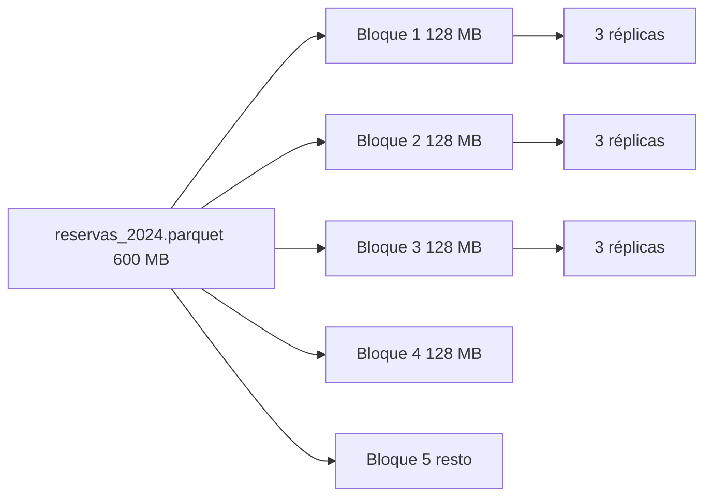
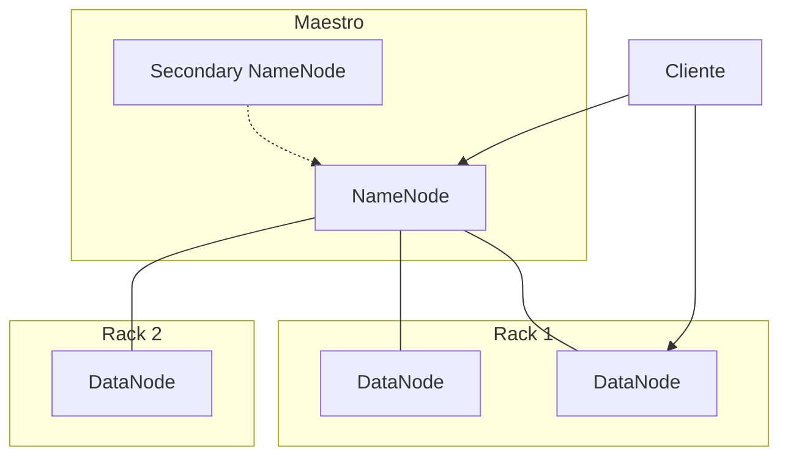
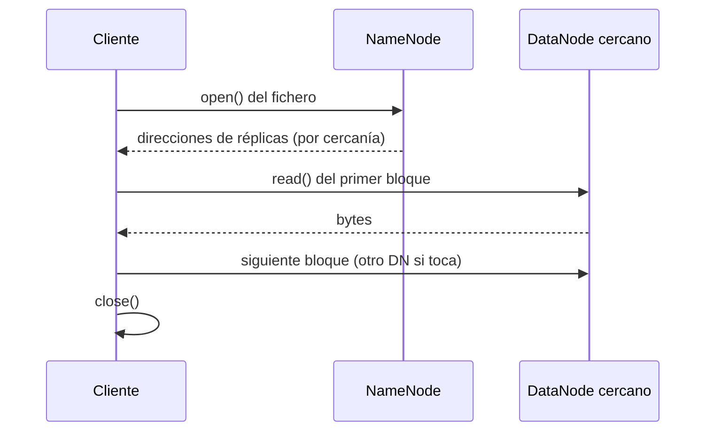

# 2.3. HDFS

El **Hadoop Distributed File System** es la capa de almacenamiento de Hadoop: un sistema de ficheros **repartido** y **tolerante a fallos** que guarda grandes cantidades de datos, **crece** enchufando servidores y **sobrevive** a discos muertos sin perder el lago. Se basa en el artículo de Google sobre el *Google File System* (2003).

Cumple de golpe varios criterios del RA2: **deposita cualquier fichero** (a), **tolera** que se muera un disco (c), **guarda ahora y lees después** (d) y **crece** añadiendo *datanodes* (e). El [2.2](ecosistema.md) os dejó el clúster y YARN; aquí el oficio es **el disco del hotel**.

HDFS **reparte** los ficheros entre todos los nodos: los corta en **bloques** (por defecto **128 MB**) y guarda **copias** en máquinas distintas. El valor de fábrica del **factor de réplica** es **3**.

Añadir un servidor incrementa el tamaño **de forma lineal**: el nodo nuevo suma **capacidad** y **redundancia**. No reescribís el programa de reservas.

Está pensado para escribir **una vez** y leer **muchas** (**WORM**: *write once, read many*). Las escrituras llegan a mano (`hdfs dfs -put`) o desde Spark, Flume o Sqoop ([1.6](../ut1/ingesta.md)).

## Qué no hace bien (y qué sí)

No ofrece buen rendimiento para:

- **Accesos de baja latencia.** No es la caja de recepción. Guarda *inputs* para procesos de cómputo.
- **Ficheros pequeños** (salvo que los agrupéis). Mejor millones de ficheros de 100 MB que miles de millones de 1 MB: el NameNode se ahoga en **metadatos**.
- **Varios escritores** a la vez sobre el mismo archivo.
- **Modificaciones arbitrarias** (el byte 17 del medio, como en un Word).

Una vez escritos, los datos son **inmutables**. Cada fichero solo admite **añadir al final** (*append-only*) o **borrarlo**. No hay un `UPDATE` fila a fila.

!!! note "HBase y Hive"
    Encima de HDFS, **HBase** y **Hive** dan una capa para *tratar* el dato como tabla (celdas que cambian, SQL). El fichero de debajo sigue siendo WORM; la capa de encima **reescribe** o **versiona**. No confundáis “puedo hacer `UPDATE` en Hive” con “HDFS edita el bloque”.

**No** es el sitio para el clic de recepción, ni para diez escritores sobre el mismo CSV, ni para un JSON de 2 KB por cada reserva suelta (juntadlos).

## Bloques

Un **bloque** es la cantidad **mínima** que HDFS lee o escribe. El tamaño por defecto es **128 MB** porque Hadoop está pensado para ficheros **grandes**.

Todos los ficheros se parten. Subís `reservas_2024.parquet` de **600 MB** → **5** bloques (4 × 128 MB + un resto). Esos bloques se **reparten** por los DataNodes.

Si el fichero es **menor** de 128 MB, ocupa **un** bloque **lógico**, pero en disco solo los **bytes reales**. Un archivo de 1 MB ocupa **1 MB** en disco, no 128. El “hueco” de 127 MB no se reserva.

Con factor de réplica **3**, el de 600 MB (5 bloques) se materializa en **15** copias de bloque en el clúster.



Los permisos de lectura y escritura siguen la filosofía **POSIX** (usuario, grupo, otros: `rwx`). Buena práctica: crear `/user/` en la raíz, como el `/home` de Linux. En este módulo usamos `/user/bda/`. En el lab, cambiad `bda` por el usuario de **vuestra** máquina.

## Tres máquinas (vista de conjunto)

| Rol | Oficio |
| --- | --- |
| **NameNode** | Maestro. Metadatos: el árbol y **dónde** está cada bloque |
| **DataNode** | Esclavo. Guarda y sirve **bloques** |
| **Secondary NameNode** | Puntos de control de los metadatos (`fsimage` + `edits`). **No** es un NameNode de reserva |



Con réplica 3, HDFS suele dejar **dos** copias en un rack y **una** en **otro**. Si se cae el *switch* del armario de Laredo, queda una copia en Potes.

## Trabajando con HDFS (`hdfs dfs`)

Desde el terminal se usa el comando `hdfs` y un segundo parámetro. Ante la duda: [documentación oficial de la *shell*](https://hadoop.apache.org/docs/current/hadoop-project-dist/hadoop-hdfs/HDFSCommands.html).

```text
hdfs comando
```

!!! tip "hadoop fs frente a hdfs dfs"
    `hadoop fs` habla con un sistema de ficheros **genérico** (local, HDFS, FTP, S3…). En versiones viejas existía `hadoop dfs`; hoy está **obsoleto** a favor de **`hdfs dfs`**. En el aula, para HDFS: `hdfs dfs`.

`dfs` pide otro argumento (con guion): un gesto al estilo de la *shell* de Linux.

```text
hdfs dfs -ls /
```

Sin ruta, `-ls` lista el directorio de trabajo del usuario (a menudo `/user/<quien>`); no siempre es la raíz. Por eso en clase escribimos la ruta **completa**.

### Los comandos que más usaréis

| Acción | Flag | Oficio en el hotel |
| --- | --- | --- |
| Subir | `-put` / `-copyFromLocal` | Dejar `reservas.csv` en el lago |
| Bajar | `-get` / `-copyToLocal` | Traer un `part-r-00000` al portátil |
| Fusionar al bajar | `-getmerge` | Varios `part-*` → un solo fichero local |
| Ver | `-cat` / `-text` / `-head` / `-tail` | Mirar sin bajar el CSV entero |
| Carpetas | `-mkdir` / `-rmdir` | `/user/bda/reservas` |
| Contar | `-count` | Carpetas, ficheros, bytes, ruta |
| Copiar / mover / borrar | `-cp` / `-mv` / `-rm` | Renombrar, limpiar *tmp* |

Borrado **recursivo** (carpeta y todo lo de dentro). Es el gesto de cada vez que un job MapReduce se queja de que la salida **ya existe**:

```text
hdfs dfs -rm -r /user/bda/salida_wc
```

### Recorrido de aula (explicad cada línea)

Ficheros: [reservas.csv](../assets/practicas/hotel-hadoop/reservas.csv) y [opiniones.txt](../assets/practicas/hotel-hadoop/opiniones.txt).

```text
hdfs dfs -mkdir -p /user/bda/datos
hdfs dfs -put reservas.csv /user/bda/datos/
hdfs dfs -put reservas.csv /user/bda/datos/reservas_copia.csv
hdfs dfs -ls /user/bda/datos
hdfs dfs -count /user/bda/datos
hdfs dfs -mv /user/bda/datos/reservas_copia.csv /user/bda/datos/reservas_backup.csv
hdfs dfs -head /user/bda/datos/reservas_backup.csv
hdfs dfs -get /user/bda/datos/reservas_backup.csv ./reservas_local.csv
```

| Comando | Qué ha pasado |
| --- | --- |
| `-mkdir -p` | Crea `/user/bda/datos` (el `-p` no falla si ya existe el padre) |
| primer `-put` | Sube con el **mismo** nombre |
| segundo `-put` | Sube **renombrando** en destino |
| `-ls` | Lista (tamaño, réplica, fecha, ruta) |
| `-count` | Número de directorios, de ficheros y **bytes** |
| `-mv` | Renombra / mueve **dentro** de HDFS (no baja al PC) |
| `-head` | Primeras líneas; no tragáis un Parquet de 8 TB |
| `-get` | Copia al disco **local** |

`hdfs dfs -cat /user/bda/datos/reservas.csv | more` pagina en el terminal. `-text` intenta mostrar también formatos que `-cat` deja crudos.

### CRC: el viaje no corrompió

Al bajar podéis pedir el fichero de *checksum* **CRC** para comprobar que los bytes del DataNode coinciden con los del portátil:

```text
hdfs dfs -get -crc /user/bda/datos/reservas.csv reservas_local.csv
```

Aparece un `.crc` junto a la copia. Si no cuadra, el viaje (o el disco) mintió. El DataNode **ya** guarda un CRC de cada bloque; esto es la comprobación **en el cliente**.

## NameNode y DataNode (en profundidad)

### NameNode

- En un clúster clásico hay **uno** activo (en producción, HA con *standby*; eso no es el Secondary).
- Los clientes se **conectan a él** para abrir / crear. Él **no** sirve los bytes.
- Mantiene el **árbol** (espacio de nombres) y el **mapa de bloques**: qué DataNodes tienen cada trozo.
- Los metadatos viven en **RAM** (rápido) y en **disco** (no se pierden al apagar). Por eso el maestro pide **mucha memoria**.
- Los bloques **nunca pasan** por el NameNode. El tráfico va entre cliente y DataNodes (o entre DataNodes en la tubería de réplica).
- Si se cae **sin** HA, **no hay HDFS**. Copias de seguridad del metadato: **críticas**.

Cuando un cliente quiere leer o escribir, el NameNode le dice **en qué nodos** está el bloque. También vigila que los nodos **no estén caídos** y que la réplica se **mantenga**.

Orden de magnitud de industria (para situar, no para memorizar): un clúster publicado de Facebook anduvo por **1 100** máquinas, **8 800** nodos y del orden de **12 PB**. El hotel de aula no es eso; el **oficio** del NameNode sí.

### Secondary NameNode

- Guarda copias de trabajo de **`fsimage`** (foto del árbol) y **`edits`** (diario de cambios, *deltas*).
- **No** es un nodo de respaldo en caliente. Si el NameNode muere, el Secondary **no** toma el relevo solo.
- Suele correr en **otra** máquina, para no competir por disco y CPU con el maestro.

Confusión clásica de examen: *Secondary* ≠ *standby*. El standby de HA es **otro NameNode**; el Secondary **compacta** metadatos para que el arranque no dure una eternidad.

### DataNode

- Hay **más de uno**. Por cada NameNode, **miles** de DataNodes.
- Almacena y lee bloques. Los clientes (y el NameNode) los **recuperan** por dirección.
- **Reportan** al NameNode la lista de bloques que tienen (*block report*) y un *heartbeat* (“sigo vivo”).
- Pueden usar **varios discos** (JBOD, [2.2](ecosistema.md)).
- Guardan un **checksum (CRC)** de cada bloque. Si no cuadra al leer, el cliente prueba **otra** réplica y se informa al maestro.

### Racks

Los DataNodes se organizan en **racks** (armarios). Rack 1: nodos de Laredo y Noja; rack 2: Potes y Comillas. Colocar réplicas en **racks distintos** evita perder el bloque si se cae un *switch* entero. Eso es tolerancia a fallos (c) a escala de **edificio**, no solo de disco.

## Proceso de lectura

Los bytes **no** pasan por el NameNode. El cliente lee **directo** del DataNode. Por eso HDFS **escala**: el tráfico se **reparte**.



Paso a paso:

1. El cliente abre el fichero con `open()` del sistema de ficheros distribuido.
2. Eso llama al NameNode por **RPC**. El maestro devuelve, para el **primer** bloque, las direcciones de los DataNodes que tienen copia. Las ordena por **proximidad** (datacenter / rack / nodo). Si el cliente **es** un DataNode y tiene el bloque, lee de **disco local**.
3. El cliente recibe un `FSDataInputStream` (flujo con búsqueda). Invoca `read()`. El flujo se conecta al DataNode **más cercano** del primer bloque.
4. Se leen los datos con `read()`. Al terminar el bloque, el flujo **cierra** esa conexión y busca el mejor DataNode para el **siguiente**.
5. Se repite. Para el programa, es un flujo **leído de seguido**; el salto de nodo es transparente.
6. Al acabar, `close()`.

Si hay error de red o de **checksum**, el flujo prueba el **siguiente** nodo más cercano. Recuerda los que fallaron (no insistir) e informa al NameNode de bloques **corruptos**.

!!! warning "NameNode sin datos"
    El maestro da el **mapa**. Si imagináis que 8 TB de reservas “atraviesan” el NameNode, el dibujo está mal y el clúster no escalaría.

## Proceso de escritura

La creación, la tubería de réplicas y el cierre:

```mermaid
sequenceDiagram
  participant C as Cliente
  participant NN as NameNode
  participant A as DataNode A
  participant B as DataNode B
  participant D as DataNode C
  C->>NN: create()
  NN-->>C: fichero creado (aún sin bloques)
  C->>A: paquetes del bloque
  A->>B: reenvío
  B->>D: reenvío
  D-->>C: acuse (réplica 3)
  C->>NN: close(); mapa final
```

1. El cliente crea el fichero con `create()` del `DistributedFileSystem`.
2. RPC al NameNode: crea la entrada **sin** bloques todavía. Comprueba que **no exista** ya y que haya **permisos**. Decide *splits* y **qué** DataNodes usará.
3. El cliente recibe un `FSDataOutputStream` que habla con DataNodes y NameNode.
4. Al escribir, el flujo pide una lista de candidatos. Forman un **pipeline**. Réplica 3 → tres nodos. El cliente manda el paquete al **primero**; ese guarda y **reenvía** al segundo; el segundo al tercero.
5. Cuando **todos** confirman, vuelve un acuse al flujo. El bloque **cuenta**.
6. `close()`: se vacían los paquetes que quedaban, se esperan acuses y se avisa al NameNode con el mapa **final** (puede haber cambiado si un nodo falló a mitad).

Si un nodo de la tubería muere, HDFS **elige otro** y sigue. No “se pierde la reserva de las 03:00” porque el primero del pipeline pestañeó.

## HDFS por dentro (metadatos)

Los cambios del clúster viven en ficheros del NameNode. La carpeta se configura en `$HADOOP_HOME/etc/hadoop/hdfs-site.xml` (en el [compose del 2.2](../assets/practicas/hotel-hadoop/config.env) el espíritu es el mismo: `dfs.namenode.name.dir`).

```xml
<property>
  <name>dfs.namenode.name.dir</name>
  <value>file:///opt/hadoop-data/hdfs/namenode</value>
</property>
```

(En textos viejos veréis `dfs.name.dir`: mismo oficio.) Dentro hay un `current/` con prefijos:

| Prefijo | Oficio |
| --- | --- |
| `edits_000…` | Histórico de cambios ya cerrados |
| `edits_inprogress_…` | Cambios **en curso** (memoria / diario abierto) |
| `fsimage_000…` | *Snapshot* del árbol en un instante |

Al **arrancar**, HDFS carga en RAM el último `fsimage` más los `edits` que aún no se han fusionado. El Secondary, cuando el diario crece, **sincroniza**: nuevo `fsimage` + nuevo `edits` limpio. Cada reinicio del NameNode hace el **merge** *fsimage* + *edit log*. Por eso un diario enorme sin *checkpoints* = arranque eterno.

`VERSION` en esa carpeta identifica el **clusterID** / *block pool*. Os servirá al bajar al disco del DataNode.

### Bloques en disco: `fsck` y el `blk_*`

Para **ver** bloques hace falta un fichero que **ocupe más de 128 MB**. El [reservas.csv](../assets/practicas/hotel-hadoop/reservas.csv) de aula cabe en **un** bloque: útil para comandos, pobre para `fsck`. Generad uno grande en local (no va a git) con [generar_reservas_grandes.py](../assets/practicas/hotel-hadoop/generar_reservas_grandes.py) o usad un Parquet de prácticas que ya pese.

```text
hdfs dfs -mkdir -p /user/bda/prueba-hdfs
hdfs dfs -put reservas_grandes.csv /user/bda/prueba-hdfs
```

`fsck` comprueba la **salud** del sistema. Con `-files` y `-blocks` lista ficheros y bloques:

```text
hdfs fsck /user/bda/prueba-hdfs -files -blocks
```

Una traza de aula (un solo DataNode, réplica 1, ~650 MB → **6** bloques) se parece a esto. Los `blk_` **cambian** en cada format; los **oficios** no:

```text
Connecting to namenode via http://namenode:9870/fsck?ugi=root&files=1&blocks=1&path=%2Fuser%2Fbda%2Fprueba-hdfs
FSCK started ...

/user/bda/prueba-hdfs <dir>
/user/bda/prueba-hdfs/reservas_grandes.csv 678260987 bytes, replicated: replication=1, 6 block(s):  OK
0. BP-481169443-172.18.0.2-1710000000000:blk_1073750565_9750 len=134217728 Live_repl=1
1. BP-481169443-172.18.0.2-1710000000000:blk_1073750566_9751 len=134217728 Live_repl=1
2. BP-481169443-172.18.0.2-1710000000000:blk_1073750567_9752 len=134217728 Live_repl=1
3. BP-481169443-172.18.0.2-1710000000000:blk_1073750568_9753 len=134217728 Live_repl=1
4. BP-481169443-172.18.0.2-1710000000000:blk_1073750569_9754 len=134217728 Live_repl=1
5. BP-481169443-172.18.0.2-1710000000000:blk_1073750570_9755 len=7172347 Live_repl=1

Status: HEALTHY
 Number of data-nodes:  1
 Number of racks:       1
```

Lectura:

- `678260987 bytes` ≈ 647 MB.
- `6 block(s)`: 5 × **134217728** (128 MiB) + un resto de ~7 MB.
- `BP-…` es el **Block Pool ID**.
- `Live_repl=1` en el portátil (un DataNode). En el hotel de verdad esperaríais `3`.
- `HEALTHY`: no hay bloques **faltantes** ni **corruptos**.

En la UI del NameNode (**9870** → *Utilities* / explorador) el mismo fichero muestra *Block information* y el *Block Pool ID*. Debe **coincidir** con la carpeta del DataNode:

```text
ls /opt/hadoop-data/hdfs/datanode/current
# BP-481169443-172.18.0.2-1710000000000
# VERSION
```

Dentro: `current/finalized/subdir0/subdir…`. Hadoop parte los bloques en subcarpetas para no tener un directorio de un millón de entradas. El fichero del primer bloque se llama `blk_1073750565` (más un `.meta` con el CRC).

```text
find /opt/hadoop-data/hdfs/datanode -name 'blk_1073750565'
head /opt/hadoop-data/hdfs/datanode/.../blk_1073750565
```

`head` del primer bloque debe mostrar la **cabecera** del CSV (`id_reserva,hotel,canal,…`). Eso cierra el círculo: el “fichero” de HDFS es **una lista de `blk_*` en discos distintos**.

En Docker del [2.2](ecosistema.md): `docker compose exec datanode bash` y exploráis esa ruta (el *mount* puede ser `/tmp/hadoop-root/dfs/data` según la imagen; `hdfs-site` y `fsck` os dan la pista).

## Un job completo: YARN pide, HDFS sirve

Ya conocéis YARN ([2.2](ecosistema.md)) y los bloques. El ciclo **entero**, con *data locality*, es el que cierra el criterio **a)** (procesar **en el sitio**) y el **b)** (el trabajo **se parte**).

**YARN** decide *dónde y cómo* corre el código. **HDFS** decide *dónde están los bytes*. Si ambos se hablan, el *map* lee de disco local. Si no, el bloque cruza el *switch* y el job **parece** lento aunque el algoritmo sea el mismo.

Imaginad el job de noches por hotel sobre `/user/bda/reservas_grandes.csv`. Diálogo de clúster (los nombres de nodo son de aula: Laredo, Potes, Noja…):

1. **Envío.** El cliente manda la aplicación (jar MapReduce o Spark) al ResourceManager.
2. **Negociación del AM.** El RM pregunta al *Scheduler*: “¿dónde lanzo un ApplicationMaster?”. El *Scheduler*: “hay holgura en el NodeManager de Potes”. El RM al NM-Potes: “crea un contenedor para el AM”.
3. **El AM arranca** en ese contenedor. NM-Potes crea la caja (RAM/CPU pactadas) e inicia el AM. El AM: “estoy listo; voy a calcular qué recursos necesito”.
4. **Petición de recursos y mapa de HDFS.** El AM al RM: “necesito 10 contenedores × 4 GB × 2 núcleos”. El RM pasa el encargo al *Scheduler*. **En paralelo**, el AM pregunta al **NameNode**: “¿dónde están los bloques de `reservas_grandes.csv`?”. El NameNode: “bloque 1 en DataNode Laredo, bloque 2 en Noja, bloque 3 en Santander…”.
5. **Localidad.** El *Scheduler* intenta abrir contenedores **donde ya está el dato**:
    - **`NODE_LOCAL`:** mismo nodo que el bloque (óptimo: la tarea de Laredo lee el bloque 1 **sin red**).
    - **`RACK_LOCAL`:** mismo rack (un salto de *switch* interno).
    - **`OFF_SWITCH`:** otro rack (el bloque **viaja**; es el caso feo).
    El RM devuelve al AM la lista: “tus contenedores están en NM-Laredo, NM-Noja, NM-Santander…”.
6. **Lanzar tareas.** El AM a cada NM: “lanza el contenedor y ejecuta *Tarea-1* (map del bloque 1)”. El NM crea la caja y mete el código.
7. **Lectura.** *Tarea-1* (en Laredo) al DataNode Laredo: “dame el bloque 1”. El DataNode entrega los bytes. Como coinciden nodo de cómputo y nodo de dato, la lectura es **local**.
8. **Heartbeats.** Mientras corre hay pulso constante:
    - NM → RM (~3 s): “sigo vivo; el contenedor usa 2 GB y el 50 % de CPU; la tarea va al 60 %”.
    - AM → RM: “la aplicación va al 45 %; necesito dos contenedores más”.
    - DataNode → NameNode: “sigo vivo; tengo los bloques 1, 5, 8, 12…”.
    Si un *heartbeat* falta, el maestro **asume** la muerte y reacciona (c).
9. **Shuffle** (MapReduce). Los *maps* terminan y dejan intermedios en **disco local** del nodo (no en HDFS todavía). El AM: “los *mappers* acabaron; lanzo *reducers*”. Un *reducer* en Comillas **tira** de los intermedios de Laredo, Noja y Santander: eso **sí** cruza la red. Es el precio del `GROUP BY` repartido.
10. **Escritura del resultado.** El *reducer* al NameNode: “quiero crear `/user/bda/salida_noches/part-00000`”. El NameNode: “escribe en DataNodes Santander, Potes y Laredo” (réplica 3). Tubería: el *reducer* → primer DataNode → segundo → tercero. Los tres confirman. El NameNode **actualiza** el mapa. Sin esa actualización, `hdfs dfs -ls` no vería el `part-*`.
11. **Limpieza.** El *reducer* avisa al AM: “tarea ok”. El AM, cuando no quedan tareas: “job hecho” al RM. El RM pide a los NM que **maten** contenedores (se libera RAM/CPU). El AM avisa al cliente y **se apaga**.
12. **Comprobación.** El cliente al NameNode: “¿dónde está `salida_noches/*`?”. El NameNode da réplicas. El cliente lee un `part-00000` de un DataNode (el más cercano) y contrasta con un `GROUP BY` local ([2.4](computacion-distribuida.md)).

```text
YARN (recursos)                     HDFS (almacén)
================                    ================
ResourceManager                     NameNode
  Scheduler                           mapa de bloques
  ApplicationsManager
NodeManager                         DataNode
  contenedores                        blk_* + CRC
ApplicationMaster (por job)
  coordina maps / reduces
```

| Pieza | Responsabilidad |
| --- | --- |
| ResourceManager | Orquesta CPU/RAM del clúster |
| Scheduler | *Qué* y *dónde* (Capacity, Fair…) |
| NodeManager | Ejecuta contenedores en **su** nodo |
| ApplicationMaster | Coordina **un** job |
| Contenedor | Caja de CPU+RAM |
| Tarea | Un *map* o un *reduce* |
| NameNode | Directorio: **dónde** están los bloques |
| DataNode | Guarda y sirve bloques |

## Administración

| Comando | Oficio |
| --- | --- |
| `hdfs dfsadmin -report` | Resumen (capacidad, nodos vivos). Parecido a la UI |
| `hdfs fsck /user/bda` | Salud de una ruta |
| `hdfs dfsadmin -printTopology` | Nodos y **rack** de cada uno |
| `hdfs dfsadmin -listOpenFiles` | Ficheros abiertos (escrituras a medias) |
| `hdfs dfsadmin -safemode enter` | **Modo seguro**: no se modifica el espacio de nombres |
| `hdfs dfsadmin -safemode leave` | Salir del modo seguro |

El modo seguro se usa para **checkpoints** a mano o cuando el NameNode arranca y aún **no** ha oído a bastante DataNodes. Escribir en safemode **falla**. En la UI veréis *Safe mode is ON*.

Checkpoint **manual** (lab de metadatos; no lo hagáis en un clúster de producción a ciegas):

```text
hdfs dfsadmin -safemode enter
hdfs dfsadmin -saveNamespace
hdfs dfsadmin -safemode leave
```

`saveNamespace` fuerza un `fsimage` nuevo. Después, en `dfs.namenode.name.dir/current/`, deberíais ver un `fsimage_…` **más reciente** que el de antes. Eso es el oficio del Secondary, disparado **a mano**. Mientras *Safe mode is ON*, un `-put` debe fallar: es la prueba de que el modo **impide** cambios.

### Snapshots (foto del lago)

Una *snapshot* guarda **cómo estaba** una carpeta en un instante (copia de seguridad lógica, no un zip en el armario). Primero se **habilita** sobre la carpeta; luego se **crea** la foto.

```text
hdfs dfsadmin -allowSnapshot /user/bda/datos
hdfs dfs -createSnapshot /user/bda/datos foto1
```

La captura vive en una carpeta oculta:

```text
/user/bda/datos/.snapshot/foto1/
```

Borráis un fichero “de verdad” y **sigue** en la foto:

```text
hdfs dfs -rm /user/bda/datos/reservas.csv
hdfs dfs -ls /user/bda/datos
hdfs dfs -cp /user/bda/datos/.snapshot/foto1/reservas.csv /user/bda/datos/
```

Carpetas que admiten instantáneas:

```text
hdfs lsSnapshottableDir
```

Para desactivar: **borrar** las fotos y luego `disallowSnapshot`:

```text
hdfs dfs -deleteSnapshot /user/bda/datos foto1
hdfs dfsadmin -disallowSnapshot /user/bda/datos
```

Criterio **c)** en versión “me equivoqué al borrar”, no solo “se fundió un disco”.

## UI del NameNode (puerto 9870)

El explorador (`http://localhost:9870/explorer.html#/`) navega el árbol. Si creáis o borrais **desde el navegador** y sale:

```text
Permission denied: user=dr.who, access=WRITE, inode="/":...:supergroup:drwxr-xr-x
```

el usuario HTTP por defecto es **`dr.who`**, no el vuestro. Dos salidas de aula:

1. Una carpeta **escribible** para prácticas web:

```text
hdfs dfs -mkdir -p /user/bda/pruebas
hdfs dfs -chmod 777 /user/bda/pruebas
```

2. O fijar el usuario estático en `core-site.xml` y **reiniciar**:

```xml
<property>
  <name>hadoop.http.staticuser.user</name>
  <value>bda</value>
</property>
```

(El valor es el usuario de **vuestra** VM, no el de otro ciclo.) Las operaciones web las hace ese usuario, grupo `supergroup`.

La UI sirve para *ver* bloques y réplicas. El examen oral se aguanta **sin** ella; el lab, no.

## HDFS y Python

Dos librerías habituales. El oficio es el de [1.7](../ut1/formatos.md): la **L** del ETL aterriza en `hdfs://…`, no en `C:\Users\…`.

### HdfsCLI (WebHDFS, puerto **9870**)

```text
pip install hdfs
```

```python
from hdfs import InsecureClient

cliente = InsecureClient("http://localhost:9870", user="bda")

with cliente.read("/user/bda/opiniones.txt") as r:
    texto = r.read()
print(texto[:200])

cliente.write("/user/bda/mini.csv", "hotel,noches\nLaredo,3\n", overwrite=True)
```

Sin Kerberos: `InsecureClient`. El *host* es el del aula (en Docker, `localhost` desde el Windows si publicasteis **9870**).

### PyArrow (RPC nativo, puerto **9000** / **8020**)

Es la vía más usada: rendimiento y Parquet/Avro. [hdfs_hotel.py](../assets/practicas/hotel-hadoop/hdfs_hotel.py).

```text
pip install pyarrow pandas
```

Hace falta que Python **encuentre** las librerías nativas de Hadoop:

```text
export CLASSPATH=$($HADOOP_HOME/bin/hadoop classpath --glob)
```

(En Windows del aula, el profesor os dará el equivalente; a menudo trabajáis **dentro** del contenedor `namenode`.)

```python
import pandas as pd
from pyarrow import fs

hdfs = fs.HadoopFileSystem(host="localhost", port=9000)

with hdfs.open_input_stream("/user/bda/opiniones.txt") as reader:
    print(reader.read().decode("utf-8")[:200])

df = pd.DataFrame(
    {"hotel": ["Laredo", "Potes"], "noches": [12, 9], "canal": ["web", "ota"]}
)
df.to_parquet("/user/bda/noches_resumen.parquet", filesystem=hdfs, index=False)
```

El puerto **9000/8020** es el RPC de `fs.defaultFS`. **No** es el 9870 de la UI. Mezclarlos es el error de la tarde.

Sin Pandas, el mismo Parquet con PyArrow puro:

```python
import pyarrow as pa
import pyarrow.parquet as pq

tabla = pa.table(
    {
        "hotel": ["Laredo", "Potes", "Noja"],
        "apellidos_recepcion": ["García", "Ruiz", "Sainz"],
        "edad_lab": [18, 19, 20],
    }
)
pq.write_table(tabla, "/user/bda/hoteles.parquet", filesystem=hdfs)
```

Otras librerías (las citáis, no las certificáis): **mrjob** (MapReduce en local / clúster / EMR), **Pydoop** (API HDFS + Avro). En este módulo el gesto evaluable es **un script que lee y escribe** en HDFS, no un *framework* nuevo.

## Hue

**Hue** (*Hadoop User Experience*) es un front-end web: HDFS, Hive, jobs… más amable que la *shell*. En muchas VM de ciclo viene instalado (`/opt/hue-…`); arranque típico:

```text
./build/env/bin/hue runserver
```

Imagen Docker oficial:

```text
docker run -it -p 8888:8888 gethue/hue:latest
```

La URL y el usuario os los da el **profesor** (suele ser `:8000` o `:8888`). No uses las credenciales de otro centro. Sirve para **ver** el mismo `/user/bda` que `hdfs dfs -ls`, subir un CSV a golpes de ratón y, si Hive está enchufado, lanzar un `SELECT` sin abrir Beeline.

Hue **no** sustituye a `fsck` ni a entender la tubería. Es el *front* para no asustar a gerencia; el RA2 se demuestra en el terminal.

## Crecer (criterio e) y decidir después (d)

Añadís un DataNode, lo dais de alta, y el **equilibrador** mueve bloques hacia el disco nuevo. Capacidad y paralelismo **suben**. No tocáis el JSON de 2023.

Dejáis el bruto en `/user/bda/crudo/`. En 2027 Spark lee solo `hotel` e `importe`. No fijasteis un esquema rígido el día 1: **esquema al leer**.

!!! tip "Comprobar tolerancia (c)"
    En un lab **controlado** y con permiso: subid un fichero, mirad `hdfs fsck` o la UI, **parad** un DataNode de prueba y verificad que el fichero **sigue leyéndose** (réplica ≥ 2). Con réplica 1 (Docker de un nodo) **no** podéis demostrar eso: el bloque se queda *under-replicated* o se pierde. Decidlo en voz alta.

## Relación con el RA2

| Criterio | En este apartado |
| --- | --- |
| **a)** | Cualquier fichero, procesado **cerca** del bloque (`NODE_LOCAL`) |
| **c)** | Réplica, CRC, racks, *fsck*, snapshots, DataNode que se sustituye |
| **d)** | WORM + crudo hoy, Hive/Spark mañana |
| **e)** | Más DataNodes; el equilibrador reparte |

!!! success "En voz alta"
    “HDFS es el disco del clúster. El NameNode guarda el **mapa**, no los bytes. Un fichero es una lista de bloques **replicados**. Si se funde un disco, quedan copias. Si no cabe el año, enchufamos un DataNode.”

## Para practicar (Moodle manda la nota)

Copiad el comando y, si lo piden, captura.

1. **Comandos.** Arrancad HDFS ([2.2](ecosistema.md)). Creád `/user/bda/ejercicios`. Subid `opiniones.txt`. Copiadlo en HDFS a `opiniones2.txt`. Mostrad el principio (`-head`). Renombrad a `opiniones_copia.txt`. Descargadlo **con CRC**. Captura de la UI con los dos ficheros. Borrad la carpeta **de un** comando (`-rm -r`).
2. **Lectura.** Explicad, paso a paso (NameNode, réplicas, cercanía, `read()`, qué pasa si un CRC falla), la lectura de `/user/bda/datos/reservas.csv`. Dibujad bloques y DataNodes **del aula** (aunque sea uno).
3. **Snapshots (opcional).** `/user/bda/snaps` → `allowSnapshot` → subid `reservas.csv` y una copia → *snapshot* `ss1` → borrad los CSV → recuperad desde `.snapshot/ss1` → *snapshot* `ss2` → `ls` de la carpeta y de `.snapshot`. Justificad qué hay en cada foto.
4. **Por dentro (opcional).** Leed `hdfs-site.xml` (carpeta del NameNode). Listad `current/`. Mirad el id de `VERSION`. `safemode enter` → comprobad la UI → `saveNamespace` → `safemode leave` → ¿hay un `fsimage` nuevo?
5. **Python.** Con PyArrow (o HdfsCLI si no hay *classpath*): conectar, leer `opiniones.txt`, imprimir las primeras 100 letras, crear un `DataFrame` con tres filas del hotel (vuestro nombre en una) y guardar **Parquet** en `/user/bda/hoteles.parquet`.

## Referencias

- [HDFS Architecture](https://hadoop.apache.org/docs/current/hadoop-project-dist/hadoop-hdfs/HdfsDesign.html) y [FileSystem Shell](https://hadoop.apache.org/docs/current/hadoop-project-dist/hadoop-common/FileSystemShell.html)
- Tom White, *Hadoop: The Definitive Guide* (O’Reilly)
- El núcleo YARN y el primer job: [2.2](ecosistema.md). Medir el poder del modelo: [2.4](computacion-distribuida.md)
