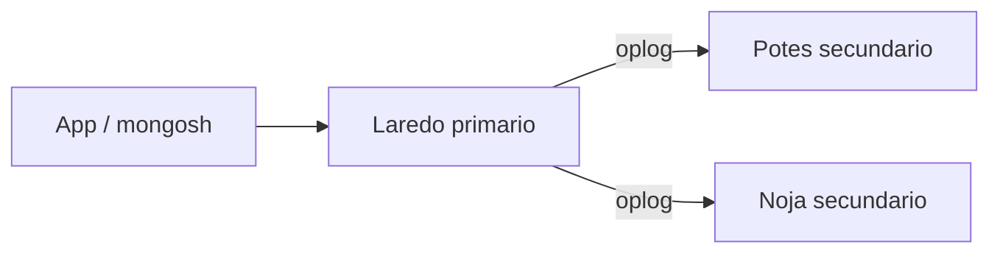
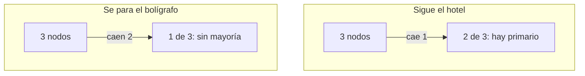
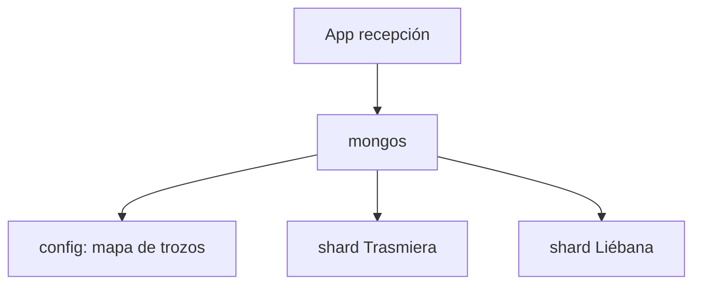

# 2.8. Réplicas y particiones

Un viernes de agosto se va la luz en Laredo. En Potes el mostrador **sigue cobrando**. Eso es el criterio **c)** del RA2: el dato no vive en un solo enchufe.

En Semana Santa las tres sedes escriben a la vez y un solo `mongod` se ahoga. Entonces **no** copiáis el mismo libro tres veces: **partís** las reservas (Trasmiera a un lado, Liébana al otro) y recepción habla con un **enrutador**. Eso es el **e)**: crecéis enchufando un módulo.

Dos oficios que en [2.5](nosql.md) ya se nombraron y que aquí se **montan**:

| Oficio | Qué guarda cada máquina | Analogía del hotel |
| --- | --- | --- |
| **Replicar** | El **mismo** dataset | Tres mostradores con la **misma** carpeta de reservas |
| **Particionar** (*sharding*) | Un **trozo** distinto | Un archivo por comarca |

En producción se combinan: cada trozo es, a su vez, un **conjunto de réplicas**. Atlas gratuito suele traer réplicas ya hechas; **no** podéis `rs.initiate` ni apagar nodos allí. El lab de este apartado es Docker **en el aula**.

## Tres mostradores, una carpeta

Un **replica set** es un grupo de procesos `mongod` que se ponen de acuerdo en **un** dataset. El cliente no “elige IP a ojo”: se apunta al **conjunto**. Si el que escribía se calla, los que quedan **votan** y otro toma el bolígrafo.



Nombres de aula (no son los de otro ciclo): set **`hotelrs`**, nodos `rs-laredo`, `rs-potes`, `rs-noja`. Laredo sale con más *priority* para que, si está vivo, vuelva a ser primario.

### Quién escribe, quién copia, quién solo vota

| Pieza | Oficio en el hotel |
| --- | --- |
| **Primario** | El único mostrador que **escribe** (altas, cobros, `update`) |
| **Secundario** | Copia el diario y puede **leer** si se lo pedís |
| **Árbitro** | Entra a la sala de votación y **no** guarda reservas. Barato para tener número **impar** de votos |

Un secundario **no** acepta `insertOne`. Si lo intentáis, Mongo se niega: no hay dos bolígrafos a la vez.

Miembros que no son “un Potes normal”:

- **Retrasado** (`priority: 0` y un retraso en segundos): la carpeta de **ayer**. Si recepción borra mal una noche, tenéis un punto de restauración. No se presenta a primario.
- **Oculto** (`hidden: true`): no aparece en la lista que usa la *app*. Sitio para el analista que barre el invierno sin pisar al mostrador.
- **Sin voto** (`votes: 0`): copia datos pero **no** decide elecciones. Útil como espejo lejano.

El árbitro **no** sustituye a un secundario con disco: si perdéis el primario y os queda árbitro + un secundario, hay mayoría para elegir… pero **un solo** sitio con datos. En aula preferid **tres nodos con disco**.

## El diario (antes que los votos)

La copia **no** es “cada noche un `mongodump`”. El primario anota cada cambio en un diario: el ***oplog*** (*operations log*), colección `local.oplog.rs`.

Es una colección ***capped***: tamaño fijo (en muchos despliegues, del orden del **5 %** del disco, configurable). Lo nuevo **empuja** a lo viejo. Si un secundario se desconecta **más tiempo** del que cabe en el diario, al volver **no** puede ponerse al día: hay que resincronizarlo (vuelve a copiar el dataset).

La réplica es **asíncrona**: Potes puede ir un segundo por detrás. Eso importa cuando prometéis al huésped “ya está cobrado” y luego leéis en Noja.

```javascript
// En el primario, dentro del set
use local
db.oplog.rs.stats()
db.oplog.rs.find().sort({ $natural: -1 }).limit(3)
```

`rs.printReplicationInfo()` resume **cuántas horas** de diario os caben. Si cabe poco, un corte de red largo os deja un secundario inservible.

## Elección: mayoría de los que *están configurados*

Si Laredo no responde unos **diez segundos** (orden de magnitud; no memoricéis el milisegundo), Potes y Noja intentan elegir primario.

**Mayoría** = más de la mitad de los miembros **configurados** (los del `rs.conf()`), no “los que hoy contestan”. Tres nodos: hace falta que **dos** se vean. Se cae uno → el set **sigue**. Se caen dos → el que queda **no** se autoproclama: preferís **parar escrituras** a tener dos primarios.



Dos centros de datos y un tercero (otro edificio o un árbitro) evitan que un corte de comarca os deje sin votos. Un solo armario con los tres portátiles **no** es tolerancia geográfica: es un lab.

### Rollback: lo que solo vio Laredo

Si Laredo aceptó un `insert` con `w: 1`, se apagó **antes** de que Potes lo copiara, y Potes ganó la elección, ese insert **no** está en el set nuevo. Al volver, Laredo **deshace** lo que no llegó al resto (*rollback*). El criterio **c)** no es “nunca se pierde un `w: 1`”: es “el hotel **sigue** y el dato **mayoritario** sobrevive”.

## Laboratorio: set `hotelrs` (tres sedes)

Compose en [`docs/assets/practicas/hotel-rs/`](../assets/practicas/hotel-rs/compose.yaml). Imagen `mongo:7`, puertos **27017–27019**, volúmenes con nombre. Trabajáis **dentro** de la red Docker: los hostnames `rs-laredo` los resuelve Compose, no el `localhost` de Windows.

```powershell
cd docs/assets/practicas/hotel-rs
docker compose up -d
docker compose exec rs-laredo mongosh
```

En ese `mongosh`:

```javascript
load("/scripts/iniciar-rs.js")
rs.status()
```

Hasta que un miembro ponga `"stateStr": "PRIMARY"`, esperad unos segundos y repetid `rs.status()`. `rs.hello()` (no el viejo `isMaster`) dice si **este** proceso es primario y a quién seguir.

Anotad en `rs.status()`:

- `set`: debe ser `hotelrs`
- `members[i].name` y `stateStr` (`PRIMARY` / `SECONDARY`)
- `electionDate` cuando hayáis forzado un relevo

### Escribir en Laredo, leer en Potes

```javascript
use hotel
db.reservas.insertOne({
  hotel: "Laredo",
  canal: "web",
  noches: 2,
  importe: 124,
  nota: "viernes de apagón",
})
```

En Potes, por defecto, `find` **falla** (el secundario se protege de lecturas “sin aviso”):

```javascript
// otro terminal
docker compose exec rs-potes mongosh
rs.hello()          // secondary: true
use hotel
db.reservas.find()  // error hasta que cambiéis la preferencia
db.getMongo().setReadPref("secondary")
db.reservas.find()
db.reservas.insertOne({ hotel: "Potes" })  // debe fallar
```

`rs.help()` lista el resto (`add`, `remove`, `stepDown`, `printSecondaryReplicationInfo`…).

Compass en `localhost:27017` ve el puerto de Laredo; el set anuncia hostnames **internos**. Para el criterio **c)** basta el `mongosh` del contenedor. Si Compass se queja del *replica set*, no es que el lab esté mal.

## Qué puede prometer recepción

### Preferencia de lectura

| `readPreference` | Gesto |
| --- | --- |
| `primary` | Por defecto: ficha **recién cobrada**, misma verdad que el bolígrafo |
| `primaryPreferred` | Primario si está; si no, un secundario (el mostrador no se queda en blanco) |
| `secondary` | Solo copias: informes, no el “¿ya está?” del huésped |
| `secondaryPreferred` | Copia si hay; si no, primario |
| `nearest` | El de menor latencia (ojo: puede ser una copia atrasada) |

En el *shell*: `db.getMongo().setReadPref("secondaryPreferred")`. En [2.9](pymongo.md) el *driver* lo lleva en el cliente.

### Preocupación de escritura

`writeConcern` es **cuántas copias** deben asentir antes de devolver OK.

| `w` | Promesa |
| --- | --- |
| `0` | *Fire-and-forget*: la *app* no espera. Peligroso en cobros |
| `1` | Por defecto: el **primario** lo tiene. Potes puede ir detrás |
| `"majority"` | La **mayoría** del set lo tiene. Más seguro, unos milisegundos más |

`j: true` pide *journal* en disco. `wtimeout` evita esperar eternamente si Noja está colgado.

```javascript
db.reservas.insertOne(
  { hotel: "Noja", canal: "ota", noches: 1, importe: 89 },
  { writeConcern: { w: "majority", wtimeout: 5000 } }
)
```

Encaja con [CAP](../ut1/almacenamiento.md): no podéis “escrito en todos” y “siempre disponible” si se parte la red. `majority` elige **no mentir** al huésped.

### Preocupación de lectura

| `readConcern` | Qué veis |
| --- | --- |
| `local` | Lo que este nodo tiene (puede no ser mayoritario) |
| `available` | Aún más laxo; en *shards* a veces es lo único barato |
| `majority` | Datos que **ya no se van a deshacer** en un rollback típico |
| `linearizable` | Lectura “como si hubiera un solo mostrador”; cara |
| `snapshot` | Transacciones de varios documentos |

Para el aula: cobro → `w: "majority"`; informe de ocupación → `secondary` + `local` os vale.

## Prueba del c): apagar el primario

Con el set sano y una reserva insertada:

```javascript
// en el PRIMARY
rs.stepDown()
// o, más brusco:
// db.adminCommand({ shutdown: 1 })
```

En otro nodo: `rs.status()` debe mostrar **otro** `PRIMARY`. Un `insertOne` **nuevo** tiene que funcionar allí. Arrancad de nuevo el contenedor caído (`docker compose start rs-laredo`) y ved cómo entra de **SECONDARY** (Laredo tiene *priority* 2: más tarde puede **recuperar** el cargo).

Eso es el criterio, no el dibujo del mermaid.

!!! warning "No mezclar labs"
    El [2.6](mongodb.md) usa un Mongo **suelto** en 27017. `hotel-rs` también publica 27017. No tengáis los dos `compose` a la vez.

## Cuando copiar ya no basta: partir

Tres copias del **mismo** disco no aumentan las escrituras: las **multiplican**. Si el cuello es “no cabemos” o “Laredo satura el primario”, hace falta **particionar**.

Mongo hace ***auto-sharding*** por **rangos** (o por **hash**) de una **shard key**. Unidad que se mueve: el ***chunk*** (trozo). Un proceso, el ***balancer***, los reparte. No es instantáneo: con muchos GB puede tardar.



| Pieza | Oficio |
| --- | --- |
| **Shard** | Un replica set con **parte** de `reservas`. En serio: **set**, no un `mongod` huérfano |
| **Config** | Metadatos: qué rango vive en qué shard. En serio: **tres** nodos |
| **mongos** | Centralita: la *app* **solo** habla con él. El *driver* cambia de `mongos` si uno cae; **no** habla con cada `mongod` |

El *shard* **primario** de una base es el que guarda las colecciones **aún no** partidas. `sh.status()` lo enseña.

### La clave: `hotel` os junta el atasco

La shard key necesita **cardinalidad** alta (muchos valores distintos) y que las escrituras **no** caigan todas en el mismo trozo.

| Clave | Qué pasa en el hotel |
| --- | --- |
| `{ hotel: 1 }` | Casi todo agosto es **Laredo** → un shard se fríe (*hotspot*) |
| `{ checkin: 1 }` | Los inserts de “hoy” van todos al **último** rango |
| `{ id_reserva: "hashed" }` | El hash **reparte** altas; un `find` por hotel **recorre** shards (*broadcast*) |

Regla práctica: si el 90 % de los `find` filtran por un campo, ese campo **pide** ir en la clave (o en un prefijo compuesto). Si no está, `mongos` pregunta **a todos**.

Colección vacía: `shardCollection` crea el índice. Colección con datos: creáis el índice **antes**.

```javascript
sh.shardCollection("hotel.reservas", { id_reserva: "hashed" })
// rango, si de verdad filtráis por comarca y hay dos mitades vivas:
// sh.shardCollection("hotel.reservas", { comarca: 1, id_reserva: 1 })
```

Tercer argumento histórico: `unique` (el índice de la clave es único). En el hotel, `id_reserva` hashed **no** se declara único a la ligera: el hash no es el identificador de negocio.

No montéis un clúster partido para 500 documentos. El **e)** se **ve** en `sh.status()` y, con volumen, en `getShardDistribution`.

## Laboratorio opcional: Trasmiera y Liébana

Compose en [`docs/assets/practicas/hotel-shards/`](../assets/practicas/hotel-shards/compose.yaml): un `mongos` (`recepcion`, puerto **27117**), config `cfgrs`, dos shards (`trasmiera`, `liebana`) con dos nodos cada uno. **No** es el YAML de otro módulo: otros hostnames, otros sets, otra historia.

Orden (esperad PRIMARY en cada set antes del siguiente `load`). El `mongos` **no** arranca bien hasta que `cfgrs` existe: si `recepcion` está *Restarting*, iniciad el config y `docker compose restart recepcion`.

```powershell
cd docs/assets/practicas/hotel-shards
docker compose up -d
docker compose exec cfg-santander mongosh --eval "load('/scripts/iniciar-cfg.js')"
docker compose restart recepcion
docker compose exec trasmiera-a mongosh --eval "load('/scripts/iniciar-trasmiera.js')"
docker compose exec liebana-a mongosh --eval "load('/scripts/iniciar-liebana.js')"
docker compose exec recepcion mongosh --eval "load('/scripts/anadir-shards.js')"
docker compose exec recepcion mongosh
```

En el `mongosh` del *router* (el prompt habla de `mongos`):

```javascript
sh.status()
use hotel
// Mongo reciente habilita la base al partir; si vuestra versión lo pide:
sh.enableSharding("hotel")

db.reservas.createIndex({ id_reserva: "hashed" })
sh.shardCollection("hotel.reservas", { id_reserva: "hashed" })

// Tres planteamientos, tres colecciones (idea de aula, datos vuestros)
db.reservas.aggregate([{ $out: "reservas_rango" }])
db.reservas.aggregate([{ $out: "reservas_hash" }])
db.reservas_rango.createIndex({ hotel: 1 })
db.reservas_hash.createIndex({ id_reserva: "hashed" })
sh.shardCollection("hotel.reservas_rango", { hotel: 1 }, false)
sh.shardCollection("hotel.reservas_hash", { id_reserva: "hashed" }, false)
```

`sh.addShard("trasmiera/trasmiera-a:27017")` ya lo hace el script. El *router* no guarda reservas: si `recepcion` cae y tenéis otro `mongos`, el *driver* cambia; los datos siguen en los shards.

### Chunks que no se mueven solos (aún)

Con pocos documentos suele haber **un** chunk (`MinKey` … `MaxKey`) en un solo shard. `getShardDistribution()` dirá 100 % en Trasmiera. Eso no es un fallo: no hay peso que equilibrar.

Insertad más (o importad [`reservas_mongo.jsonl`](../assets/practicas/reservas_mongo.jsonl) por `mongoimport` contra **27117**). Si sigue en un trozo:

```javascript
sh.splitFind("hotel.reservas_hash", { id_reserva: 1 })
// o cortar a mano:
// sh.splitAt("hotel.reservas_rango", { hotel: "Potes" })
db.reservas_hash.getShardDistribution()
sh.status()
```

`splitFind` corta por la **mediana**; `splitAt` por el valor que le dais. El *balancer* **mueve** después. Justo al cortar, un recuento puede **mentir** unos segundos (trozos a medias).

!!! tip "HDFS y Mongo, misma rima"
    Bloque ×3 en DataNodes ≈ documento ×N en secundarios. Añadir DataNode ≈ añadir shard. El NameNode no es el `mongos`, pero los dos son **mapa**, no el lago entero. El RA2 quiere que **veáis** esa rima.

## Cómo se cierra el apartado

Si Laredo se apaga y Potes cobra, tenéis **c)**. Si añadís Liébana y `mongos` sigue siendo la URI de la *app*, tenéis **e)**. Si la shard key es `hotel` y agosto entero vive en un nodo, habéis **partido el mapa** y **no** la carga.

!!! success "En voz alta"
    “El cobro sale con `w: majority`. El informe de ocupación puede ir a Noja. Si cae el primario, hay elección. Si no cabemos, `mongos` y una clave que *reparta*, no el nombre del hotel.”

## Relación con el RA2

| Criterio | Aquí |
| --- | --- |
| **c)** | `stepDown` / apagón + `rs.status()` con otro primario + `insertOne` vivo |
| **e)** | Segundo shard, *chunks*, la *app* no cambia de oficio (sigue al *router*) |
| **a)** | El JSON de reservas **sigue** siendo el del [2.6](mongodb.md); solo cambia *dónde* vive |

## Para practicar (Moodle manda)

1. **Set de tres + una cuarta sede.** Partid de `hotel-rs`. Añadid un miembro (otra localidad: p. ej. `rs-santona`) al set `hotelrs`. Importad las reservas del [2.6](mongodb.md) (`reservas_mongo.jsonl` / `opiniones.jsonl`). Entregad: `rs.status()`, un `find` en secundario **antes** y **después** de `setReadPref`, un `insertOne` en el secundario (captura del error), `rs.stepDown()` y quién es el nuevo primario. Scripts y salidas, no un PDF vacío.
2. **Promesas.** Misma reserva con `w: 1` y con `w: "majority"`. Explicad en tres líneas qué le diríais a recepción si Laredo se apaga en cada caso.
3. **Clave mala.** En un folio (o comentario en el script): por qué `{ hotel: 1 }` es un *hotspot* en agosto y qué clave usaríais para las altas. No hace falta el clúster partido para **razonarlo**.
4. (Ampliación) Levantad `hotel-shards`, partid `reservas` por hash de `id_reserva`, `sh.status()`, `getShardDistribution()`. Si todo sigue en un chunk, `splitFind` y otra captura. Vaciad, volved a importar, comparad el mapa.

## Referencias

- [Replica set](https://www.mongodb.com/docs/manual/replication/) y [elecciones](https://www.mongodb.com/docs/manual/core/replica-set-elections/) (manual de MongoDB)
- [Write concern](https://www.mongodb.com/docs/manual/reference/write-concern/) y [read preference](https://www.mongodb.com/docs/manual/core/read-preference/)
- [Sharding](https://www.mongodb.com/docs/manual/sharding/) y [elección de shard key](https://www.mongodb.com/docs/manual/core/sharding-shard-key/)
- [2.5 Familias](nosql.md) · [2.6 MongoDB](mongodb.md) · [2.7 Modelado](modelado.md) · [2.9 PyMongo](pymongo.md)
